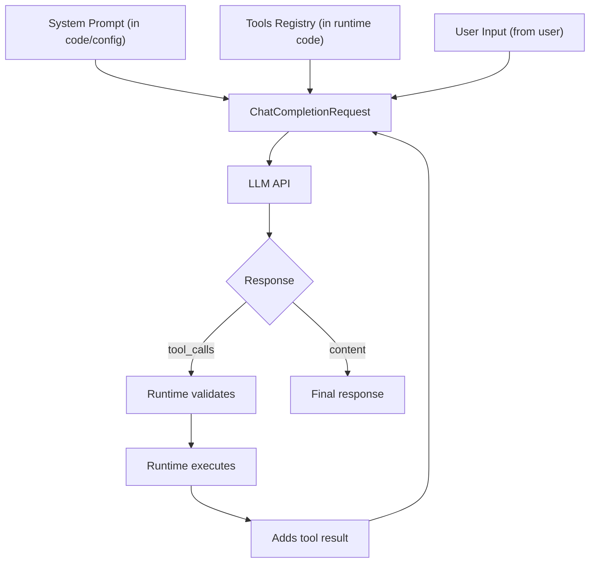

# 03. Tools and Function Calling — The Agent's "Hands"

> **Terminology Note:** This chapter uses the terms "Function Calling" (the API mechanism name) and "Tool Call" (a specific tool invocation). These are the same: a mechanism where the LLM returns a structured request to call a Go function. In agent code, we usually say "tool" (instrument), because it's a more general concept (a tool can be not only a Go function, but also an API call, command, etc.).

## Why This Chapter?

Tools turn an LLM from a talker into a worker. Without tools, an agent can only respond with text but cannot interact with the real world.

Function Calling is the mechanism that gives the model access to real actions: call Go functions, execute commands, and read data.

### Real-World Case Study

**Situation:** You've created a chatbot for DevOps. A user writes: "Check server status web-01"

**Problem:** The bot cannot actually check the server. It only promises: "I will check the server status web-01..." — but that's just text.

**Solution:** Function Calling allows the model to call real Go functions. The model generates structured JSON with the function name and arguments, your code executes the function and returns the result back to the model.

## Theory in Simple Terms

### How Does Function Calling Work?

1. **You describe a function** in JSON Schema format
2. **The LLM receives the description** and decides: "I need to call this function"
3. **The LLM generates JSON** with the function name and arguments
4. **Your code parses the JSON** and executes the real function
5. **The result is returned** to the LLM for further processing

## Function Calling — How It Works

**Function Calling** is a mechanism where the LLM returns structured JSON with the function name and arguments instead of plain text.

### Complete Cycle: From Definition to Execution

We'll walk through the **complete cycle** using the `ping` tool as an example:

#### Step 1: Tool Definition (Tool Schema)

```go
tools := []openai.Tool{
    {
        Type: openai.ToolTypeFunction,
        Function: &openai.FunctionDefinition{
            Name:        "ping",
            Description: "Ping a host to check connectivity",
            Parameters: json.RawMessage(`{
                "type": "object",
                "properties": {
                    "host": {
                        "type": "string",
                        "description": "Hostname or IP address to ping"
                    }
                },
                "required": ["host"]
            }`),
        },
    },
}
```

**What happens:** You describe the tool in JSON Schema format. This description gets sent to the model along with the request.

#### Step 2: Request to the Model

```go
messages := []openai.ChatCompletionMessage{
    {Role: "system", Content: "You are a network admin. Use tools to check connectivity."},
    {Role: "user", Content: "Check availability of google.com"},
}

req := openai.ChatCompletionRequest{
    Model:    openai.GPT3Dot5Turbo,
    Messages: messages,
    Tools:    tools,  // The model receives the tool descriptions!
    Temperature: 0,
}

resp, _ := client.CreateChatCompletion(ctx, req)
msg := resp.Choices[0].Message
```

**What happens:** The model receives the following:
- System prompt (role and instructions)
- User input (user's request)
- **Tools schema** (description of available tools)

#### Step 3: Model Response (Tool Call)

The model **doesn't return text** like "I will check ping". Instead, it returns a **structured tool call**:

```go
// msg.ToolCalls contains:
[]openai.ToolCall{
    {
        ID: "call_abc123",
        Type: "function",
        Function: openai.FunctionCall{
            Name:      "ping",
            Arguments: `{"host": "google.com"}`,
        },
    },
}
```

**What happens:** The model **generates a tool_call** for the `ping` tool with JSON arguments. Nothing magical is happening here: the model reads `Description: "Ping a host to check connectivity"` and maps it to the user's request.

**How does the model choose between multiple tools?**

Let's expand the example by adding several tools:

```go
tools := []openai.Tool{
    {
        Function: &openai.FunctionDefinition{
            Name:        "ping",
            Description: "Ping a host to check network connectivity. Use this when user asks about network reachability or connectivity.",
        },
    },
    {
        Function: &openai.FunctionDefinition{
            Name:        "check_http",
            Description: "Check HTTP status code of a website. Use this when user asks about website availability or HTTP errors.",
        },
    },
    {
        Function: &openai.FunctionDefinition{
            Name:        "traceroute",
            Description: "Trace the network path to a host. Use this when user asks about network routing or path analysis.",
        },
    },
}

userInput := "Check availability of google.com"
```

**Selection process:**

1. The model receives **all three tools** and their `Description`:
   - `ping`: "check network connectivity... Use this when user asks about network reachability"
   - `check_http`: "Check HTTP status... Use this when user asks about website availability"
   - `traceroute`: "Trace network path... Use this when user asks about routing"

2. The model matches the request "Check availability of google.com" with descriptions:
   - ✅ `ping` — description contains "connectivity" and "reachability" → **chooses this one**
   - ❌ `check_http` — about HTTP status, not network availability
   - ❌ `traceroute` — about routing, not availability check

3. The model returns a tool call for `ping`:
   ```json
   {"name": "ping", "arguments": "{\"host\": \"google.com\"}"}
   ```

**Example with a different request:**

```go
userInput := "Check if the site google.com responds"

// The model receives the same 3 tools
// Matches:
// - ping: about network availability → not quite right
// - check_http: "Use this when user asks about website availability" → ✅ CHOOSES THIS
// - traceroute: about routing → doesn't fit

// The model returns:
// {"name": "check_http", "arguments": "{\"url\": \"https://google.com\"}"}
```

**Takeaway:** The model selects a tool based on **semantic matching** between the user's request and `Description`. The more precise and specific the `Description`, the better the model selects the right tool.

#### What Does the LLM Do, and What Does Runtime Do?

**LLM (model):**
- Sees tool descriptions in `tools[]`
- Generates JSON with tool name and arguments
- Returns structured response in the `tool_calls` field

**Runtime (your code):**
- Parses `tool_calls` from the model's response
- Validates tool name (does it exist?)
- Validates JSON arguments (are they correct?)
- Executes the real Go function
- Adds result to history (`messages[]`)
- Sends updated history back to the model

**Important:** The LLM does not execute code. It only generates JSON with an execution request. Your Runtime executes the real code.

#### Step 4: Validation (Runtime)

```go
// Check that the tool exists
if msg.ToolCalls[0].Function.Name != "ping" {
    return fmt.Errorf("unknown tool: %s", msg.ToolCalls[0].Function.Name)
}

// Validate JSON arguments
var args struct {
    Host string `json:"host"`
}
if err := json.Unmarshal([]byte(msg.ToolCalls[0].Function.Arguments), &args); err != nil {
    return fmt.Errorf("invalid JSON: %v", err)
}

// Check required fields
if args.Host == "" {
    return fmt.Errorf("host is required")
}
```

**What happens:** Runtime validates the call before execution. This is **critical** for security.

#### Step 5: Tool Execution

```go
func executePing(host string) string {
    cmd := exec.Command("ping", "-c", "1", host)
    output, err := cmd.CombinedOutput()
    if err != nil {
        return fmt.Sprintf("Error: %s", err)
    }
    return string(output)
}

result := executePing(args.Host)  // "PING google.com: 64 bytes from ..."
```

**What happens:** Runtime executes the **real function** (in this case, the system command `ping`).

#### Step 6: Return Result to Model

```go
// Add result to history as a message with role "tool"
messages = append(messages, openai.ChatCompletionMessage{
    Role:       openai.ChatMessageRoleTool,
    Content:    result,  // "PING google.com: 64 bytes from ..."
    ToolCallID: msg.ToolCalls[0].ID,  // Link to the call
})

// Send updated history to the model again
resp2, _ := client.CreateChatCompletion(ctx, openai.ChatCompletionRequest{
    Model:    openai.GPT3Dot5Turbo,
    Messages: messages,  // Now includes the tool result!
    Tools:    tools,
})
```

**What happens:** The model receives the tool execution result and can:
- Formulate a final response to the user
- Call another tool if needed
- Ask a clarifying question

#### Step 7: Final Response

```go
finalMsg := resp2.Choices[0].Message
if len(finalMsg.ToolCalls) == 0 {
    // This is the final text response
    fmt.Println(finalMsg.Content)  // "google.com is available, response time 10ms"
}
```

**What happens:** The model saw the `ping` result and formulated a clear response for the user.

## End-to-End Protocol: Complete Request and Two Moves

Now let's break down the **complete protocol** from the agent developer's perspective: where everything is stored, how the request is assembled, and how runtime processes responses.

### Where Is Everything Stored in Agent Code?



**Storage scheme:**

1. **System Prompt** — stored in agent code (constant or config):
   - Instructions (Role, Goal, Constraints)
   - Few-shot examples (if used)
   - SOP (action algorithm)

2. **Tools Schema** — stored in **runtime registry** (not in the prompt!):
   - Tool definitions (JSON Schema)
   - Tool handler functions
   - Validation and execution

3. **User Input** — comes from the user:
   - Current request
   - Dialogue history (stored in `messages[]`)

4. **Tool Results** — generated by runtime:
   - After tool execution
   - Added to `messages[]` with `Role = "tool"`

### Complete Protocol: JSON Requests and Responses (2 Moves)

**Move 1: Request with Multiple Tools**

```json
{
  "model": "gpt-3.5-turbo",
  "messages": [
    {
      "role": "system",
      "content": "You are a DevOps engineer. Use tools to check services.\n\nUsage examples:\nUser: \"Check nginx status\"\nAssistant: returns tool_call check_status(\"nginx\")\n\nUser: \"Restart server\"\nAssistant: returns tool_call restart_service(\"web-01\")"
    },
    {
      "role": "user",
      "content": "Check nginx status"
    }
  ],
  "tools": [
    {
      "type": "function",
      "function": {
        "name": "check_status",
        "description": "Check if a service is running. Use this when user asks about service status.",
        "parameters": {
          "type": "object",
          "properties": {
            "service": {
              "type": "string",
              "description": "Service name"
            }
          },
          "required": ["service"]
        }
      }
    },
    {
      "type": "function",
      "function": {
        "name": "restart_service",
        "description": "Restart a systemd service. Use this when user explicitly asks to restart a service.",
        "parameters": {
          "type": "object",
          "properties": {
            "service_name": {
              "type": "string",
              "description": "Service name to restart"
            }
          },
          "required": ["service_name"]
        }
      }
    }
  ],
  "tool_choice": "auto"
}
```

**Where everything is:**
- **System Prompt** (instructions + few-shot examples) → `messages[0].content`
- **User Input** → `messages[1].content`
- **Tools Schema** (2 tools with full JSON Schema) → separate `tools[]` field

**Response #1 (tool call):**

```json
{
  "id": "chatcmpl-abc123",
  "choices": [{
    "message": {
      "role": "assistant",
      "content": null,
      "tool_calls": [
        {
          "id": "call_xyz789",
          "type": "function",
          "function": {
            "name": "check_status",
            "arguments": "{\"service\": \"nginx\"}"
          }
        }
      ]
    }
  }]
}
```

**Runtime processes tool call:**
1. Validates: `tool_calls[0].function.name` exists in registry
2. Parses: `json.Unmarshal(tool_calls[0].function.arguments)` → `{"service": "nginx"}`
3. Executes: `check_status("nginx")` → result: `"Service nginx is ONLINE"`
4. Adds tool result to `messages[]`

**Move 2: Request with Tool Result**

```json
{
  "model": "gpt-3.5-turbo",
  "messages": [
    {
      "role": "system",
      "content": "You are a DevOps engineer. Use tools to check services.\n\nUsage examples:\nUser: \"Check nginx status\"\nAssistant: returns tool_call check_status(\"nginx\")\n\nUser: \"Restart server\"\nAssistant: returns tool_call restart_service(\"web-01\")"
    },
    {
      "role": "user",
      "content": "Check nginx status"
    },
    {
      "role": "assistant",
      "content": null,
      "tool_calls": [
        {
          "id": "call_xyz789",
          "type": "function",
          "function": {
            "name": "check_status",
            "arguments": "{\"service\": \"nginx\"}"
          }
        }
      ]
    },
    {
      "role": "tool",
      "content": "Service nginx is ONLINE",
      "tool_call_id": "call_xyz789"
    }
  ],
  "tools": [
    {
      "type": "function",
      "function": {
        "name": "check_status",
        "description": "Check if a service is running. Use this when user asks about service status.",
        "parameters": {
          "type": "object",
          "properties": {
            "service": {
              "type": "string",
              "description": "Service name"
            }
          },
          "required": ["service"]
        }
      }
    },
    {
      "type": "function",
      "function": {
        "name": "restart_service",
        "description": "Restart a systemd service. Use this when user explicitly asks to restart a service.",
        "parameters": {
          "type": "object",
          "properties": {
            "service_name": {
              "type": "string",
              "description": "Service name to restart"
            }
          },
          "required": ["service_name"]
        }
      }
    }
  ]
}
```

**Where everything is:**
- **System Prompt** → `messages[0].content` (same)
- **User Input** → `messages[1].content` (same)
- **Tool Call** → `messages[2]` (added by runtime after first response)
- **Tool Result** → `messages[3].content` (added by runtime after execution)
- **Tools Schema** → `tools[]` field (same)

**Response #2 (final response):**

```json
{
  "id": "chatcmpl-def456",
  "choices": [{
    "message": {
      "role": "assistant",
      "content": "nginx is running normally, service ONLINE",
      "tool_calls": null
    }
  }]
}
```

### Evolution of messages[] Array (JSON)

**Before first request:**
```json
[
  {"role": "system", "content": "You are a DevOps engineer..."},
  {"role": "user", "content": "Check nginx status"}
]
```

**After first request (runtime adds tool call):**
```json
[
  {"role": "system", "content": "You are a DevOps engineer..."},
  {"role": "user", "content": "Check nginx status"},
  {
    "role": "assistant",
    "content": null,
    "tool_calls": [{
      "id": "call_xyz789",
      "type": "function",
      "function": {
        "name": "check_status",
        "arguments": "{\"service\": \"nginx\"}"
      }
    }]
  }
]
```

**After tool execution (runtime adds tool result):**
```json
[
  {"role": "system", "content": "You are a DevOps engineer..."},
  {"role": "user", "content": "Check nginx status"},
  {
    "role": "assistant",
    "content": null,
    "tool_calls": [{
      "id": "call_xyz789",
      "type": "function",
      "function": {
        "name": "check_status",
        "arguments": "{\"service\": \"nginx\"}"
      }
    }]
  },
  {
    "role": "tool",
    "content": "Service nginx is ONLINE",
    "tool_call_id": "call_xyz789"
  }
]
```

**After second request (model sees tool result and formulates response):**
- The model sees the full context (system + user + tool call + tool result)
- Generates final response: `"nginx is running normally, service ONLINE"`

**Note:** For Go implementation examples, see [Lab 02: Tools](../../labs/lab02-tools/README.md) and [Lab 04: Autonomy](../../labs/lab04-autonomy/README.md)

### Key Points for Developers

1. **System Prompt and Tools Schema are different things:**
   - System Prompt — text in `Messages[0].Content` (can contain few-shot examples)
   - Tools Schema — separate `Tools` field in the request (JSON Schema)

2. **Few-shot examples are inside System Prompt:**
   - This is text showing the model the response format or tool selection
   - Different from Tools Schema (which describes tool structure)

3. **Runtime manages the loop:**
   - Validates `tool_calls`
   - Executes tools
   - Adds results to `messages`
   - Sends next request

4. **Tools are not "inside the prompt":**
   - In the API they are passed as a separate `Tools` field
   - The model sees them together with the prompt, but these are different parts of the request

See how to write instructions and examples: **[Chapter 02: Prompting](../02-prompt-engineering/README.md)**

Practice: **[Lab 02: Tools](../../labs/lab02-tools/README.md)**, **[Lab 04: Autonomy](../../labs/lab04-autonomy/README.md)**

### Why Is This Not Magic?

**Key points:**

1. **The model receives descriptions of ALL tools** — it doesn't "know" about tools out of the box, it processes their `Description` in JSON Schema. The model selects the right tool by matching the user's request with descriptions.

2. **Selection mechanism is based on semantics** — the model looks for a match between:
   - User's request ("Check availability")
   - Tool description ("Use this when user asks about network reachability")
   - Context of previous results (if any)

3. **The model returns structured JSON** — this is not text "I will call ping", but a specific tool call with tool name and arguments

4. **Runtime does all the work** — parsing, validation, execution, returning result

5. **The model receives the result** — it processes the result as a new message in history and continues working

**Example of choosing between similar tools:**

```go
tools := []openai.Tool{
    {
        Function: &openai.FunctionDefinition{
            Name:        "check_service_status",
            Description: "Check if a systemd service is running. Use this for Linux services like nginx, mysql, etc.",
        },
    },
    {
        Function: &openai.FunctionDefinition{
            Name:        "check_http_status",
            Description: "Check HTTP response code of a web service. Use this for checking if a website or API is responding.",
        },
    },
}

// Request 1: "Check nginx status"
// Model chooses: check_service_status (nginx is a systemd service)

// Request 2: "Check if site example.com responds"
// Model chooses: check_http_status (site is an HTTP service)
```

**Important:** If tool descriptions are too similar or unclear, the model may choose the wrong tool. Therefore, `Description` should be **specific and distinguishable**.

**Example tool definition:**

```go
tools := []openai.Tool{
    {
        Type: openai.ToolTypeFunction,
        Function: &openai.FunctionDefinition{
            Name:        "ping",
            Description: "Ping a host to check connectivity",
            Parameters: json.RawMessage(`{
                "type": "object",
                "properties": {
                    "host": {
                        "type": "string",
                        "description": "Hostname or IP address to ping"
                    }
                },
                "required": ["host"]
            }`),
        },
    },
}
```

**Important:** `Description` is the most important field! The LLM relies on it when deciding which tool to call.

## Tool Examples in Different Domains

### DevOps

```go
// Check service status
{
    Name: "check_service_status",
    Description: "Check if a systemd service is running",
    Parameters: {"service_name": "string"}
}

// Restart service
{
    Name: "restart_service",
    Description: "Restart a systemd service. WARNING: This will cause downtime.",
    Parameters: {"service_name": "string"}
}

// Read logs
{
    Name: "read_logs",
    Description: "Read the last N lines of service logs",
    Parameters: {"service": "string", "lines": "number"}
}
```

### Support

```go
// Get ticket
{
    Name: "get_ticket",
    Description: "Get ticket details by ID",
    Parameters: {"ticket_id": "string"}
}

// Search knowledge base
{
    Name: "search_kb",
    Description: "Search knowledge base for solutions",
    Parameters: {"query": "string"}
}

// Draft reply
{
    Name: "draft_reply",
    Description: "Draft a reply to the ticket",
    Parameters: {"ticket_id": "string", "message": "string"}
}
```

### Data Analytics

```go
// SQL query (read-only!)
{
    Name: "sql_select",
    Description: "Execute a SELECT query on the database. ONLY SELECT queries allowed.",
    Parameters: {"query": "string"}
}

// Describe table
{
    Name: "describe_table",
    Description: "Get table schema and column information",
    Parameters: {"table_name": "string"}
}

// Check data quality
{
    Name: "check_data_quality",
    Description: "Check for nulls, duplicates, outliers in a table",
    Parameters: {"table_name": "string"}
}
```

### Security

```go
// Query SIEM
{
    Name: "query_siem",
    Description: "Query security information and event management system",
    Parameters: {"query": "string", "time_range": "string"}
}

// Isolate host (requires confirmation!)
{
    Name: "isolate_host",
    Description: "CRITICAL: Isolate a host from the network. Requires confirmation.",
    Parameters: {"host": "string"}
}

// Check IP reputation
{
    Name: "check_ip_reputation",
    Description: "Check if an IP address is known malicious",
    Parameters: {"ip": "string"}
}
```

## Tool Error Handling

If a tool returns an error, the agent must see and handle it.

**Example:**

```go
// Agent calls ping("nonexistent-host")
result := ping("nonexistent-host")
// result = "Error: Name or service not known"

// Add error to history
messages = append(messages, ChatCompletionMessage{
    Role:    "tool",
    Content: result,  // The model will see the error!
    ToolCallID: call.ID,
})

// The model will receive the error and can:
// 1. Try another host
// 2. Inform the user about the problem
// 3. Escalate the issue
```

**Important:** An error is also a result! Don't hide errors from the model.

## Tool Call Validation

Before executing a tool, you need to validate the arguments.

**Validation example:**

```go
func executeTool(name string, args json.RawMessage) (string, error) {
    switch name {
    case "restart_service":
        var params struct {
            ServiceName string `json:"service_name"`
        }
        if err := json.Unmarshal(args, &params); err != nil {
            return "", fmt.Errorf("invalid args: %v", err)
        }
        
        // Validation
        if params.ServiceName == "" {
            return "", fmt.Errorf("service_name is required")
        }
        
        // Security check
        if params.ServiceName == "critical-db" {
            return "", fmt.Errorf("Cannot restart critical service without confirmation")
        }
        
        return restartService(params.ServiceName), nil
    }
    return "", fmt.Errorf("unknown tool: %s", name)
}
```

## Repairing tool call arguments (when JSON/schema is invalid)

In production, you will occasionally get:

- syntactically invalid JSON (missing braces, broken quotes),
- valid JSON that still fails your JSON Schema (wrong types, missing required fields).

When this happens, do not execute the tool "as is". Add a **repair step**: a separate LLM call (or a dedicated mode/model) that takes:

- the tool name,
- the tool arguments JSON Schema,
- the original arguments string,

and returns **only the fixed JSON**, without explanations.

Skeleton:

```go
if !json.Valid([]byte(call.Function.Arguments)) {
    // 1) repaired := repairWithLLM(call.Function.Arguments, toolSchema)
    // 2) validate again (json.Valid + schema)
    // 3) execute only if validation passes; otherwise fail closed
}
```

Key rule: the repair step must not change intent. It only fixes the format to match the schema.

## Common Errors

### Error 1: Model Doesn't Generate tool_call

**Symptom:** Agent receives a text response from the model instead of `tool_calls`. The model responds with text instead of calling a tool.

**Cause:** 
- The model is not trained on function calling
- Poor tool description (`Description` is unclear)
- `Temperature > 0` (too random)

**Solution:**
```go
// GOOD: Use a model with tools support
// Check via Lab 00: Capability Check

// GOOD: Improve Description
Description: "Check the status of a server by hostname. Use this when user asks about server status or availability."

// GOOD: Temperature = 0
Temperature: 0,  // Deterministic behavior
```

### Error 2: Broken JSON in Arguments

**Symptom:** `json.Unmarshal` returns an error. JSON in arguments is incorrect.

**Cause:** Model generates incorrect JSON (missing brackets, wrong format).

**Solution:**
```go
// GOOD: Validate JSON before parsing
if !json.Valid([]byte(call.Function.Arguments)) {
    return "Error: Invalid JSON", nil
}

// GOOD: Temperature = 0 for deterministic JSON
Temperature: 0,
```

### Error 3: Tool Hallucinations

**Symptom:** Agent calls a non-existent tool. Model generates a tool_call with a name that's not in the list.

**Cause:** Model doesn't see a clear list of available tools or the list is too large.

**Solution:**
```go
// GOOD: Validate tool name before execution
allowedFunctions := map[string]bool{
    "get_server_status": true,
    "ping":              true,
}
if !allowedFunctions[call.Function.Name] {
    return "Error: Unknown function", nil
}
```

**Note:** If you have a large tool space (hundreds or thousands of tools), use **tool retrieval** — dynamically select only relevant tools before planning. For more details, see [Chapter 06: RAG](../06-rag/README.md#rag-for-action-space-tool-retrieval).

### Error 4: Poor Tool Description

**Symptom:** Model selects the wrong tool or doesn't select one at all.

**Cause:** `Description` is too general or doesn't contain keywords from the user's request.

**Solution:**
```text
// BAD
Description: "Ping a host"

// GOOD
Description: "Ping a host to check network connectivity. Use this when user asks about network reachability or connectivity."
```

## Mini-Exercises

### Exercise 1: Create a Tool

Create a `check_disk_usage` tool that checks disk usage:

```go
tools := []openai.Tool{
    {
        Type: openai.ToolTypeFunction,
        Function: &openai.FunctionDefinition{
            Name:        "check_disk_usage",
            Description: "...",  // Your code here
            Parameters:  json.RawMessage(`{
                // Your code here
            }`),
        },
    },
}
```

**Expected result:**
- `Description` contains keywords: "disk", "usage", "space"
- JSON Schema is correct
- Required fields are specified in `required`

### Exercise 2: Argument Validation

Implement an argument validation function for a tool:

```go
func validateToolCall(call openai.ToolCall) error {
    // Check tool name
    // Check JSON validity
    // Check required fields
}
```

**Expected result:**
- Function returns an error if tool name is unknown
- Function returns an error if JSON is incorrect
- Function returns an error if required fields are missing

## Completion Criteria / Checklist

✅ **Completed:**
- `Description` is specific and clear (contains keywords)
- JSON Schema is correct
- Required fields are specified in `required`
- Argument validation is implemented
- Errors are handled and returned to the agent
- Critical tools require confirmation
- Model successfully generates tool_call

❌ **Not completed:**
- Model doesn't generate tool_call (poor description or unsuitable model)
- JSON in arguments is broken (no validation)
- Model calls a non-existent tool (no name validation)
- `Description` is too general (model cannot select the right tool)

## Connection with Other Chapters

- **LLM Physics:** Why the model chooses tool call instead of text, see [Chapter 01: LLM Physics](../01-llm-fundamentals/README.md)
- **Prompting:** How to describe tools so the model uses them correctly, see [Chapter 02: Prompting](../02-prompt-engineering/README.md)
- **Loop:** How tool results are returned to the model, see [Chapter 04: Autonomy](../04-autonomy-and-loops/README.md)

## Complete Example: From Start to Finish

Here's a minimal working example of an agent with one tool:

```go
package main

import (
    "context"
    "encoding/json"
    "fmt"
    "os"
    
    "github.com/sashabaranov/go-openai"
)

func main() {
    // 1. Initialize client
    config := openai.DefaultConfig(os.Getenv("OPENAI_API_KEY"))
    if baseURL := os.Getenv("OPENAI_BASE_URL"); baseURL != "" {
        config.BaseURL = baseURL // For local models
    }
    client := openai.NewClientWithConfig(config)
    
    // 2. Define tool
    tools := []openai.Tool{
        {
            Type: openai.ToolTypeFunction,
            Function: &openai.FunctionDefinition{
                Name:        "check_status",
                Description: "Check the status of a server by hostname. Use this when user asks about server status.",
                Parameters: json.RawMessage(`{
                    "type": "object",
                    "properties": {
                        "hostname": {
                            "type": "string",
                            "description": "Server hostname"
                        }
                    },
                    "required": ["hostname"]
                }`),
            },
        },
    }
    
    // 3. Start agent
    ctx := context.Background()
    userInput := "Check server status web-01"
    
    messages := []openai.ChatCompletionMessage{
        {Role: "system", Content: "You are a DevOps engineer. Use tools to check services."},
        {Role: "user", Content: userInput},
    }
    
    // 4. Agent loop
    for i := 0; i < 10; i++ {
        resp, err := client.CreateChatCompletion(ctx, openai.ChatCompletionRequest{
            Model:       openai.GPT3Dot5Turbo,
            Messages:    messages,
            Tools:       tools,
            Temperature: 0, // Deterministic behavior
        })
        if err != nil {
            fmt.Printf("Error: %v\n", err)
            return
        }
        
        msg := resp.Choices[0].Message
        messages = append(messages, msg)
        
        // 5. Check: is this a tool_call or final response?
        if len(msg.ToolCalls) == 0 {
            // Final response
            fmt.Printf("Agent: %s\n", msg.Content)
            break
        }
        
        // 6. Execute tool (Runtime)
        for _, toolCall := range msg.ToolCalls {
            if toolCall.Function.Name != "check_status" {
                result := fmt.Sprintf("Error: Unknown tool %s", toolCall.Function.Name)
                messages = append(messages, openai.ChatCompletionMessage{
                    Role:       openai.ChatMessageRoleTool,
                    Content:    result,
                    ToolCallID: toolCall.ID,
                })
                continue
            }
            
            // Parse arguments
            var args struct {
                Hostname string `json:"hostname"`
            }
            if err := json.Unmarshal([]byte(toolCall.Function.Arguments), &args); err != nil {
                result := fmt.Sprintf("Error: Invalid JSON: %v", err)
                messages = append(messages, openai.ChatCompletionMessage{
                    Role:       openai.ChatMessageRoleTool,
                    Content:    result,
                    ToolCallID: toolCall.ID,
                })
                continue
            }
            
            // Execute real function
            result := checkStatus(args.Hostname)
            
            // Add result to history
            messages = append(messages, openai.ChatCompletionMessage{
                Role:       openai.ChatMessageRoleTool,
                Content:    result,
                ToolCallID: toolCall.ID,
            })
        }
    }
}

// Real function called by Runtime
func checkStatus(hostname string) string {
    // In a real application, there would be an API call or command here
    return fmt.Sprintf("Server %s is ONLINE", hostname)
}
```

**What happens:**
1. Agent receives request "Check server status web-01"
2. Model sees the `check_status` tool and generates tool_call
3. Runtime parses tool_call, validates and executes `checkStatus("web-01")`
4. Result is added to history
5. Model sees the result and formulates final response

**Run:**
```bash
export OPENAI_API_KEY="your-key"
export OPENAI_BASE_URL="http://localhost:1234/v1"  # For local models
go run main.go
```

## What's Next?

After studying tools, proceed to:
- **[04. Autonomy and Loops](../04-autonomy-and-loops/README.md)** — how the agent works in a loop

