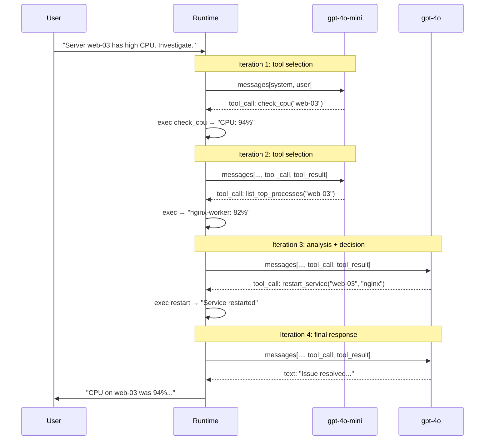

# 04. Autonomy and Loops — ReAct Loop

## Why This Chapter?

In this chapter, we implement the **ReAct (Reason + Act)** pattern — the heart of an autonomous agent.

Without an autonomous loop, an agent works like a chatbot: one request → one response. With an autonomous loop, an agent can perform 10 actions in a row to solve one task, independently making decisions based on the results of previous actions.

### Real-World Case Study

**Situation:** A user writes: "I'm out of disk space on the server. Fix it."

**Without autonomous loop:**
- Agent: "I will check disk usage" → calls `check_disk` → gets "95%"
- Agent: [Stops, waits for next user command]

**With autonomous loop:**
- Agent: "I will check disk usage" → calls `check_disk` → gets "95%"
- Agent: "Disk is full. I'll clean logs" → calls `clean_logs` → gets "Freed 20GB"
- Agent: "Checking again" → calls `check_disk` → gets "40%"
- Agent: "Done! Freed 20GB."

**Difference:** The agent decides what to do next based on the results of previous actions.

## Theory in Simple Terms

### ReAct Loop (Autonomy Cycle)

**ReAct** is an acronym for **Reason + Act**. This is a pattern where the agent:
1. **Reason:** Analyzes the situation and decides what to do
2. **Act:** Performs an action (calls a tool)
3. **Observe:** Receives the result of the action
4. **Repeat:** Reasons again based on the result

There's no magic here — it's simply a loop where the model processes the results of previous actions in context and generates the next step.

An autonomous agent works in a loop:

```
While (Task not solved):
  1. Send history to LLM
  2. Get response
  3. IF it's text → Show user and wait for new input
  4. IF it's a tool call →
       a. Execute tool
       b. Add result to history
       c. GOTO 1 (without asking the user!)
```

**Takeaway:** Point 4.c provides the "magic" — the agent looks at the result and decides what to do next. But it's not real magic: the model receives the tool result in context (`messages[]`) and generates the next step based on that context.

### Closing the Loop

After executing a tool, **don't ask the user** what to do next. Instead, send the result back to the LLM. The model receives the result of its actions and decides what to do next.

**Example dialogue in memory:**

### Magic vs Reality: How the Loop Works

**Magic (how it's usually explained):**
> The agent decided to call `clean_logs()` after checking the disk

**Reality (how it actually works):**

**Iteration 1: First Request**

```go
// messages before first iteration
messages := []openai.ChatCompletionMessage{
    {Role: "system", Content: "You are an autonomous DevOps agent."},
    {Role: "user", Content: "Out of disk space."},
}

// Send to model
resp1, _ := client.CreateChatCompletion(ctx, openai.ChatCompletionRequest{
    Model:    "gpt-4o-mini",
    Messages: messages,
    Tools:    tools,
})

msg1 := resp1.Choices[0].Message
// msg1.ToolCalls = [{ID: "call_1", Function: {Name: "check_disk_usage", Arguments: "{}"}}]

// Add assistant response to history
messages = append(messages, msg1)
// Now messages contains:
// [system, user, assistant(tool_call: check_disk_usage)]
```

**Iteration 2: Tool Execution and Result Return**

```go
// Execute tool
result1 := checkDiskUsage()  // "95% usage"

// Add result as a message with role "tool"
messages = append(messages, openai.ChatCompletionMessage{
    Role:       "tool",
    Content:    result1,  // "95% usage"
    ToolCallID: "call_1",
})
// Now messages contains:
// [system, user, assistant(tool_call), tool("95% usage")]

// Send UPDATED history to model again
resp2, _ := client.CreateChatCompletion(ctx, openai.ChatCompletionRequest{
    Model:    "gpt-4o-mini",
    Messages: messages,  // Model receives check_disk_usage result!
    Tools:    tools,
})

msg2 := resp2.Choices[0].Message
// msg2.ToolCalls = [{ID: "call_2", Function: {Name: "clean_logs", Arguments: "{}"}}]

messages = append(messages, msg2)
// Now messages contains:
// [system, user, assistant(tool_call_1), tool("95%"), assistant(tool_call_2)]
```

**Iteration 3: Second Tool**

```go
// Execute second tool
result2 := cleanLogs()  // "Freed 20GB"

messages = append(messages, openai.ChatCompletionMessage{
    Role:       "tool",
    Content:    result2,  // "Freed 20GB"
    ToolCallID: "call_2",
})
// Now messages contains:
// [system, user, assistant(tool_call_1), tool("95%"), assistant(tool_call_2), tool("Freed 20GB")]

// Send again
resp3, _ := client.CreateChatCompletion(ctx, openai.ChatCompletionRequest{
    Model:    "gpt-4o-mini",
    Messages: messages,  // Model receives both results!
    Tools:    tools,
})

msg3 := resp3.Choices[0].Message
// msg3.ToolCalls = []  // Empty! Model decided to respond with text
// msg3.Content = "I cleaned the logs, now there's enough space."

// This is the final response - exit loop
```

**Why this isn't magic:**

1. **The model receives the full history** — it doesn't "remember" the past, it processes it in `messages[]`
2. **The model receives the tool result** — the result is added as a new message with role `tool`
3. **The model decides based on context** — seeing "95% usage", the model understands that space needs to be freed
4. **Runtime manages the loop** — code checks `len(msg.ToolCalls)` and decides whether to continue the loop

**Takeaway:** The model didn't "decide on its own" — it saw the `check_disk_usage` result in context and generated the next tool call based on that context.

### Visualization: Who Does What?

```
┌─────────────────────────────────────────────────────────┐
│ LLM (Model)                                             │
│                                                         │
│ 1. Receives in context:                                 │
│    - System Prompt: "You are a DevOps agent"            │
│    - User Input: "Out of disk space"                    │
│    - Tools Schema: [{name: "check_disk", ...}]          │
│                                                         │
│ 2. Generates tool_call:                                 │
│    {name: "check_disk_usage", arguments: "{}"}          │
│                                                         │
│ 3. Does NOT execute code! Only generates JSON.          │
└─────────────────────────────────────────────────────────┘
                        ↓
┌─────────────────────────────────────────────────────────┐
│ Runtime (Your Go code)                                  │
│                                                         │
│ 1. Receives tool_call from model response               │
│ 2. Validates: does the tool exist?                      │
│ 3. Executes: checkDiskUsage() → "95% usage"             │
│ 4. Adds result to messages[]:                           │
│    {role: "tool", content: "95% usage"}                 │
│ 5. Sends updated history back to LLM                    │
└─────────────────────────────────────────────────────────┘
                        ↓
┌─────────────────────────────────────────────────────────┐
│ LLM (Model) - next iteration                            │
│                                                         │
│ 1. Receives in context:                                 │
│    - Previous tool_call                                 │
│    - Result: "95% usage" ← Runtime added!               │
│                                                         │
│ 2. Generates next tool_call:                            │
│    {name: "clean_logs", arguments: "{}"}                │
│                                                         │
│ 3. Loop repeats...                                      │
└─────────────────────────────────────────────────────────┘
```

**Takeaway:** The LLM doesn't "remember" the past. It processes it in `messages[]`, which Runtime collects.

## Loop Implementation

```go
for i := 0; i < maxIterations; i++ {
    // 1. Send request
    resp, err := client.CreateChatCompletion(ctx, openai.ChatCompletionRequest{
        Model:    "gpt-4o-mini",
        Messages: messages,
        Tools:    tools,
    })
    
    msg := resp.Choices[0].Message
    messages = append(messages, msg)  // Save response
    
    // 2. Check response type
    if len(msg.ToolCalls) == 0 {
        // This is the final text response
        fmt.Println("Agent:", msg.Content)
        break
    }
    
    // 3. Execute tools
    for _, toolCall := range msg.ToolCalls {
        result := executeTool(toolCall.Function.Name, toolCall.Function.Arguments)
        
        // 4. Add result to history
        messages = append(messages, openai.ChatCompletionMessage{
            Role:       openai.ChatMessageRoleTool,
            Content:    result,
            ToolCallID: toolCall.ID,
        })
    }
    // Loop continues automatically!
    // But this isn't magic: send the updated history (with tool result)
    // to the model again, and the model receives the result and decides what to do next
}
```

### Error Handling in the Loop

**Important:** Don't forget to handle errors and add them to history! If a tool fails, the LLM should know and try something else.

**Proper error handling:**

```go
for _, toolCall := range msg.ToolCalls {
    result, err := executeTool(toolCall.Function.Name, toolCall.Function.Arguments)
    
    if err != nil {
        // Error is also a result! Add it to history
        result = fmt.Sprintf("Error: %v", err)
    }
    
    // Add result (or error) to history
    messages = append(messages, openai.ChatCompletionMessage{
        Role:       openai.ChatMessageRoleTool,
        Content:    result,  // Model will see the error!
        ToolCallID: toolCall.ID,
    })
}
```

**What happens:**

1. Tool returns an error: `Error: connection refused`
2. Error is added to history as tool result
3. Model receives the error in context
4. Model can:
    - Try another tool
    - Inform the user about the problem
    - Escalate the issue

**Example:**

```
Iteration 1:
Action: check_database_status("prod")
Observation: Error: connection refused

Iteration 2 (model receives error):
Thought: "Database is unavailable. I'll check network connectivity"
Action: ping_host("db-prod.example.com")
Observation: "Host is unreachable"

Iteration 3:
Thought: "Network is unavailable. I'll inform the user about the problem"
Action: [Final response] "Database is unavailable. Check network connectivity."
```

**Anti-pattern:** Don't hide errors from the model!

```go
// BAD: Hide error
if err != nil {
    log.Printf("Error: %v", err)  // Only to log
    continue  // Skip tool
}

// GOOD: Show error to model
if err != nil {
    result := fmt.Sprintf("Error: %v", err)
    messages = append(messages, ...)  // Add to history
}
```

## Parallel Tool Calls

The model can return **multiple tool calls in a single iteration**. For example, a user asks "Check the status of nginx and postgresql" — the model returns two tool_calls in one response.

### What This Looks Like

```go
msg := resp.Choices[0].Message
// msg.ToolCalls can contain multiple calls:
// [
//   {ID: "call_1", Function: {Name: "check_status", Arguments: `{"service":"nginx"}`}},
//   {ID: "call_2", Function: {Name: "check_status", Arguments: `{"service":"postgresql"}`}},
// ]
```

### Sequential vs Parallel Execution

By default, runtime executes tools **sequentially** — one after another in a `range msg.ToolCalls` loop. This is simple and safe.

But if the tools are **independent** (don't read/write shared data), you can execute them **in parallel**:

```go
for _, toolCall := range msg.ToolCalls {
    if !areIndependent(toolCall, msg.ToolCalls) {
        // Dependent tools — execute sequentially
        result := executeTool(toolCall)
        messages = append(messages, makeToolMessage(toolCall.ID, result))
        continue
    }

    // Independent tools — run in parallel
    go func(tc openai.ToolCall) {
        result := executeTool(tc)
        resultsCh <- toolResult{ID: tc.ID, Content: result}
    }(toolCall)
}
```

**Simple implementation with `sync.WaitGroup`:**

```go
type toolResult struct {
    ID      string
    Content string
}

func executeToolsParallel(toolCalls []openai.ToolCall) []toolResult {
    results := make([]toolResult, len(toolCalls))
    var wg sync.WaitGroup

    for i, tc := range toolCalls {
        wg.Add(1)
        go func(idx int, call openai.ToolCall) {
            defer wg.Done()
            result, err := executeTool(call.Function.Name, call.Function.Arguments)
            if err != nil {
                result = fmt.Sprintf("Error: %v", err)
            }
            results[idx] = toolResult{ID: call.ID, Content: result}
        }(i, tc)
    }

    wg.Wait()
    return results
}
```

**When parallel, when sequential:**

| Situation | Strategy |
|-----------|----------|
| Two `check_status` for different services | Parallel — independent |
| `read_file` → `parse_json` | Sequential — second depends on first |
| Prototype / MVP | Sequential — easier to debug |

## Multi-Model Agent Loop

In [Chapter 03](../03-tools-and-function-calling/README.md#model-selection-strategy-for-different-stages) we introduced `ModelSelector`. Now let's apply it to the agent loop.

### Why Switch Models Inside the Loop?

Different iterations involve different work:

- **Iterations with tool calls:** The model picks a tool and generates arguments. This is a classification task — a cheap model handles it fine.
- **Final iteration:** The model analyzes all results and formulates a response. This is a reasoning task — needs a powerful model.
- **Iterations after an error:** The model decides what to do about the error. This requires reasoning — a powerful model is better.

### Implementation

```go
type MultiModelLoop struct {
    fastModel  string // For tool selection: cheap and fast
    smartModel string // For analysis and reasoning: powerful
}

func (l *MultiModelLoop) Run(ctx context.Context, client *openai.Client,
    messages []openai.ChatCompletionMessage, tools []openai.Tool, maxIter int,
) (string, error) {
    lastHadError := false

    for i := 0; i < maxIter; i++ {
        // Pick model for the current iteration
        model := l.fastModel
        if lastHadError {
            model = l.smartModel // After an error, reasoning is needed
        }

        resp, err := client.CreateChatCompletion(ctx, openai.ChatCompletionRequest{
            Model:    model,
            Messages: messages,
            Tools:    tools,
        })
        if err != nil {
            return "", fmt.Errorf("iteration %d: %w", i, err)
        }

        msg := resp.Choices[0].Message
        messages = append(messages, msg)

        // Final response — re-ask with the powerful model if the cheap one answered
        if len(msg.ToolCalls) == 0 {
            if model == l.fastModel && i > 0 {
                // The cheap model gave a final answer.
                // Optionally re-ask the powerful model for better quality.
                return l.refineAnswer(ctx, client, messages)
            }
            return msg.Content, nil
        }

        // Execute tools
        lastHadError = false
        for _, tc := range msg.ToolCalls {
            result, execErr := executeTool(tc.Function.Name, tc.Function.Arguments)
            if execErr != nil {
                result = fmt.Sprintf("Error: %v", execErr)
                lastHadError = true
            }
            messages = append(messages, openai.ChatCompletionMessage{
                Role:       openai.ChatMessageRoleTool,
                Content:    result,
                ToolCallID: tc.ID,
            })
        }
    }
    return "", fmt.Errorf("exceeded %d iterations", maxIter)
}
```

**Key point:** The `refineAnswer` method is optional. It's an optimization: if the cheap model gathered all data through tools, the powerful model can formulate a better final answer.

## End-to-End Example: Multi-Model Flow over 5 Iterations

The `ModelSelector` and `MultiModelLoop` abstractions may look clear in code, but it's hard to see **what actually happens at runtime**. Let's walk through a concrete scenario step by step.

### Scenario

The user writes: **"Server web-03 has high CPU. Investigate."**

The agent has three tools:

```go
tools := []openai.Tool{
    {Function: &openai.FunctionDefinition{
        Name:        "check_cpu",
        Description: "Check CPU usage of a server",
        Parameters:  json.RawMessage(`{"type":"object","properties":{"host":{"type":"string"}},"required":["host"]}`),
    }},
    {Function: &openai.FunctionDefinition{
        Name:        "list_top_processes",
        Description: "List top CPU-consuming processes on a server",
        Parameters:  json.RawMessage(`{"type":"object","properties":{"host":{"type":"string"},"limit":{"type":"integer"}},"required":["host"]}`),
    }},
    {Function: &openai.FunctionDefinition{
        Name:        "restart_service",
        Description: "Restart a systemd service on a server. CAUTION: causes brief downtime.",
        Parameters:  json.RawMessage(`{"type":"object","properties":{"host":{"type":"string"},"service":{"type":"string"}},"required":["host","service"]}`),
    }},
}
```

Model selection strategy:
- **gpt-4o-mini** — for iterations where the previous response contained tool calls (simple task: pick a tool)
- **gpt-4o** — when a decision based on collected data is needed (analysis, final response)

### Flow Diagram



### Step-by-Step Walkthrough

**Iteration 1 — `gpt-4o-mini` — first tool selection**

```
[iter=1 model=gpt-4o-mini reason=first_call cost≈$0.0003]
```

The model receives:
```
messages = [
  {role: "system", content: "You are a DevOps agent. Diagnose and fix issues."},
  {role: "user",   content: "Server web-03 has high CPU. Investigate."}
]
```

The model returns:
```json
{"tool_calls": [{"function": {"name": "check_cpu", "arguments": "{\"host\":\"web-03\"}"}}]}
```

**Why gpt-4o-mini?** This is the first call. The task is to pick from 3 tools the one matching "high CPU". That's classification, not reasoning. A cheap model handles it fine.

Runtime executes `check_cpu("web-03")` → `"CPU usage: 94%, load average: 12.3"`

---

**Iteration 2 — `gpt-4o-mini` — second tool selection**

```
[iter=2 model=gpt-4o-mini reason=previous_had_tool_calls cost≈$0.0004]
```

The model receives (messages grew):
```
messages = [
  {role: "system",    content: "You are a DevOps agent..."},
  {role: "user",      content: "Server web-03 has high CPU. Investigate."},
  {role: "assistant", tool_calls: [{name: "check_cpu", args: {host: "web-03"}}]},
  {role: "tool",      content: "CPU usage: 94%, load average: 12.3", tool_call_id: "call_1"}
]
```

The model returns:
```json
{"tool_calls": [{"function": {"name": "list_top_processes", "arguments": "{\"host\":\"web-03\",\"limit\":5}"}}]}
```

**Why gpt-4o-mini?** The previous iteration returned a tool call. The model sees "CPU 94%" and needs to pick the next tool. This is still classification: "which tool helps understand what's consuming CPU?" → `list_top_processes`.

Runtime executes `list_top_processes("web-03", 5)`:
```
PID    COMMAND         CPU%
18234  nginx-worker    82.1%
18235  nginx-worker    4.3%
  892  postgres        3.2%
  451  node            2.1%
    1  systemd         0.1%
```

---

**Iteration 3 — `gpt-4o` — making a decision**

```
[iter=3 model=gpt-4o reason=need_analysis cost≈$0.008]
```

The model receives (messages contains 6 elements):
```
messages = [
  system, user,
  assistant(tool_call: check_cpu),    tool("CPU: 94%"),
  assistant(tool_call: list_top),     tool("nginx-worker: 82.1%...")
]
```

The model returns:
```json
{"tool_calls": [{"function": {"name": "restart_service", "arguments": "{\"host\":\"web-03\",\"service\":\"nginx\"}"}}]}
```

**Why gpt-4o?** This is where **reasoning** is needed. The model must:
1. Understand that nginx-worker consumes 82% CPU (not just pick a tool)
2. Decide the right action is restarting nginx (not postgres or node)
3. Assess the restart risk (CAUTION in the tool description)

A cheap model might get it wrong: restart the wrong service or keep gathering information instead of acting.

Runtime executes `restart_service("web-03", "nginx")` → `"Service nginx restarted successfully. PID: 19012"`

---

**Iteration 4 — `gpt-4o` — final response**

```
[iter=4 model=gpt-4o reason=previous_had_tool_calls_but_critical cost≈$0.01]
```

The model receives (messages contains 8 elements):
```
messages = [
  system, user,
  assistant(check_cpu),     tool("CPU: 94%"),
  assistant(list_top),      tool("nginx-worker: 82.1%"),
  assistant(restart_nginx), tool("Service nginx restarted. PID: 19012")
]
```

The model returns **text** (no tool_calls):
```
CPU on web-03 was at 94%. Main consumer: nginx-worker process (82.1% CPU).
Restarted nginx. New PID: 19012.

Recommendations:
- Check worker_processes configuration in nginx.conf
- Set up CPU monitoring with an alert at 80%
```

**Why gpt-4o?** The final response requires synthesizing information from all previous steps and formulating recommendations. The powerful model does this better.

### messages[] Evolution

| After iteration | Elements in messages[] | What was added |
|:-:|:-:|:--|
| — | 2 | `system` + `user` |
| 1 | 4 | + `assistant(tool_call: check_cpu)` + `tool("CPU: 94%")` |
| 2 | 6 | + `assistant(tool_call: list_top)` + `tool("nginx: 82%")` |
| 3 | 8 | + `assistant(tool_call: restart)` + `tool("restarted")` |
| 4 | 9 | + `assistant("CPU on web-03 was at 94%...")` |

Each iteration adds 2 messages (assistant + tool), the last one adds only 1 (just assistant with text).

### Cost Calculation

**Single model (gpt-4o for all iterations):**

| Iteration | Model | Input tokens | Output tokens | Cost |
|:-:|:--|:-:|:-:|:-:|
| 1 | gpt-4o | ~300 | ~30 | $0.0040 |
| 2 | gpt-4o | ~450 | ~40 | $0.0060 |
| 3 | gpt-4o | ~650 | ~35 | $0.0085 |
| 4 | gpt-4o | ~800 | ~120 | $0.0120 |
| | | | **Total:** | **$0.0305** |

**Multi-model strategy:**

| Iteration | Model | Input tokens | Output tokens | Cost |
|:-:|:--|:-:|:-:|:-:|
| 1 | gpt-4o-mini | ~300 | ~30 | $0.0003 |
| 2 | gpt-4o-mini | ~450 | ~40 | $0.0004 |
| 3 | gpt-4o | ~650 | ~35 | $0.0085 |
| 4 | gpt-4o | ~800 | ~120 | $0.0120 |
| | | | **Total:** | **$0.0212** |

**Savings: 30%** in this example. At 10,000 tasks per day: $305 vs $212 → $93/day → **$2,800/month**.

For tasks with more tool calls (6–8 iterations instead of 4), savings reach 50–60%.

### When Does Runtime Switch the Model?

Model selection logic in this example:

```go
func selectModel(iteration int, lastHadToolCalls bool, lastHadError bool) string {
    // After an error — powerful model (reasoning needed)
    if lastHadError {
        return "gpt-4o"
    }

    // First 2 iterations with tool calls — cheap model
    // Starting from iteration 3 — powerful (enough context accumulated for a decision)
    if lastHadToolCalls && iteration < 3 {
        return "gpt-4o-mini"
    }

    // Everything else — powerful model
    return "gpt-4o"
}
```

**Alternative strategy** — simpler, but less precise:

```go
func selectModelSimple(lastHadToolCalls bool) string {
    if lastHadToolCalls {
        return "gpt-4o-mini" // Still gathering data
    }
    return "gpt-4o" // Formulating response
}
```

Problem with the simple strategy: iteration 3 (where a restart decision is needed) will use the cheap model. It might get it wrong.

### Full Working Code

```go
package main

import (
    "context"
    "encoding/json"
    "fmt"
    "os"
    "strings"

    "github.com/sashabaranov/go-openai"
)

func main() {
    config := openai.DefaultConfig(os.Getenv("OPENAI_API_KEY"))
    if baseURL := os.Getenv("OPENAI_BASE_URL"); baseURL != "" {
        config.BaseURL = baseURL
    }
    client := openai.NewClientWithConfig(config)
    ctx := context.Background()

    // Tools
    tools := []openai.Tool{
        {Type: openai.ToolTypeFunction, Function: &openai.FunctionDefinition{
            Name: "check_cpu", Description: "Check CPU usage of a server",
            Parameters: json.RawMessage(`{"type":"object","properties":{"host":{"type":"string"}},"required":["host"]}`),
        }},
        {Type: openai.ToolTypeFunction, Function: &openai.FunctionDefinition{
            Name: "list_top_processes", Description: "List top CPU-consuming processes",
            Parameters: json.RawMessage(`{"type":"object","properties":{"host":{"type":"string"},"limit":{"type":"integer"}},"required":["host"]}`),
        }},
        {Type: openai.ToolTypeFunction, Function: &openai.FunctionDefinition{
            Name: "restart_service", Description: "Restart a systemd service. CAUTION: causes brief downtime.",
            Parameters: json.RawMessage(`{"type":"object","properties":{"host":{"type":"string"},"service":{"type":"string"}},"required":["host","service"]}`),
        }},
    }

    messages := []openai.ChatCompletionMessage{
        {Role: "system", Content: "You are a DevOps agent. Diagnose and fix server issues. Use tools to investigate, then act."},
        {Role: "user", Content: "Server web-03 has high CPU. Investigate."},
    }

    // Multi-model loop
    const (
        fastModel  = "gpt-4o-mini"
        smartModel = "gpt-4o"
        maxIter    = 10
    )

    lastHadToolCalls := true
    lastHadError := false

    for i := 0; i < maxIter; i++ {
        // --- Model selection ---
        model := fastModel
        if lastHadError || (lastHadToolCalls && i >= 3) || !lastHadToolCalls {
            model = smartModel
        }

        fmt.Printf("\n[iter=%d model=%s msgs=%d]\n", i+1, model, len(messages))

        resp, err := client.CreateChatCompletion(ctx, openai.ChatCompletionRequest{
            Model:       model,
            Messages:    messages,
            Tools:       tools,
            Temperature: 0,
        })
        if err != nil {
            fmt.Printf("  ERROR: %v\n", err)
            return
        }

        msg := resp.Choices[0].Message
        messages = append(messages, msg)
        fmt.Printf("  tokens: prompt=%d completion=%d\n", resp.Usage.PromptTokens, resp.Usage.CompletionTokens)

        // --- Final response? ---
        if len(msg.ToolCalls) == 0 {
            fmt.Printf("  FINAL ANSWER:\n%s\n", msg.Content)
            break
        }

        // --- Execute tools ---
        lastHadToolCalls = true
        lastHadError = false
        for _, tc := range msg.ToolCalls {
            fmt.Printf("  tool_call: %s(%s)\n", tc.Function.Name, tc.Function.Arguments)

            result := executeToolStub(tc.Function.Name, tc.Function.Arguments)
            if strings.HasPrefix(result, "Error") {
                lastHadError = true
            }
            fmt.Printf("  result: %s\n", truncate(result, 80))

            messages = append(messages, openai.ChatCompletionMessage{
                Role:       openai.ChatMessageRoleTool,
                Content:    result,
                ToolCallID: tc.ID,
            })
        }
    }
}

// Tool stubs (replace with real calls)
func executeToolStub(name, argsJSON string) string {
    switch name {
    case "check_cpu":
        return "CPU usage: 94%, load average: 12.3, uptime: 14 days"
    case "list_top_processes":
        return `PID    COMMAND         CPU%
18234  nginx-worker    82.1%
18235  nginx-worker    4.3%
  892  postgres        3.2%
  451  node            2.1%
    1  systemd         0.1%`
    case "restart_service":
        var args struct{ Service string `json:"service"` }
        json.Unmarshal([]byte(argsJSON), &args)
        return fmt.Sprintf("Service %s restarted successfully. New PID: 19012", args.Service)
    default:
        return fmt.Sprintf("Error: unknown tool %s", name)
    }
}

func truncate(s string, maxLen int) string {
    s = strings.ReplaceAll(s, "\n", " | ")
    if len(s) > maxLen {
        return s[:maxLen] + "..."
    }
    return s
}
```

**Expected output:**

```
[iter=1 model=gpt-4o-mini msgs=2]
  tokens: prompt=285 completion=28
  tool_call: check_cpu({"host":"web-03"})
  result: CPU usage: 94%, load average: 12.3, uptime: 14 days

[iter=2 model=gpt-4o-mini msgs=4]
  tokens: prompt=432 completion=38
  tool_call: list_top_processes({"host":"web-03","limit":5})
  result: PID    COMMAND         CPU% | 18234  nginx-worker    82.1% | 18235  ngi...

[iter=3 model=gpt-4o msgs=6]
  tokens: prompt=648 completion=32
  tool_call: restart_service({"host":"web-03","service":"nginx"})
  result: Service nginx restarted successfully. New PID: 19012

[iter=4 model=gpt-4o msgs=8]
  tokens: prompt=795 completion=118
  FINAL ANSWER:
CPU on web-03 was at 94%. Root cause: nginx-worker process (82.1% CPU).
Restarted nginx (new PID: 19012).
Recommend checking worker_processes in nginx.conf and setting up a CPU alert at 80%.
```

Notice the `model=` column: iterations 1–2 use the cheap model, iterations 3–4 use the powerful one. Runtime makes this decision **before** calling the LLM, based on the iteration number and the presence of tool calls.

## Loop Stopping Strategies

The iteration limit (`maxIterations`) is **protection against infinite loops**, not a stopping strategy. The agent should stop when the task is solved.

### Strategy 1: The Model Decides (Default)

The model stops calling tools and returns text. This works when the System Prompt contains an instruction:

```
When the task is complete, respond with a summary. Do not call tools unnecessarily.
```

### Strategy 2: A "task_complete" Tool

Add a special tool that the agent calls to signal completion:

```go
{
    Name:        "task_complete",
    Description: "Call this when the task is fully resolved. Provide a summary of what was done.",
    Parameters: json.RawMessage(`{
        "type": "object",
        "properties": {
            "summary": {"type": "string", "description": "Summary of completed work"},
            "success": {"type": "boolean", "description": "Whether the task was successful"}
        },
        "required": ["summary", "success"]
    }`),
}
```

Advantage: you get a **structured** result (success/failure + description), not just text.

### Strategy 3: Stuck Detection

If the last N actions are identical, the agent is stuck:

```go
func detectStuck(messages []openai.ChatCompletionMessage, windowSize int) bool {
    var recentCalls []string
    for i := len(messages) - 1; i >= 0 && len(recentCalls) < windowSize; i-- {
        msg := messages[i]
        if msg.Role == openai.ChatMessageRoleAssistant && len(msg.ToolCalls) > 0 {
            call := msg.ToolCalls[0].Function.Name + ":" + msg.ToolCalls[0].Function.Arguments
            recentCalls = append(recentCalls, call)
        }
    }

    if len(recentCalls) < windowSize {
        return false
    }
    // Are all calls identical?
    for _, c := range recentCalls[1:] {
        if c != recentCalls[0] {
            return false
        }
    }
    return true
}
```

### Strategy 4: Token Budget

Stop if too many tokens have been spent:

```go
totalTokens += resp.Usage.TotalTokens
if totalTokens > maxTokenBudget {
    // Budget exhausted — ask the model to give a final answer
    messages = append(messages, openai.ChatCompletionMessage{
        Role:    openai.ChatMessageRoleUser,
        Content: "Token budget exhausted. Provide your best answer based on information gathered so far.",
    })
    // Last call without tools — model must respond with text
    resp, _ := client.CreateChatCompletion(ctx, openai.ChatCompletionRequest{
        Model:    model,
        Messages: messages,
        // Don't pass tools — model can only respond with text
    })
    return resp.Choices[0].Message.Content, nil
}
```

For more on token budgets, see [Chapter 20: Cost & Latency Engineering](../20-cost-latency-engineering/README.md).

## Common Errors

### Error 1: Infinite Loop

**Symptom:** Agent repeats the same action infinitely.

**Cause:** No iteration limit and no detection of repeating actions.

**Solution:**
```go
// GOOD: Iteration limit + stuck detection
for i := 0; i < maxIterations; i++ {
    // ...
    
    // Detect repeating actions
    if lastNActionsAreSame(history, 3) {
        break
    }
}

// GOOD: Improve prompt
systemPrompt := `... If action doesn't help, try a different approach.`
```

### Error 2: Tool Result Not Added to History

**Symptom:** Agent doesn't see tool result and continues performing the same action.

**Cause:** Tool execution result is not added to `messages[]`.

**Solution:**
```go
// BAD: Result not added
result := executeTool(toolCall)
// History not updated!

// GOOD: ALWAYS add result!
messages = append(messages, openai.ChatCompletionMessage{
    Role:       openai.ChatMessageRoleTool,
    Content:    result,
    ToolCallID: toolCall.ID,  // Important for linking!
})
```

### Error 3: Agent Doesn't Stop

**Symptom:** Agent continues calling tools even when the task is solved.

**Cause:** System Prompt doesn't instruct the agent to stop when the task is solved.

**Solution:**
```go
// GOOD: Add to System Prompt
systemPrompt := `... If task is solved, answer user with text. Don't call tools unnecessarily.`
```

### Error 4: One Model for All Iterations

**Symptom:** Agent is slow and expensive. Every tool call costs as much as the final response.

**Cause:** A single powerful model (GPT-4o) is used for all iterations, including simple tool selection.

**Solution:**
```go
// BAD: GPT-4o for every iteration
model := "gpt-4o" // $0.01 per call × 8 iterations = $0.08

// GOOD: Cheap model for tool calls, powerful for analysis
if lastHadToolCalls {
    model = "gpt-4o-mini" // $0.0002 per tool call × 7 = $0.0014
} else {
    model = "gpt-4o"      // $0.01 for final response × 1 = $0.01
}
// Total: $0.0114 instead of $0.08 — 7x savings
```

For more details, see [Chapter 03: Model Selection Strategy](../03-tools-and-function-calling/README.md#model-selection-strategy-for-different-stages).

## Mini-Exercises

### Exercise 1: Add Loop Detection

Implement a check that the last 3 actions are the same:

```go
func isStuck(history []ChatCompletionMessage) bool {
    // Check that last 3 actions are the same
    // ...
}
```

**Expected result:**
- Function returns `true` if last 3 actions are the same
- Function returns `false` otherwise

### Exercise 2: Add Logging

Log each loop iteration:

```go
fmt.Printf("[Iteration %d] Agent decided: %s\n", i, action)
fmt.Printf("[Iteration %d] Tool result: %s\n", i, result)
```

**Expected result:**
- Each iteration is logged with number and action
- Tool results are logged

## Completion Criteria / Checklist

**Completed:**
- [x] Agent executes loop autonomously
- [x] Tool results are added to history
- [x] Agent stops when task is solved
- [x] Protection against loops (iteration limit + detection)
- [x] Tool errors are handled and added to history

**Not completed:**
- [ ] Agent doesn't continue loop after tool execution
- [ ] Tool results are not visible to agent (not added to history)
- [ ] Agent loops infinitely (no protection)
- [ ] Agent doesn't stop when task is solved

## Connection with Other Chapters

- **Tools:** How tools are called and return results, see [Chapter 03: Tools](../03-tools-and-function-calling/README.md)
- **Memory:** How message history (`messages[]`) grows and is managed, see [Chapter 09: Agent Anatomy](../09-agent-architecture/README.md)
- **Safety:** How to stop the loop for confirmation, see [Chapter 05: Safety](../05-safety-and-hitl/README.md)

## What's Next?

After studying autonomy, proceed to:
- **[05. Safety and Human-in-the-Loop](../05-safety-and-hitl/README.md)** — how to protect the agent from dangerous actions

