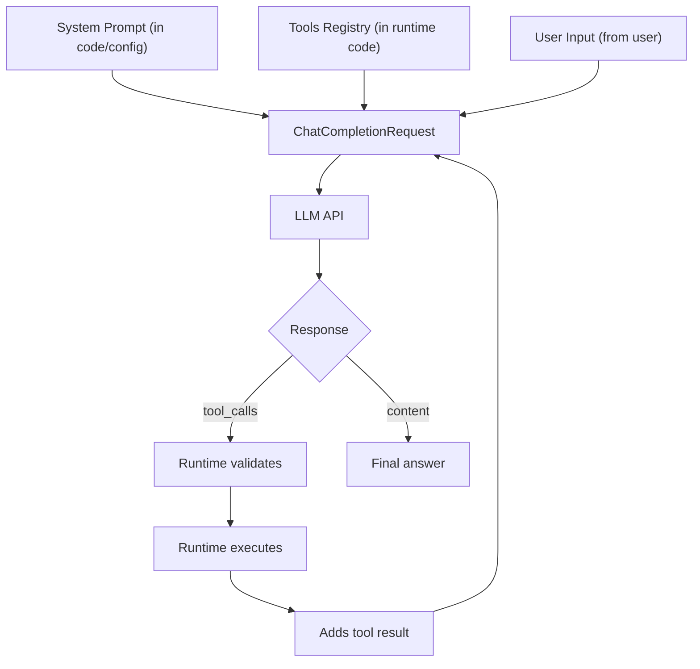

# 04. Tools and Function Calling — Agent's "Hands"

## Why This Chapter?

Tools turn an LLM from a talker into a worker. Without tools, an agent can only respond with text, but cannot interact with the real world.

Function Calling is a mechanism that allows the model to call real Go functions, execute commands, read data, and perform actions.

### Real-World Case Study

**Situation:** You've created a DevOps chatbot. User writes: "Check status of server web-01"

**Problem:** Bot cannot actually check the server. It only says: "I'll check the status of server web-01 for you..." (text)

**Solution:** Function Calling allows the model to call real Go functions. The model generates structured JSON with function name and arguments, your code executes the function and returns the result back to the model.

## Theory in Simple Terms

### How Does Function Calling Work?

1. **You describe the function** in JSON Schema format
2. **LLM sees the description** and decides: "I need to call this function"
3. **LLM generates JSON** with function name and arguments
4. **Your code parses JSON** and executes the real function
5. **Result is returned** to LLM for further processing

## Function Calling — How It Works

**Function Calling** is a mechanism where LLM returns not text, but structured JSON with function name and arguments.

### Full Cycle: From Definition to Execution

Let's break down the **full cycle** using the `ping` tool example:

#### Step 1: Tool Definition (Tool Schema)

```go
tools := []openai.Tool{
    {
        Type: openai.ToolTypeFunction,
        Function: &openai.FunctionDefinition{
            Name:        "ping",
            Description: "Ping a host to check connectivity",
            Parameters: json.RawMessage(`{
                "type": "object",
                "properties": {
                    "host": {
                        "type": "string",
                        "description": "Hostname or IP address to ping"
                    }
                },
                "required": ["host"]
            }`),
        },
    },
}
```

**What happens:** We describe the tool in JSON Schema format. This description is sent to the model along with the request.

#### Step 2: Request to Model

```go
messages := []openai.ChatCompletionMessage{
    {Role: "system", Content: "You are a network admin. Use tools to check connectivity."},
    {Role: "user", Content: "Check availability of google.com"},
}

req := openai.ChatCompletionRequest{
    Model:    openai.GPT3Dot5Turbo,
    Messages: messages,
    Tools:    tools,  // Model sees tool descriptions!
    Temperature: 0,
}

resp, _ := client.CreateChatCompletion(ctx, req)
msg := resp.Choices[0].Message
```

**What happens:** Model sees:
- System prompt (role and instructions)
- User input (user request)
- **Tools schema** (description of available tools)

#### Step 3: Model Response (Tool Call)

Model **doesn't return text** "I'll check ping". It returns **structured tool call**:

```go
// msg.ToolCalls contains:
[]openai.ToolCall{
    {
        ID: "call_abc123",
        Type: "function",
        Function: openai.FunctionCall{
            Name:      "ping",
            Arguments: `{"host": "google.com"}`,
        },
    },
}
```

**What happens:** Model **generated tool_call** for `ping` tool and JSON with arguments. This is **not magic** — the model saw `Description: "Ping a host to check connectivity"` and linked it with the user's request.

**How does the model choose between multiple tools?**

Let's expand the example by adding several tools:

```go
tools := []openai.Tool{
    {
        Function: &openai.FunctionDefinition{
            Name:        "ping",
            Description: "Ping a host to check network connectivity. Use this when user asks about network reachability or connectivity.",
        },
    },
    {
        Function: &openai.FunctionDefinition{
            Name:        "check_http",
            Description: "Check HTTP status code of a website. Use this when user asks about website availability or HTTP errors.",
        },
    },
    {
        Function: &openai.FunctionDefinition{
            Name:        "traceroute",
            Description: "Trace the network path to a host. Use this when user asks about network routing or path analysis.",
        },
    },
}

userInput := "Check availability of google.com"
```

**Selection process:**

1. Model sees **all three tools** and their `Description`:
   - `ping`: "check network connectivity... Use this when user asks about network reachability"
   - `check_http`: "Check HTTP status... Use this when user asks about website availability"
   - `traceroute`: "Trace network path... Use this when user asks about routing"

2. Model matches request "Check availability of google.com" with descriptions:
   - ✅ `ping` — description contains "connectivity" and "reachability" → **chooses this**
   - ❌ `check_http` — about HTTP status, not network availability
   - ❌ `traceroute` — about routing, not availability check

3. Model returns tool call for `ping`:
   ```json
   {"name": "ping", "arguments": "{\"host\": \"google.com\"}"}
   ```

**Example with different request:**

```go
userInput := "Check if site google.com responds"

// Model sees the same 3 tools
// Matches:
// - ping: about network availability → not quite it
// - check_http: "Use this when user asks about website availability" → ✅ CHOOSES THIS
// - traceroute: about routing → doesn't fit

// Model returns:
// {"name": "check_http", "arguments": "{\"url\": \"https://google.com\"}"}
```

**Key point:** Model chooses tool based on **semantic matching** between user request and `Description`. The more accurate and specific `Description`, the better the model chooses the right tool.

#### Step 4: Validation (Runtime)

```go
// Check that tool exists
if msg.ToolCalls[0].Function.Name != "ping" {
    return fmt.Errorf("unknown tool: %s", msg.ToolCalls[0].Function.Name)
}

// Validate JSON arguments
var args struct {
    Host string `json:"host"`
}
if err := json.Unmarshal([]byte(msg.ToolCalls[0].Function.Arguments), &args); err != nil {
    return fmt.Errorf("invalid JSON: %v", err)
}

// Check required fields
if args.Host == "" {
    return fmt.Errorf("host is required")
}
```

**What happens:** Runtime validates the call before execution. This is **critical** for security.

#### Step 5: Tool Execution

```go
func executePing(host string) string {
    cmd := exec.Command("ping", "-c", "1", host)
    output, err := cmd.CombinedOutput()
    if err != nil {
        return fmt.Sprintf("Error: %s", err)
    }
    return string(output)
}

result := executePing(args.Host)  // "PING google.com: 64 bytes from ..."
```

**What happens:** Runtime executes **real function** (in this case system command `ping`).

#### Step 6: Return Result to Model

```go
// Add result to history as message with role "tool"
messages = append(messages, openai.ChatCompletionMessage{
    Role:       openai.ChatMessageRoleTool,
    Content:    result,  // "PING google.com: 64 bytes from ..."
    ToolCallID: msg.ToolCalls[0].ID,  // Link with call
})

// Send updated history to model again
resp2, _ := client.CreateChatCompletion(ctx, openai.ChatCompletionRequest{
    Model:    openai.GPT3Dot5Turbo,
    Messages: messages,  // Now includes tool result!
    Tools:    tools,
})
```

**What happens:** Model sees tool execution result and can:
- Formulate final answer to user
- Call another tool if needed
- Ask clarifying question

#### Step 7: Final Answer

```go
finalMsg := resp2.Choices[0].Message
if len(finalMsg.ToolCalls) == 0 {
    // This is final text answer
    fmt.Println(finalMsg.Content)  // "google.com is available, response time 10ms"
}
```

**What happens:** Model saw `ping` result and formulated a clear answer for the user.

## End-to-End Protocol: Full Request and Two Moves

Now let's break down the **full protocol** from the agent developer's perspective: where things are stored, how the request is assembled, and how runtime processes responses.

### Where Is What Stored in Agent Code?



**Storage scheme:**

1. **System Prompt** — stored in agent code (constant or config):
   - Instructions (Role, Goal, Constraints)
   - Few-shot examples (if used)
   - SOP (action algorithm)

2. **Tools Schema** — stored in **runtime registry** (not in prompt!):
   - Tool definitions (JSON Schema)
   - Tool handler functions
   - Validation and execution

3. **User Input** — comes from user:
   - Current request
   - Dialogue history (stored in `messages[]`)

4. **Tool Results** — generated by runtime:
   - After tool execution
   - Added to `messages[]` with `Role = "tool"`

### Full Protocol: JSON Requests and Responses (2 Moves)

**Move 1: Request with Multiple Tools**

```json
{
  "model": "gpt-3.5-turbo",
  "messages": [
    {
      "role": "system",
      "content": "You are a DevOps engineer. Use tools to check services.\n\nUsage examples:\nUser: \"Check nginx status\"\nAssistant: returns tool_call check_status(\"nginx\")\n\nUser: \"Restart server\"\nAssistant: returns tool_call restart_service(\"web-01\")"
    },
    {
      "role": "user",
      "content": "Check nginx status"
    }
  ],
  "tools": [
    {
      "type": "function",
      "function": {
        "name": "check_status",
        "description": "Check if a service is running. Use this when user asks about service status.",
        "parameters": {
          "type": "object",
          "properties": {
            "service": {
              "type": "string",
              "description": "Service name"
            }
          },
          "required": ["service"]
        }
      }
    },
    {
      "type": "function",
      "function": {
        "name": "restart_service",
        "description": "Restart a systemd service. Use this when user explicitly asks to restart a service.",
        "parameters": {
          "type": "object",
          "properties": {
            "service_name": {
              "type": "string",
              "description": "Service name to restart"
            }
          },
          "required": ["service_name"]
        }
      }
    }
  ],
  "tool_choice": "auto"
}
```

**Where things are:**
- **System Prompt** (instructions + few-shot examples) → `messages[0].content`
- **User Input** → `messages[1].content`
- **Tools Schema** (2 tools with full JSON Schema) → separate field `tools[]`

**Response #1 (tool call):**

```json
{
  "id": "chatcmpl-abc123",
  "choices": [{
    "message": {
      "role": "assistant",
      "content": null,
      "tool_calls": [
        {
          "id": "call_xyz789",
          "type": "function",
          "function": {
            "name": "check_status",
            "arguments": "{\"service\": \"nginx\"}"
          }
        }
      ]
    }
  }]
}
```

**Runtime processes tool call:**
1. Validates: `tool_calls[0].function.name` exists in registry
2. Parses: `json.Unmarshal(tool_calls[0].function.arguments)` → `{"service": "nginx"}`
3. Executes: `check_status("nginx")` → result: `"Service nginx is ONLINE"`
4. Adds tool result to `messages[]`

**Move 2: Request with Tool Result**

```json
{
  "model": "gpt-3.5-turbo",
  "messages": [
    {
      "role": "system",
      "content": "You are a DevOps engineer. Use tools to check services.\n\nUsage examples:\nUser: \"Check nginx status\"\nAssistant: returns tool_call check_status(\"nginx\")\n\nUser: \"Restart server\"\nAssistant: returns tool_call restart_service(\"web-01\")"
    },
    {
      "role": "user",
      "content": "Check nginx status"
    },
    {
      "role": "assistant",
      "content": null,
      "tool_calls": [
        {
          "id": "call_xyz789",
          "type": "function",
          "function": {
            "name": "check_status",
            "arguments": "{\"service\": \"nginx\"}"
          }
        }
      ]
    },
    {
      "role": "tool",
      "content": "Service nginx is ONLINE",
      "tool_call_id": "call_xyz789"
    }
  ],
  "tools": [
    {
      "type": "function",
      "function": {
        "name": "check_status",
        "description": "Check if a service is running. Use this when user asks about service status.",
        "parameters": {
          "type": "object",
          "properties": {
            "service": {
              "type": "string",
              "description": "Service name"
            }
          },
          "required": ["service"]
        }
      }
    },
    {
      "type": "function",
      "function": {
        "name": "restart_service",
        "description": "Restart a systemd service. Use this when user explicitly asks to restart a service.",
        "parameters": {
          "type": "object",
          "properties": {
            "service_name": {
              "type": "string",
              "description": "Service name to restart"
            }
          },
          "required": ["service_name"]
        }
      }
    }
  ]
}
```

**Where things are:**
- **System Prompt** → `messages[0].content` (same)
- **User Input** → `messages[1].content` (same)
- **Tool Call** → `messages[2]` (added by runtime after first response)
- **Tool Result** → `messages[3].content` (added by runtime after execution)
- **Tools Schema** → field `tools[]` (same)

**Response #2 (final answer):**

```json
{
  "id": "chatcmpl-def456",
  "choices": [{
    "message": {
      "role": "assistant",
      "content": "nginx is working normally, service ONLINE",
      "tool_calls": null
    }
  }]
}
```

### Evolution of messages[] Array (JSON)

**Before first request:**
```json
[
  {"role": "system", "content": "You are a DevOps engineer..."},
  {"role": "user", "content": "Check nginx status"}
]
```

**After first request (runtime adds tool call):**
```json
[
  {"role": "system", "content": "You are a DevOps engineer..."},
  {"role": "user", "content": "Check nginx status"},
  {
    "role": "assistant",
    "content": null,
    "tool_calls": [{
      "id": "call_xyz789",
      "type": "function",
      "function": {
        "name": "check_status",
        "arguments": "{\"service\": \"nginx\"}"
      }
    }]
  }
]
```

**After tool execution (runtime adds tool result):**
```json
[
  {"role": "system", "content": "You are a DevOps engineer..."},
  {"role": "user", "content": "Check nginx status"},
  {
    "role": "assistant",
    "content": null,
    "tool_calls": [{
      "id": "call_xyz789",
      "type": "function",
      "function": {
        "name": "check_status",
        "arguments": "{\"service\": \"nginx\"}"
      }
    }]
  },
  {
    "role": "tool",
    "content": "Service nginx is ONLINE",
    "tool_call_id": "call_xyz789"
  }
]
```

**After second request (model sees tool result and formulates answer):**
- Model sees full context (system + user + tool call + tool result)
- Generates final answer: `"nginx is working normally, service ONLINE"`

**Note:** For Go implementation, see examples in [Lab 02: Tools](../../labs/lab02-tools/README.md) and [Lab 04: Autonomy](../../labs/lab04-autonomy/README.md)

### Key Points for Developers

1. **System Prompt and Tools Schema — Different Things:**
   - System Prompt — text in `Messages[0].Content` (may contain few-shot examples)
   - Tools Schema — separate field `Tools` in request (JSON Schema)

2. **Few-shot Examples — Inside System Prompt:**
   - This is text showing the model response format or tool selection
   - Different from Tools Schema (which describes tool structure)

3. **Runtime Manages Loop:**
   - Validates `tool_calls`
   - Executes tools
   - Adds results to `messages`
   - Sends next request

4. **Tools Not "Inside Prompt":**
   - In API they're passed as separate field `Tools`
   - Model sees them together with prompt, but these are different parts of request

See how to write instructions and examples: **[Chapter 02: Prompting](../02-prompt-engineering/README.md)**

Practice: **[Lab 02: Tools](../../labs/lab02-tools/README.md)**, **[Lab 04: Autonomy](../../labs/lab04-autonomy/README.md)**

### Why Is This Not Magic?

**Key points:**

1. **Model sees description of ALL tools** — it doesn't "know" about tools out of the box, it sees their `Description` in JSON Schema. Model chooses the right tool by matching user request with descriptions.

2. **Selection mechanism is based on semantics** — model looks for match between:
   - User request ("Check availability")
   - Tool description ("Use this when user asks about network reachability")
   - Context of previous results (if any)

3. **Model returns structured JSON** — this is not text "I'll call ping", but a specific tool call with tool name and arguments

4. **Runtime does all the work** — parsing, validation, execution, returning result

5. **Model sees result** — it receives result as new message in history and continues work

**Example of choosing between similar tools:**

```go
tools := []openai.Tool{
    {
        Function: &openai.FunctionDefinition{
            Name:        "check_service_status",
            Description: "Check if a systemd service is running. Use this for Linux services like nginx, mysql, etc.",
        },
    },
    {
        Function: &openai.FunctionDefinition{
            Name:        "check_http_status",
            Description: "Check HTTP response code of a web service. Use this for checking if a website or API is responding.",
        },
    },
}

// Request 1: "Check nginx status"
// Model chooses: check_service_status (nginx is a systemd service)

// Request 2: "Check if site example.com responds"
// Model chooses: check_http_status (site is an HTTP service)
```

**Important:** If tool descriptions are too similar or unclear, model may choose wrong tool. Therefore `Description` should be **specific and distinguishable**.

**Tool definition example:**

```go
tools := []openai.Tool{
    {
        Type: openai.ToolTypeFunction,
        Function: &openai.FunctionDefinition{
            Name:        "ping",
            Description: "Ping a host to check connectivity",
            Parameters: json.RawMessage(`{
                "type": "object",
                "properties": {
                    "host": {
                        "type": "string",
                        "description": "Hostname or IP address to ping"
                    }
                },
                "required": ["host"]
            }`),
        },
    },
}
```

**Important:** `Description` is the most important field! LLM relies on it when deciding which tool to call.

## Tool Examples in Different Domains

### DevOps

```go
// Service status check
{
    Name: "check_service_status",
    Description: "Check if a systemd service is running",
    Parameters: {"service_name": "string"}
}

// Service restart
{
    Name: "restart_service",
    Description: "Restart a systemd service. WARNING: This will cause downtime.",
    Parameters: {"service_name": "string"}
}

// Log reading
{
    Name: "read_logs",
    Description: "Read the last N lines of service logs",
    Parameters: {"service": "string", "lines": "number"}
}
```

### Support

```go
// Get ticket
{
    Name: "get_ticket",
    Description: "Get ticket details by ID",
    Parameters: {"ticket_id": "string"}
}

// Knowledge base search
{
    Name: "search_kb",
    Description: "Search knowledge base for solutions",
    Parameters: {"query": "string"}
}

// Draft reply
{
    Name: "draft_reply",
    Description: "Draft a reply to the ticket",
    Parameters: {"ticket_id": "string", "message": "string"}
}
```

### Data Analytics

```go
// SQL query (read-only!)
{
    Name: "sql_select",
    Description: "Execute a SELECT query on the database. ONLY SELECT queries allowed.",
    Parameters: {"query": "string"}
}

// Table description
{
    Name: "describe_table",
    Description: "Get table schema and column information",
    Parameters: {"table_name": "string"}
}

// Data quality check
{
    Name: "check_data_quality",
    Description: "Check for nulls, duplicates, outliers in a table",
    Parameters: {"table_name": "string"}
}
```

### Security

```go
// SIEM query
{
    Name: "query_siem",
    Description: "Query security information and event management system",
    Parameters: {"query": "string", "time_range": "string"}
}

// Host isolation (requires confirmation!)
{
    Name: "isolate_host",
    Description: "CRITICAL: Isolate a host from the network. Requires confirmation.",
    Parameters: {"host": "string"}
}

// IP reputation check
{
    Name: "check_ip_reputation",
    Description: "Check if an IP address is known malicious",
    Parameters: {"ip": "string"}
}
```

## Tool Error Handling

If a tool returns an error, the agent should see it and handle it.

**Example:**

```go
// Agent calls ping("nonexistent-host")
result := ping("nonexistent-host")
// result = "Error: Name or service not known"

// Add error to history
messages = append(messages, ChatCompletionMessage{
    Role:    "tool",
    Content: result,  // Model will see error!
    ToolCallID: call.ID,
})

// Model will receive error and can:
// 1. Try another host
// 2. Report problem to user
// 3. Escalate problem
```

**Important:** Error is also a result! Don't hide errors from the model.

## Tool Call Validation

Before executing a tool, arguments need to be validated.

**Validation example:**

```go
func executeTool(name string, args json.RawMessage) (string, error) {
    switch name {
    case "restart_service":
        var params struct {
            ServiceName string `json:"service_name"`
        }
        if err := json.Unmarshal(args, &params); err != nil {
            return "", fmt.Errorf("invalid args: %v", err)
        }
        
        // Validation
        if params.ServiceName == "" {
            return "", fmt.Errorf("service_name is required")
        }
        
        // Security check
        if params.ServiceName == "critical-db" {
            return "", fmt.Errorf("Cannot restart critical service without confirmation")
        }
        
        return restartService(params.ServiceName), nil
    }
    return "", fmt.Errorf("unknown tool: %s", name)
}
```

## Common Mistakes

### Mistake 1: Model Doesn't Generate tool_call

**Symptom:** Agent receives text response from model instead of `tool_calls`. Model responds with text instead of calling tool.

**Cause:** 
- Model not trained on function calling
- Poor tool description (`Description` unclear)
- `Temperature > 0` (too random)

**Solution:**
```go
// GOOD: Use model with tools support
// Check via Lab 00: Capability Check

// GOOD: Improve Description
Description: "Check the status of a server by hostname. Use this when user asks about server status or availability."

// GOOD: Temperature = 0
Temperature: 0,  // Deterministic behavior
```

### Mistake 2: Broken JSON in Arguments

**Symptom:** `json.Unmarshal` returns error. JSON in arguments is incorrect.

**Cause:** Model generates incorrect JSON (missing brackets, wrong format).

**Solution:**
```go
// GOOD: Validate JSON before parsing
if !json.Valid([]byte(call.Function.Arguments)) {
    return "Error: Invalid JSON", nil
}

// GOOD: Temperature = 0 for deterministic JSON
Temperature: 0,
```

### Mistake 3: Tool Hallucinations

**Symptom:** Agent calls non-existent tool. Model generates tool_call with name that doesn't exist in the list.

**Cause:** Model doesn't see clear list of available tools or list is too large.

**Solution:**
```go
// GOOD: Validate tool name before execution
allowedFunctions := map[string]bool{
    "get_server_status": true,
    "ping":              true,
}
if !allowedFunctions[call.Function.Name] {
    return "Error: Unknown function", nil
}
```

### Mistake 4: Poor Tool Description

**Symptom:** Model chooses wrong tool or doesn't choose it at all.

**Cause:** `Description` too general or doesn't contain keywords from user request.

**Solution:**
```text
// BAD
Description: "Ping a host"

// GOOD
Description: "Ping a host to check network connectivity. Use this when user asks about network reachability or connectivity."
```

## Mini-Exercises

### Exercise 1: Create a Tool

Create a `check_disk_usage` tool that checks disk usage:

```go
tools := []openai.Tool{
    {
        Type: openai.ToolTypeFunction,
        Function: &openai.FunctionDefinition{
            Name:        "check_disk_usage",
            Description: "...",  // Your code here
            Parameters:  json.RawMessage(`{
                // Your code here
            }`),
        },
    },
}
```

**Expected result:**
- `Description` contains keywords: "disk", "usage", "space"
- JSON Schema is correct
- Required fields specified in `required`

### Exercise 2: Argument Validation

Implement argument validation function for a tool:

```go
func validateToolCall(call openai.ToolCall) error {
    // Check tool name
    // Check JSON validity
    // Check required fields
}
```

**Expected result:**
- Function returns error if tool name unknown
- Function returns error if JSON incorrect
- Function returns error if required fields missing

## Completion Criteria / Checklist

✅ **Completed:**
- `Description` specific and clear (contains keywords)
- JSON Schema correct
- Required fields specified in `required`
- Argument validation implemented
- Errors handled and returned to agent
- Critical tools require confirmation
- Model successfully generates tool_call

❌ **Not completed:**
- Model doesn't generate tool_call (poor description or unsuitable model)
- JSON in arguments broken (no validation)
- Model calls non-existent tool (no name validation)
- `Description` too general (model can't choose right tool)

## Connection with Other Chapters

- **LLM Physics:** Why model chooses tool call instead of text, see [Chapter 01: LLM Physics](../01-llm-fundamentals/README.md)
- **Prompting:** How to describe tools so model uses them correctly, see [Chapter 02: Prompting](../02-prompt-engineering/README.md)
- **Loop:** How tool results are returned to model, see [Chapter 05: Autonomy](../05-autonomy-and-loops/README.md)

## What's Next?

After studying tools, proceed to:
- **[05. Autonomy and Loops](../05-autonomy-and-loops/README.md)** — how the agent works in a loop

---

**Navigation:** [← Agent Anatomy](../03-agent-architecture/README.md) | [Table of Contents](../README.md) | [Autonomy →](../05-autonomy-and-loops/README.md)
