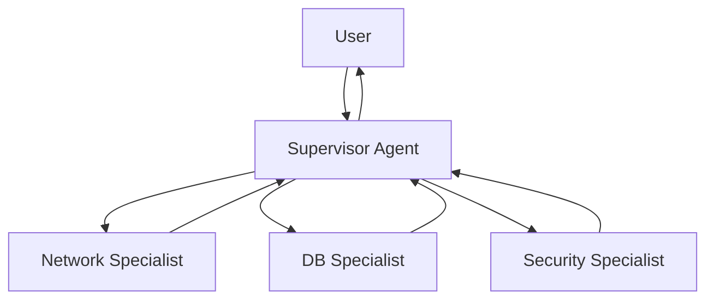

# 07. Multi-Agent Systems

## Why This Chapter?

A single "jack-of-all-trades" agent often gets confused with tools. When an agent has too many tools (20+), the model starts getting confused during selection and makes mistakes.

It's more efficient to divide responsibility: create a team of narrow specialists, managed by a main agent (Supervisor). Each specialist knows only their tools and focuses on their area.

### Real-World Case Study

**Situation:** You've created a DevOps agent with 15 tools: network checks, database work, service management, logs, metrics, security, etc.

**Problem:** The agent gets confused with tools. When a user asks "Check DB availability and find out version", the agent may call the wrong tool or skip a step.

**Solution:** Multi-Agent system with Supervisor and specialists. Supervisor delegates the task to Network Expert for availability check and DB Expert for version retrieval. Each specialist focuses only on their area.

## Theory in Simple Terms

### How Does Multi-Agent Work?

1. **Supervisor receives a task** from the user
2. **Supervisor analyzes the task** and decides which specialists are needed
3. **Supervisor calls specialists** via tool calls
4. **Specialists perform tasks** in isolated context
5. **Results are returned to Supervisor**, who assembles the response

**Takeaway:** Context isolation — each specialist receives only their task, not the entire Supervisor history. This saves tokens and helps focus attention.

## Supervisor Pattern (Boss-Subordinate)

**Architecture:**

- **Supervisor:** Main brain. Has no tools, but knows who can do what.
- **Workers:** Specialized agents with a narrow set of tools.

**Context isolation:** Worker doesn't see the entire Supervisor conversation, only their task. This saves tokens and focuses attention.



## DevOps Example — Magic vs Reality

**Magic:**
> Supervisor "thinks" and "delegates" tasks to specialists

**Reality:**

### How Multi-Agent Works in Practice

**Step 1: Supervisor Receives Task**

```go
// Supervisor has tools to call Workers
supervisorTools := []openai.Tool{
    {
        Function: &openai.FunctionDefinition{
            Name: "ask_network_expert",
            Description: "Ask the network specialist about connectivity, pings, ports",
            Parameters: json.RawMessage(`{
                "type": "object",
                "properties": {
                    "question": {"type": "string"}
                },
                "required": ["question"]
            }`),
        },
    },
    {
        Function: &openai.FunctionDefinition{
            Name: "ask_database_expert",
            Description: "Ask the DB specialist about SQL, schemas, data",
            Parameters: json.RawMessage(`{
                "type": "object",
                "properties": {
                    "question": {"type": "string"}
                },
                "required": ["question"]
            }`),
        },
    },
}

supervisorMessages := []openai.ChatCompletionMessage{
    {Role: "system", Content: "You are a Supervisor. Delegate tasks to specialists."},
    {Role: "user", Content: "Check if DB server is available, and if yes — find out version"},
}
```

**Step 2: Supervisor Generates Tool Calls for Workers**

```go
supervisorResp, _ := client.CreateChatCompletion(ctx, openai.ChatCompletionRequest{
    Model:    "gpt-4o",
    Messages: supervisorMessages,
    Tools:    supervisorTools,
})

supervisorMsg := supervisorResp.Choices[0].Message
// supervisorMsg.ToolCalls = [
//     {Function: {Name: "ask_network_expert", Arguments: "{\"question\": \"Check availability of db-host.example.com\"}"}},
//     {Function: {Name: "ask_database_expert", Arguments: "{\"question\": \"What PostgreSQL version on db-host?\"}"}},
// ]
```

**Why did Supervisor call both tools?**
- Supervisor receives task "check availability" → links to Network Expert
- Supervisor receives "find out version" → links to DB Expert
- Supervisor understands sequence: first network, then DB

**Step 3: Runtime (Your Code) Calls Worker for Network Expert**

> **Note:** Runtime is the agent code you write in Go. See [Chapter 00: Preface](../00-preface/README.md#runtime-execution-environment) for definition.

```go
// Runtime intercepts tool call "ask_network_expert"
func askNetworkExpert(question string) string {
    // Create NEW context for Worker (isolation!)
    workerMessages := []openai.ChatCompletionMessage{
        {Role: "system", Content: "You are a Network Specialist. Use ping tool to check connectivity."},
        {Role: "user", Content: question},  // Only question, without entire Supervisor history!
    }
    
    // Worker has its own tools
    workerTools := []openai.Tool{
        {
            Function: &openai.FunctionDefinition{
                Name: "ping",
                Description: "Ping a host to check connectivity",
                Parameters: json.RawMessage(`{
                    "type": "object",
                    "properties": {"host": {"type": "string"}},
                    "required": ["host"]
                }`),
            },
        },
    }
    
    // Run Worker as separate agent
    workerResp, _ := client.CreateChatCompletion(ctx, openai.ChatCompletionRequest{
        Model:    "gpt-4o-mini",
        Messages: workerMessages,  // Isolated context!
        Tools:    workerTools,
    })
    
    workerMsg := workerResp.Choices[0].Message
    // workerMsg.ToolCalls = [{Function: {Name: "ping", Arguments: "{\"host\": \"db-host.example.com\"}"}}]
    
    // Execute ping
    pingResult := ping("db-host.example.com")  // "Host is reachable"
    
    // Worker receives result and formulates response
    workerMessages = append(workerMessages, workerMsg)
    workerMessages = append(workerMessages, openai.ChatCompletionMessage{
        Role:    "tool",
        Content: pingResult,
    })
    
    workerResp2, _ := client.CreateChatCompletion(ctx, openai.ChatCompletionRequest{
        Model:    "gpt-4o-mini",
        Messages: workerMessages,
        Tools:    workerTools,
    })
    
    // Return Worker's final response to Supervisor
    return workerResp2.Choices[0].Message.Content  // "Host db-host.example.com is reachable"
}
```

**Key isolation point:**
- Worker **doesn't see** entire Supervisor history
- Worker receives only its question and its context
- This saves tokens and focuses Worker's attention

**Step 4: Runtime (Your Code) Calls Worker for DB Expert**

```go
func askDatabaseExpert(question string) string {
    // Similar to Network Expert, but with different tools
    workerMessages := []openai.ChatCompletionMessage{
        {Role: "system", Content: "You are a DB Specialist. Use SQL tools."},
        {Role: "user", Content: question},  // Isolated context!
    }
    
    workerTools := []openai.Tool{
        {
            Function: &openai.FunctionDefinition{
                Name: "sql_query",
                Description: "Execute a SELECT query",
                Parameters: json.RawMessage(`{
                    "type": "object",
                    "properties": {"query": {"type": "string"}},
                    "required": ["query"]
                }`),
            },
        },
    }
    
    // Worker generates SQL and executes
    // Returns: "PostgreSQL 15.2"
    return "PostgreSQL 15.2"
}
```

**Step 5: Worker Results Returned to Supervisor**

```go
// Runtime adds results as tool messages
supervisorMessages = append(supervisorMessages, supervisorMsg)
supervisorMessages = append(supervisorMessages, openai.ChatCompletionMessage{
    Role:       "tool",
    Content:    askNetworkExpert("Check availability of db-host.example.com"),  // "Host is reachable"
    ToolCallID: supervisorMsg.ToolCalls[0].ID,
})
supervisorMessages = append(supervisorMessages, openai.ChatCompletionMessage{
    Role:       "tool",
    Content:    askDatabaseExpert("What PostgreSQL version on db-host?"),  // "PostgreSQL 15.2"
    ToolCallID: supervisorMsg.ToolCalls[1].ID,
})
```

**Step 6: Supervisor Collects Results and Responds**

```go
// Send Worker results to Supervisor
supervisorResp2, _ := client.CreateChatCompletion(ctx, openai.ChatCompletionRequest{
    Model:    "gpt-4o",
    Messages: supervisorMessages,  // Supervisor receives results from both Workers!
    Tools:    supervisorTools,
})

finalMsg := supervisorResp2.Choices[0].Message
// finalMsg.Content = "DB server is available (ping successful). PostgreSQL version: 15.2"
```

**Why this isn't magic:**

1. **Supervisor calls Workers as regular tools** — this isn't "delegation", but a tool call
2. **Workers are separate agents** — each with its own context and tools
3. **Context isolation** — Worker doesn't see Supervisor history, only its question
4. **Runtime manages everything** — it intercepts Supervisor tool calls, runs Workers, collects results

**Takeaway:** Multi-Agent isn't magic "commanding", but a mechanism for calling specialized agents via tool calls with context isolation.

## Other Multi-Agent System Patterns

Supervisor/Worker is the basic pattern. In practice, others are used as well.

### Pattern: Router Agent

Router Agent receives a request and routes it to one matching specialist. Unlike Supervisor, Router **does not coordinate** multiple agents — it selects one.

```
┌──────┐     ┌────────┐     ┌────────────────┐
│ User │────→│ Router │────→│ Network Agent  │
└──────┘     │        │     └────────────────┘
             │        │────→│ DB Agent       │
             │        │     └────────────────┘
             │        │────→│ Security Agent │
             └────────┘     └────────────────┘
```

**Implementation:**

```go
// Router determines which agent should handle the request
func routeRequest(query string, client *openai.Client) (string, error) {
    resp, err := client.CreateChatCompletion(ctx, openai.ChatCompletionRequest{
        Model: "gpt-4o-mini", // Cheap model — classification task
        Messages: []openai.ChatCompletionMessage{
            {
                Role: openai.ChatMessageRoleSystem,
                Content: `Classify the request and route to the correct specialist.
Available specialists:
- "network": connectivity, DNS, ports, network troubleshooting
- "database": SQL, schemas, queries, DB performance
- "security": access, vulnerabilities, incidents
Return ONLY the specialist name.`,
            },
            {Role: openai.ChatMessageRoleUser, Content: query},
        },
        Temperature: 0,
    })
    if err != nil {
        return "", err
    }
    return strings.TrimSpace(resp.Choices[0].Message.Content), nil
}

// Usage
specialist, _ := routeRequest("Can't connect to PostgreSQL")
// specialist = "database"
result := runSpecialist(specialist, query) // Run the matching agent
```

**When Router beats Supervisor:**
- Request belongs to a single domain (no coordination needed)
- Minimal latency required (one LLM call for routing instead of several)
- You have 10+ specialists — Router scales more easily

### Pattern: Handoffs (Context Transfer)

A Handoff is when one agent **transfers control** to another, including part of the context. Unlike Supervisor/Worker, there is no "boss" here — agents are peers.

**Warm handoff** — next agent receives full context:

```go
type Handoff struct {
    FromAgent string                          // Who transfers
    ToAgent   string                          // Who receives
    Context   []openai.ChatCompletionMessage  // What is transferred
    Reason    string                          // Why
}

func performHandoff(h Handoff, client *openai.Client) (string, error) {
    // Build context for receiving agent
    handoffMessages := []openai.ChatCompletionMessage{
        {
            Role: openai.ChatMessageRoleSystem,
            Content: fmt.Sprintf(
                "You are a %s specialist. You received a handoff from %s.\nReason: %s\nContinue the conversation.",
                h.ToAgent, h.FromAgent, h.Reason,
            ),
        },
    }
    // Append transferred context
    handoffMessages = append(handoffMessages, h.Context...)

    resp, err := client.CreateChatCompletion(ctx, openai.ChatCompletionRequest{
        Model:    "gpt-4o",
        Messages: handoffMessages,
        Tools:    getToolsForAgent(h.ToAgent),
    })
    if err != nil {
        return "", err
    }
    return resp.Choices[0].Message.Content, nil
}
```

**Cold handoff** — next agent receives only a summary:

```go
// Instead of full context, pass a compressed summary
summary := summarizeConversation(messages)
handoff := Handoff{
    FromAgent: "l1_support",
    ToAgent:   "l2_engineer",
    Context: []openai.ChatCompletionMessage{
        {Role: openai.ChatMessageRoleUser, Content: summary},
    },
    Reason: "Issue requires deeper investigation",
}
```

**When to use Handoffs:**
- Escalation (L1 Support → L2 Engineer)
- Domain switch (a network problem turns out to be a DB problem)
- Long-running tasks with multiple stages

### Pattern: Subagents (Agent Hierarchy)

A Subagent is an agent that another agent creates **dynamically** for a subtask. Unlike a Worker, a Subagent is created on the fly for a specific task.

```go
// Agent works on a task and realizes a subtask is needed
func solveWithSubagent(task string, parentTools []openai.Tool) string {
    // Parent agent decomposes the task
    subtasks := decomposeTask(task)

    var results []string
    for _, subtask := range subtasks {
        // Create a Subagent for each subtask
        subResult := runSubagent(subtask, parentTools)
        results = append(results, subResult)
    }

    // Combine results
    return synthesizeResults(results)
}

func runSubagent(task string, tools []openai.Tool) string {
    messages := []openai.ChatCompletionMessage{
        {
            Role:    openai.ChatMessageRoleSystem,
            Content: "You are a focused agent. Complete the specific task given to you.",
        },
        {Role: openai.ChatMessageRoleUser, Content: task},
    }

    // Subagent runs in its own loop with available tools
    return runAgentLoop(messages, tools, 5) // maxIterations = 5
}
```

### Pattern: Custom DAG Workflows

For tasks with complex dependencies — DAG (Directed Acyclic Graph). Agents execute in dependency order; independent ones run in parallel.

```go
type WorkflowStep struct {
    AgentID      string   // Which agent executes
    DependsOn    []string // Which steps it depends on
    Task         string   // The task
}

type Workflow struct {
    Steps []WorkflowStep
}

// Example: Incident analysis
workflow := Workflow{
    Steps: []WorkflowStep{
        {AgentID: "log_analyzer", DependsOn: nil, Task: "Analyze logs from the last hour"},
        {AgentID: "metrics_checker", DependsOn: nil, Task: "Check CPU and memory metrics"},
        {AgentID: "correlator", DependsOn: []string{"log_analyzer", "metrics_checker"}, Task: "Correlate results"},
        {AgentID: "reporter", DependsOn: []string{"correlator"}, Task: "Write incident report"},
    },
}

// log_analyzer and metrics_checker run in parallel (no dependencies)
// correlator waits for both results
// reporter waits for correlator
```

For more on workflow patterns, see [Chapter 10: Planning and Workflows](../10-planning-and-workflows/README.md).

### A2A (Agent-to-Agent) Protocol

In the patterns above, agents communicate through runtime (your code). [A2A](https://google.github.io/A2A/) is a **standardized protocol** for inter-agent communication, proposed by Google.

**Key concepts:**

- **Agent Card** — JSON description of an agent: what it can do, what tasks it accepts.
- **Task** — unit of work with a lifecycle: `submitted → working → completed/failed`.
- **Message/Artifact** — data exchange between agents.

```go
// Agent Card — agent description for other agents
type AgentCard struct {
    Name         string   `json:"name"`
    Description  string   `json:"description"`
    URL          string   `json:"url"`           // Agent endpoint
    Capabilities []string `json:"capabilities"`  // What it can do
    InputSchema  json.RawMessage `json:"input_schema"` // What data it accepts
}

// Task — unit of work
type A2ATask struct {
    ID      string `json:"id"`
    Status  string `json:"status"` // "submitted", "working", "completed", "failed"
    Input   string `json:"input"`
    Output  string `json:"output,omitempty"`
}

// Client agent sends a task to another agent
func sendA2ATask(agentURL string, task A2ATask) (*A2ATask, error) {
    body, _ := json.Marshal(task)
    resp, err := http.Post(agentURL+"/tasks", "application/json", bytes.NewReader(body))
    if err != nil {
        return nil, err
    }
    defer resp.Body.Close()

    var result A2ATask
    json.NewDecoder(resp.Body).Decode(&result)
    return &result, nil
}
```

**When you need A2A:**
- Agents run on **different servers** (microservice architecture)
- Agents are written in **different languages** (Go + Python)
- You need a **standard interface** for integrating with external agents

**When A2A is overkill:**
- All agents in one process — use tool calls (Supervisor/Worker)
- Prototype — start with plain functions

For more on A2A, see [Chapter 18: Tool Protocols](../18-tool-protocols-and-servers/README.md#a2a-protocol).

### Scaling Multi-Agent Systems

As load grows, a single Supervisor isn't enough.

**Worker Pool:**

```go
type WorkerPool struct {
    workers map[string]chan WorkerTask // Task channel for each Worker type
    results chan WorkerResult
}

func (p *WorkerPool) Submit(agentType string, task string) {
    p.workers[agentType] <- WorkerTask{Task: task, ResultCh: p.results}
}
```

**Load balancing:**
- Round-robin — distribute tasks evenly across Workers
- By load — send to an idle Worker
- By specialization — Router picks a Worker by task type

### Decision Table: When to Use Which Pattern

| Pattern | When to Use | Complexity |
|---------|------------|------------|
| Supervisor/Worker | Task requires coordinating multiple specialists | Medium |
| Router | Request belongs to a single domain | Low |
| Handoffs | Escalation, domain switch | Medium |
| Subagents | Dynamic task decomposition | High |
| DAG Workflow | Tasks with complex dependencies | High |
| A2A | Distributed agents on different servers | High |

## Common Errors

### Error 1: No Context Isolation

**Symptom:** Worker receives entire Supervisor history, leading to context overflow and confusion.

**Cause:** Worker receives full Supervisor message history instead of isolated context.

**Solution:**
```go
// BAD: Worker receives entire Supervisor history
workerMessages := supervisorMessages  // Full history!

// GOOD: Worker receives only its question
workerMessages := []openai.ChatCompletionMessage{
    {Role: "system", Content: "You are a Network Specialist."},
    {Role: "user", Content: question},  // Only question!
}
```

### Error 2: Supervisor Doesn't Know Who to Call

**Symptom:** Supervisor doesn't call needed specialists or calls wrong ones.

**Cause:** Tool descriptions for calling Workers are not clear enough.

**Solution:**
```go
// GOOD: Clear description of when to call each specialist
{
    Name: "ask_network_expert",
    Description: "Ask the network specialist about connectivity, pings, ports, network troubleshooting. Use this when user asks about network issues, connectivity, or network-related problems.",
},
{
    Name: "ask_database_expert",
    Description: "Ask the DB specialist about SQL, schemas, data, database queries. Use this when user asks about database, SQL, or data-related questions.",
},
```

### Error 3: Worker Doesn't Return Result

**Symptom:** Supervisor doesn't receive answer from Worker or receives empty answer.

**Cause:** Worker doesn't complete its work or result isn't returned to Supervisor.

**Solution:**
```go
// GOOD: Worker completes work and returns result
func askNetworkExpert(question string) string {
    // ... Worker performs task ...
    
    // Return Worker's final response
    return workerResp2.Choices[0].Message.Content  // "Host is reachable"
}

// Supervisor receives result
supervisorMessages = append(supervisorMessages, openai.ChatCompletionMessage{
    Role:       "tool",
    Content:    askNetworkExpert("..."),  // Worker result
    ToolCallID: supervisorMsg.ToolCalls[0].ID,
})
```

## Mini-Exercises

### Exercise 1: Implement Context Isolation

Implement a function to create isolated context for Worker:

```go
func createWorkerContext(question string, workerRole string) []openai.ChatCompletionMessage {
    // Create isolated context for Worker
    // Only System Prompt and user question
}
```

**Expected result:**
- Worker receives only System Prompt and its question
- Worker doesn't see Supervisor history

### Exercise 2: Implement Supervisor with Two Specialists

Create a Supervisor with two specialists (Network Expert and DB Expert):

```go
supervisorTools := []openai.Tool{
    // Your code here
}
```

**Expected result:**
- Supervisor can call both specialists
- Tool descriptions are clear and understandable
- Supervisor correctly selects specialist for task

## Completion Criteria / Checklist

**Completed:**
- [x] Supervisor correctly delegates tasks to specialists
- [x] Workers operate in isolated context
- [x] Worker results are returned to Supervisor
- [x] Supervisor collects results and formulates final response
- [x] Tool descriptions for calling Workers are clear

**Not completed:**
- [ ] Worker receives entire Supervisor history (no isolation)
- [ ] Supervisor doesn't know who to call (poor descriptions)
- [ ] Worker doesn't return result to Supervisor
- [ ] Supervisor doesn't collect results from Workers

## Production Notes

When using Multi-Agent systems in production:

- **Correlation by `run_id`:** Use a single `run_id` for the entire chain Supervisor → Worker → Tool. This allows tracking the full request path in logs.
- **Chain tracing:** Trace each step of the chain (Supervisor → Worker → Tool) for debugging. More: [Chapter 19: Observability and Tracing](../19-observability-and-tracing/README.md).
- **Context isolation:** Each Worker must have its own isolated context (already described above). This is critical for preventing context overflow.

## Connection with Other Chapters

- **Tools:** How Supervisor calls Workers via tool calls, see [Chapter 03: Tools](../03-tools-and-function-calling/README.md)
- **Autonomy:** How Supervisor manages the work loop, see [Chapter 04: Autonomy](../04-autonomy-and-loops/README.md)
- **Architecture:** Agent components (Runtime, Memory, Planning) that multi-agent systems are built from, see [Chapter 09: Agent Architecture](../09-agent-architecture/README.md)

## What's Next?

After studying Multi-Agent, proceed to:
- **[08. Evals and Reliability](../08-evals-and-reliability/README.md)** — how to test agents

