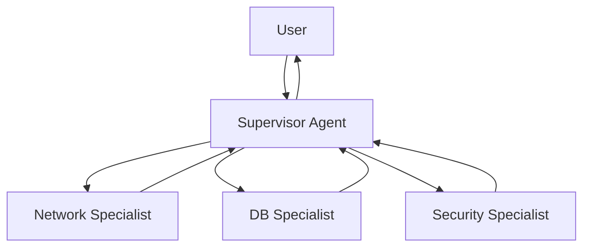

# 07. Multi-Agent Systems

## Why This Chapter?

A single "jack-of-all-trades" agent often gets confused with tools. When an agent has too many tools (20+), the model starts getting confused during selection and makes mistakes.

It's more efficient to divide responsibility: create a team of narrow specialists, managed by a main agent (Supervisor). Each specialist knows only their tools and focuses on their area.

### Real-World Case Study

**Situation:** You've created a DevOps agent with 15 tools: network checks, database work, service management, logs, metrics, security, etc.

**Problem:** The agent gets confused with tools. When a user asks "Check DB availability and find out version", the agent may call the wrong tool or skip a step.

**Solution:** Multi-Agent system with Supervisor and specialists. Supervisor delegates the task to Network Expert for availability check and DB Expert for version retrieval. Each specialist focuses only on their area.

## Theory in Simple Terms

### How Does Multi-Agent Work?

1. **Supervisor receives a task** from the user
2. **Supervisor analyzes the task** and decides which specialists are needed
3. **Supervisor calls specialists** via tool calls
4. **Specialists perform tasks** in isolated context
5. **Results are returned to Supervisor**, who assembles the response

**Takeaway:** Context isolation — each specialist receives only their task, not the entire Supervisor history. This saves tokens and helps focus attention.

## Supervisor Pattern (Boss-Subordinate)

**Architecture:**

- **Supervisor:** Main brain. Has no tools, but knows who can do what.
- **Workers:** Specialized agents with a narrow set of tools.

**Context isolation:** Worker doesn't see the entire Supervisor conversation, only their task. This saves tokens and focuses attention.



## DevOps Example — Magic vs Reality

**❌ Magic:**
> Supervisor "thinks" and "delegates" tasks to specialists

**✅ Reality:**

### How Multi-Agent Works in Practice

**Step 1: Supervisor Receives Task**

```go
// Supervisor has tools to call Workers
supervisorTools := []openai.Tool{
    {
        Function: &openai.FunctionDefinition{
            Name: "ask_network_expert",
            Description: "Ask the network specialist about connectivity, pings, ports",
            Parameters: json.RawMessage(`{
                "type": "object",
                "properties": {
                    "question": {"type": "string"}
                },
                "required": ["question"]
            }`),
        },
    },
    {
        Function: &openai.FunctionDefinition{
            Name: "ask_database_expert",
            Description: "Ask the DB specialist about SQL, schemas, data",
            Parameters: json.RawMessage(`{
                "type": "object",
                "properties": {
                    "question": {"type": "string"}
                },
                "required": ["question"]
            }`),
        },
    },
}

supervisorMessages := []openai.ChatCompletionMessage{
    {Role: "system", Content: "You are a Supervisor. Delegate tasks to specialists."},
    {Role: "user", Content: "Check if DB server is available, and if yes — find out version"},
}
```

**Step 2: Supervisor Generates Tool Calls for Workers**

```go
supervisorResp, _ := client.CreateChatCompletion(ctx, openai.ChatCompletionRequest{
    Model:    openai.GPT4,
    Messages: supervisorMessages,
    Tools:    supervisorTools,
})

supervisorMsg := supervisorResp.Choices[0].Message
// supervisorMsg.ToolCalls = [
//     {Function: {Name: "ask_network_expert", Arguments: "{\"question\": \"Check availability of db-host.example.com\"}"}},
//     {Function: {Name: "ask_database_expert", Arguments: "{\"question\": \"What PostgreSQL version on db-host?\"}"}},
// ]
```

**Why did Supervisor call both tools?**
- Supervisor receives task "check availability" → links to Network Expert
- Supervisor receives "find out version" → links to DB Expert
- Supervisor understands sequence: first network, then DB

**Step 3: Runtime (Your Code) Calls Worker for Network Expert**

> **Note:** Runtime is the agent code you write in Go. See [Chapter 00: Preface](../00-preface/README.md#runtime-execution-environment) for definition.

```go
// Runtime intercepts tool call "ask_network_expert"
func askNetworkExpert(question string) string {
    // Create NEW context for Worker (isolation!)
    workerMessages := []openai.ChatCompletionMessage{
        {Role: "system", Content: "You are a Network Specialist. Use ping tool to check connectivity."},
        {Role: "user", Content: question},  // Only question, without entire Supervisor history!
    }
    
    // Worker has its own tools
    workerTools := []openai.Tool{
        {
            Function: &openai.FunctionDefinition{
                Name: "ping",
                Description: "Ping a host to check connectivity",
                Parameters: json.RawMessage(`{
                    "type": "object",
                    "properties": {"host": {"type": "string"}},
                    "required": ["host"]
                }`),
            },
        },
    }
    
    // Run Worker as separate agent
    workerResp, _ := client.CreateChatCompletion(ctx, openai.ChatCompletionRequest{
        Model:    openai.GPT3Dot5Turbo,
        Messages: workerMessages,  // Isolated context!
        Tools:    workerTools,
    })
    
    workerMsg := workerResp.Choices[0].Message
    // workerMsg.ToolCalls = [{Function: {Name: "ping", Arguments: "{\"host\": \"db-host.example.com\"}"}}]
    
    // Execute ping
    pingResult := ping("db-host.example.com")  // "Host is reachable"
    
    // Worker receives result and formulates response
    workerMessages = append(workerMessages, workerMsg)
    workerMessages = append(workerMessages, openai.ChatCompletionMessage{
        Role:    "tool",
        Content: pingResult,
    })
    
    workerResp2, _ := client.CreateChatCompletion(ctx, openai.ChatCompletionRequest{
        Model:    openai.GPT3Dot5Turbo,
        Messages: workerMessages,
        Tools:    workerTools,
    })
    
    // Return Worker's final response to Supervisor
    return workerResp2.Choices[0].Message.Content  // "Host db-host.example.com is reachable"
}
```

**Key isolation point:**
- Worker **doesn't see** entire Supervisor history
- Worker receives only its question and its context
- This saves tokens and focuses Worker's attention

**Step 4: Runtime (Your Code) Calls Worker for DB Expert**

```go
func askDatabaseExpert(question string) string {
    // Similar to Network Expert, but with different tools
    workerMessages := []openai.ChatCompletionMessage{
        {Role: "system", Content: "You are a DB Specialist. Use SQL tools."},
        {Role: "user", Content: question},  // Isolated context!
    }
    
    workerTools := []openai.Tool{
        {
            Function: &openai.FunctionDefinition{
                Name: "sql_query",
                Description: "Execute a SELECT query",
                Parameters: json.RawMessage(`{
                    "type": "object",
                    "properties": {"query": {"type": "string"}},
                    "required": ["query"]
                }`),
            },
        },
    }
    
    // Worker generates SQL and executes
    // Returns: "PostgreSQL 15.2"
    return "PostgreSQL 15.2"
}
```

**Step 5: Worker Results Returned to Supervisor**

```go
// Runtime adds results as tool messages
supervisorMessages = append(supervisorMessages, supervisorMsg)
supervisorMessages = append(supervisorMessages, openai.ChatCompletionMessage{
    Role:       "tool",
    Content:    askNetworkExpert("Check availability of db-host.example.com"),  // "Host is reachable"
    ToolCallID: supervisorMsg.ToolCalls[0].ID,
})
supervisorMessages = append(supervisorMessages, openai.ChatCompletionMessage{
    Role:       "tool",
    Content:    askDatabaseExpert("What PostgreSQL version on db-host?"),  // "PostgreSQL 15.2"
    ToolCallID: supervisorMsg.ToolCalls[1].ID,
})
```

**Step 6: Supervisor Collects Results and Responds**

```go
// Send Worker results to Supervisor
supervisorResp2, _ := client.CreateChatCompletion(ctx, openai.ChatCompletionRequest{
    Model:    openai.GPT4,
    Messages: supervisorMessages,  // Supervisor receives results from both Workers!
    Tools:    supervisorTools,
})

finalMsg := supervisorResp2.Choices[0].Message
// finalMsg.Content = "DB server is available (ping successful). PostgreSQL version: 15.2"
```

**Why this isn't magic:**

1. **Supervisor calls Workers as regular tools** — this isn't "delegation", but a tool call
2. **Workers are separate agents** — each with its own context and tools
3. **Context isolation** — Worker doesn't see Supervisor history, only its question
4. **Runtime manages everything** — it intercepts Supervisor tool calls, runs Workers, collects results

**Takeaway:** Multi-Agent isn't magic "commanding", but a mechanism for calling specialized agents via tool calls with context isolation.

## Common Errors

### Error 1: No Context Isolation

**Symptom:** Worker receives entire Supervisor history, leading to context overflow and confusion.

**Cause:** Worker receives full Supervisor message history instead of isolated context.

**Solution:**
```go
// BAD: Worker receives entire Supervisor history
workerMessages := supervisorMessages  // Full history!

// GOOD: Worker receives only its question
workerMessages := []openai.ChatCompletionMessage{
    {Role: "system", Content: "You are a Network Specialist."},
    {Role: "user", Content: question},  // Only question!
}
```

### Error 2: Supervisor Doesn't Know Who to Call

**Symptom:** Supervisor doesn't call needed specialists or calls wrong ones.

**Cause:** Tool descriptions for calling Workers are not clear enough.

**Solution:**
```go
// GOOD: Clear description of when to call each specialist
{
    Name: "ask_network_expert",
    Description: "Ask the network specialist about connectivity, pings, ports, network troubleshooting. Use this when user asks about network issues, connectivity, or network-related problems.",
},
{
    Name: "ask_database_expert",
    Description: "Ask the DB specialist about SQL, schemas, data, database queries. Use this when user asks about database, SQL, or data-related questions.",
},
```

### Error 3: Worker Doesn't Return Result

**Symptom:** Supervisor doesn't receive answer from Worker or receives empty answer.

**Cause:** Worker doesn't complete its work or result isn't returned to Supervisor.

**Solution:**
```go
// GOOD: Worker completes work and returns result
func askNetworkExpert(question string) string {
    // ... Worker performs task ...
    
    // Return Worker's final response
    return workerResp2.Choices[0].Message.Content  // "Host is reachable"
}

// Supervisor receives result
supervisorMessages = append(supervisorMessages, openai.ChatCompletionMessage{
    Role:       "tool",
    Content:    askNetworkExpert("..."),  // Worker result
    ToolCallID: supervisorMsg.ToolCalls[0].ID,
})
```

## Mini-Exercises

### Exercise 1: Implement Context Isolation

Implement a function to create isolated context for Worker:

```go
func createWorkerContext(question string, workerRole string) []openai.ChatCompletionMessage {
    // Create isolated context for Worker
    // Only System Prompt and user question
}
```

**Expected result:**
- Worker receives only System Prompt and its question
- Worker doesn't see Supervisor history

### Exercise 2: Implement Supervisor with Two Specialists

Create a Supervisor with two specialists (Network Expert and DB Expert):

```go
supervisorTools := []openai.Tool{
    // Your code here
}
```

**Expected result:**
- Supervisor can call both specialists
- Tool descriptions are clear and understandable
- Supervisor correctly selects specialist for task

## Completion Criteria / Checklist

✅ **Completed:**
- Supervisor correctly delegates tasks to specialists
- Workers operate in isolated context
- Worker results are returned to Supervisor
- Supervisor collects results and formulates final response
- Tool descriptions for calling Workers are clear

❌ **Not completed:**
- Worker receives entire Supervisor history (no isolation)
- Supervisor doesn't know who to call (poor descriptions)
- Worker doesn't return result to Supervisor
- Supervisor doesn't collect results from Workers

## Production Notes

When using Multi-Agent systems in production:

- **Correlation by `run_id`:** Use a single `run_id` for the entire chain Supervisor → Worker → Tool. This allows tracking the full request path in logs.
- **Chain tracing:** Trace each step of the chain (Supervisor → Worker → Tool) for debugging. More: [Chapter 19: Observability and Tracing](../19-observability-and-tracing/README.md).
- **Context isolation:** Each Worker must have its own isolated context (already described above). This is critical for preventing context overflow.

## Connection with Other Chapters

- **Tools:** How Supervisor calls Workers via tool calls, see [Chapter 03: Tools](../03-tools-and-function-calling/README.md)
- **Autonomy:** How Supervisor manages the work loop, see [Chapter 04: Autonomy](../04-autonomy-and-loops/README.md)

## What's Next?

After studying Multi-Agent, proceed to:
- **[08. Evals and Reliability](../08-evals-and-reliability/README.md)** — how to test agents

