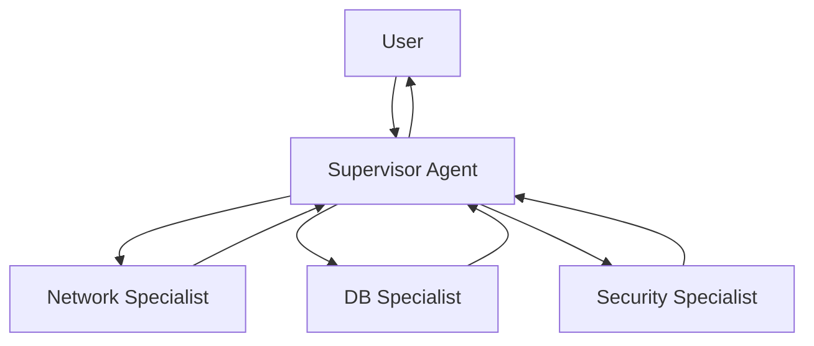

# 08. Multi-Agent Systems

## Why This Chapter?

A single "jack-of-all-trades" agent often gets confused with tools. When an agent has too many tools (20+), the model starts confusing choices and makes mistakes.

It's more effective to divide responsibility: create a team of narrow specialists, managed by a main agent (Supervisor). Each specialist knows only their tools and focuses on their domain.

### Real-World Case Study

**Situation:** You created a DevOps agent with 15 tools: network checks, database work, service management, logs, metrics, security, etc.

**Problem:** Agent gets confused with tools. When user asks "Check database availability and find out version", agent may call wrong tool or skip a step.

**Solution:** Multi-Agent system with Supervisor and specialists. Supervisor delegates task to Network Expert for availability check and DB Expert for version. Each specialist focuses only on their domain.

## Theory in Simple Terms

### How Does Multi-Agent Work?

1. **Supervisor receives task** from user
2. **Supervisor analyzes task** and decides which specialists are needed
3. **Supervisor calls specialists** via tool calls
4. **Specialists perform tasks** in isolated context
5. **Results returned to Supervisor**, who assembles answer

**Key point:** Context isolation — each specialist sees only their task, not Supervisor's entire history. This saves tokens and focuses attention.

## Supervisor Pattern (Boss-Subordinate)

**Architecture:**

- **Supervisor:** Main brain. Has no tools, but knows who can do what.
- **Workers:** Specialized agents with narrow tool sets.

**Context isolation:** Worker doesn't see Supervisor's entire conversation, only their task. This saves tokens and focuses attention.



## DevOps Example — Magic vs Reality

**❌ Magic:**
> Supervisor "thinks" and "delegates" tasks to specialists

**✅ Reality:**

### How Multi-Agent Works in Practice

**Step 1: Supervisor Receives Task**

```go
// Supervisor has tools to call Workers
supervisorTools := []openai.Tool{
    {
        Function: &openai.FunctionDefinition{
            Name: "ask_network_expert",
            Description: "Ask the network specialist about connectivity, pings, ports",
            Parameters: json.RawMessage(`{
                "type": "object",
                "properties": {
                    "question": {"type": "string"}
                },
                "required": ["question"]
            }`),
        },
    },
    {
        Function: &openai.FunctionDefinition{
            Name: "ask_database_expert",
            Description: "Ask the DB specialist about SQL, schemas, data",
            Parameters: json.RawMessage(`{
                "type": "object",
                "properties": {
                    "question": {"type": "string"}
                },
                "required": ["question"]
            }`),
        },
    },
}

supervisorMessages := []openai.ChatCompletionMessage{
    {Role: "system", Content: "You are a Supervisor. Delegate tasks to specialists."},
    {Role: "user", Content: "Check if DB server is available, and if yes — find out version"},
}
```

**Step 2: Supervisor Generates Tool Calls for Workers**

```go
supervisorResp, _ := client.CreateChatCompletion(ctx, openai.ChatCompletionRequest{
    Model:    openai.GPT4,
    Messages: supervisorMessages,
    Tools:    supervisorTools,
})

supervisorMsg := supervisorResp.Choices[0].Message
// supervisorMsg.ToolCalls = [
//     {Function: {Name: "ask_network_expert", Arguments: "{\"question\": \"Check availability of db-host.example.com\"}"}},
//     {Function: {Name: "ask_database_expert", Arguments: "{\"question\": \"What PostgreSQL version on db-host?\"}"}},
// ]
```

**Why did Supervisor call both tools?**
- Supervisor sees task "check availability" → links to Network Expert
- Supervisor sees "find out version" → links to DB Expert
- Supervisor understands sequence: network first, then DB

**Step 3: Runtime Calls Worker for Network Expert**

```go
// Runtime intercepts tool call "ask_network_expert"
func askNetworkExpert(question string) string {
    // Create NEW context for Worker (isolation!)
    workerMessages := []openai.ChatCompletionMessage{
        {Role: "system", Content: "You are a Network Specialist. Use ping tool to check connectivity."},
        {Role: "user", Content: question},  // Only question, without Supervisor's entire history!
    }
    
    // Worker has its own tools
    workerTools := []openai.Tool{
        {
            Function: &openai.FunctionDefinition{
                Name: "ping",
                Description: "Ping a host to check connectivity",
                Parameters: json.RawMessage(`{
                    "type": "object",
                    "properties": {"host": {"type": "string"}},
                    "required": ["host"]
                }`),
            },
        },
    }
    
    // Run Worker as separate agent
    workerResp, _ := client.CreateChatCompletion(ctx, openai.ChatCompletionRequest{
        Model:    openai.GPT3Dot5Turbo,
        Messages: workerMessages,  // Isolated context!
        Tools:    workerTools,
    })
    
    workerMsg := workerResp.Choices[0].Message
    // workerMsg.ToolCalls = [{Function: {Name: "ping", Arguments: "{\"host\": \"db-host.example.com\"}"}}]
    
    // Execute ping
    pingResult := ping("db-host.example.com")  // "Host is reachable"
    
    // Worker sees result and formulates answer
    workerMessages = append(workerMessages, workerMsg)
    workerMessages = append(workerMessages, openai.ChatCompletionMessage{
        Role:    "tool",
        Content: pingResult,
    })
    
    workerResp2, _ := client.CreateChatCompletion(ctx, openai.ChatCompletionRequest{
        Model:    openai.GPT3Dot5Turbo,
        Messages: workerMessages,
        Tools:    workerTools,
    })
    
    // Return Worker's final answer to Supervisor
    return workerResp2.Choices[0].Message.Content  // "Host db-host.example.com is reachable"
}
```

**Key isolation point:**
- Worker **doesn't see** Supervisor's entire history
- Worker sees only its question and its context
- This saves tokens and focuses Worker's attention

**Step 4: Runtime Calls Worker for DB Expert**

```go
func askDatabaseExpert(question string) string {
    // Similarly to Network Expert, but with different tools
    workerMessages := []openai.ChatCompletionMessage{
        {Role: "system", Content: "You are a DB Specialist. Use SQL tools."},
        {Role: "user", Content: question},  // Isolated context!
    }
    
    workerTools := []openai.Tool{
        {
            Function: &openai.FunctionDefinition{
                Name: "sql_query",
                Description: "Execute a SELECT query",
                Parameters: json.RawMessage(`{
                    "type": "object",
                    "properties": {"query": {"type": "string"}},
                    "required": ["query"]
                }`),
            },
        },
    }
    
    // Worker generates SQL and executes
    // Returns: "PostgreSQL 15.2"
    return "PostgreSQL 15.2"
}
```

**Step 5: Worker Results Returned to Supervisor**

```go
// Runtime adds results as tool messages
supervisorMessages = append(supervisorMessages, supervisorMsg)
supervisorMessages = append(supervisorMessages, openai.ChatCompletionMessage{
    Role:       "tool",
    Content:    askNetworkExpert("Check availability of db-host.example.com"),  // "Host is reachable"
    ToolCallID: supervisorMsg.ToolCalls[0].ID,
})
supervisorMessages = append(supervisorMessages, openai.ChatCompletionMessage{
    Role:       "tool",
    Content:    askDatabaseExpert("What PostgreSQL version on db-host?"),  // "PostgreSQL 15.2"
    ToolCallID: supervisorMsg.ToolCalls[1].ID,
})
```

**Step 6: Supervisor Assembles Results and Responds**

```go
// Send Supervisor results from Workers
supervisorResp2, _ := client.CreateChatCompletion(ctx, openai.ChatCompletionRequest{
    Model:    openai.GPT4,
    Messages: supervisorMessages,  // Supervisor sees results from both Workers!
    Tools:    supervisorTools,
})

finalMsg := supervisorResp2.Choices[0].Message
// finalMsg.Content = "DB server is available (ping successful). PostgreSQL version: 15.2"
```

**Why this is not magic:**

1. **Supervisor calls Workers as regular tools** — this is not "delegation", but tool call
2. **Workers are separate agents** — each with its own context and tools
3. **Context isolation** — Worker doesn't see Supervisor's history, only its question
4. **Runtime manages everything** — it intercepts Supervisor's tool calls, runs Workers, collects results

**Key point:** Multi-Agent is not magic "commanding", but a mechanism for calling specialized agents through tool calls with context isolation.

## Common Mistakes

### Mistake 1: No Context Isolation

**Symptom:** Worker sees Supervisor's entire history, leading to context overflow and confusion.

**Cause:** Worker receives Supervisor's full message history instead of isolated context.

**Solution:**
```go
// BAD: Worker sees Supervisor's entire history
workerMessages := supervisorMessages  // Full history!

// GOOD: Worker receives only its question
workerMessages := []openai.ChatCompletionMessage{
    {Role: "system", Content: "You are a Network Specialist."},
    {Role: "user", Content: question},  // Only question!
}
```

### Mistake 2: Supervisor Doesn't Know Who to Call

**Symptom:** Supervisor doesn't call needed specialists or calls wrong ones.

**Cause:** Tool descriptions for calling Workers are not clear enough.

**Solution:**
```go
// GOOD: Clear description, when to call each specialist
{
    Name: "ask_network_expert",
    Description: "Ask the network specialist about connectivity, pings, ports, network troubleshooting. Use this when user asks about network issues, connectivity, or network-related problems.",
},
{
    Name: "ask_database_expert",
    Description: "Ask the DB specialist about SQL, schemas, data, database queries. Use this when user asks about database, SQL, or data-related questions.",
},
```

### Mistake 3: Worker Doesn't Return Result

**Symptom:** Supervisor doesn't receive answer from Worker or receives empty answer.

**Cause:** Worker doesn't complete its work or result isn't returned to Supervisor.

**Solution:**
```go
// GOOD: Worker completes work and returns result
func askNetworkExpert(question string) string {
    // ... Worker performs task ...
    
    // Return Worker's final answer
    return workerResp2.Choices[0].Message.Content  // "Host is reachable"
}

// Supervisor receives result
supervisorMessages = append(supervisorMessages, openai.ChatCompletionMessage{
    Role:       "tool",
    Content:    askNetworkExpert("..."),  // Worker's result
    ToolCallID: supervisorMsg.ToolCalls[0].ID,
})
```

## Mini-Exercises

### Exercise 1: Implement Context Isolation

Implement a function to create isolated context for Worker:

```go
func createWorkerContext(question string, workerRole string) []openai.ChatCompletionMessage {
    // Create isolated context for Worker
    // Only System Prompt and user question
}
```

**Expected result:**
- Worker receives only System Prompt and its question
- Worker doesn't see Supervisor's history

### Exercise 2: Implement Supervisor with Two Specialists

Create a Supervisor with two specialists (Network Expert and DB Expert):

```go
supervisorTools := []openai.Tool{
    // Your code here
}
```

**Expected result:**
- Supervisor can call both specialists
- Tool descriptions are clear and understandable
- Supervisor correctly chooses specialist for task

## Completion Criteria / Checklist

✅ **Completed:**
- Supervisor correctly delegates tasks to specialists
- Workers operate in isolated context
- Worker results returned to Supervisor
- Supervisor assembles results and formulates final answer
- Tool descriptions for calling Workers are clear

❌ **Not completed:**
- Worker sees Supervisor's entire history (no isolation)
- Supervisor doesn't know who to call (poor descriptions)
- Worker doesn't return result to Supervisor
- Supervisor doesn't assemble results from Workers

## Connection with Other Chapters

- **Tools:** How Supervisor calls Workers via tool calls, see [Chapter 04: Tools](../04-tools-and-function-calling/README.md)
- **Autonomy:** How Supervisor manages work cycle, see [Chapter 05: Autonomy](../05-autonomy-and-loops/README.md)

## What's Next?

After studying Multi-Agent, proceed to:
- **[09. Evals and Reliability](../09-evals-and-reliability/README.md)** — how to test agents

---

**Navigation:** [← RAG](../07-rag/README.md) | [Table of Contents](../README.md) | [Evals →](../09-evals-and-reliability/README.md)
