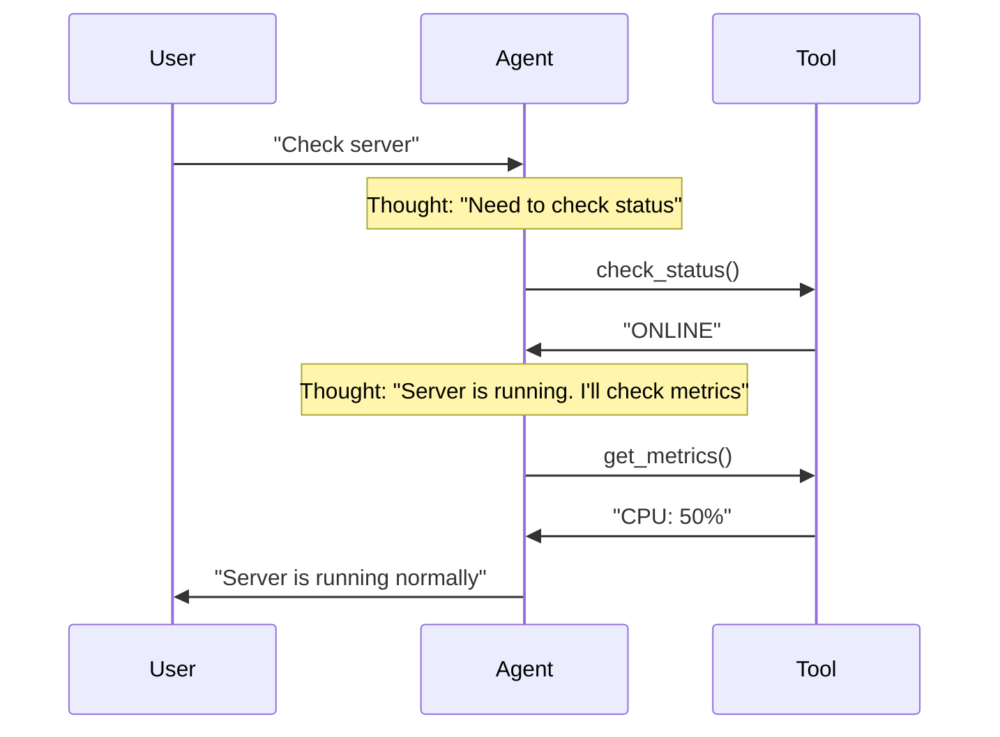
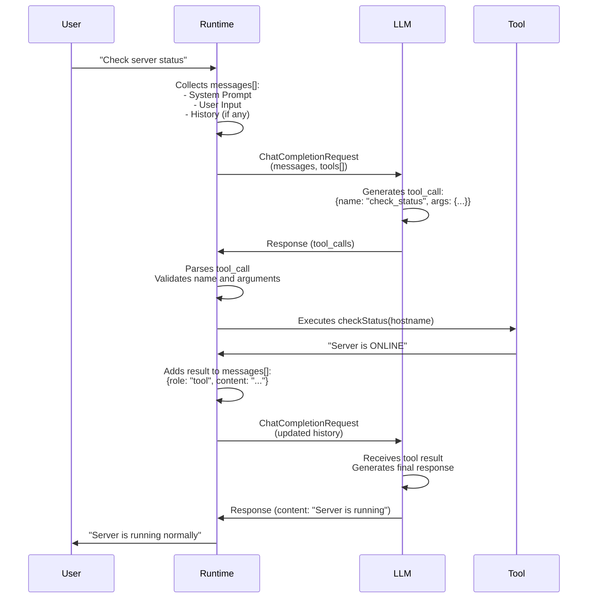

# 09. Agent Anatomy — Components and Their Interaction

## Why This Chapter?

An agent isn't just an LLM with tools. It's a complex system with memory, planning, and an execution environment. Without understanding the architecture, you won't be able to:
- Properly manage context and dialogue history
- Implement an autonomous agent work loop
- Optimize token usage
- Create an extensible system

This chapter explains agent components and how they interact with each other.

### Real-World Case Study

**Situation:** You've created a DevOps agent. After 20 messages, the agent "forgets" the beginning of the conversation and stops remembering the task context.

**Problem:** Dialogue history overflows the model's context window. Old messages are "pushed out", and the agent loses important information.

**Solution:** Understanding memory architecture allows implementing context optimization through summarization or message prioritization.

## Theory in Simple Terms

Agent equation:

$$ Agent = LLM + Memory + Tools + Planning $$

## Memory

An agent must "remember" conversation context and action history.

### Short-term Memory

This is the message history (`messages` array). Limited by the context window.

**Message structure:**

```go
type ChatCompletionMessage struct {
    Role    string  // "system", "user", "assistant", "tool"
    Content string  // Message text
    ToolCallID string  // If this is a tool result
}
```

**History example:**

```go
messages := []ChatCompletionMessage{
    {Role: "system", Content: "You are a DevOps engineer"},
    {Role: "user", Content: "Check server status"},
    {Role: "assistant", Content: "", ToolCalls: [...]},  // Tool call
    {Role: "tool", Content: "Server is ONLINE", ToolCallID: "call_123"},
    {Role: "assistant", Content: "Server is running normally"},
}
```

**Problem:** If history is too long, it doesn't fit in the context window.

**Problem example:**

```go
// Context window: 4k tokens
// System Prompt: 200 tokens
// Dialogue history: 4000 tokens
// New request: 100 tokens
// TOTAL: 4300 tokens > 4000 ❌ ERROR!
```

**IMPORTANT:** Detailed context optimization techniques (summarization, fact selection, token budgets, selection policies) are described in [Chapter 13: Context Engineering](../13-context-engineering/README.md). Here, only the concept of short-term memory as an agent component is described.

### Long-term Memory

This is a vector database (RAG). Allows storing gigabytes of documents and finding what's needed by meaning (Semantic Search).

**How it works:**

1. Documents are split into chunks
2. Each chunk is converted to a vector (embedding)
3. When agent queries, similar vectors are searched
4. Relevant chunks are added to context

**Usage examples:**

- **DevOps:** Storing protocols, runbooks, service documentation
- **Support:** Knowledge base with solutions to common problems
- **Data:** Database schemas, API documentation
- **Security:** Incident playbooks, security policies

See [Chapter 06: RAG](../06-rag/README.md)

## Planning

**Planning** is the agent's ability to break down a complex task into a sequence of simple steps and execute them in the correct order.

### Why Is Planning Needed?

Imagine a task: *"We have database issues, investigate"*

**Without planning:**
- Agent may try to do everything at once and get confused
- Agent may skip important steps
- Agent may execute steps in wrong order

**With planning:**
- Agent first analyzes the task
- Agent breaks it into subtasks
- Agent executes subtasks sequentially
- Agent checks result of each step

### Planning Levels

#### Level 1: Implicit Planning (ReAct)

Agent doesn't create an explicit plan, but plans "on the fly" during execution.

**How it works:**
1. Agent receives a task
2. Agent thinks: "What do I need to do first?"
3. Agent performs an action
4. Agent receives result and thinks: "What to do next?"
5. Repeats until task is complete

**Example (DevOps):**
```
User: "Check why server is slow"

Iteration 1:
Thought: "Need to check server metrics"
Action: get_cpu_metrics()
Observation: CPU 95%

Iteration 2:
Thought: "CPU is high. Need to see which process is consuming resources"
Action: get_top_processes()
Observation: Process: ffmpeg, CPU: 90%

Iteration 3:
Thought: "ffmpeg is consuming CPU. Need to check what this process is"
Action: get_process_info(pid=12345)
Observation: This is video conversion started by user

Iteration 4:
Thought: "This is a legitimate process, but it's blocking the system. I'll suggest user limit priority"
Action: [Final response to user]
```

**Advantages:**
- Flexibility: agent can adapt to results
- Simple implementation
- Suitable for medium complexity tasks

**Disadvantages:**
- May "get lost" in details
- May skip important steps
- Hard to track progress

#### Level 2: Explicit Planning (Plan-and-Solve)

Agent first creates a complete plan, then executes it step by step.

**How it works:**
1. Agent receives a task
2. Agent generates complete plan (list of steps)
3. Agent executes steps in order
4. Agent marks completed steps
5. Agent completes when all steps are done

**Example (DevOps - Incident):**
```
User: "Payment service unavailable (502). Investigate"

Step 1: Planning
Agent thinks: "Need to create investigation plan"
Agent generates plan:
  1. Check HTTP status of service
  2. If not 200 — read logs
  3. Analyze errors in logs
  4. Determine cause (config error / connection error / memory)
  5. Apply fix (rollback / restart / scale)
  6. Verify service is restored

Step 2: Execution
Agent: "Executing step 1: Checking HTTP status"
Action: check_http_status("payment-service")
Observation: 502 Bad Gateway

Agent: "Executing step 2: Reading logs"
Action: read_logs("payment-service", lines=50)
Observation: ERROR: Config syntax error in line 42

Agent: "Executing step 3: Analyzing errors"
Thought: "Logs show syntax error in config. This is not a temporary issue."

Agent: "Executing step 4: Determining cause"
Thought: "Cause: Config error. Solution: Rollback"

Agent: "Executing step 5: Applying fix"
Action: rollback_deploy("payment-service", version="v1.9")
Observation: Rollback complete. Service restarted.

Agent: "Executing step 6: Verifying"
Action: check_http_status("payment-service")
Observation: 200 OK

Agent: "All steps completed. Incident resolved."
```

**Advantages:**
- Guarantee all steps are executed
- Easy to track progress
- Suitable for complex tasks (5+ steps)

**Disadvantages:**
- Less flexible: plan may be suboptimal
- Requires more tokens (plan generation)
- May be excessive for simple tasks

#### Level 3: Hierarchical Planning

For very complex tasks, the plan is broken into subplans.

**Example (Security - Incident investigation):**
```
Main task: "Investigate suspicious activity on host 192.168.1.10"

Top-level plan:
  1. Alert triage
  2. Evidence collection
  3. Threat analysis
  4. Action (containment)
  5. Report generation

Subplan for step 2 (Evidence collection):
  2.1. Request SIEM logs for last hour
  2.2. Check network traffic
  2.3. Check system metrics
  2.4. Check running processes
  2.5. Check filesystem for changes

Subplan for step 3 (Threat analysis):
  3.1. Determine attack type
  3.2. Assess criticality
  3.3. Determine scope (affected systems)
  3.4. Assess damage
```

**When to use:**
- Very complex tasks (10+ steps)
- Tasks with multiple dependencies
- Tasks requiring coordination of multiple specialists

### Planning Strategies

#### 1. ReAct (Reason + Act)

Most popular architecture. Formula: `Thought -> Action -> Observation`.



**ReAct cycle:**

1. **Thought:** Model generates CoT (action plan)
2. **Action:** Model generates tool call token
3. **Runtime:** Our code intercepts call, executes function, gets result
4. **Observation:** Result is fed back to model
5. **Loop:** Repeat until model decides task is solved

**ReAct examples in different domains:**

**DevOps:**
```
Thought: User complains about slowness. Need to check CPU.
Action: get_cpu_metrics()
Observation: CPU 99% process: ffmpeg
Thought: ffmpeg is consuming everything. Need to kill or limit it.
Action: kill_process(pid=123)
```

**Support:**
```
Thought: User can't log in. I'll check account status.
Action: check_account_status(user_id="12345")
Observation: Account is locked due to suspicious activity
Thought: Account is locked. Need to unlock, but first check logs.
Action: check_security_logs(user_id="12345")
Observation: Multiple failed login attempts from unknown IP
Thought: This looks like a hack. I'll unlock, but send notification to change password.
Action: unlock_account(user_id="12345")
```

**Data Analytics:**
```
Thought: User asks about sales. Need to understand data structure.
Action: describe_table("sales")
Observation: Table contains: date, region, amount
Thought: Now I'll formulate SQL query.
Action: sql_select("SELECT region, SUM(amount) FROM sales GROUP BY region")
Observation: Region A: 100k, Region B: 150k
Thought: I'll analyze results and formulate conclusions.
```

### Plan-and-Solve

For complex tasks (Lab 06 Incident), ReAct may "get lost" in details.

**Architecture:**

1. **Planner:** First generate complete plan
   ```
   Plan:
   1. Check HTTP status
   2. Read logs
   3. Analyze errors
   4. Apply fix
   5. Verify
   ```

2. **Solver:** Execute plan items in order

**When to use Plan-and-Solve instead of ReAct?**

- Task is very complex (5+ steps)
- Need guarantee all steps will be executed
- Agent often "forgets" important steps
- Task has clear structure (e.g., SOP for incidents)

**Plan-and-Solve implementation:**

```go
func planAndSolve(ctx context.Context, client *openai.Client, task string) {
    // Step 1: Plan generation
    planPrompt := fmt.Sprintf(`Break task into steps:
Task: %s

Create action plan. Each step should be specific and executable.`, task)
    
    planResp, _ := client.CreateChatCompletion(ctx, openai.ChatCompletionRequest{
        Model: openai.GPT4,
        Messages: []openai.ChatCompletionMessage{
            {Role: "system", Content: "You are a task planner. Create detailed plans."},
            {Role: "user", Content: planPrompt},
        },
    })
    
    plan := planResp.Choices[0].Message.Content
    fmt.Printf("Plan:\n%s\n", plan)
    
    // Step 2: Plan execution
    executionPrompt := fmt.Sprintf(`Execute plan step by step:
Plan:
%s

Execute steps in order. After each step, report result.`, plan)
    
    // Run agent with plan in context
    runAgentWithPlan(ctx, client, executionPrompt, plan)
}
```

#### 3. Tree-of-Thoughts (ToT)

Agent considers several solution options and chooses the best one.

**How it works:**
1. Agent generates several possible solution paths
2. Agent evaluates each path
3. Agent chooses best path
4. Agent executes chosen path

**Example (Data Analytics):**
```
Task: "Why did sales drop in region X?"

Option 1: Check sales data directly
  - Pros: Fast
  - Cons: May not show cause

Option 2: Check sales data + marketing campaigns + competitors
  - Pros: More complete picture
  - Cons: Longer

Option 3: Check data quality first
  - Pros: Ensure data is correct
  - Cons: May be excessive

Agent chooses Option 2 (most complete)
```

**When to use:**
- Task has several possible approaches
- Need to choose optimal path
- Solution efficiency is important

#### 4. Self-Consistency

Agent generates several plans and chooses the most consistent one.

**How it works:**
1. Agent generates N plans (e.g., 5)
2. Agent finds common elements in all plans
3. Agent creates final plan based on common elements

**Example:**
```
Plan 1: [A, B, C, D]
Plan 2: [A, B, E, F]
Plan 3: [A, C, D, G]
Plan 4: [A, B, C, H]
Plan 5: [A, B, D, I]

Common elements: A (all 5), B (in 4 of 5), C (in 2 of 5)
Final plan: [A, B, C, ...] (based on most frequent elements)
```

### Task Decomposition

#### How to Properly Break Down Tasks?

**Decomposition principles:**

1. **Atomicity:** Each step should be executable with one action
   - ❌ Bad: "Check and fix server"
   - ✅ Good: "Check server status" → "Read logs" → "Apply fix"

2. **Dependencies:** Steps should execute in correct order
   - ❌ Bad: "Apply fix" → "Read logs"
   - ✅ Good: "Read logs" → "Analyze" → "Apply fix"

3. **Verifiability:** Each step should have clear success criterion
   - ❌ Bad: "Improve performance"
   - ✅ Good: "Reduce CPU from 95% to 50%"

**Decomposition example (Support):**

```
Original task: "Process user ticket about login problem"

Decomposition:
1. Read ticket completely
   - Success criterion: All problem details obtained
   
2. Gather context
   - Success criterion: Software version, OS, browser known
   
3. Search knowledge base
   - Success criterion: Similar cases or solution found
   
4. Check account status
   - Success criterion: Status known (active/locked)
   
5. Formulate response
   - Success criterion: Response ready and contains solution
   
6. Send response or escalate
   - Success criterion: Ticket processed
```

### Practical Planning Examples

#### Example 1: DevOps - Incident Investigation

```go
// Task: "Service is unavailable. Investigate."

// Plan (generated by agent):
plan := []string{
    "1. Check HTTP status of service",
    "2. If not 200 — read logs",
    "3. Analyze errors",
    "4. Determine cause",
    "5. Apply fix",
    "6. Verify recovery",
}

// Execution:
for i, step := range plan {
    fmt.Printf("Executing step %d: %s\n", i+1, step)
    result := executeStep(step)
    if !result.Success {
        fmt.Printf("Step %d failed: %s\n", i+1, result.Error)
        // Agent may replan or escalate
        break
    }
}
```

#### Example 2: Data Analytics - Sales Analysis

```go
// Task: "Why did sales drop in region X?"

// Plan:
plan := []string{
    "1. Check data quality (nulls, duplicates)",
    "2. Get sales data for last month",
    "3. Compare with previous period",
    "4. Check marketing campaigns",
    "5. Check competitors",
    "6. Analyze trends",
    "7. Generate report with conclusions",
}
```

#### Example 3: Security - Alert Triage

```go
// Task: "Alert: suspicious activity on host 192.168.1.10"

// Plan:
plan := []string{
    "1. Determine alert severity",
    "2. Gather evidence (logs, metrics, traffic)",
    "3. Analyze attack patterns",
    "4. Determine scope (affected systems)",
    "5. Assess criticality",
    "6. Make decision (False Positive / True Positive)",
    "7. If True Positive — containment (with confirmation)",
    "8. Generate report for SOC",
}
```

### Common Planning Errors

#### Error 1: Plan Too General

❌ **Bad:**
```
Plan:
1. Figure out the problem
2. Fix it
3. Check
```

✅ **Good:**
```
Plan:
1. Check HTTP status of service (check_http)
2. If 502 — read last 50 log lines (read_logs)
3. Find error keywords in logs
4. If "Syntax error" — perform rollback (rollback_deploy)
5. If "Connection refused" — restart service (restart_service)
6. Verify: check HTTP status again (check_http)
```

#### Error 2: Wrong Step Order

❌ **Bad:**
```
1. Apply fix
2. Read logs
3. Check status
```

✅ **Good:**
```
1. Check status
2. Read logs
3. Apply fix
```

#### Error 3: Skipping Important Steps

❌ **Bad:**
```
1. Read logs
2. Apply fix
(Verification step skipped!)
```

✅ **Good:**
```
1. Read logs
2. Apply fix
3. Verify result
```

### Planning Checklist

- [ ] Task broken into atomic steps
- [ ] Steps execute in correct order
- [ ] Each step has clear success criterion
- [ ] Plan includes result verification
- [ ] Correct planning level chosen (ReAct / Plan-and-Solve / Hierarchical)
- [ ] Plan adapts to execution results (for ReAct)

### Reflexion (Self-Correction)

Agents often make mistakes. Reflexion adds a criticism step.

Cycle: `Act -> Observe -> Fail -> REFLECT -> Plan Again`

**Example:**

```
Action: read_file("/etc/nginx/nginx.conf")
Observation: Permission denied
Reflection: "I tried to read file, but got Permission Denied. 
            This means I don't have permissions. Next time I should use sudo 
            or check permissions first."
Action: check_permissions("/etc/nginx/nginx.conf")
Observation: File is readable by root only
Action: read_file_sudo("/etc/nginx/nginx.conf")
```

## Runtime (Execution Environment)

Runtime is the code that connects the LLM with tools.

**Main Runtime functions:**

1. **Parsing LLM responses:** Determining if model wants to call a tool
2. **Executing tools:** Calling real Go functions
3. **Managing history:** Adding results to context
4. **Managing loop:** Determining when to stop

### Registry Pattern for Extensibility

To make an agent extensible, don't hardcode tool logic in `main.go`. Use a **Registry** pattern.

**Problem without Registry:**
- Adding a new tool requires changes in dozens of places
- Code becomes unreadable
- Hard to test individual tools

**Solution: Go Interfaces + Registry**

#### Defining Tool Interface

```go
type Tool interface {
    Name() string
    Description() string
    Parameters() json.RawMessage
    Execute(args json.RawMessage) (string, error)
}
```

Any tool (Proxmox, Ansible, SSH) must implement this interface.

#### Tool Implementation

```go
type ProxmoxListVMsTool struct{}

func (t *ProxmoxListVMsTool) Name() string {
    return "list_vms"
}

func (t *ProxmoxListVMsTool) Description() string {
    return "List all VMs in the Proxmox cluster"
}

func (t *ProxmoxListVMsTool) Parameters() json.RawMessage {
    return json.RawMessage(`{
        "type": "object",
        "properties": {},
        "required": []
    }`)
}

func (t *ProxmoxListVMsTool) Execute(args json.RawMessage) (string, error) {
    // Real Proxmox API call logic
    return "VM-100 (Running), VM-101 (Stopped)", nil
}
```

#### Registry (Tool Registry)

Registry is a tool storage accessible by name.

```go
type ToolRegistry struct {
    tools map[string]Tool
}

func NewToolRegistry() *ToolRegistry {
    return &ToolRegistry{
        tools: make(map[string]Tool),
    }
}

func (r *ToolRegistry) Register(tool Tool) {
    r.tools[tool.Name()] = tool
}

func (r *ToolRegistry) Get(name string) (Tool, bool) {
    tool, exists := r.tools[name]
    return tool, exists
}

func (r *ToolRegistry) ToOpenAITools() []openai.Tool {
    var result []openai.Tool
    for _, tool := range r.tools {
        result = append(result, openai.Tool{
            Type: openai.ToolTypeFunction,
            Function: &openai.FunctionDefinition{
                Name:        tool.Name(),
                Description: tool.Description(),
                Parameters:  tool.Parameters(),
            },
        })
    }
    return result
}
```

#### Using Registry

```go
// Initialization
registry := NewToolRegistry()
registry.Register(&ProxmoxListVMsTool{})
registry.Register(&AnsibleRunPlaybookTool{})

// Get tool list for LLM
tools := registry.ToOpenAITools()

// Execute tool by name
toolCall := msg.ToolCalls[0]
if tool, exists := registry.Get(toolCall.Function.Name); exists {
    result, err := tool.Execute(json.RawMessage(toolCall.Function.Arguments))
    if err != nil {
        return fmt.Errorf("tool execution failed: %v", err)
    }
    // Add result to history
}
```

**Registry advantages:**
- ✅ Adding new tool — just implement interface and register
- ✅ Tool code is isolated and easily testable
- ✅ Runtime doesn't know about specific tools, works through interface
- ✅ Easy to add validation, logging, metrics at Registry level

**Runtime example with Registry:**

```go
func runAgent(ctx context.Context, client *openai.Client, registry *ToolRegistry, userInput string) {
    messages := []openai.ChatCompletionMessage{
        {Role: "system", Content: systemPrompt},
        {Role: "user", Content: userInput},
    }
    
    tools := registry.ToOpenAITools()  // Get tool list from Registry
    
    for i := 0; i < maxIterations; i++ {
        resp, _ := client.CreateChatCompletion(ctx, openai.ChatCompletionRequest{
            Model: openai.GPT3Dot5Turbo,
            Messages: messages,
            Tools: tools,
        })
        
        msg := resp.Choices[0].Message
        messages = append(messages, msg)
        
        if len(msg.ToolCalls) == 0 {
            // Final response
            fmt.Println(msg.Content)
            break
        }
        
        // Execute tools through Registry
        for _, toolCall := range msg.ToolCalls {
            tool, exists := registry.Get(toolCall.Function.Name)
            if !exists {
                result := fmt.Sprintf("Error: Unknown tool %s", toolCall.Function.Name)
                messages = append(messages, openai.ChatCompletionMessage{
                    Role: "tool",
                    Content: result,
                    ToolCallID: toolCall.ID,
                })
                continue
            }
            
            result, err := tool.Execute(json.RawMessage(toolCall.Function.Arguments))
            if err != nil {
                result = fmt.Sprintf("Error: %v", err)
            }
            
            messages = append(messages, openai.ChatCompletionMessage{
                Role: "tool",
                Content: result,
                ToolCallID: toolCall.ID,
            })
        }
    }
}
```

### Agent Data Flow Diagram



**Key points:**
- LLM doesn't execute code, only generates JSON
- Runtime manages entire loop and executes real functions
- History (`messages[]`) is collected by Runtime and passed in each request
- Tool results are added to history before next request

## Common Errors

### Error 1: History Overflow

**Symptom:** Agent "forgets" beginning of conversation. After N messages, stops remembering task context.

**Cause:** Dialogue history exceeds model's context window size. Old messages are "pushed out" of context.

**Solution:**
```go
// BAD: Simply truncate history (lose information)
if len(messages) > maxHistoryLength {
    messages = append(
        []openai.ChatCompletionMessage{messages[0]},  // System
        messages[len(messages)-maxHistoryLength+1:]...,  // Last ones
    )
}

// GOOD: Compress old messages through summarization
// Detailed optimization techniques described in [Chapter 13: Context Engineering](../13-context-engineering/README.md)
compressed := compressContext(messages, maxTokens)
```

### Error 2: Agent Loops

**Symptom:** Agent repeats the same action infinitely.

**Cause:** No iteration limit and no detection of repeating actions.

**Solution:**
```go
// GOOD: Iteration limit + stuck detection
for i := 0; i < maxIterations; i++ {
    // ...
    
    // Stuck detection
    if lastNActionsAreSame(history, 3) {
        break
    }
}
```

### Error 3: Tool Result Not Added to History

**Symptom:** Agent doesn't see tool result and continues performing the same action.

**Cause:** Tool execution result is not added to `messages[]`.

**Solution:**
```go
// BAD: Result not added
result := executeTool(toolCall)
// History not updated!

// GOOD: Result added to history
result := executeTool(toolCall)
messages = append(messages, openai.ChatCompletionMessage{
    Role:       openai.ChatMessageRoleTool,
    Content:    result,
    ToolCallID: toolCall.ID,
})
```

## Mini-Exercises

### Exercise 1: Count Tokens in History

Implement a function to count tokens in message history:

```go
func countTokensInMessages(messages []openai.ChatCompletionMessage) int {
    // Count total number of tokens
    // Consider: Content, ToolCalls, system messages
}
```

**Expected result:**
- Function returns accurate token count
- Considers all message types (system, user, assistant, tool)

### Exercise 2: Context Optimization

**Note:** Detailed context optimization techniques are described in [Chapter 13: Context Engineering](../13-context-engineering/README.md). Here, a basic exercise is proposed.

Implement a context compression function through summarization:

```go
func compressContext(messages []openai.ChatCompletionMessage, maxTokens int) []openai.ChatCompletionMessage {
    // If tokens less than maxTokens, return as is
    // Otherwise compress old messages through summarization
    // Detailed techniques: see [Chapter 13: Context Engineering](../13-context-engineering/README.md)
}
```

**Expected result:**
- System Prompt always remains first
- Old messages compressed through LLM
- Last N messages preserved completely

## Completion Criteria / Checklist

✅ **Completed:**
- Short-term memory (message history) is managed
- Token counting and context monitoring implemented
- Context optimization applied (summarization/prioritization)
- Long-term memory (RAG) configured (if needed)
- Planning (ReAct/Plan-and-Solve) implemented
- Runtime correctly parses LLM responses
- Runtime executes tools
- Runtime manages loop
- Protection against loops exists

❌ **Not completed:**
- History overflows (no context optimization)
- Agent loops (no iteration limit)
- Tool results not added to history
- No token usage monitoring

## Connection with Other Chapters

- **[Chapter 01: LLM Physics](../01-llm-fundamentals/README.md)** — Understanding context window helps manage memory
- **[Chapter 03: Tools and Function Calling](../03-tools-and-function-calling/README.md)** — How Runtime executes tools
- **[Chapter 04: Autonomy and Loops](../04-autonomy-and-loops/README.md)** — How Planning works in agent loop
- **[Chapter 13: Context Engineering](../13-context-engineering/README.md)** — Detailed context optimization techniques (summarization, fact selection, token budgets)

## What's Next?

After studying architecture, proceed to:
- **[10. Planning and Workflow Patterns](../10-planning-and-workflows/README.md)** — how agent plans complex tasks

---

**Navigation:** [← Evals and Reliability](../08-evals-and-reliability/README.md) | [Table of Contents](../README.md) | [Planning →](../10-planning-and-workflows/README.md)
