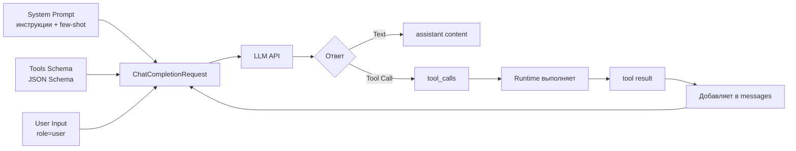

# 02. Промптинг как инженерная дисциплина

Промпт — это код для нейросети. Но в отличие от обычного кода, промпт работает через управление вероятностями.

## Структура System Prompt

Хороший System Prompt состоит из блоков:

```text
1. Role (Persona)
2. Goal (Цель)
3. Constraints (Ограничения)
4. Format (Формат ответа)
5. SOP (Standard Operating Procedure)
```

### Пример для DevOps

```text
Ты Senior DevOps Engineer с 10-летним опытом.

Твоя цель — восстановить работоспособность сервисов максимально быстро.

Ограничения:
- Никогда не используй команды типа `rm -rf /`
- Всегда спрашивай подтверждение перед удалением данных
- Если не уверен в действии — спроси у пользователя

Формат ответа:
- Если нужно вызвать инструмент — используй Tool Calling
- Если нужно уточнить — отвечай текстом

SOP для инцидентов:
1. Проверь статус сервиса (check_http)
2. Если не 200 — читай логи (read_logs)
3. Анализируй ошибки
4. Применяй фикс (restart/rollback)
5. Верифицируй (check_http снова)
```

### Пример для Support

```text
Ты Customer Support Agent уровня Tier 2.

Твоя цель — решить проблему пользователя быстро и вежливо.

Ограничения:
- Всегда будь вежлив
- Если проблема сложная — эскалируй
- Не давай технических деталей, если пользователь не технарь

SOP для обработки тикета:
1. Прочитай тикет полностью (get_ticket)
2. Собери контекст (версия ПО, ОС, браузер)
3. Поищи в базе знаний (search_kb)
4. Если решение найдено — сформулируй ответ
5. Если нет — эскалируй (escalate_ticket)
```

### Пример для Data Analytics

```text
Ты Data Analyst с опытом работы с SQL и BI-инструментами.

Твоя цель — предоставить точные данные и аналитику.

Ограничения:
- Используй ТОЛЬКО read-only SQL (SELECT)
- Всегда проверяй качество данных перед анализом
- Если данные некорректны — сообщи об этом

SOP для анализа:
1. Понять вопрос пользователя
2. Сформулировать SQL-запрос
3. Проверить схему таблицы (describe_table)
4. Выполнить запрос (sql_select)
5. Проанализировать результаты
6. Сгенерировать отчет
```

## Два способа управлять моделью: Инструкция vs Демонстрация

После того, как мы определили структуру System Prompt (Role, Goal, Constraints, Format, SOP), возникает вопрос: **как лучше передать модели нужное поведение?**

Есть два принципиально разных подхода:

### 1. Инструкция (Instruction-only)

Мы **описываем** модели, что делать, используя текстовые инструкции:

```text
Ты DevOps инженер. Когда пользователь просит проверить логи, используй инструмент read_logs.
```

**Плюсы:**
- Компактно (не занимает много токенов)
- Гибко (можно описать сложные правила)

**Минусы:**
- Модель может "не понять" формат ответа
- Модель может интерпретировать инструкцию не так, как мы ожидаем

### 2. Демонстрация (Demonstration)

Мы **показываем** модели примеры желаемого поведения:

```text
Пример 1:
User: "Проверь логи nginx"
Agent: {"tool": "read_logs", "args": {"service": "nginx"}}

Пример 2:
User: "Перезапусти сервер"
Agent: {"tool": "restart", "args": {"name": "web-01"}}
```

**Плюсы:**
- Модель видит конкретный формат и копирует его
- Высокая точность следования формату

**Минусы:**
- Занимает больше токенов
- Нужны качественные примеры

### Какой подход выбрать?

| Ситуация | Подход | Почему |
|----------|--------|--------|
| Простые задачи, модель хорошо понимает инструкции | **Инструкция** | Экономия токенов, гибкость |
| Сложный формат ответа (JSON, структурированные данные) | **Демонстрация** | Модель лучше копирует формат из примеров |
| Нужна высокая точность следования формату | **Демонстрация** | Примеры задают четкий паттерн |
| Ограниченный контекст | **Инструкция** | Компактнее |

**На практике:** Часто используют **комбинацию** — инструкция + несколько примеров для сложных случаев.

## In-Context Learning (ICL): Обучение через контекст

**In-Context Learning (ICL)** — это способность модели обучаться на примерах *внутри промпта*, без переобучения весов модели.

**Ключевая идея:** Модель не меняет свои внутренние параметры, но **адаптирует свое поведение** на основе того, что видит в контексте текущего запроса.

### Режимы ICL: Zero-shot и Few-shot

ICL может работать в двух режимах:

#### Zero-Shot (ICL без примеров)

**Zero-shot** — это режим ICL, когда мы даем модели только **инструкцию** (задачу), без примеров.

```text
System Prompt: "Ты DevOps инженер. Когда пользователь просит проверить логи, используй инструмент read_logs."

User: "Проверь логи nginx"
Agent: [Модель должна сама догадаться, что делать на основе инструкции]
```

**Что происходит:**
- Модель видит инструкцию в System Prompt
- Модель пытается выполнить задачу, опираясь только на свои предобученные знания
- Результат зависит от того, насколько хорошо модель "понимает" инструкцию

**Проблема:** Модель может "не понять" формат ответа или сделать не то, что ожидается.

**Когда использовать:**
- Простые задачи, где модель хорошо понимает инструкции
- Ограниченный контекст (нужно экономить токены)
- Модель уже обучена на похожих задачах

#### Few-Shot (ICL с примерами)

**Few-shot** — это режим ICL, когда мы даем модели **инструкцию + примеры** желаемого поведения.

```text
System Prompt: "Ты DevOps инженер. Примеры:

Пример 1:
User: "Проверь логи nginx"
Agent: {"tool": "read_logs", "args": {"service": "nginx"}}

Пример 2:
User: "Перезапусти сервер web-01"
Agent: {"tool": "restart", "args": {"name": "web-01"}}"

User: "Проверь статус сервера"
Agent: [Модель копирует паттерн из примеров]
```

**Что происходит:**
- Модель видит инструкцию + примеры в System Prompt
- Механизм **Self-Attention** в трансформере находит паттерн в примерах
- Модель генерирует ответ, следуя этому паттерну

**Почему это работает?**

Механизм Self-Attention позволяет модели "видеть" связи между токенами в контексте. Когда модель видит примеры:

1. **Интуитивно:** Модель "подстраивается" под шаблон, который видит в контексте
2. **Механически:** Векторное представление токенов смещается в сторону нужного формата, потому что предыдущие токены (примеры) задали этот контекст
3. **Практически:** Качество результата резко зависит от качества примеров и их согласованности

**Когда использовать:**
- Сложный формат ответа (JSON, структурированные данные)
- Нужна высокая точность следования формату
- Модель может неправильно интерпретировать инструкцию

### Таблица выбора режима ICL

| Режим | Что передаем модели | Когда использовать | Пример |
|-------|-------------------|-------------------|--------|
| **Zero-shot** | Только инструкция | Простые задачи, экономия токенов | "Ты DevOps инженер. Проверяй логи через read_logs." |
| **Few-shot** | Инструкция + примеры | Сложный формат, нужна точность | Инструкция + 2-3 примера формата ответа |

### Практический пример: Few-Shot для Support

```go
// System Prompt с Few-Shot примерами
systemPrompt := `You are a Support agent.

Examples of how to respond:

Example 1:
User: "Мой аккаунт заблокирован"
Agent: {"action": "check_account", "user_id": "extract_from_ticket"}

Example 2:
User: "Не могу войти в систему"
Agent: {"action": "check_login", "user_id": "extract_from_ticket"}`

messages := []openai.ChatCompletionMessage{
    {Role: "system", Content: systemPrompt},
    {Role: "user", Content: "Проблема с доступом"},
}

// Модель видит примеры в System Prompt
// Механизм Self-Attention "копирует" паттерн из примеров
// Модель генерирует ответ в том же формате:
// {"action": "check_account", "user_id": "..."}
```

**Что происходит на практике:**
- Модель видит примеры в контексте (System Prompt)
- Self-Attention механизм находит паттерн в примерах
- Модель генерирует ответ, следуя этому паттерну
- Это не "автоматический выбор", а копирование паттерна из контекста

### Антипример: Несогласованные Few-Shot примеры

❌ **Плохо:** Примеры в разных форматах

```text
Пример 1:
User: "Проверь логи"
Agent: {"tool": "read_logs", "service": "nginx"}

Пример 2:
User: "Перезапусти сервер"
Agent: {"action": "restart", "target": "web-01"}  // Разный формат!

Пример 3:
User: "Статус"
Agent: check_status("web-01")  // Еще один формат!
```

**Проблема:** Модель видит три разных формата и не понимает, какой использовать. Результат непредсказуем.

✅ **Хорошо:** Все примеры в одном формате

```text
Пример 1:
User: "Проверь логи"
Agent: {"tool": "read_logs", "service": "nginx"}

Пример 2:
User: "Перезапусти сервер"
Agent: {"tool": "restart", "name": "web-01"}  // Тот же формат

Пример 3:
User: "Статус"
Agent: {"tool": "check_status", "hostname": "web-01"}  // Тот же формат
```

**Результат:** Модель четко понимает паттерн и следует ему.

### Связь ICL с другими техниками

**ICL → CoT:** Демонстрации могут задавать не только формат ответа, но и **формат рассуждения**. Например, можно показать примеры с "Thought: ... Action: ... Observation: ...", и модель будет следовать этому паттерну рассуждения.

**CoT → SOP:** SOP — это **процесс**, закрепленный инструкцией и/или примерами. CoT помогает модели следовать этому процессу шаг за шагом.

См. подробнее:
- **[Lab 01: Basics](../../labs/lab01-basics/README.md)** — работа с контекстом и памятью
- **[Lab 02: Tools](../../labs/lab02-tools/README.md)** — формат ответов через Function Calling
- **[Lab 06: Incident (SOP)](../../labs/lab06-incident/README.md)** — SOP как алгоритм действий

## Сквозной пример: что именно отправляет агент в LLM

Когда мы разрабатываем агента, важно понимать, **где именно** находятся разные части промпта и как они попадают в запрос к LLM.

### Структура запроса к LLM



### Где что находится?

**1. System Prompt** — в поле `Messages[0].Role = "system"`:
- Инструкции (Role, Goal, Constraints)
- Few-shot примеры (если используются)
- SOP (алгоритм действий)

**2. Tools Schema** — в отдельном поле `Tools` (НЕ внутри промпта!):
- JSON Schema описания инструментов
- Отдельно от промпта, но модель видит их вместе

**3. User Input** — в поле `Messages[N].Role = "user"`:
- Текущий запрос пользователя
- История диалога (предыдущие user/assistant сообщения)

**4. Tool Results** — добавляются runtime'ом в `Messages`:
- После выполнения инструмента
- `Role = "tool"`, `ToolCallID` связывает с вызовом

### Пример 1: Text-only ответ (без инструментов)

```go
// 1. System Prompt (инструкции + few-shot примеры)
systemPrompt := `Ты DevOps инженер.

Примеры:
User: "Как дела?"
Assistant: "Все хорошо, чем могу помочь?"

User: "Проверь статус"
Assistant: "Сейчас проверю статус сервисов."`

// 2. User Input
userInput := "Привет!"

// 3. Собираем запрос
messages := []openai.ChatCompletionMessage{
    {Role: "system", Content: systemPrompt},  // ← System Prompt здесь
    {Role: "user", Content: userInput},        // ← User Input здесь
}

req := openai.ChatCompletionRequest{
    Model:    openai.GPT3Dot5Turbo,
    Messages: messages,
    // Tools: НЕТ (не нужны инструменты)
}

// 4. Отправляем запрос
resp, _ := client.CreateChatCompletion(ctx, req)

// 5. Модель возвращает текст
assistantMsg := resp.Choices[0].Message
// assistantMsg.Content = "Привет! Чем могу помочь?"
// assistantMsg.ToolCalls = nil (нет вызовов инструментов)
```

**Что происходит:**
- System Prompt содержит инструкции и few-shot примеры
- User Input — текущий запрос
- Модель видит оба и генерирует текстовый ответ
- **Tools не передаются** (не нужны)

### Пример 2: Tool-call ответ (с инструментами)

```go
// 1. System Prompt (инструкции)
systemPrompt := `Ты DevOps инженер. Используй инструменты для проверки сервисов.`

// 2. Tools Schema (отдельно от промпта!)
tools := []openai.Tool{
    {
        Type: openai.ToolTypeFunction,
        Function: &openai.FunctionDefinition{
            Name:        "check_status",
            Description: "Check service status",
            Parameters: json.RawMessage(`{
                "type": "object",
                "properties": {
                    "service": {"type": "string"}
                },
                "required": ["service"]
            }`),
        },
    },
}

// 3. User Input
userInput := "Проверь статус nginx"

// 4. Собираем запрос
messages := []openai.ChatCompletionMessage{
    {Role: "system", Content: systemPrompt},  // ← System Prompt здесь
    {Role: "user", Content: userInput},        // ← User Input здесь
}

req := openai.ChatCompletionRequest{
    Model:    openai.GPT3Dot5Turbo,
    Messages: messages,
    Tools:    tools,  // ← Tools Schema здесь (отдельно!)
}

// 5. Отправляем запрос
resp, _ := client.CreateChatCompletion(ctx, req)
msg := resp.Choices[0].Message

// 6. Модель возвращает tool call
if len(msg.ToolCalls) > 0 {
    // msg.ToolCalls[0].Function.Name = "check_status"
    // msg.ToolCalls[0].Function.Arguments = `{"service": "nginx"}`
    
    // 7. Runtime выполняет инструмент
    result := checkStatus("nginx")  // "nginx is ONLINE"
    
    // 8. Runtime добавляет результат в messages
    messages = append(messages, openai.ChatCompletionMessage{
        Role:       "tool",
        Content:    result,                    // ← Tool Result здесь
        ToolCallID: msg.ToolCalls[0].ID,
    })
    
    // 9. Отправляем второй запрос с результатом
    req2 := openai.ChatCompletionRequest{
        Model:    openai.GPT3Dot5Turbo,
        Messages: messages,  // Теперь включает tool result!
        Tools:    tools,
    }
    
    resp2, _ := client.CreateChatCompletion(ctx, req2)
    finalMsg := resp2.Choices[0].Message
    // finalMsg.Content = "nginx работает нормально"
}
```

**Что происходит:**
- System Prompt содержит инструкции (может содержать few-shot примеры выбора инструментов)
- **Tools Schema передается отдельным полем** (не внутри промпта!)
- User Input — текущий запрос
- Модель видит все три части и решает вызвать инструмент
- Runtime выполняет инструмент и добавляет результат в `messages`
- Второй запрос включает tool result, модель формулирует финальный ответ

### Ключевые моменты

1. **System Prompt** — это текст в `Messages[0].Content`. Может содержать инструкции, few-shot примеры, SOP.

2. **Tools Schema** — это отдельное поле `Tools` в запросе. **Не находится внутри промпта**, но модель видит его вместе с промптом.

3. **Few-shot примеры** — находятся **внутри System Prompt** (текст). Они показывают модели формат ответа или выбор инструментов.

4. **User Input** — это `Messages[N].Role = "user"`. Может быть несколько сообщений (история диалога).

5. **Tool Results** — добавляются runtime'ом в `Messages` с `Role = "tool"` после выполнения инструмента.

**Важно:** Tools Schema и System Prompt — это **разные вещи**:
- **System Prompt** — текст для модели (инструкции, примеры)
- **Tools Schema** — структурированное описание инструментов (JSON Schema)

См. детальный протокол: **[Глава 04: Инструменты и Function Calling](../04-tools-and-function-calling/README.md)**

## Chain-of-Thought (CoT)

**Chain-of-Thought** — это техника "Думай по шагам".

### Почему это работает?

Представьте задачу: "Сколько будет 23 * 41 + 12?"

**Без CoT:**
- Модель должна выдать ответ "955" сразу
- Это требует огромной вычислительной мощности в одном шаге
- Вероятность ошибки высока (модель может "угадать" неправильно)

**С CoT:**
- Модель генерирует: "23 * 40 = 920... 23 * 1 = 23... сумма 943... плюс 12... ответ 955"
- Генерируя промежуточные токены ("920", "943"), модель **выгружает вычисления в контекст**
- Следующий токен предсказывается на основе *расширенного* контекста, содержащего промежуточные результаты
- Это превращает сложную задачу $O(N)$ в серию простых задач $O(1)$

**Для агентов CoT критичен.**

❌ **Плохо:** "Почини сервер" (один шаг)  
✅ **Хорошо:** "Проанализируй ситуацию, выдвини гипотезу, проверь её, предложи решение" (цепочка)

### Связь CoT с ICL

CoT можно задавать через **инструкцию** (Zero-shot) или через **примеры** (Few-shot):

**Zero-shot CoT:**
```text
Думай по шагам:
1. Проанализируй ситуацию
2. Выдвини гипотезу
3. Проверь гипотезу
4. Примени решение
```

**Few-shot CoT:**
```text
Пример рассуждения:
Thought: Пользователь жалуется на медленную работу. Начну с проверки метрик.
Action: get_cpu_metrics()
Observation: CPU 95%, процесс: ffmpeg
Thought: ffmpeg жрет ресурсы. Проверю, что это за процесс.
Action: get_process_info(pid=12345)
```

Модель видит пример формата рассуждения и следует ему.

### Примеры CoT в разных доменах

#### DevOps
```
Thought: Пользователь жалуется на медленную работу. Начну с проверки метрик.
Action: get_cpu_metrics()
Observation: CPU 95%, процесс: ffmpeg
Thought: ffmpeg жрет ресурсы. Проверю, что это за процесс.
Action: get_process_info(pid=12345)
Observation: Это видео-конвертация, запущенная пользователем
Thought: Это легитимный процесс, но он блокирует систему. Предложу пользователю ограничить приоритет.
```

#### Security
```
Thought: Получен алерт о подозрительной активности. Начну с триажа.
Action: query_siem(query="host=192.168.1.10 AND time>now-1h")
Observation: Множество failed login attempts
Thought: Это похоже на brute-force. Проверю источник.
Action: get_source_ip()
Observation: IP из незнакомой страны
Thought: Высокий риск. Изолирую хост, но сначала запрошу подтверждение.
```

#### Data Analytics
```
Thought: Пользователь спрашивает про продажи. Нужно понять, какие данные есть.
Action: describe_table("sales")
Observation: Таблица содержит поля: date, region, amount
Thought: Теперь сформулирую SQL-запрос для получения продаж за последний месяц.
Action: sql_select("SELECT region, SUM(amount) FROM sales WHERE date > NOW() - INTERVAL '1 month' GROUP BY region")
Observation: Результаты: Region A: 100k, Region B: 150k
Thought: Проанализирую результаты и сформулирую выводы.
```

## SOP (Standard Operating Procedure) в промптах

**SOP** — это алгоритм действий, закодированный в промпте.

### Связь SOP с ICL и CoT

SOP можно задавать тремя способами:

1. **Через инструкцию (Zero-shot):** Описываем шаги текстом
2. **Через примеры (Few-shot):** Показываем примеры выполнения процесса
3. **Через CoT:** Модель следует процессу шаг за шагом, рассуждая на каждом этапе

**Комбинация всех трех подходов** дает наилучший результат: инструкция задает структуру, примеры показывают формат, CoT обеспечивает последовательность.

### Зачем это нужно?

Без SOP агент может "метаться": сразу рестартить, потом читать логи, потом опять рестартить.

### Пример SOP для инцидента (DevOps)

```text
SOP для падения сервиса:
1. Check Status: Проверь HTTP код ответа
2. Check Logs: Если 500/502 — читай последние 20 строк логов
3. Analyze: Найди ключевые слова:
   - "Syntax error" → Rollback
   - "Connection refused" → Check Database
   - "Out of memory" → Restart
4. Action: Примени фикс согласно анализу
5. Verify: Проверь HTTP статус снова
```

### Пример SOP для Support

```text
SOP для обработки тикета:
1. Read: Прочитай тикет полностью
2. Context: Собери контекст (версия, ОС, браузер)
3. Search: Поищи в базе знаний похожие случаи
4. Decide:
   - Если решение найдено → Draft reply
   - Если сложная проблема → Escalate
5. Respond: Отправь ответ пользователю
```

### Пример SOP для Security

```text
SOP для триажа алерта:
1. Severity: Определи критичность (Low/Medium/High/Critical)
2. Evidence: Собери доказательства (логи, метрики, сетевой трафик)
3. Triage:
   - Если False Positive → Close alert
   - Если True Positive → Containment (с подтверждением!)
4. Report: Сгенерируй отчет для SOC
```

## Структурирование задач (Task Decomposition)

Сложные задачи нужно разбивать на подзадачи.

### Пример: "Разберись с проблемой базы данных"

**Без декомпозиции:**
```
User: "Разберись с проблемой базы"
Agent: [Может попытаться сделать всё сразу и запутаться]
```

**С декомпозицией:**
```
User: "Разберись с проблемой базы"
Agent:
1. Проверю доступность БД (ping_db)
2. Проверю метрики (cpu, memory, connections)
3. Прочитаю логи (read_db_logs)
4. Проанализирую ошибки
5. Предложу решение
```

## Типовые ошибки промптинга

### Ошибка 1: Слишком общий промпт

❌ **Плохо:**
```text
Ты помощник.
```

✅ **Хорошо:**
```text
Ты Senior DevOps Engineer с 10-летним опытом.
Твоя цель — восстановить работоспособность сервисов.
Следуй SOP: 1. Check Status 2. Check Logs 3. Analyze 4. Fix 5. Verify
```

### Ошибка 2: Отсутствие CoT

❌ **Плохо:**
```text
Почини сервер.
```

✅ **Хорошо:**
```text
Думай по шагам:
1. Проанализируй ситуацию
2. Выдвини гипотезу
3. Проверь гипотезу
4. Примени решение
```

### Ошибка 3: Отсутствие ограничений

❌ **Плохо:**
```text
Ты DevOps инженер. Делай что нужно.
```

✅ **Хорошо:**
```text
Ты DevOps инженер.
Ограничения:
- Никогда не удаляй данные без подтверждения
- Всегда проверяй логи перед действием
```

## Чек-лист: Создание System Prompt

- [ ] Роль (Persona) четко определена
- [ ] Цель (Goal) конкретна и измерима
- [ ] Ограничения (Constraints) явно указаны
- [ ] Формат ответа (Format) описан
- [ ] SOP (если применимо) детально расписан
- [ ] CoT включен для сложных задач
- [ ] Few-Shot примеры добавлены (если нужно)

## Мини-упражнения

### Упражнение 1: Создайте System Prompt

Создайте System Prompt для агента, который обрабатывает тикеты поддержки:

```go
systemPrompt := `
// Ваш код здесь
`
```

### Упражнение 2: Добавьте CoT

Улучшите промпт, добавив Chain-of-Thought:

```go
cotPrompt := `
// Ваш код здесь
`
```

## Что дальше?

После изучения промптинга переходите к:
- **[03. Анатомия Агента](../03-agent-architecture/README.md)** — как устроен агент изнутри

---

**Навигация:** [← Физика LLM](../01-llm-fundamentals/README.md) | [Оглавление](../README.md) | [Анатомия Агента →](../03-agent-architecture/README.md)

