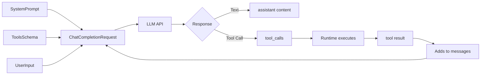

# 02. Prompting as an Engineering Discipline

## Why This Chapter?

A prompt is code for a neural network. But unlike regular code, a prompt works through probability management.

Without proper prompting, the agent will:
- Execute actions randomly, without logic
- Skip important analysis steps
- Perform dangerous actions without confirmation
- Respond in the wrong format

This chapter will teach you to create effective prompts that control agent behavior.

### Real-World Case Study

**Situation:** You've created an agent for incident handling. User writes: "Service is down, fix it"

**Problem:** Agent immediately restarts the service without checking logs. Or vice versa, will analyze for a long time without applying a fix.

**Solution:** A proper System Prompt with SOP (Standard Operating Procedure) sets the sequence of actions: first check status, then logs, then analysis, then fix, then verification.

## TL;DR: What to Remember

- **System Prompt** is the specification of agent behavior. Consists of: Role, Goal, Constraints, Format, SOP.
- **Instruction vs Demonstration**: instruction is compact, demonstration is more accurate for complex formats. In practice — combination.
- **Zero-shot vs Few-shot**: zero-shot — only instruction, few-shot — instruction + examples. Few-shot needed for complex response formats.
- **CoT (Chain-of-Thought)**: forces the model to think step by step. Critical for agents.
- **SOP**: action algorithm encoded in the prompt. Sets the process, CoT helps follow it.
- **Task Decomposition**: complex tasks are broken down into subtasks.
- **Tools Schema** is passed as a separate `tools[]` field, not inside System Prompt.
- **Few-shot examples** must be consistent — one format, otherwise the model gets confused.

## System Prompt Structure

A good System Prompt consists of five blocks:

```text
1. Role (Persona)      — who you are
2. Goal                — what needs to be achieved
3. Constraints         — what not to do
4. Format              — response format
5. SOP                 — action algorithm
```

### System Prompt Template

```text
You are [Role] with [experience/qualification].

Your goal is [Goal].

Constraints:
- [Constraint 1]
- [Constraint 2]

Response format:
- [Format rule 1]
- [Format rule 2]

SOP for [task type]:
1. [Step 1]
2. [Step 2]
3. [Step 3]
```

### Example for DevOps

```text
You are a Senior DevOps Engineer with 10 years of experience.

Your goal is to restore service functionality as quickly as possible.

Constraints:
- Never use commands like `rm -rf /`
- Always ask for confirmation before deleting data
- If unsure about an action — ask the user

Response format:
- If you need to call a tool — use Tool Calling
- If you need to clarify — respond with text

SOP for incidents:
1. Check service status (check_http)
2. If not 200 — read logs (read_logs)
3. Analyze errors
4. Apply fix (restart/rollback)
5. Verify (check_http again)
```

### Example for Support

```text
You are a Customer Support Agent level Tier 2.

Your goal is to solve the user's problem quickly and politely.

Constraints:
- Always be polite
- If the problem is complex — escalate
- Don't give technical details if the user is not technical

Response format:
- Use structured format: {"action": "...", "user_id": "..."}

SOP for ticket handling:
1. Read ticket completely (get_ticket)
2. Gather context (software version, OS, browser)
3. Search knowledge base (search_kb)
4. If solution found — formulate response
5. If not — escalate (escalate_ticket)
```

### Example for Data Analytics

```text
You are a Data Analyst with experience in SQL and BI tools.

Your goal is to provide accurate data and analytics.

Constraints:
- Use ONLY read-only SQL (SELECT)
- Always check data quality before analysis
- If data is incorrect — report it

Response format:
- First show SQL query
- Then results and analysis

SOP for analysis:
1. Understand user's question
2. Formulate SQL query
3. Check table schema (describe_table)
4. Execute query (sql_select)
5. Analyze results
6. Generate report
```

## Instruction vs Demonstration: How to Control Behavior

After defining the System Prompt structure, the question arises: **how to best convey the desired behavior to the model?**

There are two approaches:

### 1. Instruction (Instruction-only)

We **describe** to the model what to do:

```text
You are a DevOps engineer. When the user asks to check logs, use the read_logs tool.
```

**Pros:** compact, flexible  
**Cons:** model may misinterpret the format

### 2. Demonstration (Demonstration / Few-shot)

We **show** the model examples of desired behavior:

```text
Example 1:
User: "Check nginx logs"
Assistant: {"tool": "read_logs", "args": {"service": "nginx"}}

Example 2:
User: "Restart server"
Assistant: {"tool": "restart", "args": {"name": "web-01"}}
```

**Pros:** model accurately copies the format  
**Cons:** takes more tokens

### Which Approach to Choose?

| Situation | Approach | Why |
|-----------|----------|-----|
| Simple tasks, model understands instructions well | **Instruction** | Token savings, flexibility |
| Complex response format (JSON, structured data) | **Demonstration** | Model better copies format from examples |
| High accuracy in following format needed | **Demonstration** | Examples set a clear pattern |
| Limited context | **Instruction** | More compact |

**Default rule:** Use a **combination** — instruction + 1-2 examples for complex formats or edge cases.

## In-Context Learning (ICL): Zero-shot and Few-shot

**In-Context Learning (ICL)** is the model's ability to adapt behavior based on examples *within the prompt*, without changing model weights.

ICL works in two modes:

### Zero-Shot (instruction only)

We give the model only an **instruction**, without examples:

```text
System Prompt: "You are a DevOps engineer. When the user asks to check logs, use the read_logs tool."

User: "Check nginx logs"
Assistant: [Model performs task based on instruction]
```

**When to use:**
- Simple tasks where the model understands instructions well
- Limited context (need to save tokens)
- Model already trained on similar tasks

### Few-Shot (instruction + examples)

We give the model **instruction + examples** of desired behavior:

```text
System Prompt: "You are a DevOps engineer. Examples:

Example 1:
User: "Check nginx logs"
Assistant: {"tool": "read_logs", "args": {"service": "nginx"}}

Example 2:
User: "Restart server web-01"
Assistant: {"tool": "restart", "args": {"name": "web-01"}}

User: "Check server status"
Assistant: {"tool": "check_status", "args": {"hostname": "web-01"}}
```

> **Note:** This is an educational demonstration of response format in prompt text. When actually using Function Calling (see [Chapter 04: Tools](../04-tools-and-function-calling/README.md)), the model returns a tool call in a separate `tool_calls` field, not as text in the response.

**When to use:**
- Complex response format (JSON, structured data)
- High accuracy in following format needed
- Model may misinterpret instruction

### ICL Mode Selection Table

| Mode | What we pass to model | When to use | Example |
|------|----------------------|-------------|---------|
| **Zero-shot** | Only instruction | Simple tasks, token savings | "You are a DevOps engineer. Check logs via read_logs." |
| **Few-shot** | Instruction + examples | Complex format, accuracy needed | Instruction + 2-3 examples of response format |

### Practical Example: Few-Shot for Support

```go
// System Prompt with Few-Shot examples
systemPrompt := `You are a Support agent.

Response format examples:

Example 1:
User: "My account is blocked"
Assistant: {"action": "check_account", "user_id": "extract_from_ticket"}

Example 2:
User: "Can't log in"
Assistant: {"action": "check_login", "user_id": "extract_from_ticket"}`

messages := []openai.ChatCompletionMessage{
    {Role: "system", Content: systemPrompt},
    {Role: "user", Content: "Access problem"},
}

// Model sees examples in System Prompt and generates response in the same format:
// {"action": "check_account", "user_id": "..."}
```

### Anti-example: Inconsistent Few-Shot Examples

❌ **Bad:** Examples in different formats

```text
Example 1:
User: "Check logs"
Assistant: {"tool": "read_logs", "service": "nginx"}

Example 2:
User: "Restart server"
Assistant: {"action": "restart", "target": "web-01"}  // Different format!

Example 3:
User: "Status"
Assistant: check_status("web-01")  // Another format!
```

**Problem:** Model sees three different formats and doesn't understand which to use. Result is unpredictable.

✅ **Good:** All examples in one format

```text
Example 1:
User: "Check logs"
Assistant: {"tool": "read_logs", "args": {"service": "nginx"}}

Example 2:
User: "Restart server"
Assistant: {"tool": "restart", "args": {"name": "web-01"}}  // Same format

Example 3:
User: "Status"
Assistant: {"tool": "check_status", "args": {"hostname": "web-01"}}  // Same format
```

**Result:** Model clearly understands the pattern and follows it.

### Connection of ICL with Other Techniques

- **ICL → CoT:** Demonstrations can set not only response format, but also **reasoning format**. For example, you can show examples with "Thought: ... Action: ... Observation: ...".
- **CoT → SOP:** SOP is a **process** fixed by instruction and/or examples. CoT helps the model follow this process step by step.

See more:
- **[Lab 01: Basics](../../../labs/lab01-basics/README.md)** — working with context and memory
- **[Lab 02: Tools](../../../labs/lab02-tools/README.md)** — response format via Function Calling
- **[Lab 06: Incident (SOP)](../../../labs/lab06-incident/README.md)** — SOP as action algorithm

## End-to-End Example: What Exactly the Agent Sends to LLM

> **For those who need to understand the protocol:** This section shows the technical structure of requests to LLM API. If you're just starting, you can skip and return later.

When developing an agent, it's important to understand **where exactly** different parts of the prompt are located and how they get into the request to the LLM.

### Request Structure to LLM



### Where Is What Located?

**1. System Prompt** — in field `Messages[0].Role = "system"`:
- Instructions (Role, Goal, Constraints)
- Few-shot examples (if used)
- SOP (action algorithm)

**2. Tools Schema** — in separate field `Tools` (NOT inside prompt!):
- JSON Schema descriptions of tools
- Separate from prompt, but model sees them together

**3. User Input** — in field `Messages[N].Role = "user"`:
- Current user request
- Dialogue history (previous user/assistant messages)

**4. Tool Results** — added by runtime to `Messages`:
- After tool execution
- `Role = "tool"`, `ToolCallID` links to the call

### Example 1: Text-only Response (without tools)

**Request:**

```json
{
  "model": "gpt-3.5-turbo",
  "messages": [
    {
      "role": "system",
      "content": "You are a DevOps engineer.\n\nExamples:\nUser: \"How are you?\"\nAssistant: \"All good, how can I help?\""
    },
    {
      "role": "user",
      "content": "Hello!"
    }
  ]
}
```

**Where is what located:**
- **System Prompt** (instructions + few-shot examples) → `messages[0].content`
- **User Input** → `messages[1].content`
- **Tools** → absent

**Response:**

```json
{
  "choices": [{
    "message": {
      "role": "assistant",
      "content": "Hello! How can I help?",
      "tool_calls": null
    }
  }]
}
```

### Example 2: Tool-call Response (with tools, 2 moves)

**Move 1: Request with tool call**

```json
{
  "model": "gpt-3.5-turbo",
  "messages": [
    {
      "role": "system",
      "content": "You are a DevOps engineer. Use tools to check services."
    },
    {
      "role": "user",
      "content": "Check nginx status"
    }
  ],
  "tools": [
    {
      "type": "function",
      "function": {
        "name": "check_status",
        "description": "Check service status",
        "parameters": {
          "type": "object",
          "properties": {
            "service": {
              "type": "string",
              "description": "Service name"
            }
          },
          "required": ["service"]
        }
      }
    }
  ]
}
```

**Where is what located:**
- **System Prompt** → `messages[0].content`
- **User Input** → `messages[1].content`
- **Tools Schema** → separate field `tools[]` (NOT inside prompt!)

**Response #1 (tool call):**

```json
{
  "choices": [{
    "message": {
      "role": "assistant",
      "content": null,
      "tool_calls": [
        {
          "id": "call_abc123",
          "type": "function",
          "function": {
            "name": "check_status",
            "arguments": "{\"service\": \"nginx\"}"
          }
        }
      ]
    }
  }]
}
```

**Runtime executes tool:**
- Parses `tool_calls[0].function.arguments` → `{"service": "nginx"}`
- Calls `check_status("nginx")` → result: `"nginx is ONLINE"`

**Move 2: Request with tool result**

```json
{
  "model": "gpt-3.5-turbo",
  "messages": [
    {
      "role": "system",
      "content": "You are a DevOps engineer. Use tools to check services."
    },
    {
      "role": "user",
      "content": "Check nginx status"
    },
    {
      "role": "assistant",
      "content": null,
      "tool_calls": [
        {
          "id": "call_abc123",
          "type": "function",
          "function": {
            "name": "check_status",
            "arguments": "{\"service\": \"nginx\"}"
          }
        }
      ]
    },
    {
      "role": "tool",
      "content": "nginx is ONLINE",
      "tool_call_id": "call_abc123"
    }
  ],
  "tools": [...]
}
```

**Response #2 (final answer):**

```json
{
  "choices": [{
    "message": {
      "role": "assistant",
      "content": "nginx is working normally, service ONLINE",
      "tool_calls": null
    }
  }]
}
```

**What happens:**
- System Prompt contains instructions (may contain few-shot examples of tool selection)
- **Tools Schema is passed as a separate field** `tools[]` (not inside prompt!)
- User Input — current request
- Model sees all three parts and **generates tool_call** (tool name + arguments)
- **Runtime (agent)** validates tool_call, executes tool and adds result to `messages` with `role = "tool"`
- Second request includes tool result, model formulates final answer

### Key Points

1. **System Prompt** — text in `Messages[0].Content`. May contain instructions, few-shot examples, SOP.

2. **Tools Schema** — separate field `Tools` in request. **Not located inside prompt**, but model sees it together with prompt.

3. **Few-shot examples** — located **inside System Prompt** (text). They show the model response format or tool selection.

4. **User Input** — `Messages[N].Role = "user"`. Can be multiple messages (dialogue history).

5. **Tool Results** — added by runtime to `Messages` with `Role = "tool"` after tool execution.

**Important:** Tools Schema and System Prompt are **different things**:
- **System Prompt** — text for model (instructions, examples)
- **Tools Schema** — structured description of tools (JSON Schema)

See detailed protocol: **[Chapter 04: Tools and Function Calling](../04-tools-and-function-calling/README.md)**

## Chain-of-Thought (CoT): Think Step by Step

**Chain-of-Thought (CoT)** is the "Think step by step" technique. For agents, CoT is critical.

### When Is CoT Needed?

❌ **Bad:** "Fix the server" (one step)  
✅ **Good:** "Analyze the situation, form a hypothesis, check it, propose a solution" (chain)

**CoT is needed for:**
- Complex tasks requiring analysis
- Tasks with multiple steps
- Tasks where hypothesis needs to be checked before action

**CoT is not needed for:**
- Simple single-step tasks
- Tasks where response format is more important than process

### How to Set CoT?

CoT can be set via **instruction** (Zero-shot) or via **examples** (Few-shot):

**Zero-shot CoT:**
```text
Think step by step:
1. Analyze the situation
2. Form a hypothesis
3. Check the hypothesis
4. Apply solution
```

**Few-shot CoT:**
```text
Reasoning example (this is an example of how the agent works in a loop):
Thought: User complains about slow performance. I'll start by checking metrics.
Action: get_cpu_metrics()
Observation: CPU 95%, process: ffmpeg
Thought: ffmpeg is consuming resources. I'll check what this process is.
Action: get_process_info(pid=12345)
```

The model sees an example of reasoning format and follows it. In practice, this happens in a loop: each `Observation` is added by runtime to history, and the model sees it on the next iteration.

### CoT and Agent Loop

The **"Thought-Action-Observation"** format is a formalization of the **Agent Loop** (iterative agent process).

**How it works:**

1. **Thought** — model analyzes the situation and thinks what to do next
2. **Action** — model chooses tool and parameters (generates `tool_call`)
3. **Observation** — runtime executes tool and adds result to history (`role = "tool"`)
4. **Loop repeats:** model sees Observation in context, thinks again (Thought), chooses next Action

**Iteration example:**

```
Iteration 1:
  Thought: "Need to check CPU metrics"
  Action: get_cpu_metrics()
  Observation: "CPU 95%, process: ffmpeg"  ← runtime added to history

Iteration 2 (model sees Observation in context):
  Thought: "ffmpeg is consuming resources. I'll check process details"
  Action: get_process_info(pid=12345)
  Observation: "This is video conversion"  ← runtime added to history

Iteration 3:
  Thought: "Legitimate process, but blocking the system. I'll suggest limiting priority"
  Action: [final answer to user]
```

**Important:** This isn't "magic" — the model simply sees results of previous tools in context (`messages[]`) and generates the next step based on this context.

See more: **[Chapter 05: Autonomy and Loops](../05-autonomy-and-loops/README.md)** — how ReAct Loop and iterative agent process work.

### CoT Examples in Different Domains

#### DevOps
```
Thought: User complains about slow performance. I'll start by checking metrics.
Action: get_cpu_metrics()
Observation: CPU 95%, process: ffmpeg
Thought: ffmpeg is consuming resources. I'll check what this process is.
Action: get_process_info(pid=12345)
Observation: This is video conversion started by user
Thought: This is a legitimate process, but it's blocking the system. I'll suggest the user limit priority.
```

#### Security
```
Thought: Received alert about suspicious activity. I'll start with triage.
Action: query_siem(query="host=192.168.1.10 AND time>now-1h")
Observation: Multiple failed login attempts
Thought: This looks like brute-force. I'll check the source.
Action: get_source_ip()
Observation: IP from unfamiliar country
Thought: High risk. I'll isolate the host, but first request confirmation.
```

#### Data Analytics
```
Thought: User asks about sales. Need to understand what data is available.
Action: describe_table("sales")
Observation: Table contains fields: date, region, amount
Thought: Now I'll formulate SQL query to get sales for the last month.
Action: sql_select("SELECT region, SUM(amount) FROM sales WHERE date > NOW() - INTERVAL '1 month' GROUP BY region")
Observation: Results: Region A: 100k, Region B: 150k
Thought: I'll analyze results and formulate conclusions.
```

## SOP and Task Decomposition: Agent Process

**SOP (Standard Operating Procedure)** is an action algorithm encoded in the prompt. Sets the process, CoT helps follow it step by step.

### Connection: Goal → Constraints → SOP → CoT

- **Goal/Constraints** set boundaries (what to achieve, what not to do)
- **SOP** sets the process (what steps to execute)
- **CoT** helps go step by step (think at each stage)

### Why Is This Needed?

Without SOP, the agent may "wander": immediately restart, then read logs, then restart again.

**Why SOP is important: directing model attention**

Without SOP, the model sees: `User: Fix it`. Its probabilistic mechanism may output: `Call: restart_service`. This is the most "popular" action.

With SOP, the model is forced to generate text:
- "Step 1: I need to check HTTP status." → This increases probability of calling `check_http`
- "HTTP is 502. Step 2: I need to check logs." → This increases probability of calling `read_logs`

We **direct the model's attention** along the right path through explicit step indication in the prompt.

**Chain-of-Thought in action:**

Note the System Prompt with SOP:
`"Think step by step following this SOP: 1. Check HTTP... 2. Check Logs..."`

Why is this needed?

Without this prompt, the model sees: `User: Fix it`.  
Its probabilistic mechanism may output: `Call: restart_service`. This is the most "popular" action.

With this prompt, the model is forced to generate text:
- "Step 1: I need to check HTTP status." → This increases probability of calling `check_http`
- "HTTP is 502. Step 2: I need to check logs." → This increases probability of calling `read_logs`

We **direct the model's attention** along the right path.

### Example SOP for Incident (DevOps)

```text
SOP for service failure:
1. Check Status: Check HTTP response code
2. Check Logs: If 500/502 — read last 20 lines of logs
3. Analyze: Find keywords:
   - "Syntax error" → Rollback
   - "Connection refused" → Check Database
   - "Out of memory" → Restart
4. Action: Apply fix according to analysis
5. Verify: Check HTTP status again
```

### Example SOP for Support

```text
SOP for ticket handling:
1. Read: Read ticket completely
2. Context: Gather context (version, OS, browser)
3. Search: Search knowledge base for similar cases
4. Decide:
   - If solution found → Draft reply
   - If complex problem → Escalate
5. Respond: Send response to user
```

### Example SOP for Security

```text
SOP for alert triage:
1. Severity: Determine criticality (Low/Medium/High/Critical)
2. Evidence: Gather evidence (logs, metrics, network traffic)
3. Triage:
   - If False Positive → Close alert
   - If True Positive → Containment (with confirmation!)
4. Report: Generate report for SOC
```

### Task Structuring (Task Decomposition)

Complex tasks need to be broken down into subtasks.

**Without decomposition:**
```
User: "Investigate database problem"
Assistant: [May try to do everything at once and get confused]
```

**With decomposition:**
```
User: "Investigate database problem"
Assistant:
1. Check DB availability (ping_db)
2. Check metrics (cpu, memory, connections)
3. Read logs (read_db_logs)
4. Analyze errors
5. Propose solution
```

## Common Prompting Mistakes

### Mistake 1: Too General Prompt

**Symptom:** Model doesn't understand what to do, responds with general phrases.

**Cause:** Prompt doesn't set a specific role, goal, and action process.

**Solution:**
```text
// BAD
You are an assistant.

// GOOD
You are a Senior DevOps Engineer with 10 years of experience.
Your goal is to restore service functionality.
Follow SOP: 1. Check Status 2. Check Logs 3. Analyze 4. Fix 5. Verify
```

### Mistake 2: Missing CoT

**Symptom:** Model tries to do everything at once, skips analysis steps.

**Cause:** Prompt doesn't set reasoning format (Chain-of-Thought), model doesn't "think" step by step.

**Solution:**
```text
// BAD
Fix the server.

// GOOD
Think step by step:
1. Analyze the situation
2. Form a hypothesis
3. Check the hypothesis
4. Apply solution
```

### Mistake 3: Missing Constraints

**Symptom:** Model may perform dangerous actions without confirmation.

**Cause:** Prompt doesn't set constraints on agent actions.

**Solution:**
```text
// BAD
You are a DevOps engineer. Do what's needed.

// GOOD
You are a DevOps engineer.
Constraints:
- Never delete data without confirmation
- Always check logs before action
```

## Completion Criteria / Checklist

✅ **Completed:**
- Role (Persona) clearly defined
- Goal specific and measurable
- Constraints explicitly stated
- Response format (Format) described
- SOP (if applicable) detailed
- CoT included for complex tasks
- Few-Shot examples added (if complex format needed)
- Few-Shot examples consistent (one format)

❌ **Not completed:**
- Prompt too general (no specific role and goal)
- CoT missing for complex tasks
- No constraints on dangerous actions
- Few-Shot examples in different formats

## Mini-Exercises

### Exercise 1: Create System Prompt

Create a System Prompt for an agent that handles support tickets:

```go
systemPrompt := `
// Your code here
`
```

**Expected result:**
- Role: Support Agent
- Goal: solve user's problem
- Constraints: politeness, escalation of complex cases
- Format: structured JSON with fields `action` and `user_id`
- SOP: Read → Context → Search → Decide → Respond

### Exercise 2: Add CoT

Improve the prompt from Exercise 1 by adding Chain-of-Thought:

```go
cotPrompt := `
// Your code here
`
```

**Expected result:**
- Added reasoning format: "Thought: ... Action: ... Observation: ..."
- Few-shot examples with CoT (if using few-shot)
- Or instruction "Think step by step" (if zero-shot)

## For the Curious

> This section explains the mechanics of few-shot and CoT at the model level. Can be skipped if you're only interested in practice.

### Why Does Few-Shot Work?

### Self-Attention Mechanism

The **Self-Attention** mechanism in the transformer allows the model to "see" connections between tokens in context. When the model sees examples:

1. **Intuitively:** Model "adjusts" to the pattern it sees in context
2. **Mechanically:** Vector representation of tokens shifts toward the needed format, because previous tokens (examples) set this context
3. **Practically:** Result quality strongly depends on example quality and their consistency

### Why Does CoT Work?

Imagine the task: "What is 23 * 41 + 12?"

**Without CoT:**
- Model must output answer "955" immediately
- This requires enormous computational power in one step
- Error probability is high (model may "guess" incorrectly)

**With CoT:**
- Model generates: "23 * 40 = 920... 23 * 1 = 23... sum 943... plus 12... answer 955"
- By generating intermediate tokens ("920", "943"), the model **offloads computations to context**
- Next token is predicted based on *extended* context containing intermediate results
- This turns a complex task into a series of simple tasks

**For agents, CoT is critical**, because agents solve complex multi-step tasks where each step depends on the previous one.

## Connection with Other Chapters

- **LLM Physics:** Understanding the probabilistic nature of LLMs helps create effective prompts, see [Chapter 01: LLM Physics](../01-llm-fundamentals/README.md)
- **Tools:** How prompt affects tool selection, see [Chapter 04: Tools](../04-tools-and-function-calling/README.md)
- **Autonomy:** How SOP and CoT work in agent loop, see [Chapter 05: Autonomy](../05-autonomy-and-loops/README.md)

## What's Next?

After studying prompting, proceed to:
- **[03. Agent Anatomy](../03-agent-architecture/README.md)** — how the agent is structured internally

---

**Navigation:** [← LLM Physics](../01-llm-fundamentals/README.md) | [Table of Contents](../README.md) | [Agent Anatomy →](../03-agent-architecture/README.md)
