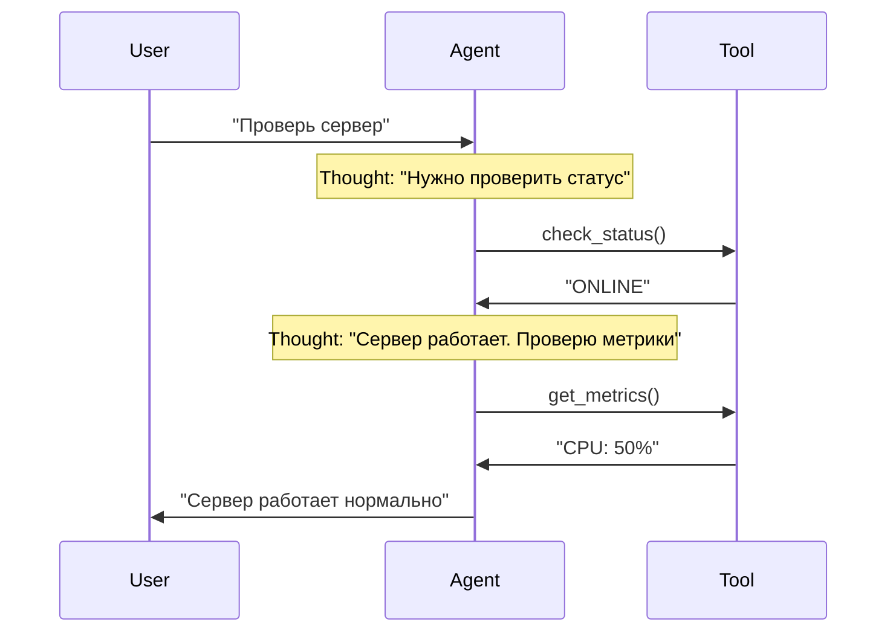

# 03. Анатомия агента — компоненты и их взаимодействие

Уравнение агента:

$$ Agent = LLM + Memory + Tools + Planning $$

## Memory (Память)

Агент должен "помнить" контекст разговора и историю действий.

### Short-term Memory (Краткосрочная память)

Это история сообщений (`messages` array). Ограничена контекстным окном.

**Структура сообщения:**

```go
type ChatCompletionMessage struct {
    Role    string  // "system", "user", "assistant", "tool"
    Content string  // Текст сообщения
    ToolCallID string  // Если это результат инструмента
}
```

**Пример истории:**

```go
messages := []ChatCompletionMessage{
    {Role: "system", Content: "Ты DevOps инженер"},
    {Role: "user", Content: "Проверь статус сервера"},
    {Role: "assistant", Content: "", ToolCalls: [...]},  // Вызов инструмента
    {Role: "tool", Content: "Server is ONLINE", ToolCallID: "call_123"},
    {Role: "assistant", Content: "Сервер работает нормально"},
}
```

**Проблема:** Если история слишком длинная, она не влезает в контекстное окно.

**Решение:** Обрезка истории (оставляем только последние N сообщений) или суммаризация старых сообщений.

### Long-term Memory (Долгосрочная память)

Это векторная база данных (RAG). Позволяет хранить гигабайты документов и находить нужное по смыслу (Semantic Search).

**Как это работает:**

1. Документы разбиваются на чанки (chunks)
2. Каждый чанк преобразуется в вектор (embedding)
3. При запросе агента ищутся похожие векторы
4. Релевантные чанки добавляются в контекст

**Примеры использования:**

- **DevOps:** Хранение регламентов, runbooks, документации по сервисам
- **Support:** База знаний с решениями типовых проблем
- **Data:** Схемы баз данных, документация по API
- **Security:** Playbooks для инцидентов, политики безопасности

См. [Глава 07: RAG](../07-rag/README.md)

## Planning (Планирование)

Способность разбить задачу "Сделай хорошо" на шаги.

### ReAct (Reason + Act)

Самая популярная архитектура. Формула: `Thought -> Action -> Observation`.



**Цикл ReAct:**

1. **Thought:** Модель генерирует CoT (план действий)
2. **Action:** Модель генерирует токен вызова инструмента
3. **Runtime:** Наш код перехватывает вызов, выполняет функцию, получает результат
4. **Observation:** Результат подается обратно в модель
5. **Loop:** Повторяем до тех пор, пока модель не решит, что задача решена

**Примеры ReAct в разных доменах:**

**DevOps:**
```
Thought: Пользователь жалуется на тормоза. Надо проверить CPU.
Action: get_cpu_metrics()
Observation: CPU 99% process: ffmpeg
Thought: ffmpeg жрет все. Надо его убить или ограничить.
Action: kill_process(pid=123)
```

**Support:**
```
Thought: Пользователь не может войти. Проверю статус аккаунта.
Action: check_account_status(user_id="12345")
Observation: Account is locked due to suspicious activity
Thought: Аккаунт заблокирован. Нужно разблокировать, но сначала проверю логи.
Action: check_security_logs(user_id="12345")
Observation: Multiple failed login attempts from unknown IP
Thought: Это похоже на взлом. Разблокирую, но отправлю уведомление о смене пароля.
Action: unlock_account(user_id="12345")
```

**Data Analytics:**
```
Thought: Пользователь спрашивает про продажи. Нужно понять структуру данных.
Action: describe_table("sales")
Observation: Таблица содержит: date, region, amount
Thought: Теперь сформулирую SQL-запрос.
Action: sql_select("SELECT region, SUM(amount) FROM sales GROUP BY region")
Observation: Region A: 100k, Region B: 150k
Thought: Проанализирую результаты и сформулирую выводы.
```

### Plan-and-Solve

Для сложных задач (Lab 06 Incident) ReAct может "заблудиться" в деталях.

**Архитектура:**

1. **Planner:** Сначала сгенерируй полный план
   ```
   План:
   1. Проверить HTTP статус
   2. Прочитать логи
   3. Проанализировать ошибки
   4. Применить фикс
   5. Верифицировать
   ```

2. **Solver:** Выполняй пункты плана по очереди

**Когда использовать Plan-and-Solve вместо ReAct?**

- Задача очень сложная (5+ шагов)
- Нужна гарантия, что все шаги будут выполнены
- Агент часто "забывает" про важные шаги

### Reflexion (Самокоррекция)

Агенты часто ошибаются. Reflexion добавляет шаг критики.

Цикл: `Act -> Observe -> Fail -> REFLECT -> Plan Again`

**Пример:**

```
Action: read_file("/etc/nginx/nginx.conf")
Observation: Permission denied
Reflection: "Я пытался прочитать файл, но получил Permission Denied. 
            Значит, у меня нет прав. В следующий раз надо использовать sudo 
            или проверить права доступа сначала."
Action: check_permissions("/etc/nginx/nginx.conf")
Observation: File is readable by root only
Action: read_file_sudo("/etc/nginx/nginx.conf")
```

## Runtime (Среда выполнения)

Runtime — это код, который связывает LLM с инструментами.

**Основные функции Runtime:**

1. **Парсинг ответов LLM:** Определение, хочет ли модель вызвать инструмент
2. **Выполнение инструментов:** Вызов реальных функций Go
3. **Управление историей:** Добавление результатов в контекст
4. **Управление циклом:** Определение, когда остановиться

**Пример простого Runtime:**

```go
func runAgent(ctx context.Context, client *openai.Client, userInput string) {
    messages := []openai.ChatCompletionMessage{
        {Role: "system", Content: systemPrompt},
        {Role: "user", Content: userInput},
    }
    
    for i := 0; i < maxIterations; i++ {
        resp, _ := client.CreateChatCompletion(ctx, openai.ChatCompletionRequest{
            Model: openai.GPT3Dot5Turbo,
            Messages: messages,
            Tools: tools,
        })
        
        msg := resp.Choices[0].Message
        messages = append(messages, msg)
        
        if len(msg.ToolCalls) == 0 {
            // Финальный ответ
            fmt.Println(msg.Content)
            break
        }
        
        // Выполняем инструменты
        for _, toolCall := range msg.ToolCalls {
            result := executeTool(toolCall.Function.Name, toolCall.Function.Arguments)
            messages = append(messages, openai.ChatCompletionMessage{
                Role: "tool",
                Content: result,
                ToolCallID: toolCall.ID,
            })
        }
    }
}
```

## Типовые проблемы архитектуры

### Проблема 1: История переполняется

**Симптом:** Агент "забывает" начало разговора.

**Решение:**
```go
// Обрезка истории
if len(messages) > maxHistoryLength {
    messages = append(
        []openai.ChatCompletionMessage{messages[0]},  // System
        messages[len(messages)-maxHistoryLength+1:]...,  // Последние
    )
}
```

### Проблема 2: Агент зацикливается

**Симптом:** Агент повторяет одно и то же действие.

**Решение:**
```go
// Лимит итераций
for i := 0; i < maxIterations; i++ {
    // ...
}

// Детекция застревания
if lastNActionsAreSame(history, 3) {
    break
}
```

## Чек-лист: Архитектура агента

- [ ] Short-term memory (история сообщений) управляется
- [ ] Long-term memory (RAG) настроена (если нужно)
- [ ] Planning (ReAct/Plan-and-Solve) реализован
- [ ] Runtime корректно парсит ответы LLM
- [ ] Runtime выполняет инструменты
- [ ] Runtime управляет циклом
- [ ] Есть защита от зацикливания

## Что дальше?

После изучения архитектуры переходите к:
- **[04. Инструменты и Function Calling](../04-tools-and-function-calling/README.md)** — как агент взаимодействует с реальным миром

---

**Навигация:** [← Промптинг](../02-prompt-engineering/README.md) | [Оглавление](../README.md) | [Инструменты →](../04-tools-and-function-calling/README.md)

