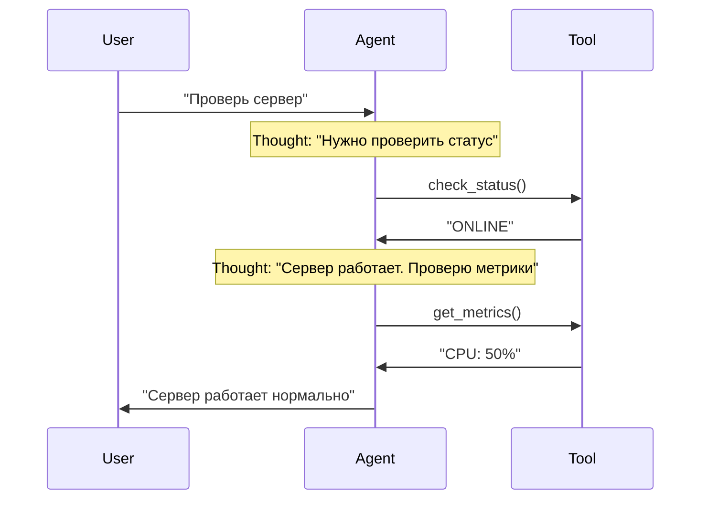

# 03. Анатомия агента — компоненты и их взаимодействие

Уравнение агента:

$$ Agent = LLM + Memory + Tools + Planning $$

## Memory (Память)

Агент должен "помнить" контекст разговора и историю действий.

### Short-term Memory (Краткосрочная память)

Это история сообщений (`messages` array). Ограничена контекстным окном.

**Структура сообщения:**

```go
type ChatCompletionMessage struct {
    Role    string  // "system", "user", "assistant", "tool"
    Content string  // Текст сообщения
    ToolCallID string  // Если это результат инструмента
}
```

**Пример истории:**

```go
messages := []ChatCompletionMessage{
    {Role: "system", Content: "Ты DevOps инженер"},
    {Role: "user", Content: "Проверь статус сервера"},
    {Role: "assistant", Content: "", ToolCalls: [...]},  // Вызов инструмента
    {Role: "tool", Content: "Server is ONLINE", ToolCallID: "call_123"},
    {Role: "assistant", Content: "Сервер работает нормально"},
}
```

**Проблема:** Если история слишком длинная, она не влезает в контекстное окно.

**Решение:** Обрезка истории (оставляем только последние N сообщений) или суммаризация старых сообщений.

### Long-term Memory (Долгосрочная память)

Это векторная база данных (RAG). Позволяет хранить гигабайты документов и находить нужное по смыслу (Semantic Search).

**Как это работает:**

1. Документы разбиваются на чанки (chunks)
2. Каждый чанк преобразуется в вектор (embedding)
3. При запросе агента ищутся похожие векторы
4. Релевантные чанки добавляются в контекст

**Примеры использования:**

- **DevOps:** Хранение регламентов, runbooks, документации по сервисам
- **Support:** База знаний с решениями типовых проблем
- **Data:** Схемы баз данных, документация по API
- **Security:** Playbooks для инцидентов, политики безопасности

См. [Глава 07: RAG](../07-rag/README.md)

## Planning (Планирование)

**Planning** — это способность агента разбить сложную задачу на последовательность простых шагов и выполнить их в правильном порядке.

### Зачем нужно планирование?

Представьте задачу: *"У нас проблемы с базой данных, разберись"*

**Без планирования:**
- Агент может попытаться сделать всё сразу и запутаться
- Агент может пропустить важные шаги
- Агент может выполнить шаги в неправильном порядке

**С планированием:**
- Агент сначала анализирует задачу
- Агент разбивает её на подзадачи
- Агент выполняет подзадачи последовательно
- Агент проверяет результат каждого шага

### Уровни планирования

#### Уровень 1: Имплицитное планирование (ReAct)

Агент не создает явный план, а планирует "на лету" в процессе выполнения.

**Как это работает:**
1. Агент получает задачу
2. Агент думает: "Что мне нужно сделать первым?"
3. Агент выполняет действие
4. Агент видит результат и думает: "Что делать дальше?"
5. Повторяет до завершения задачи

**Пример (DevOps):**
```
User: "Проверь, почему сервер медленно отвечает"

Итерация 1:
Thought: "Нужно проверить метрики сервера"
Action: get_cpu_metrics()
Observation: CPU 95%

Итерация 2:
Thought: "CPU высокий. Нужно посмотреть, какой процесс жрет ресурсы"
Action: get_top_processes()
Observation: Process: ffmpeg, CPU: 90%

Итерация 3:
Thought: "ffmpeg жрет CPU. Нужно проверить, что это за процесс"
Action: get_process_info(pid=12345)
Observation: Это видео-конвертация, запущенная пользователем

Итерация 4:
Thought: "Это легитимный процесс, но он блокирует систему. Предложу пользователю ограничить приоритет"
Action: [Финальный ответ пользователю]
```

**Преимущества:**
- Гибкость: агент может адаптироваться к результатам
- Простота реализации
- Подходит для задач средней сложности

**Недостатки:**
- Может "заблудиться" в деталях
- Может пропустить важные шаги
- Сложно отследить прогресс

#### Уровень 2: Явное планирование (Plan-and-Solve)

Агент сначала создает полный план, затем выполняет его по пунктам.

**Как это работает:**
1. Агент получает задачу
2. Агент генерирует полный план (список шагов)
3. Агент выполняет шаги по очереди
4. Агент отмечает выполненные шаги
5. Агент завершает, когда все шаги выполнены

**Пример (DevOps - Инцидент):**
```
User: "Сервис оплаты недоступен (502). Разберись"

Шаг 1: Планирование
Agent думает: "Нужно создать план расследования"
Agent генерирует план:
  1. Проверить HTTP статус сервиса
  2. Если не 200 — прочитать логи
  3. Проанализировать ошибки в логах
  4. Определить причину (config error / connection error / memory)
  5. Применить фикс (rollback / restart / scale)
  6. Верифицировать, что сервис восстановлен

Шаг 2: Выполнение
Agent: "Выполняю пункт 1: Проверяю HTTP статус"
Action: check_http_status("payment-service")
Observation: 502 Bad Gateway

Agent: "Выполняю пункт 2: Читаю логи"
Action: read_logs("payment-service", lines=50)
Observation: ERROR: Config syntax error in line 42

Agent: "Выполняю пункт 3: Анализирую ошибки"
Thought: "Логи показывают синтаксическую ошибку в конфиге. Это не временная проблема."

Agent: "Выполняю пункт 4: Определяю причину"
Thought: "Причина: Config error. Решение: Rollback"

Agent: "Выполняю пункт 5: Применяю фикс"
Action: rollback_deploy("payment-service", version="v1.9")
Observation: Rollback complete. Service restarted.

Agent: "Выполняю пункт 6: Верифицирую"
Action: check_http_status("payment-service")
Observation: 200 OK

Agent: "Все шаги выполнены. Инцидент решен."
```

**Преимущества:**
- Гарантия выполнения всех шагов
- Легко отследить прогресс
- Подходит для сложных задач (5+ шагов)

**Недостатки:**
- Менее гибкий: план может быть неоптимальным
- Требует больше токенов (генерация плана)
- Может быть избыточным для простых задач

#### Уровень 3: Иерархическое планирование (Hierarchical Planning)

Для очень сложных задач план разбивается на подпланы.

**Пример (Security - Расследование инцидента):**
```
Главная задача: "Расследовать подозрительную активность на хосте 192.168.1.10"

План верхнего уровня:
  1. Триаж алерта
  2. Сбор доказательств
  3. Анализ угрозы
  4. Принятие мер (containment)
  5. Генерация отчета

Подплан для шага 2 (Сбор доказательств):
  2.1. Запросить логи SIEM за последний час
  2.2. Проверить сетевой трафик
  2.3. Проверить метрики системы
  2.4. Проверить запущенные процессы
  2.5. Проверить файловую систему на изменения

Подплан для шага 3 (Анализ угрозы):
  3.1. Определить тип атаки
  3.2. Оценить критичность
  3.3. Определить scope (затронутые системы)
  3.4. Оценить ущерб
```

**Когда использовать:**
- Очень сложные задачи (10+ шагов)
- Задачи с множественными зависимостями
- Задачи, требующие координации нескольких специалистов

### Стратегии планирования

#### 1. ReAct (Reason + Act)

Самая популярная архитектура. Формула: `Thought -> Action -> Observation`.

Самая популярная архитектура. Формула: `Thought -> Action -> Observation`.



**Цикл ReAct:**

1. **Thought:** Модель генерирует CoT (план действий)
2. **Action:** Модель генерирует токен вызова инструмента
3. **Runtime:** Наш код перехватывает вызов, выполняет функцию, получает результат
4. **Observation:** Результат подается обратно в модель
5. **Loop:** Повторяем до тех пор, пока модель не решит, что задача решена

**Примеры ReAct в разных доменах:**

**DevOps:**
```
Thought: Пользователь жалуется на тормоза. Надо проверить CPU.
Action: get_cpu_metrics()
Observation: CPU 99% process: ffmpeg
Thought: ffmpeg жрет все. Надо его убить или ограничить.
Action: kill_process(pid=123)
```

**Support:**
```
Thought: Пользователь не может войти. Проверю статус аккаунта.
Action: check_account_status(user_id="12345")
Observation: Account is locked due to suspicious activity
Thought: Аккаунт заблокирован. Нужно разблокировать, но сначала проверю логи.
Action: check_security_logs(user_id="12345")
Observation: Multiple failed login attempts from unknown IP
Thought: Это похоже на взлом. Разблокирую, но отправлю уведомление о смене пароля.
Action: unlock_account(user_id="12345")
```

**Data Analytics:**
```
Thought: Пользователь спрашивает про продажи. Нужно понять структуру данных.
Action: describe_table("sales")
Observation: Таблица содержит: date, region, amount
Thought: Теперь сформулирую SQL-запрос.
Action: sql_select("SELECT region, SUM(amount) FROM sales GROUP BY region")
Observation: Region A: 100k, Region B: 150k
Thought: Проанализирую результаты и сформулирую выводы.
```

### Plan-and-Solve

Для сложных задач (Lab 06 Incident) ReAct может "заблудиться" в деталях.

**Архитектура:**

1. **Planner:** Сначала сгенерируй полный план
   ```
   План:
   1. Проверить HTTP статус
   2. Прочитать логи
   3. Проанализировать ошибки
   4. Применить фикс
   5. Верифицировать
   ```

2. **Solver:** Выполняй пункты плана по очереди

**Когда использовать Plan-and-Solve вместо ReAct?**

- Задача очень сложная (5+ шагов)
- Нужна гарантия, что все шаги будут выполнены
- Агент часто "забывает" про важные шаги
- Задача имеет четкую структуру (например, SOP для инцидентов)

**Реализация Plan-and-Solve:**

```go
func planAndSolve(ctx context.Context, client *openai.Client, task string) {
    // Шаг 1: Генерация плана
    planPrompt := fmt.Sprintf(`Разбей задачу на шаги:
Задача: %s

Создай план действий. Каждый шаг должен быть конкретным и выполнимым.`, task)
    
    planResp, _ := client.CreateChatCompletion(ctx, openai.ChatCompletionRequest{
        Model: openai.GPT4,
        Messages: []openai.ChatCompletionMessage{
            {Role: "system", Content: "Ты планировщик задач. Создавай детальные планы."},
            {Role: "user", Content: planPrompt},
        },
    })
    
    plan := planResp.Choices[0].Message.Content
    fmt.Printf("План:\n%s\n", plan)
    
    // Шаг 2: Выполнение плана
    executionPrompt := fmt.Sprintf(`Выполни план по шагам:
План:
%s

Выполняй шаги по очереди. После каждого шага сообщай о результате.`, plan)
    
    // Запускаем агента с планом в контексте
    runAgentWithPlan(ctx, client, executionPrompt, plan)
}
```

#### 3. Tree-of-Thoughts (ToT)

Агент рассматривает несколько вариантов решения и выбирает лучший.

**Как это работает:**
1. Агент генерирует несколько возможных путей решения
2. Агент оценивает каждый путь
3. Агент выбирает лучший путь
4. Агент выполняет выбранный путь

**Пример (Data Analytics):**
```
Задача: "Почему упали продажи в регионе X?"

Вариант 1: Проверить данные о продажах напрямую
  - Плюсы: Быстро
  - Минусы: Может не показать причину

Вариант 2: Проверить данные о продажах + маркетинговые кампании + конкурентов
  - Плюсы: Более полная картина
  - Минусы: Дольше

Вариант 3: Проверить качество данных сначала
  - Плюсы: Убедимся, что данные корректны
  - Минусы: Может быть избыточно

Агент выбирает Вариант 2 (наиболее полный)
```

**Когда использовать:**
- Задача имеет несколько возможных подходов
- Нужно выбрать оптимальный путь
- Важна эффективность решения

#### 4. Self-Consistency (Самосогласованность)

Агент генерирует несколько планов и выбирает наиболее согласованный.

**Как это работает:**
1. Агент генерирует N планов (например, 5)
2. Агент находит общие элементы во всех планах
3. Агент создает финальный план на основе общих элементов

**Пример:**
```
План 1: [A, B, C, D]
План 2: [A, B, E, F]
План 3: [A, C, D, G]
План 4: [A, B, C, H]
План 5: [A, B, D, I]

Общие элементы: A (всех 5), B (в 4 из 5), C (в 2 из 5)
Финальный план: [A, B, C, ...] (на основе наиболее частых элементов)
```

### Декомпозиция задач

#### Как правильно разбивать задачи?

**Принципы декомпозиции:**

1. **Атомарность:** Каждый шаг должен быть выполним одним действием
   - ❌ Плохо: "Проверить и починить сервер"
   - ✅ Хорошо: "Проверить статус сервера" → "Прочитать логи" → "Применить фикс"

2. **Зависимости:** Шаги должны выполняться в правильном порядке
   - ❌ Плохо: "Применить фикс" → "Прочитать логи"
   - ✅ Хорошо: "Прочитать логи" → "Проанализировать" → "Применить фикс"

3. **Проверяемость:** Каждый шаг должен иметь четкий критерий успеха
   - ❌ Плохо: "Улучшить производительность"
   - ✅ Хорошо: "Снизить CPU с 95% до 50%"

**Пример декомпозиции (Support):**

```
Исходная задача: "Обработать тикет пользователя о проблеме с входом"

Декомпозиция:
1. Прочитать тикет полностью
   - Критерий успеха: Получены все детали проблемы
   
2. Собрать контекст
   - Критерий успеха: Известны версия ПО, ОС, браузер
   
3. Поискать в базе знаний
   - Критерий успеха: Найдены похожие случаи или решение
   
4. Проверить статус аккаунта
   - Критерий успеха: Известен статус (активен/заблокирован)
   
5. Сформулировать ответ
   - Критерий успеха: Ответ готов и содержит решение
   
6. Отправить ответ или эскалировать
   - Критерий успеха: Тикет обработан
```

### Практические примеры планирования

#### Пример 1: DevOps - Расследование инцидента

```go
// Задача: "Сервис недоступен. Разберись."

// План (генерируется агентом):
plan := []string{
    "1. Проверить HTTP статус сервиса",
    "2. Если не 200 — прочитать логи",
    "3. Проанализировать ошибки",
    "4. Определить причину",
    "5. Применить фикс",
    "6. Верифицировать восстановление",
}

// Выполнение:
for i, step := range plan {
    fmt.Printf("Выполняю шаг %d: %s\n", i+1, step)
    result := executeStep(step)
    if !result.Success {
        fmt.Printf("Шаг %d провален: %s\n", i+1, result.Error)
        // Агент может перепланировать или эскалировать
        break
    }
}
```

#### Пример 2: Data Analytics - Анализ продаж

```go
// Задача: "Почему упали продажи в регионе X?"

// План:
plan := []string{
    "1. Проверить качество данных (nulls, duplicates)",
    "2. Получить данные о продажах за последний месяц",
    "3. Сравнить с предыдущим периодом",
    "4. Проверить маркетинговые кампании",
    "5. Проверить конкурентов",
    "6. Проанализировать тренды",
    "7. Сгенерировать отчет с выводами",
}
```

#### Пример 3: Security - Триаж алерта

```go
// Задача: "Алерт: подозрительная активность на хосте 192.168.1.10"

// План:
plan := []string{
    "1. Определить severity алерта",
    "2. Собрать доказательства (логи, метрики, трафик)",
    "3. Проанализировать паттерны атаки",
    "4. Определить scope (затронутые системы)",
    "5. Оценить критичность",
    "6. Принять решение (False Positive / True Positive)",
    "7. Если True Positive — containment (с подтверждением)",
    "8. Сгенерировать отчет для SOC",
}
```

### Типовые ошибки планирования

#### Ошибка 1: Слишком общий план

❌ **Плохо:**
```
План:
1. Разобраться с проблемой
2. Починить
3. Проверить
```

✅ **Хорошо:**
```
План:
1. Проверить HTTP статус сервиса (check_http)
2. Если 502 — прочитать последние 50 строк логов (read_logs)
3. Найти ключевые слова ошибок в логах
4. Если "Syntax error" — выполнить rollback (rollback_deploy)
5. Если "Connection refused" — перезапустить сервис (restart_service)
6. Верифицировать: проверить HTTP статус снова (check_http)
```

#### Ошибка 2: Неправильный порядок шагов

❌ **Плохо:**
```
1. Применить фикс
2. Прочитать логи
3. Проверить статус
```

✅ **Хорошо:**
```
1. Проверить статус
2. Прочитать логи
3. Применить фикс
```

#### Ошибка 3: Пропуск важных шагов

❌ **Плохо:**
```
1. Прочитать логи
2. Применить фикс
(Пропущен шаг верификации!)
```

✅ **Хорошо:**
```
1. Прочитать логи
2. Применить фикс
3. Верифицировать результат
```

### Чек-лист: Планирование

- [ ] Задача разбита на атомарные шаги
- [ ] Шаги выполняются в правильном порядке
- [ ] Каждый шаг имеет четкий критерий успеха
- [ ] План включает верификацию результата
- [ ] Выбран правильный уровень планирования (ReAct / Plan-and-Solve / Hierarchical)
- [ ] План адаптируется к результатам выполнения (для ReAct)

### ReAct (Reason + Act)

### Reflexion (Самокоррекция)

Агенты часто ошибаются. Reflexion добавляет шаг критики.

Цикл: `Act -> Observe -> Fail -> REFLECT -> Plan Again`

**Пример:**

```
Action: read_file("/etc/nginx/nginx.conf")
Observation: Permission denied
Reflection: "Я пытался прочитать файл, но получил Permission Denied. 
            Значит, у меня нет прав. В следующий раз надо использовать sudo 
            или проверить права доступа сначала."
Action: check_permissions("/etc/nginx/nginx.conf")
Observation: File is readable by root only
Action: read_file_sudo("/etc/nginx/nginx.conf")
```

## Runtime (Среда выполнения)

Runtime — это код, который связывает LLM с инструментами.

**Основные функции Runtime:**

1. **Парсинг ответов LLM:** Определение, хочет ли модель вызвать инструмент
2. **Выполнение инструментов:** Вызов реальных функций Go
3. **Управление историей:** Добавление результатов в контекст
4. **Управление циклом:** Определение, когда остановиться

**Пример простого Runtime:**

```go
func runAgent(ctx context.Context, client *openai.Client, userInput string) {
    messages := []openai.ChatCompletionMessage{
        {Role: "system", Content: systemPrompt},
        {Role: "user", Content: userInput},
    }
    
    for i := 0; i < maxIterations; i++ {
        resp, _ := client.CreateChatCompletion(ctx, openai.ChatCompletionRequest{
            Model: openai.GPT3Dot5Turbo,
            Messages: messages,
            Tools: tools,
        })
        
        msg := resp.Choices[0].Message
        messages = append(messages, msg)
        
        if len(msg.ToolCalls) == 0 {
            // Финальный ответ
            fmt.Println(msg.Content)
            break
        }
        
        // Выполняем инструменты
        for _, toolCall := range msg.ToolCalls {
            result := executeTool(toolCall.Function.Name, toolCall.Function.Arguments)
            messages = append(messages, openai.ChatCompletionMessage{
                Role: "tool",
                Content: result,
                ToolCallID: toolCall.ID,
            })
        }
    }
}
```

## Типовые проблемы архитектуры

### Проблема 1: История переполняется

**Симптом:** Агент "забывает" начало разговора.

**Решение:**
```go
// Обрезка истории
if len(messages) > maxHistoryLength {
    messages = append(
        []openai.ChatCompletionMessage{messages[0]},  // System
        messages[len(messages)-maxHistoryLength+1:]...,  // Последние
    )
}
```

### Проблема 2: Агент зацикливается

**Симптом:** Агент повторяет одно и то же действие.

**Решение:**
```go
// Лимит итераций
for i := 0; i < maxIterations; i++ {
    // ...
}

// Детекция застревания
if lastNActionsAreSame(history, 3) {
    break
}
```

## Чек-лист: Архитектура агента

- [ ] Short-term memory (история сообщений) управляется
- [ ] Long-term memory (RAG) настроена (если нужно)
- [ ] Planning (ReAct/Plan-and-Solve) реализован
- [ ] Runtime корректно парсит ответы LLM
- [ ] Runtime выполняет инструменты
- [ ] Runtime управляет циклом
- [ ] Есть защита от зацикливания

## Что дальше?

После изучения архитектуры переходите к:
- **[04. Инструменты и Function Calling](../04-tools-and-function-calling/README.md)** — как агент взаимодействует с реальным миром

---

**Навигация:** [← Промптинг](../02-prompt-engineering/README.md) | [Оглавление](../README.md) | [Инструменты →](../04-tools-and-function-calling/README.md)

