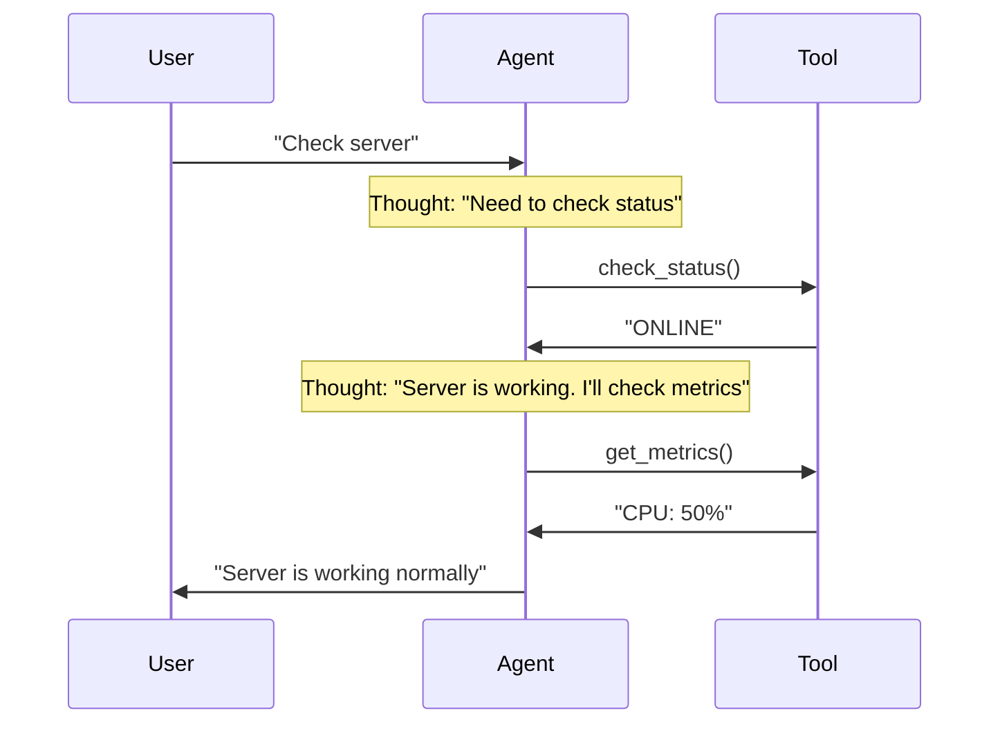

# 03. Agent Anatomy — Components and Their Interaction

## Why This Chapter?

An agent is not just an LLM with tools. It's a complex system with memory, planning, and runtime. Without understanding the architecture, you won't be able to:
- Properly manage context and dialogue history
- Implement an autonomous agent loop
- Optimize token usage
- Create an extensible system

This chapter explains agent components and how they interact with each other.

### Real-World Case Study

**Situation:** You've created a DevOps agent. After 20 messages, the agent "forgets" the start of the conversation and stops remembering the task context.

**Problem:** Dialogue history overflows the model's context window. Old messages are "pushed out", and the agent loses important information.

**Solution:** Understanding memory architecture allows implementing context optimization through summarization or message prioritization.

## Theory in Simple Terms

Agent equation:

$$ Agent = LLM + Memory + Tools + Planning $$

## Memory

The agent must "remember" conversation context and action history.

### Short-term Memory

This is the message history (`messages` array). Limited by the context window.

**Message structure:**

```go
type ChatCompletionMessage struct {
    Role    string  // "system", "user", "assistant", "tool"
    Content string  // Message text
    ToolCallID string  // If this is a tool result
}
```

**Example history:**

```go
messages := []ChatCompletionMessage{
    {Role: "system", Content: "You are a DevOps engineer"},
    {Role: "user", Content: "Check server status"},
    {Role: "assistant", Content: "", ToolCalls: [...]},  // Tool call
    {Role: "tool", Content: "Server is ONLINE", ToolCallID: "call_123"},
    {Role: "assistant", Content: "Server is working normally"},
}
```

**Problem:** If history is too long, it doesn't fit in the context window.

**Example problem:**

```go
// Context window: 4k tokens
// System Prompt: 200 tokens
// Dialogue history: 4000 tokens
// New request: 100 tokens
// TOTAL: 4300 tokens > 4000 ❌ ERROR!
```

### Context Optimization

When context is close to exhaustion, optimization techniques need to be applied.

#### Technique 1: Token Counting and Monitoring

**First step** — always know how many tokens are used:

```go
func estimateTokens(text string) int {
    // Approximate estimate: 1 token ≈ 4 characters (for English)
    // For Russian: 1 token ≈ 3 characters
    // IMPORTANT: This is an approximate estimate!
    // For accurate counting, use libraries:
    // - tiktoken (Python) - official OpenAI library
    // - github.com/pkoukk/tiktoken-go (Go) - tiktoken port
    return len(text) / 4
}

// Accurate counting using library (recommended)
import "github.com/pkoukk/tiktoken-go"

func countTokensAccurate(text string, model string) int {
    enc, _ := tiktoken.EncodingForModel(model)  // "gpt-3.5-turbo"
    tokens := enc.Encode(text, nil, nil)
    return len(tokens)
}

func countTokensInMessages(messages []openai.ChatCompletionMessage) int {
    total := 0
    for _, msg := range messages {
        total += estimateTokens(msg.Content)
        // Tool calls also take tokens (approximately 50-100 tokens per call)
        if len(msg.ToolCalls) > 0 {
            total += len(msg.ToolCalls) * 80
        }
    }
    return total
}

// Check before each request
func checkContextLimit(messages []openai.ChatCompletionMessage, maxTokens int) bool {
    used := countTokensInMessages(messages)
    return used < maxTokens*0.9  // Leave 10% reserve
}
```

#### Technique 2: History Truncation

**Simple solution:** Keep only the last N messages.

```go
func truncateHistory(messages []openai.ChatCompletionMessage, maxTokens int) []openai.ChatCompletionMessage {
    // Always keep System Prompt
    systemMsg := messages[0]
    
    // Process messages from the end
    result := []openai.ChatCompletionMessage{systemMsg}
    currentTokens := estimateTokens(systemMsg.Content)
    
    // Go from end and add messages until limit reached
    for i := len(messages) - 1; i > 0; i-- {
        msgTokens := estimateTokens(messages[i].Content)
        if currentTokens + msgTokens > maxTokens {
            break
        }
        result = append([]openai.ChatCompletionMessage{messages[i]}, result...)
        currentTokens += msgTokens
    }
    
    return result
}
```

**Truncation problem:** We lose important information from the start of the conversation.

#### Technique 3: Context Compression (Summarization)

**Better solution:** Compress old messages through summarization.

**How it works:**

```go
func compressOldMessages(messages []openai.ChatCompletionMessage, maxTokens int) []openai.ChatCompletionMessage {
    // 1. Count tokens
    totalTokens := countTokensInMessages(messages)
    
    if totalTokens < maxTokens {
        return messages  // Everything fits, do nothing
    }
    
    // 2. Split into "old" and "new" messages
    systemMsg := messages[0]
    oldMessages := messages[1 : len(messages)-10]  // All except last 10
    recentMessages := messages[len(messages)-10:]  // Last 10
    
    // 3. Compress old messages via LLM
    summary := summarizeMessages(oldMessages)
    
    // 4. Assemble new context
    compressed := []openai.ChatCompletionMessage{
        systemMsg,
        {
            Role:    "system",
            Content: fmt.Sprintf("Summary of previous conversation:\n%s", summary),
        },
    }
    compressed = append(compressed, recentMessages...)
    
    return compressed
}

func summarizeMessages(messages []openai.ChatCompletionMessage) string {
    // Form prompt for summarization
    conversation := ""
    for _, msg := range messages {
        conversation += fmt.Sprintf("%s: %s\n", msg.Role, msg.Content)
    }
    
    summaryPrompt := fmt.Sprintf(`Summarize this conversation, keeping only:
1. Important decisions made
2. Key facts discovered
3. Current state of the task

Conversation:
%s`, conversation)
    
    // Use LLM for summarization (can use another model with smaller context)
    resp, _ := client.CreateChatCompletion(ctx, openai.ChatCompletionRequest{
        Model: openai.GPT3Dot5Turbo,
        Messages: []openai.ChatCompletionMessage{
            {Role: "system", Content: "You are a conversation summarizer. Create concise summaries."},
            {Role: "user", Content: summaryPrompt},
        },
        Temperature: 0,
    })
    
    return resp.Choices[0].Message.Content
}
```

**Summarization example:**

```
Original history (2000 tokens):
- User: "Check server"
- Assistant: Called check_status
- Tool: "Server is ONLINE"
- User: "Check database"
- Assistant: Called check_db
- Tool: "Database is healthy"
- User: "Check logs"
- Assistant: Called read_logs
- Tool: "No errors found"
... (50 more messages)

Compressed version (200 tokens):
Summary: "User requested server, database, and log checks. All systems are healthy. 
No errors found in logs. Current task: monitoring system status."
```

**Summarization advantages:**
- Preserve important information
- Save tokens
- Model sees task context

#### Technique 4: Sliding Window

**Compromise:** Preserve start (important details) and end (current context), compress middle.

```go
func slidingWindowCompression(messages []openai.ChatCompletionMessage, maxTokens int) []openai.ChatCompletionMessage {
    systemMsg := messages[0]
    
    // Preserve first 5 messages (start of conversation)
    startMessages := messages[1:6]
    
    // Preserve last 10 messages (current context)
    endMessages := messages[len(messages)-10:]
    
    // Compress middle
    middleMessages := messages[6 : len(messages)-10]
    summary := summarizeMessages(middleMessages)
    
    // Assemble
    result := []openai.ChatCompletionMessage{systemMsg}
    result = append(result, startMessages...)
    result = append(result, openai.ChatCompletionMessage{
        Role:    "system",
        Content: fmt.Sprintf("Summary of middle conversation:\n%s", summary),
    })
    result = append(result, endMessages...)
    
    return result
}
```

#### Technique 5: Message Prioritization

**Smart solution:** Preserve important messages, remove less important ones.

```go
func prioritizeMessages(messages []openai.ChatCompletionMessage, maxTokens int) []openai.ChatCompletionMessage {
    // Important messages (always preserve):
    // - System Prompt
    // - Last user request
    // - Tool results (they may be important for next step)
    // - Error messages
    
    important := []openai.ChatCompletionMessage{messages[0]}  // System
    
    for i := 1; i < len(messages); i++ {
        msg := messages[i]
        
        // Always preserve last 5 messages
        if i >= len(messages)-5 {
            important = append(important, msg)
            continue
        }
        
        // Preserve tool results (they're important for context)
        if msg.Role == "tool" {
            important = append(important, msg)
            continue
        }
        
        // Preserve error messages
        if strings.Contains(strings.ToLower(msg.Content), "error") {
            important = append(important, msg)
            continue
        }
        
        // Others can be deleted or compressed
    }
    
    // If still doesn't fit - apply summarization
    if countTokensInMessages(important) > maxTokens {
        return compressOldMessages(important, maxTokens)
    }
    
    return important
}
```

#### When to Use Which Technique?

| Situation | Technique | When to use |
|-----------|-----------|-------------|
| Context almost full (80-90%) | Token counting + monitoring | Always |
| Simple tasks, history not important | Truncation | Quick one-time tasks |
| Long dialogues, history important | Summarization | Long sessions, contextual information important |
| Need balance | Sliding Window | Medium tasks, both start and end important |
| Critical tool results | Prioritization | When tool results are important for next steps |

#### Practical Example: Adaptive Context Management

```go
func adaptiveContextManagement(messages []openai.ChatCompletionMessage, maxTokens int) []openai.ChatCompletionMessage {
    usedTokens := countTokensInMessages(messages)
    threshold80 := int(float64(maxTokens) * 0.8)
    threshold90 := int(float64(maxTokens) * 0.9)
    
    if usedTokens < threshold80 {
        // All good, do nothing
        return messages
    } else if usedTokens < threshold90 {
        // Apply light optimization: prioritization
        return prioritizeMessages(messages, maxTokens)
    } else {
        // Critical! Apply summarization
        return compressOldMessages(messages, maxTokens)
    }
}

// Usage in agent loop
for i := 0; i < maxIterations; i++ {
    // Before each request, check and optimize context
    messages = adaptiveContextManagement(messages, maxContextTokens)
    
    resp, _ := client.CreateChatCompletion(ctx, openai.ChatCompletionRequest{
        Model:    openai.GPT3Dot5Turbo,
        Messages: messages,
        Tools:    tools,
    })
    
    // ... rest of code
}
```

#### Optimization Examples in Different Domains

**DevOps:**
```go
// Important to preserve:
// - Check results (check_status, check_logs)
// - Errors and their solutions
// - Current system state

// Can compress:
// - Repeated status checks
// - Successful operations without errors
```

**Support:**
```go
// Important to preserve:
// - Ticket details
// - Solutions from knowledge base
// - Current problem status

// Can compress:
// - Polite phrases
// - Repeated questions
```

**Data Analytics:**
```go
// Important to preserve:
// - Table schemas (describe_table results)
// - SQL queries and their results
// - Analysis conclusions

// Can compress:
// - Intermediate data quality checks
```

### Long-term Memory

This is a vector database (RAG). Allows storing gigabytes of documents and finding what's needed by meaning (Semantic Search).

**How it works:**

1. Documents are split into chunks
2. Each chunk is converted to a vector (embedding)
3. When agent queries, similar vectors are searched
4. Relevant chunks are added to context

**Usage examples:**

- **DevOps:** Storing regulations, runbooks, service documentation
- **Support:** Knowledge base with solutions to common problems
- **Data:** Database schemas, API documentation
- **Security:** Incident playbooks, security policies

See [Chapter 07: RAG](../07-rag/README.md)

## Planning

**Planning** is the agent's ability to break down a complex task into a sequence of simple steps and execute them in the correct order.

### Why Is Planning Needed?

Imagine the task: *"We have database problems, investigate"*

**Without planning:**
- Agent may try to do everything at once and get confused
- Agent may skip important steps
- Agent may execute steps in wrong order

**With planning:**
- Agent first analyzes the task
- Agent breaks it down into subtasks
- Agent executes subtasks sequentially
- Agent checks result of each step

### Planning Levels

#### Level 1: Implicit Planning (ReAct)

Agent doesn't create an explicit plan, but plans "on the fly" during execution.

**How it works:**
1. Agent receives task
2. Agent thinks: "What do I need to do first?"
3. Agent executes action
4. Agent sees result and thinks: "What to do next?"
5. Repeats until task completion

**Example (DevOps):**
```
User: "Check why server is responding slowly"

Iteration 1:
Thought: "Need to check server metrics"
Action: get_cpu_metrics()
Observation: CPU 95%

Iteration 2:
Thought: "CPU is high. Need to see which process is consuming resources"
Action: get_top_processes()
Observation: Process: ffmpeg, CPU: 90%

Iteration 3:
Thought: "ffmpeg is consuming CPU. Need to check what this process is"
Action: get_process_info(pid=12345)
Observation: This is video conversion started by user

Iteration 4:
Thought: "This is a legitimate process, but it's blocking the system. I'll suggest the user limit priority"
Action: [Final answer to user]
```

**Advantages:**
- Flexibility: agent can adapt to results
- Simple implementation
- Suitable for medium complexity tasks

**Disadvantages:**
- May "get lost" in details
- May skip important steps
- Hard to track progress

#### Level 2: Explicit Planning (Plan-and-Solve)

Agent first creates a full plan, then executes it point by point.

**How it works:**
1. Agent receives task
2. Agent generates full plan (list of steps)
3. Agent executes steps in order
4. Agent marks completed steps
5. Agent completes when all steps are done

**Example (DevOps - Incident):**
```
User: "Payment service unavailable (502). Investigate"

Step 1: Planning
Agent thinks: "Need to create investigation plan"
Agent generates plan:
  1. Check service HTTP status
  2. If not 200 — read logs
  3. Analyze errors in logs
  4. Determine cause (config error / connection error / memory)
  5. Apply fix (rollback / restart / scale)
  6. Verify service is restored

Step 2: Execution
Agent: "Executing step 1: Checking HTTP status"
Action: check_http_status("payment-service")
Observation: 502 Bad Gateway

Agent: "Executing step 2: Reading logs"
Action: read_logs("payment-service", lines=50)
Observation: ERROR: Config syntax error in line 42

Agent: "Executing step 3: Analyzing errors"
Thought: "Logs show syntax error in config. This is not a transient problem."

Agent: "Executing step 4: Determining cause"
Thought: "Cause: Config error. Solution: Rollback"

Agent: "Executing step 5: Applying fix"
Action: rollback_deploy("payment-service", version="v1.9")
Observation: Rollback complete. Service restarted.

Agent: "Executing step 6: Verifying"
Action: check_http_status("payment-service")
Observation: 200 OK

Agent: "All steps completed. Incident resolved."
```

**Advantages:**
- Guarantee all steps will be executed
- Easy to track progress
- Suitable for complex tasks (5+ steps)

**Disadvantages:**
- Less flexible: plan may be suboptimal
- Requires more tokens (plan generation)
- May be excessive for simple tasks

#### Level 3: Hierarchical Planning

For very complex tasks, the plan is broken down into sub-plans.

**Example (Security - Incident Investigation):**
```
Main task: "Investigate suspicious activity on host 192.168.1.10"

Top-level plan:
  1. Alert triage
  2. Evidence gathering
  3. Threat analysis
  4. Containment actions
  5. Report generation

Sub-plan for step 2 (Evidence gathering):
  2.1. Request SIEM logs for last hour
  2.2. Check network traffic
  2.3. Check system metrics
  2.4. Check running processes
  2.5. Check filesystem for changes

Sub-plan for step 3 (Threat analysis):
  3.1. Determine attack type
  3.2. Assess criticality
  3.3. Determine scope (affected systems)
  3.4. Assess damage
```

**When to use:**
- Very complex tasks (10+ steps)
- Tasks with multiple dependencies
- Tasks requiring coordination of multiple specialists

### Planning Strategies

#### 1. ReAct (Reason + Act)

Most popular architecture. Formula: `Thought -> Action -> Observation`.



**ReAct cycle:**

1. **Thought:** Model generates CoT (action plan)
2. **Action:** Model generates tool call token
3. **Runtime:** Our code intercepts call, executes function, gets result
4. **Observation:** Result is fed back to model
5. **Loop:** Repeat until model decides task is solved

**ReAct examples in different domains:**

**DevOps:**
```
Thought: User complains about slowness. Need to check CPU.
Action: get_cpu_metrics()
Observation: CPU 99% process: ffmpeg
Thought: ffmpeg is consuming everything. Need to kill or limit it.
Action: kill_process(pid=123)
```

**Support:**
```
Thought: User can't log in. I'll check account status.
Action: check_account_status(user_id="12345")
Observation: Account is locked due to suspicious activity
Thought: Account is locked. Need to unlock, but first I'll check logs.
Action: check_security_logs(user_id="12345")
Observation: Multiple failed login attempts from unknown IP
Thought: This looks like a hack. I'll unlock, but send password change notification.
Action: unlock_account(user_id="12345")
```

**Data Analytics:**
```
Thought: User asks about sales. Need to understand data structure.
Action: describe_table("sales")
Observation: Table contains: date, region, amount
Thought: Now I'll formulate SQL query.
Action: sql_select("SELECT region, SUM(amount) FROM sales GROUP BY region")
Observation: Region A: 100k, Region B: 150k
Thought: I'll analyze results and formulate conclusions.
```

### Plan-and-Solve

For complex tasks (Lab 06 Incident), ReAct may "get lost" in details.

**Architecture:**

1. **Planner:** First generate full plan
   ```
   Plan:
   1. Check HTTP status
   2. Read logs
   3. Analyze errors
   4. Apply fix
   5. Verify
   ```

2. **Solver:** Execute plan points in order

**When to use Plan-and-Solve instead of ReAct?**

- Task is very complex (5+ steps)
- Need guarantee all steps will be executed
- Agent often "forgets" important steps
- Task has clear structure (e.g., SOP for incidents)

**Plan-and-Solve implementation:**

```go
func planAndSolve(ctx context.Context, client *openai.Client, task string) {
    // Step 1: Plan generation
    planPrompt := fmt.Sprintf(`Break down the task into steps:
Task: %s

Create an action plan. Each step must be specific and executable.`, task)
    
    planResp, _ := client.CreateChatCompletion(ctx, openai.ChatCompletionRequest{
        Model: openai.GPT4,
        Messages: []openai.ChatCompletionMessage{
            {Role: "system", Content: "You are a task planner. Create detailed plans."},
            {Role: "user", Content: planPrompt},
        },
    })
    
    plan := planResp.Choices[0].Message.Content
    fmt.Printf("Plan:\n%s\n", plan)
    
    // Step 2: Plan execution
    executionPrompt := fmt.Sprintf(`Execute plan step by step:
Plan:
%s

Execute steps in order. After each step, report the result.`, plan)
    
    // Run agent with plan in context
    runAgentWithPlan(ctx, client, executionPrompt, plan)
}
```

#### 3. Tree-of-Thoughts (ToT)

Agent considers several solution options and chooses the best one.

**How it works:**
1. Agent generates several possible solution paths
2. Agent evaluates each path
3. Agent chooses best path
4. Agent executes chosen path

**Example (Data Analytics):**
```
Task: "Why did sales drop in region X?"

Option 1: Check sales data directly
  - Pros: Fast
  - Cons: May not show cause

Option 2: Check sales data + marketing campaigns + competitors
  - Pros: More complete picture
  - Cons: Longer

Option 3: Check data quality first
  - Pros: Ensure data is correct
  - Cons: May be excessive

Agent chooses Option 2 (most complete)
```

**When to use:**
- Task has several possible approaches
- Need to choose optimal path
- Solution efficiency is important

#### 4. Self-Consistency

Agent generates several plans and chooses the most consistent one.

**How it works:**
1. Agent generates N plans (e.g., 5)
2. Agent finds common elements in all plans
3. Agent creates final plan based on common elements

**Example:**
```
Plan 1: [A, B, C, D]
Plan 2: [A, B, E, F]
Plan 3: [A, C, D, G]
Plan 4: [A, B, C, H]
Plan 5: [A, B, D, I]

Common elements: A (all 5), B (4 of 5), C (2 of 5)
Final plan: [A, B, C, ...] (based on most frequent elements)
```

### Task Decomposition

#### How to Properly Break Down Tasks?

**Decomposition principles:**

1. **Atomicity:** Each step must be executable with one action
   - ❌ Bad: "Check and fix server"
   - ✅ Good: "Check server status" → "Read logs" → "Apply fix"

2. **Dependencies:** Steps must execute in correct order
   - ❌ Bad: "Apply fix" → "Read logs"
   - ✅ Good: "Read logs" → "Analyze" → "Apply fix"

3. **Verifiability:** Each step must have a clear success criterion
   - ❌ Bad: "Improve performance"
   - ✅ Good: "Reduce CPU from 95% to 50%"

**Decomposition example (Support):**

```
Original task: "Handle user ticket about login problem"

Decomposition:
1. Read ticket completely
   - Success criterion: Got all problem details
   
2. Gather context
   - Success criterion: Known software version, OS, browser
   
3. Search knowledge base
   - Success criterion: Found similar cases or solution
   
4. Check account status
   - Success criterion: Known status (active/locked)
   
5. Formulate response
   - Success criterion: Response ready and contains solution
   
6. Send response or escalate
   - Success criterion: Ticket processed
```

### Practical Planning Examples

#### Example 1: DevOps - Incident Investigation

```go
// Task: "Service unavailable. Investigate."

// Plan (generated by agent):
plan := []string{
    "1. Check service HTTP status",
    "2. If not 200 — read logs",
    "3. Analyze errors",
    "4. Determine cause",
    "5. Apply fix",
    "6. Verify recovery",
}

// Execution:
for i, step := range plan {
    fmt.Printf("Executing step %d: %s\n", i+1, step)
    result := executeStep(step)
    if !result.Success {
        fmt.Printf("Step %d failed: %s\n", i+1, result.Error)
        // Agent can replan or escalate
        break
    }
}
```

#### Example 2: Data Analytics - Sales Analysis

```go
// Task: "Why did sales drop in region X?"

// Plan:
plan := []string{
    "1. Check data quality (nulls, duplicates)",
    "2. Get sales data for last month",
    "3. Compare with previous period",
    "4. Check marketing campaigns",
    "5. Check competitors",
    "6. Analyze trends",
    "7. Generate report with conclusions",
}
```

#### Example 3: Security - Alert Triage

```go
// Task: "Alert: suspicious activity on host 192.168.1.10"

// Plan:
plan := []string{
    "1. Determine alert severity",
    "2. Gather evidence (logs, metrics, traffic)",
    "3. Analyze attack patterns",
    "4. Determine scope (affected systems)",
    "5. Assess criticality",
    "6. Make decision (False Positive / True Positive)",
    "7. If True Positive — containment (with confirmation)",
    "8. Generate report for SOC",
}
```

### Common Planning Mistakes

#### Mistake 1: Too General Plan

❌ **Bad:**
```
Plan:
1. Investigate problem
2. Fix
3. Check
```

✅ **Good:**
```
Plan:
1. Check service HTTP status (check_http)
2. If 502 — read last 50 lines of logs (read_logs)
3. Find error keywords in logs
4. If "Syntax error" — execute rollback (rollback_deploy)
5. If "Connection refused" — restart service (restart_service)
6. Verify: check HTTP status again (check_http)
```

#### Mistake 2: Wrong Step Order

❌ **Bad:**
```
1. Apply fix
2. Read logs
3. Check status
```

✅ **Good:**
```
1. Check status
2. Read logs
3. Apply fix
```

#### Mistake 3: Skipping Important Steps

❌ **Bad:**
```
1. Read logs
2. Apply fix
(Missing verification step!)
```

✅ **Good:**
```
1. Read logs
2. Apply fix
3. Verify result
```

### Checklist: Planning

- [ ] Task broken down into atomic steps
- [ ] Steps execute in correct order
- [ ] Each step has clear success criterion
- [ ] Plan includes result verification
- [ ] Correct planning level chosen (ReAct / Plan-and-Solve / Hierarchical)
- [ ] Plan adapts to execution results (for ReAct)

### Reflexion (Self-Correction)

Agents often make mistakes. Reflexion adds a criticism step.

Cycle: `Act -> Observe -> Fail -> REFLECT -> Plan Again`

**Example:**

```
Action: read_file("/etc/nginx/nginx.conf")
Observation: Permission denied
Reflection: "I tried to read the file, but got Permission Denied. 
            This means I don't have rights. Next time I should use sudo 
            or check access rights first."
Action: check_permissions("/etc/nginx/nginx.conf")
Observation: File is readable by root only
Action: read_file_sudo("/etc/nginx/nginx.conf")
```

## Runtime

Runtime is the code that connects LLM with tools.

**Main Runtime functions:**

1. **Parsing LLM responses:** Determining if model wants to call a tool
2. **Tool execution:** Calling real Go functions
3. **History management:** Adding results to context
4. **Loop management:** Determining when to stop

### Registry Pattern for Extensibility

To make the agent extensible, we shouldn't hardcode tool logic in `main.go`. We need the **Registry** pattern.

**Problem without Registry:**
- Adding a new tool requires changes in dozens of places
- Code becomes unreadable
- Hard to test individual tools

**Solution: Go Interfaces + Registry**

#### Defining Tool Interface

```go
type Tool interface {
    Name() string
    Description() string
    Parameters() json.RawMessage
    Execute(args json.RawMessage) (string, error)
}
```

Any tool (Proxmox, Ansible, SSH) must implement this interface.

#### Tool Implementation

```go
type ProxmoxListVMsTool struct{}

func (t *ProxmoxListVMsTool) Name() string {
    return "list_vms"
}

func (t *ProxmoxListVMsTool) Description() string {
    return "List all VMs in the Proxmox cluster"
}

func (t *ProxmoxListVMsTool) Parameters() json.RawMessage {
    return json.RawMessage(`{
        "type": "object",
        "properties": {},
        "required": []
    }`)
}

func (t *ProxmoxListVMsTool) Execute(args json.RawMessage) (string, error) {
    // Real Proxmox API call logic
    return "VM-100 (Running), VM-101 (Stopped)", nil
}
```

#### Registry (Tool Registry)

Registry is a storage of tools, accessible by name.

```go
type ToolRegistry struct {
    tools map[string]Tool
}

func NewToolRegistry() *ToolRegistry {
    return &ToolRegistry{
        tools: make(map[string]Tool),
    }
}

func (r *ToolRegistry) Register(tool Tool) {
    r.tools[tool.Name()] = tool
}

func (r *ToolRegistry) Get(name string) (Tool, bool) {
    tool, exists := r.tools[name]
    return tool, exists
}

func (r *ToolRegistry) ToOpenAITools() []openai.Tool {
    var result []openai.Tool
    for _, tool := range r.tools {
        result = append(result, openai.Tool{
            Type: openai.ToolTypeFunction,
            Function: &openai.FunctionDefinition{
                Name:        tool.Name(),
                Description: tool.Description(),
                Parameters:  tool.Parameters(),
            },
        })
    }
    return result
}
```

#### Using Registry

```go
// Initialization
registry := NewToolRegistry()
registry.Register(&ProxmoxListVMsTool{})
registry.Register(&AnsibleRunPlaybookTool{})

// Get list of tools for LLM
tools := registry.ToOpenAITools()

// Execute tool by name
toolCall := msg.ToolCalls[0]
if tool, exists := registry.Get(toolCall.Function.Name); exists {
    result, err := tool.Execute(json.RawMessage(toolCall.Function.Arguments))
    if err != nil {
        return fmt.Errorf("tool execution failed: %v", err)
    }
    // Add result to history
}
```

**Registry advantages:**
- ✅ Adding new tool — just implement interface and register
- ✅ Tool code is isolated and easily testable
- ✅ Runtime doesn't know about specific tools, works through interface
- ✅ Easy to add validation, logging, metrics at Registry level

**Runtime Example with Registry:**

```go
func runAgent(ctx context.Context, client *openai.Client, registry *ToolRegistry, userInput string) {
    messages := []openai.ChatCompletionMessage{
        {Role: "system", Content: systemPrompt},
        {Role: "user", Content: userInput},
    }
    
    tools := registry.ToOpenAITools()  // Get tool list from Registry
    
    for i := 0; i < maxIterations; i++ {
        resp, _ := client.CreateChatCompletion(ctx, openai.ChatCompletionRequest{
            Model: openai.GPT3Dot5Turbo,
            Messages: messages,
            Tools: tools,
        })
        
        msg := resp.Choices[0].Message
        messages = append(messages, msg)
        
        if len(msg.ToolCalls) == 0 {
            // Final answer
            fmt.Println(msg.Content)
            break
        }
        
        // Execute tools through Registry
        for _, toolCall := range msg.ToolCalls {
            tool, exists := registry.Get(toolCall.Function.Name)
            if !exists {
                result := fmt.Sprintf("Error: Unknown tool %s", toolCall.Function.Name)
                messages = append(messages, openai.ChatCompletionMessage{
                    Role: "tool",
                    Content: result,
                    ToolCallID: toolCall.ID,
                })
                continue
            }
            
            result, err := tool.Execute(json.RawMessage(toolCall.Function.Arguments))
            if err != nil {
                result = fmt.Sprintf("Error: %v", err)
            }
            
            messages = append(messages, openai.ChatCompletionMessage{
                Role: "tool",
                Content: result,
                ToolCallID: toolCall.ID,
            })
        }
    }
}
```

## Common Mistakes

### Mistake 1: History Overflows

**Symptom:** Agent "forgets" start of conversation. After N messages, stops remembering task context.

**Cause:** Dialogue history exceeds model's context window size. Old messages are "pushed out" of context.

**Solution:**
```go
// BAD: Simply truncate history (lose information)
if len(messages) > maxHistoryLength {
    messages = append(
        []openai.ChatCompletionMessage{messages[0]},  // System
        messages[len(messages)-maxHistoryLength+1:]...,  // Last ones
    )
}

// GOOD: Compress old messages through summarization
compressed := compressContext(messages, maxTokens)
```

See more: [Context Optimization](#context-optimization)

### Mistake 2: Agent Loops Infinitely

**Symptom:** Agent repeats the same action infinitely.

**Cause:** No iteration limit and detection of repeating actions.

**Solution:**
```go
// GOOD: Iteration limit + stuck detection
for i := 0; i < maxIterations; i++ {
    // ...
    
    // Stuck detection
    if lastNActionsAreSame(history, 3) {
        break
    }
}
```

### Mistake 3: Tool Result Not Added to History

**Symptom:** Agent doesn't see tool result and continues executing the same action.

**Cause:** Tool execution result not added to `messages[]`.

**Solution:**
```go
// BAD: Result not added
result := executeTool(toolCall)
// History not updated!

// GOOD: Result added to history
result := executeTool(toolCall)
messages = append(messages, openai.ChatCompletionMessage{
    Role:       openai.ChatMessageRoleTool,
    Content:    result,
    ToolCallID: toolCall.ID,
})
```

## Mini-Exercises

### Exercise 1: Token Counting in History

Implement a function to count tokens in message history:

```go
func countTokensInMessages(messages []openai.ChatCompletionMessage) int {
    // Count total tokens
    // Account for: Content, ToolCalls, system messages
}
```

**Expected result:**
- Function returns accurate token count
- Accounts for all message types (system, user, assistant, tool)

### Exercise 2: Context Optimization

Implement a function to compress context through summarization:

```go
func compressContext(messages []openai.ChatCompletionMessage, maxTokens int) []openai.ChatCompletionMessage {
    // If tokens less than maxTokens, return as is
    // Otherwise compress old messages through summarization
}
```

**Expected result:**
- System Prompt always remains first
- Old messages compressed via LLM
- Last N messages preserved completely

## Completion Criteria / Checklist

✅ **Completed:**
- Short-term memory (message history) managed
- Token counting and context monitoring implemented
- Context optimization applied (summarization/prioritization)
- Long-term memory (RAG) configured (if needed)
- Planning (ReAct/Plan-and-Solve) implemented
- Runtime correctly parses LLM responses
- Runtime executes tools
- Runtime manages loop
- Has protection against infinite loops

❌ **Not completed:**
- History overflows (no context optimization)
- Agent loops infinitely (no iteration limit)
- Tool results not added to history
- No token usage monitoring

## Connection with Other Chapters

- **LLM Physics:** Understanding context window helps manage memory, see [Chapter 01: LLM Physics](../01-llm-fundamentals/README.md)
- **Tools:** How Runtime executes tools, see [Chapter 04: Tools](../04-tools-and-function-calling/README.md)
- **Autonomy:** How Planning works in agent loop, see [Chapter 05: Autonomy](../05-autonomy-and-loops/README.md)

## What's Next?

After studying architecture, proceed to:
- **[04. Tools and Function Calling](../04-tools-and-function-calling/README.md)** — how the agent interacts with the real world

---

**Navigation:** [← Prompting](../02-prompt-engineering/README.md) | [Table of Contents](../README.md) | [Tools →](../04-tools-and-function-calling/README.md)
