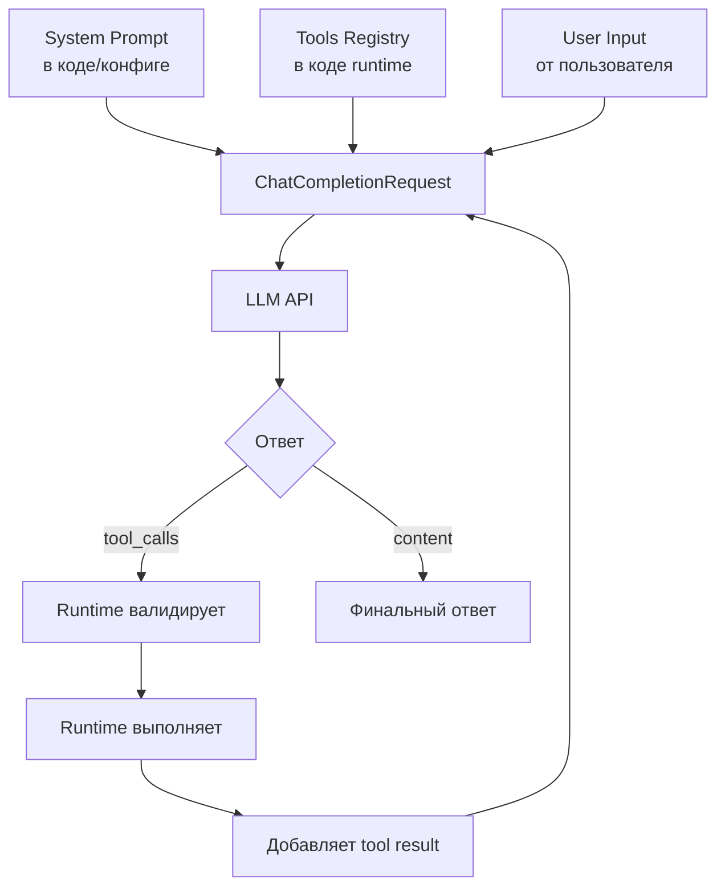

# 04. Инструменты и Function Calling — "руки" агента

Инструменты превращают LLM из болтуна в работника.

## Function Calling — механизм работы

**Function Calling** — это механизм, при котором LLM возвращает не текст, а структурированный JSON с именем функции и аргументами.

### Полный цикл: от определения до выполнения

Давайте разберем **полный цикл** на примере инструмента `ping`:

#### Шаг 1: Определение инструмента (Tool Schema)

```go
tools := []openai.Tool{
    {
        Type: openai.ToolTypeFunction,
        Function: &openai.FunctionDefinition{
            Name:        "ping",
            Description: "Ping a host to check connectivity",
            Parameters: json.RawMessage(`{
                "type": "object",
                "properties": {
                    "host": {
                        "type": "string",
                        "description": "Hostname or IP address to ping"
                    }
                },
                "required": ["host"]
            }`),
        },
    },
}
```

**Что происходит:** Мы описываем инструмент в формате JSON Schema. Это описание отправляется в модель вместе с запросом.

#### Шаг 2: Запрос к модели

```go
messages := []openai.ChatCompletionMessage{
    {Role: "system", Content: "You are a network admin. Use tools to check connectivity."},
    {Role: "user", Content: "Проверь доступность google.com"},
}

req := openai.ChatCompletionRequest{
    Model:    openai.GPT3Dot5Turbo,
    Messages: messages,
    Tools:    tools,  // Модель видит описание инструментов!
    Temperature: 0,
}

resp, _ := client.CreateChatCompletion(ctx, req)
msg := resp.Choices[0].Message
```

**Что происходит:** Модель видит:
- System prompt (роль и инструкции)
- User input (запрос пользователя)
- **Tools schema** (описание доступных инструментов)

#### Шаг 3: Ответ модели (Tool Call)

Модель **не возвращает текст** "Я проверю ping". Она возвращает **структурированный tool call**:

```go
// msg.ToolCalls содержит:
[]openai.ToolCall{
    {
        ID: "call_abc123",
        Type: "function",
        Function: openai.FunctionCall{
            Name:      "ping",
            Arguments: `{"host": "google.com"}`,
        },
    },
}
```

**Что происходит:** Модель выбрала инструмент `ping` и сгенерировала JSON с аргументами. Это **не магия** — модель видела `Description: "Ping a host to check connectivity"` и связала это с запросом пользователя.

**Как модель выбирает между несколькими инструментами?**

Давайте расширим пример, добавив несколько инструментов:

```go
tools := []openai.Tool{
    {
        Function: &openai.FunctionDefinition{
            Name:        "ping",
            Description: "Ping a host to check network connectivity. Use this when user asks about network reachability or connectivity.",
        },
    },
    {
        Function: &openai.FunctionDefinition{
            Name:        "check_http",
            Description: "Check HTTP status code of a website. Use this when user asks about website availability or HTTP errors.",
        },
    },
    {
        Function: &openai.FunctionDefinition{
            Name:        "traceroute",
            Description: "Trace the network path to a host. Use this when user asks about network routing or path analysis.",
        },
    },
}

userInput := "Проверь доступность google.com"
```

**Процесс выбора:**

1. Модель видит **все три инструмента** и их `Description`:
   - `ping`: "check network connectivity... Use this when user asks about network reachability"
   - `check_http`: "Check HTTP status... Use this when user asks about website availability"
   - `traceroute`: "Trace network path... Use this when user asks about routing"

2. Модель сопоставляет запрос "Проверь доступность google.com" с описаниями:
   - ✅ `ping` — описание содержит "connectivity" и "reachability" → **выбирает этот**
   - ❌ `check_http` — про HTTP статус, не про сетевую доступность
   - ❌ `traceroute` — про маршрутизацию, не про проверку доступности

3. Модель возвращает tool call для `ping`:
   ```json
   {"name": "ping", "arguments": "{\"host\": \"google.com\"}"}
   ```

**Пример с другим запросом:**

```go
userInput := "Проверь, отвечает ли сайт google.com"

// Модель видит те же 3 инструмента
// Сопоставляет:
// - ping: про сетевую доступность → не совсем то
// - check_http: "Use this when user asks about website availability" → ✅ ВЫБИРАЕТ ЭТОТ
// - traceroute: про маршрутизацию → не подходит

// Модель возвращает:
// {"name": "check_http", "arguments": "{\"url\": \"https://google.com\"}"}
```

**Ключевой момент:** Модель выбирает инструмент на основе **семантического соответствия** между запросом пользователя и `Description`. Чем точнее и конкретнее `Description`, тем лучше модель выбирает нужный инструмент.

#### Шаг 4: Валидация (Runtime)

```go
// Проверяем, что инструмент существует
if msg.ToolCalls[0].Function.Name != "ping" {
    return fmt.Errorf("unknown tool: %s", msg.ToolCalls[0].Function.Name)
}

// Валидируем JSON аргументов
var args struct {
    Host string `json:"host"`
}
if err := json.Unmarshal([]byte(msg.ToolCalls[0].Function.Arguments), &args); err != nil {
    return fmt.Errorf("invalid JSON: %v", err)
}

// Проверяем обязательные поля
if args.Host == "" {
    return fmt.Errorf("host is required")
}
```

**Что происходит:** Runtime валидирует вызов перед выполнением. Это **критично** для безопасности.

#### Шаг 5: Выполнение инструмента

```go
func executePing(host string) string {
    cmd := exec.Command("ping", "-c", "1", host)
    output, err := cmd.CombinedOutput()
    if err != nil {
        return fmt.Sprintf("Error: %s", err)
    }
    return string(output)
}

result := executePing(args.Host)  // "PING google.com: 64 bytes from ..."
```

**Что происходит:** Runtime выполняет **реальную функцию** (в данном случае системную команду `ping`).

#### Шаг 6: Возврат результата в модель

```go
// Добавляем результат в историю как сообщение с ролью "tool"
messages = append(messages, openai.ChatCompletionMessage{
    Role:       openai.ChatMessageRoleTool,
    Content:    result,  // "PING google.com: 64 bytes from ..."
    ToolCallID: msg.ToolCalls[0].ID,  // Связываем с вызовом
})

// Отправляем обновленную историю в модель снова
resp2, _ := client.CreateChatCompletion(ctx, openai.ChatCompletionRequest{
    Model:    openai.GPT3Dot5Turbo,
    Messages: messages,  // Теперь включает результат инструмента!
    Tools:    tools,
})
```

**Что происходит:** Модель видит результат выполнения инструмента и может:
- Сформулировать финальный ответ пользователю
- Вызвать другой инструмент, если нужно
- Задать уточняющий вопрос

#### Шаг 7: Финальный ответ

```go
finalMsg := resp2.Choices[0].Message
if len(finalMsg.ToolCalls) == 0 {
    // Это финальный текстовый ответ
    fmt.Println(finalMsg.Content)  // "google.com доступен, время отклика 10ms"
}
```

**Что происходит:** Модель видела результат `ping` и сформулировала понятный ответ для пользователя.

## Сквозной протокол: полный запрос и два хода

Теперь разберем **полный протокол** с точки зрения разработчика агента: где что хранится, как собирается запрос, и как runtime обрабатывает ответы.

### Где что хранится в коде агента?



**Схема хранения:**

1. **System Prompt** — хранится в коде агента (константа или конфиг):
   - Инструкции (Role, Goal, Constraints)
   - Few-shot примеры (если используются)
   - SOP (алгоритм действий)

2. **Tools Schema** — хранится в **registry runtime** (не в промпте!):
   - Определения инструментов (JSON Schema)
   - Функции-обработчики инструментов
   - Валидация и выполнение

3. **User Input** — приходит от пользователя:
   - Текущий запрос
   - История диалога (хранится в `messages[]`)

4. **Tool Results** — генерируются runtime'ом:
   - После выполнения инструмента
   - Добавляются в `messages[]` с `Role = "tool"`

### Полный пример: два хода (tool call → финальный ответ)

```go
package main

import (
    "context"
    "encoding/json"
    "fmt"
    "github.com/sashabaranov/go-openai"
)

// 1. System Prompt (хранится в коде агента)
const systemPrompt = `Ты DevOps инженер. Используй инструменты для проверки сервисов.

Примеры использования:
User: "Проверь статус nginx"
Agent: вызывает check_status("nginx")

User: "Перезапусти сервер"
Agent: вызывает restart_service("web-01")`

// 2. Tools Schema (хранится в registry runtime)
var tools = []openai.Tool{
    {
        Type: openai.ToolTypeFunction,
        Function: &openai.FunctionDefinition{
            Name:        "check_status",
            Description: "Check if a service is running. Use this when user asks about service status.",
            Parameters: json.RawMessage(`{
                "type": "object",
                "properties": {
                    "service": {"type": "string", "description": "Service name"}
                },
                "required": ["service"]
            }`),
        },
    },
    {
        Type: openai.ToolTypeFunction,
        Function: &openai.FunctionDefinition{
            Name:        "restart_service",
            Description: "Restart a systemd service. Use this when user explicitly asks to restart a service.",
            Parameters: json.RawMessage(`{
                "type": "object",
                "properties": {
                    "service_name": {"type": "string", "description": "Service name to restart"}
                },
                "required": ["service_name"]
            }`),
        },
    },
}

// 3. Функция-обработчик инструмента (хранится в registry runtime)
func executeCheckStatus(service string) string {
    // Реальная логика проверки статуса
    return fmt.Sprintf("Service %s is ONLINE", service)
}

func executeRestartService(serviceName string) string {
    // Реальная логика перезапуска
    return fmt.Sprintf("Service %s restarted successfully", serviceName)
}

func main() {
    ctx := context.Background()
    client := openai.NewClientWithConfig(openai.DefaultConfig("your-api-key"))

    // 4. User Input (приходит от пользователя)
    userInput := "Проверь статус nginx"

    // 5. Собираем первый запрос
    messages := []openai.ChatCompletionMessage{
        {Role: "system", Content: systemPrompt},  // ← System Prompt здесь
        {Role: "user", Content: userInput},        // ← User Input здесь
    }

    req := openai.ChatCompletionRequest{
        Model:    openai.GPT3Dot5Turbo,
        Messages: messages,
        Tools:    tools,  // ← Tools Schema здесь (отдельно от промпта!)
        ToolChoice: "auto",  // Модель сама решает, вызывать ли инструмент
    }

    // 6. Отправляем первый запрос
    resp, err := client.CreateChatCompletion(ctx, req)
    if err != nil {
        panic(err)
    }

    msg := resp.Choices[0].Message

    // 7. Проверяем ответ модели
    if len(msg.ToolCalls) > 0 {
        // Модель решила вызвать инструмент
        
        // 8. Валидация tool calls (runtime)
        for _, toolCall := range msg.ToolCalls {
            // Проверяем, что инструмент существует
            if toolCall.Function.Name != "check_status" && 
               toolCall.Function.Name != "restart_service" {
                panic(fmt.Sprintf("Unknown tool: %s", toolCall.Function.Name))
            }

            // Парсим аргументы
            var args map[string]interface{}
            if err := json.Unmarshal([]byte(toolCall.Function.Arguments), &args); err != nil {
                panic(fmt.Sprintf("Invalid JSON: %v", err))
            }

            // 9. Выполняем инструмент (runtime)
            var result string
            switch toolCall.Function.Name {
            case "check_status":
                service, _ := args["service"].(string)
                result = executeCheckStatus(service)
            case "restart_service":
                serviceName, _ := args["service_name"].(string)
                result = executeRestartService(serviceName)
            }

            // 10. Добавляем результат в messages (runtime)
            messages = append(messages, openai.ChatCompletionMessage{
                Role:       "assistant",
                Content:    "",  // Пусто, т.к. был tool call
                ToolCalls:  msg.ToolCalls,
            })
            messages = append(messages, openai.ChatCompletionMessage{
                Role:       "tool",
                Content:    result,                    // ← Tool Result здесь
                ToolCallID: toolCall.ID,              // Связываем с вызовом
            })
        }

        // 11. Отправляем второй запрос с результатом инструмента
        req2 := openai.ChatCompletionRequest{
            Model:    openai.GPT3Dot5Turbo,
            Messages: messages,  // Теперь включает tool result!
            Tools:    tools,
        }

        resp2, err := client.CreateChatCompletion(ctx, req2)
        if err != nil {
            panic(err)
        }

        finalMsg := resp2.Choices[0].Message
        fmt.Println("Final answer:", finalMsg.Content)
        // Output: "nginx работает нормально, сервис ONLINE"

    } else {
        // Модель вернула текстовый ответ (без инструментов)
        fmt.Println("Answer:", msg.Content)
    }
}
```

### Что реально возвращает LLM (JSON)

**Первый запрос — tool call:**

```json
{
  "id": "chatcmpl-abc123",
  "choices": [{
    "message": {
      "role": "assistant",
      "content": null,
      "tool_calls": [{
        "id": "call_xyz789",
        "type": "function",
        "function": {
          "name": "check_status",
          "arguments": "{\"service\": \"nginx\"}"
        }
      }]
    }
  }]
}
```

**Второй запрос — финальный ответ:**

```json
{
  "id": "chatcmpl-def456",
  "choices": [{
    "message": {
      "role": "assistant",
      "content": "nginx работает нормально, сервис ONLINE",
      "tool_calls": null
    }
  }]
}
```

### Эволюция messages[] массива

**До первого запроса:**
```go
messages = [
    {role: "system", content: "Ты DevOps инженер..."},
    {role: "user", content: "Проверь статус nginx"},
]
```

**После первого запроса (добавили tool call):**
```go
messages = [
    {role: "system", content: "Ты DevOps инженер..."},
    {role: "user", content: "Проверь статус nginx"},
    {role: "assistant", content: "", tool_calls: [{name: "check_status", ...}]},
]
```

**После выполнения инструмента (добавили tool result):**
```go
messages = [
    {role: "system", content: "Ты DevOps инженер..."},
    {role: "user", content: "Проверь статус nginx"},
    {role: "assistant", content: "", tool_calls: [...]},
    {role: "tool", content: "Service nginx is ONLINE", tool_call_id: "call_xyz789"},
]
```

**После второго запроса (модель видит tool result и формулирует ответ):**
```go
// Модель видит весь контекст и генерирует финальный ответ
// finalMsg.Content = "nginx работает нормально, сервис ONLINE"
```

### Ключевые моменты для разработчика

1. **System Prompt и Tools Schema — разные вещи:**
   - System Prompt — текст в `Messages[0].Content` (может содержать few-shot примеры)
   - Tools Schema — отдельное поле `Tools` в запросе (JSON Schema)

2. **Few-shot примеры — внутри System Prompt:**
   - Это текст, показывающий модели формат ответа или выбор инструментов
   - Отличается от Tools Schema (которая описывает структуру инструментов)

3. **Runtime управляет циклом:**
   - Валидирует `tool_calls`
   - Выполняет инструменты
   - Добавляет результаты в `messages`
   - Отправляет следующий запрос

4. **Tools не "внутри промпта":**
   - В API они передаются отдельным полем `Tools`
   - Модель видит их вместе с промптом, но это разные части запроса

См. как писать инструкции и примеры: **[Глава 02: Промптинг](../02-prompt-engineering/README.md)**

Практика: **[Lab 02: Tools](../../labs/lab02-tools/README.md)**, **[Lab 04: Autonomy](../../labs/lab04-autonomy/README.md)**

### Почему это не магия?

**Ключевые моменты:**

1. **Модель видит описание ВСЕХ инструментов** — она не "знает" про инструменты из коробки, она видит их `Description` в JSON Schema. Модель выбирает нужный инструмент, сопоставляя запрос пользователя с описаниями.

2. **Механизм выбора основан на семантике** — модель ищет соответствие между:
   - Запросом пользователя ("Проверь доступность")
   - Описанием инструмента ("Use this when user asks about network reachability")
   - Контекстом предыдущих результатов (если есть)

3. **Модель возвращает структурированный JSON** — это не текст "я вызову ping", а конкретный tool call с именем инструмента и аргументами

4. **Runtime делает всю работу** — парсинг, валидация, выполнение, возврат результата

5. **Модель видит результат** — она получает результат как новое сообщение в истории и продолжает работу

**Пример выбора между похожими инструментами:**

```go
tools := []openai.Tool{
    {
        Function: &openai.FunctionDefinition{
            Name:        "check_service_status",
            Description: "Check if a systemd service is running. Use this for Linux services like nginx, mysql, etc.",
        },
    },
    {
        Function: &openai.FunctionDefinition{
            Name:        "check_http_status",
            Description: "Check HTTP response code of a web service. Use this for checking if a website or API is responding.",
        },
    },
}

// Запрос 1: "Проверь статус nginx"
// Модель выбирает: check_service_status (nginx - это systemd service)

// Запрос 2: "Проверь, отвечает ли сайт example.com"
// Модель выбирает: check_http_status (сайт - это HTTP сервис)
```

**Важно:** Если описания инструментов слишком похожи или неясны, модель может выбрать неправильный инструмент. Поэтому `Description` должен быть **конкретным и различимым**.

**Пример определения инструмента:**

```go
tools := []openai.Tool{
    {
        Type: openai.ToolTypeFunction,
        Function: &openai.FunctionDefinition{
            Name:        "ping",
            Description: "Ping a host to check connectivity",
            Parameters: json.RawMessage(`{
                "type": "object",
                "properties": {
                    "host": {
                        "type": "string",
                        "description": "Hostname or IP address to ping"
                    }
                },
                "required": ["host"]
            }`),
        },
    },
}
```

**Важно:** `Description` — это самое важное поле! LLM ориентируется именно по нему, решая, какой инструмент вызвать.

## Примеры инструментов в разных доменах

### DevOps

```go
// Проверка статуса сервиса
{
    Name: "check_service_status",
    Description: "Check if a systemd service is running",
    Parameters: {"service_name": "string"}
}

// Перезапуск сервиса
{
    Name: "restart_service",
    Description: "Restart a systemd service. WARNING: This will cause downtime.",
    Parameters: {"service_name": "string"}
}

// Чтение логов
{
    Name: "read_logs",
    Description: "Read the last N lines of service logs",
    Parameters: {"service": "string", "lines": "number"}
}
```

### Support

```go
// Получение тикета
{
    Name: "get_ticket",
    Description: "Get ticket details by ID",
    Parameters: {"ticket_id": "string"}
}

// Поиск в базе знаний
{
    Name: "search_kb",
    Description: "Search knowledge base for solutions",
    Parameters: {"query": "string"}
}

// Черновик ответа
{
    Name: "draft_reply",
    Description: "Draft a reply to the ticket",
    Parameters: {"ticket_id": "string", "message": "string"}
}
```

### Data Analytics

```go
// SQL запрос (read-only!)
{
    Name: "sql_select",
    Description: "Execute a SELECT query on the database. ONLY SELECT queries allowed.",
    Parameters: {"query": "string"}
}

// Описание таблицы
{
    Name: "describe_table",
    Description: "Get table schema and column information",
    Parameters: {"table_name": "string"}
}

// Проверка качества данных
{
    Name: "check_data_quality",
    Description: "Check for nulls, duplicates, outliers in a table",
    Parameters: {"table_name": "string"}
}
```

### Security

```go
// Запрос к SIEM
{
    Name: "query_siem",
    Description: "Query security information and event management system",
    Parameters: {"query": "string", "time_range": "string"}
}

// Изоляция хоста (требует подтверждения!)
{
    Name: "isolate_host",
    Description: "CRITICAL: Isolate a host from the network. Requires confirmation.",
    Parameters: {"host": "string"}
}

// Проверка IP репутации
{
    Name: "check_ip_reputation",
    Description: "Check if an IP address is known malicious",
    Parameters: {"ip": "string"}
}
```

## Обработка ошибок инструментов

Если инструмент вернул ошибку, агент должен это увидеть и обработать.

**Пример:**

```go
// Агент вызывает ping("nonexistent-host")
result := ping("nonexistent-host")
// result = "Error: Name or service not known"

// Добавляем ошибку в историю
messages = append(messages, ChatCompletionMessage{
    Role:    "tool",
    Content: result,  // Модель увидит ошибку!
    ToolCallID: call.ID,
})

// Модель получит ошибку и может:
// 1. Попробовать другой хост
// 2. Сообщить пользователю о проблеме
// 3. Эскалировать проблему
```

**Важно:** Ошибка — это тоже результат! Не скрывайте ошибки от модели.

## Валидация вызова инструментов

Перед выполнением инструмента нужно валидировать аргументы.

**Пример валидации:**

```go
func executeTool(name string, args json.RawMessage) (string, error) {
    switch name {
    case "restart_service":
        var params struct {
            ServiceName string `json:"service_name"`
        }
        if err := json.Unmarshal(args, &params); err != nil {
            return "", fmt.Errorf("invalid args: %v", err)
        }
        
        // Валидация
        if params.ServiceName == "" {
            return "", fmt.Errorf("service_name is required")
        }
        
        // Проверка безопасности
        if params.ServiceName == "critical-db" {
            return "", fmt.Errorf("Cannot restart critical service without confirmation")
        }
        
        return restartService(params.ServiceName), nil
    }
    return "", fmt.Errorf("unknown tool: %s", name)
}
```

## Типовые проблемы

### Проблема 1: Модель не вызывает инструменты

**Симптом:** Агент отвечает текстом вместо вызова инструмента.

**Решение:**
- Используйте модель с поддержкой tools (Hermes-2-Pro, Llama-3-Instruct)
- Улучшите `Description` инструмента
- Добавьте Few-Shot примеры в промпт

### Проблема 2: Сломанный JSON в аргументах

**Симптом:** `json.Unmarshal` возвращает ошибку.

**Решение:**
- `Temperature = 0`
- Валидация JSON перед парсингом
- Использование structured output (если модель поддерживает)

### Проблема 3: Галлюцинации инструментов

**Симптом:** Агент вызывает несуществующий инструмент.

**Решение:**
- Явно указывайте список доступных инструментов в промпте
- Валидируйте имя инструмента перед выполнением

## Чек-лист: Создание инструментов

- [ ] `Description` конкретное и понятное
- [ ] JSON Schema корректна
- [ ] Обязательные поля указаны в `required`
- [ ] Валидация аргументов реализована
- [ ] Ошибки обрабатываются и возвращаются агенту
- [ ] Критические инструменты требуют подтверждения

## Связь с другими главами

- **Физика LLM:** Почему модель выбирает tool call вместо текста, см. [Главу 01: Физика LLM](../01-llm-fundamentals/README.md)
- **Промптинг:** Как описать инструменты так, чтобы модель их правильно использовала, см. [Главу 02: Промптинг](../02-prompt-engineering/README.md)
- **Цикл:** Как результаты инструментов возвращаются в модель, см. [Главу 05: Автономность](../05-autonomy-and-loops/README.md)

## Что дальше?

После изучения инструментов переходите к:
- **[05. Автономность и Циклы](../05-autonomy-and-loops/README.md)** — как агент работает в цикле

---

**Навигация:** [← Анатомия Агента](../03-agent-architecture/README.md) | [Оглавление](../README.md) | [Автономность →](../05-autonomy-and-loops/README.md)

