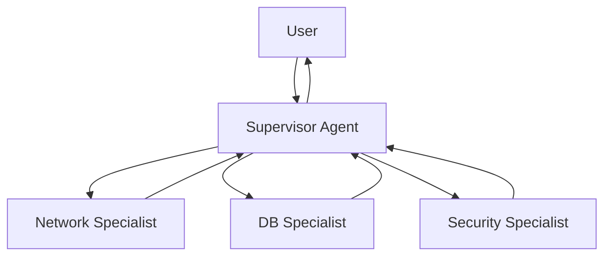

# 08. Multi-Agent Systems

Один агент "мастер на все руки" часто путается в инструментах. Эффективнее разделить ответственность: создать команду узких специалистов, управляемую главным агентом (Supervisor).

## Паттерн Supervisor (Начальник-Подчиненный)

**Архитектура:**

- **Supervisor:** Главный мозг. Не имеет инструментов, но знает, кто что умеет.
- **Workers:** Специализированные агенты с узким набором инструментов.

**Изоляция контекста:** Worker не видит всей переписки Supervisor-а, только свою задачу. Это экономит токены и фокусирует внимание.



## Пример для DevOps

```
Supervisor получает: "Проверь, доступен ли сервер БД, и если да — узнай версию"

Supervisor думает:
- Сначала нужно проверить сеть → делегирую Network Specialist
- Потом нужно проверить БД → делегирую DB Specialist

Network Specialist получает: "Проверь доступность db-host.example.com"
→ Вызывает ping("db-host.example.com")
→ Возвращает: "Host is reachable"

DB Specialist получает: "Какая версия PostgreSQL на db-host?"
→ Вызывает sql_query("SELECT version()")
→ Возвращает: "PostgreSQL 15.2"

Supervisor собирает результаты и отвечает пользователю
```

## Что дальше?

После изучения Multi-Agent переходите к:
- **[09. Evals и Надежность](../09-evals-and-reliability/README.md)** — как тестировать агентов

---

**Навигация:** [← RAG](../07-rag/README.md) | [Оглавление](../README.md) | [Evals →](../09-evals-and-reliability/README.md)

