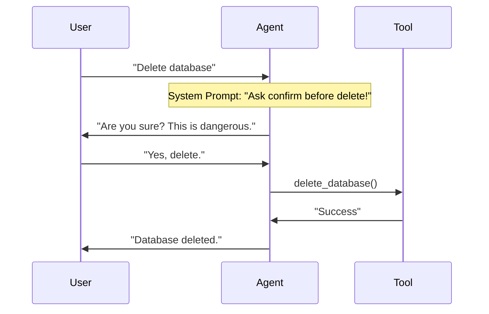

# Lab 05: Human-in-the-Loop (Clarification & Safety)

## Goal
Teach the agent not to be a "blind executor". The agent should be able to:
1.  **Ask questions** if information is missing (Slot Filling).
2.  **Request confirmation** before dangerous actions (Safety check).

## Theory
In Lab 04, our loop worked like: `User -> Loop(Think->Act->Think) -> Answer`.
But what if the Agent in the `Think` phase realizes it can't call a tool because it doesn't know the arguments? Or the tool is too dangerous?

In this case, the Agent should generate a **Text response** (Question), and the loop should break to give the User a turn.

**Interactive loop diagram:**

## Assignment
You have a set of tools: `delete_db(name)` and `send_email(to, subject, body)`.

1.  **System Prompt:** Configure the prompt so that the agent:
    *   Always asks for confirmation before `delete_db`.
    *   Always clarifies email subject if user didn't specify it.
2.  **Main Loop:** Use code from Lab 04, but wrap it in an infinite input loop (`while true`), like in Lab 01.
    *   If agent returns `ToolCall` -> execute, continue agent loop.
    *   If agent returns `Text` -> output to user, wait for input, continue chat loop.

## Testing Scenarios
1.  `"Delete database test_db"` -> Agent should ask "Are you sure?". -> You answer "Yes". -> Agent deletes.
2.  `"Send email to boss"` -> Agent should ask "What subject and text?". -> You answer. -> Agent sends.
