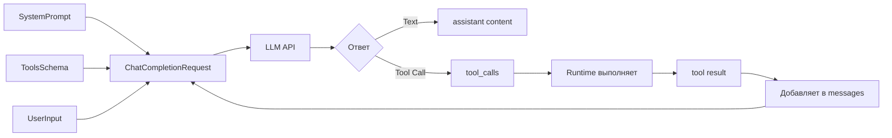

# 02. Промптинг как инженерная дисциплина

## Зачем это нужно?

Промпт — это код для нейросети. Но в отличие от обычного кода, промпт работает через управление вероятностями.

Без правильного промптинга агент будет:
- Выполнять действия случайно, без логики
- Пропускать важные шаги анализа
- Делать опасные действия без подтверждения
- Отвечать в неправильном формате

Эта глава научит вас создавать эффективные промпты, которые управляют поведением агента.

### Реальный кейс

**Ситуация:** Вы создали агента для обработки инцидентов. Пользователь пишет: "Упал сервис, почини"

**Проблема:** Агент сразу рестартит сервис, не проверив логи. Или наоборот, будет долго анализировать, не применяя фикс.

**Решение:** Правильный System Prompt с SOP (Standard Operating Procedure) задает последовательность действий: сначала проверка статуса, потом логи, потом анализ, потом фикс, потом верификация.

## TL;DR: Что нужно запомнить

- **System Prompt** — это спецификация поведения агента. Состоит из: Role, Goal, Constraints, Format, SOP.
- **In-Context Learning (ICL)**: Zero-shot (instruction-only) — компактно, гибко, но модель может неправильно интерпретировать формат. Few-shot (demonstration) — инструкция + примеры, точнее для сложных форматов. На практике — комбинация.
- **CoT (Chain-of-Thought)**: заставляет модель думать по шагам. Критичен для агентов.
- **SOP**: алгоритм действий, закодированный в промпте. Задает процесс, CoT помогает следовать ему.
- **Task Decomposition**: сложные задачи разбиваем на подзадачи.
- **Tools Schema** передается отдельным полем `tools[]`, не внутри System Prompt.
- **Few-shot примеры** должны быть согласованными — один формат, иначе модель запутается.

## Структура System Prompt

Хороший System Prompt состоит из пяти блоков:

```text
1. Role (Persona)      — кто ты
2. Goal (Цель)         — что нужно достичь
3. Constraints         — что нельзя делать
4. Format              — в каком формате отвечать
5. SOP                 — алгоритм действий
```

### Шаблон System Prompt

```text
Ты [Role] с [опыт/квалификация].

Твоя цель — [Goal].

Ограничения:
- [Constraint 1]
- [Constraint 2]

Формат ответа:
- [Format rule 1]
- [Format rule 2]

SOP для [тип задачи]:
1. [Шаг 1]
2. [Шаг 2]
3. [Шаг 3]
```

### Пример для DevOps

```text
Ты Senior DevOps Engineer с 10-летним опытом.

Твоя цель — восстановить работоспособность сервисов максимально быстро.

Ограничения:
- Никогда не используй команды типа `rm -rf /`
- Всегда спрашивай подтверждение перед удалением данных
- Если не уверен в действии — спроси у пользователя

Формат ответа:
- Если нужно вызвать инструмент — используй Tool Calling
- Если нужно уточнить — отвечай текстом

SOP для инцидентов:
1. Проверь статус сервиса (check_http)
2. Если не 200 — читай логи (read_logs)
3. Анализируй ошибки
4. Применяй фикс (restart/rollback)
5. Верифицируй (check_http снова)
```

### Пример для Support

```text
Ты Customer Support Agent уровня Tier 2.

Твоя цель — решить проблему пользователя быстро и вежливо.

Ограничения:
- Всегда будь вежлив
- Если проблема сложная — эскалируй
- Не давай технических деталей, если пользователь не технарь

Формат ответа:
- Используй структурированный формат: {"action": "...", "user_id": "..."}

SOP для обработки тикета:
1. Прочитай тикет полностью (get_ticket)
2. Собери контекст (версия ПО, ОС, браузер)
3. Поищи в базе знаний (search_kb)
4. Если решение найдено — сформулируй ответ
5. Если нет — эскалируй (escalate_ticket)
```

### Пример для Data Analytics

```text
Ты Data Analyst с опытом работы с SQL и BI-инструментами.

Твоя цель — предоставить точные данные и аналитику.

Ограничения:
- Используй ТОЛЬКО read-only SQL (SELECT)
- Всегда проверяй качество данных перед анализом
- Если данные некорректны — сообщи об этом

Формат ответа:
- Сначала покажи SQL-запрос
- Затем результаты и анализ

SOP для анализа:
1. Понять вопрос пользователя
2. Сформулировать SQL-запрос
3. Проверить схему таблицы (describe_table)
4. Выполнить запрос (sql_select)
5. Проанализировать результаты
6. Сгенерировать отчет
```

## In-Context Learning (ICL): Zero-shot и Few-shot

После того, как мы определили структуру System Prompt, возникает вопрос: **как лучше передать модели нужное поведение?**

**In-Context Learning (ICL)** — это способность модели адаптировать поведение на основе примеров *внутри промпта*, без изменения весов модели.

ICL работает в двух режимах:

### Zero-Shot (только инструкция)

Даем модели только **инструкцию**, без примеров:

```text
System Prompt: "Ты DevOps инженер. Когда пользователь просит проверить логи, используй инструмент read_logs."

User: "Проверь логи nginx"
Assistant: [Модель выполняет задачу на основе инструкции]
```

**Когда использовать:**
- Простые задачи, где модель хорошо понимает инструкции
- Ограниченный контекст (нужно экономить токены)
- Модель уже обучена на похожих задачах

### Few-Shot (инструкция + примеры)

Даем модели **инструкцию + примеры** желаемого поведения:

```text
System Prompt: "Ты DevOps инженер. Примеры:

Пример 1:
User: "Проверь логи nginx"
Assistant: {"tool": "read_logs", "args": {"service": "nginx"}}

Пример 2:
User: "Перезапусти сервер web-01"
Assistant: {"tool": "restart", "args": {"name": "web-01"}}

User: "Проверь статус сервера"
Assistant: {"tool": "check_status", "args": {"hostname": "web-01"}}
```

> **Примечание:** Это учебная демонстрация формата ответа в тексте промпта. При реальном использовании Function Calling (см. [Главу 03: Инструменты](../03-tools-and-function-calling/README.md)) модель возвращает вызов инструмента в отдельном поле `tool_calls`, а не как текст в ответе.

**Когда использовать:**
- Сложный формат ответа (JSON, структурированные данные)
- Нужна высокая точность следования формату
- Модель может неправильно интерпретировать инструкцию

### Терминология: Инструкция vs Демонстрация

Термины **Instruction-only** (только инструкция) и **Demonstration** (демонстрация) или **Few-shot** — это альтернативные способы описания тех же режимов ICL:

- **Instruction-only** = **Zero-shot**: Мы **описываем** модели, что делать (компактно, гибко, но модель может неправильно интерпретировать формат)
- **Demonstration/Few-shot** = **Few-shot**: Мы **показываем** модели примеры желаемого поведения (модель точно копирует формат, но занимает больше токенов)

**Правило по умолчанию:** Используйте **комбинацию** — инструкция + 1-2 примера для сложных форматов или краевых случаев.

### Таблица выбора режима ICL

| Режим | Что передаем модели | Когда использовать | Пример |
|-------|-------------------|-------------------|--------|
| **Zero-shot** (Instruction-only) | Только инструкция | Простые задачи, модель хорошо понимает инструкции, ограниченный контекст, экономия токенов | "Ты DevOps инженер. Проверяй логи через read_logs." |
| **Few-shot** (Demonstration) | Инструкция + примеры | Сложный формат ответа (JSON, структурированные данные), нужна высокая точность следования формату | Инструкция + 2-3 примера формата ответа |

### Практический пример: Few-Shot для Support

```go
// System Prompt с Few-Shot примерами
systemPrompt := `Ты Support агент.

Примеры формата ответа:

Пример 1:
User: "Мой аккаунт заблокирован"
Assistant: {"action": "check_account", "user_id": "extract_from_ticket"}

Пример 2:
User: "Не могу войти в систему"
Assistant: {"action": "check_login", "user_id": "extract_from_ticket"}`

messages := []openai.ChatCompletionMessage{
    {Role: "system", Content: systemPrompt},
    {Role: "user", Content: "Проблема с доступом"},
}

// Модель видит примеры в System Prompt и генерирует ответ в том же формате:
// {"action": "check_account", "user_id": "..."}
```

### Антипример: Несогласованные Few-Shot примеры

❌ **Плохо:** Примеры в разных форматах

```text
Пример 1:
User: "Проверь логи"
Assistant: {"tool": "read_logs", "service": "nginx"}

Пример 2:
User: "Перезапусти сервер"
Assistant: {"action": "restart", "target": "web-01"}  // Разный формат!

Пример 3:
User: "Статус"
Assistant: check_status("web-01")  // Еще один формат!
```

**Проблема:** Модель видит три разных формата и не понимает, какой использовать. Результат непредсказуем.

✅ **Хорошо:** Все примеры в одном формате

```text
Пример 1:
User: "Проверь логи"
Assistant: {"tool": "read_logs", "args": {"service": "nginx"}}

Пример 2:
User: "Перезапусти сервер"
Assistant: {"tool": "restart", "args": {"name": "web-01"}}  // Тот же формат

Пример 3:
User: "Статус"
Assistant: {"tool": "check_status", "args": {"hostname": "web-01"}}  // Тот же формат
```

**Результат:** Модель четко понимает паттерн и следует ему.

!!! warning "Few-shot задаёт не только формат, но и скрытые подсказки"
    Примеры в few-shot могут не только показывать формат ответа, но и **неявно подсказывать желаемый вывод**. Модель может "подхватить" паттерн из примеров и сместить ответ в сторону того, что показано в демонстрациях, даже если это не соответствует реальным данным или задаче.
    
    **Проблема:** Если в примерах правильный ответ всегда в позиции "A", или все примеры ведут к одному типу решения, модель может перенять этот позиционный или тематический биас.
    
    **Решение:** Используйте разнообразные примеры, перемешивайте позиции правильных ответов, включайте контрпримеры. См. раздел ["Как не подсказывать модели ответ"](#как-не-подсказывать-модели-ответ) ниже.

### Связь ICL с другими техниками

- **ICL → CoT:** Демонстрации могут задавать не только формат ответа, но и **формат рассуждения**. Например, можно показать примеры с "Thought: ... Action: ... Observation: ...".
- **CoT → SOP:** SOP — это **процесс**, закрепленный инструкцией и/или примерами. CoT помогает модели следовать этому процессу шаг за шагом.

См. подробнее:
- **[Lab 01: Basics](../../labs/lab01-basics/README.md)** — работа с контекстом и памятью
- **[Lab 02: Tools](../../labs/lab02-tools/README.md)** — формат ответов через Function Calling
- **[Lab 06: Incident (SOP)](../../labs/lab06-incident/README.md)** — SOP как алгоритм действий

## Сквозной пример: что именно отправляет агент в LLM

> **Для тех, кому нужно понимать протокол:** Этот раздел показывает техническую структуру запросов к LLM API. Если вы только начинаете, можете пропустить и вернуться позже.

Когда мы разрабатываем агента, важно понимать, **где именно** находятся разные части промпта и как они попадают в запрос к LLM.

### Структура запроса к LLM



### Где что находится?

**1. System Prompt** — в поле `Messages[0].Role = "system"`:
- Инструкции (Role, Goal, Constraints)
- Few-shot примеры (если используются)
- SOP (алгоритм действий)

**2. Tools Schema** — в отдельном поле `Tools` (НЕ внутри промпта!):
- JSON Schema описания инструментов
- Отдельно от промпта, но модель видит их вместе

**3. User Input** — в поле `Messages[N].Role = "user"`:
- Текущий запрос пользователя
- История диалога (предыдущие user/assistant сообщения)

**4. Tool Results** — добавляются runtime'ом в `Messages`:
- После выполнения инструмента
- `Role = "tool"`, `ToolCallID` связывает с вызовом

### Пример 1: Text-only ответ (без инструментов)

**Request:**

```json
{
  "model": "gpt-3.5-turbo",
  "messages": [
    {
      "role": "system",
      "content": "Ты DevOps инженер.\n\nПримеры:\nUser: \"Как дела?\"\nAssistant: \"Все хорошо, чем могу помочь?\""
    },
    {
      "role": "user",
      "content": "Привет!"
    }
  ]
}
```

**Где что находится:**
- **System Prompt** (инструкции + few-shot примеры) → `messages[0].content`
- **User Input** → `messages[1].content`
- **Tools** → отсутствует

**Response:**

```json
{
  "choices": [{
    "message": {
      "role": "assistant",
      "content": "Привет! Чем могу помочь?",
      "tool_calls": null
    }
  }]
}
```

### Пример 2: Tool-call ответ (с инструментами, 2 хода)

**Ход 1: Request с tool call**

```json
{
  "model": "gpt-3.5-turbo",
  "messages": [
    {
      "role": "system",
      "content": "Ты DevOps инженер. Используй инструменты для проверки сервисов."
    },
    {
      "role": "user",
      "content": "Проверь статус nginx"
    }
  ],
  "tools": [
    {
      "type": "function",
      "function": {
        "name": "check_status",
        "description": "Check service status",
        "parameters": {
          "type": "object",
          "properties": {
            "service": {
              "type": "string",
              "description": "Service name"
            }
          },
          "required": ["service"]
        }
      }
    }
  ]
}
```

**Где что находится:**
- **System Prompt** → `messages[0].content`
- **User Input** → `messages[1].content`
- **Tools Schema** → отдельное поле `tools[]` (НЕ внутри промпта!)

**Response #1 (tool call):**

```json
{
  "choices": [{
    "message": {
      "role": "assistant",
      "content": null,
      "tool_calls": [
        {
          "id": "call_abc123",
          "type": "function",
          "function": {
            "name": "check_status",
            "arguments": "{\"service\": \"nginx\"}"
          }
        }
      ]
    }
  }]
}
```

**Runtime выполняет инструмент:**
- Парсит `tool_calls[0].function.arguments` → `{"service": "nginx"}`
- Вызывает `check_status("nginx")` → результат: `"nginx is ONLINE"`

**Ход 2: Request с tool result**

```json
{
  "model": "gpt-3.5-turbo",
  "messages": [
    {
      "role": "system",
      "content": "Ты DevOps инженер. Используй инструменты для проверки сервисов."
    },
    {
      "role": "user",
      "content": "Проверь статус nginx"
    },
    {
      "role": "assistant",
      "content": null,
      "tool_calls": [
        {
          "id": "call_abc123",
          "type": "function",
          "function": {
            "name": "check_status",
            "arguments": "{\"service\": \"nginx\"}"
          }
        }
      ]
    },
    {
      "role": "tool",
      "content": "nginx is ONLINE",
      "tool_call_id": "call_abc123"
    }
  ],
  "tools": [...]
}
```

**Response #2 (финальный ответ):**

```json
{
  "choices": [{
    "message": {
      "role": "assistant",
      "content": "nginx работает нормально, сервис ONLINE",
      "tool_calls": null
    }
  }]
}
```

**Что происходит:**
- System Prompt содержит инструкции (может содержать few-shot примеры выбора инструментов)
- **Tools Schema передается отдельным полем** `tools[]` (не внутри промпта!)
- User Input — текущий запрос
- Модель видит все три части и **генерирует tool_call** (имя инструмента + аргументы)
- **Runtime (ваш код агента)** валидирует tool_call, выполняет инструмент и добавляет результат в `messages` с `role = "tool"`. Runtime — это код, который вы пишете на Go для управления циклом агента (см. [Главу 00: Предисловие](../00-preface/README.md#runtime-среда-выполнения))
- Второй запрос включает tool result, модель формулирует финальный ответ

### Что важно запомнить

1. **System Prompt** — это текст в `Messages[0].Content`. Может содержать инструкции, few-shot примеры, SOP.

2. **Tools Schema** — это отдельное поле `Tools` в запросе. **Не находится внутри промпта**, но модель видит его вместе с промптом.

3. **Few-shot примеры** — находятся **внутри System Prompt** (текст). Они показывают модели формат ответа или выбор инструментов.

4. **User Input** — это `Messages[N].Role = "user"`. Может быть несколько сообщений (история диалога).

5. **Tool Results** — добавляются runtime'ом в `Messages` с `Role = "tool"` после выполнения инструмента.

**Важно:** Tools Schema и System Prompt — это **разные вещи**:
- **System Prompt** — текст для модели (инструкции, примеры)
- **Tools Schema** — структурированное описание инструментов (JSON Schema)

См. детальный протокол: **[Глава 03: Инструменты и Function Calling](../03-tools-and-function-calling/README.md)**

## Chain-of-Thought (CoT): Думай по шагам

**Chain-of-Thought (CoT)** — это техника "Думай по шагам". Для агентов CoT критичен.

### Когда CoT нужен?

❌ **Плохо:** "Почини сервер" (один шаг)  
✅ **Хорошо:** "Проанализируй ситуацию, выдвини гипотезу, проверь её, предложи решение" (цепочка)

**CoT нужен для:**
- Сложных задач, требующих анализа
- Задач с несколькими шагами
- Задач, где нужно проверить гипотезу перед действием

**CoT не нужен для:**
- Простых одношаговых задач
- Задач, где формат ответа важнее процесса

### Как задавать CoT?

CoT можно задавать через **инструкцию** (Zero-shot) или через **примеры** (Few-shot):

**Zero-shot CoT:**
```text
Думай по шагам:
1. Проанализируй ситуацию
2. Выдвини гипотезу
3. Проверь гипотезу
4. Примени решение
```

**Few-shot CoT:**
```text
Пример рассуждения (это пример того, как агент работает в цикле):
Thought: Пользователь жалуется на медленную работу. Начну с проверки метрик.
Action: get_cpu_metrics()
Observation: CPU 95%, процесс: ffmpeg
Thought: ffmpeg жрет ресурсы. Проверю, что это за процесс.
Action: get_process_info(pid=12345)
```

Модель видит пример формата рассуждения и следует ему. На практике это происходит в цикле: каждый `Observation` добавляется Runtime'ом (вашим кодом) в историю, и модель видит его при следующей итерации.

### CoT и Agent Loop

Формат **"Thought-Action-Observation"** — это формализация **Agent Loop** (итеративного процесса агента).

**Как это работает:**

1. **Thought** — модель анализирует ситуацию и думает, что делать дальше
2. **Action** — модель выбирает инструмент и параметры (генерирует `tool_call`)
3. **Observation** — Runtime (ваш код) выполняет инструмент и добавляет результат в историю (`role = "tool"`)
4. **Цикл повторяется:** модель видит Observation в контексте, снова думает (Thought), выбирает следующий Action

**Пример итерации:**

```
Итерация 1:
  Thought: "Нужно проверить метрики CPU"
  Action: get_cpu_metrics()
  Observation: "CPU 95%, процесс: ffmpeg"  ← runtime добавил в историю

Итерация 2 (модель видит Observation в контексте):
  Thought: "ffmpeg жрет ресурсы. Проверю детали процесса"
  Action: get_process_info(pid=12345)
  Observation: "Это видео-конвертация"  ← runtime добавил в историю

Итерация 3:
  Thought: "Легитимный процесс, но блокирует систему. Предложу ограничить приоритет"
  Action: [финальный ответ пользователю]
```

**Важно:** Никакой магии тут нет — модель просто видит результаты предыдущих инструментов в контексте (`messages[]`) и генерирует следующий шаг на основе этого контекста.

!!! warning "CoT может быть post-hoc (после факта)"
    Цепочка рассуждений (CoT), которую генерирует модель, **не обязательно отражает реальный процесс вывода**. Модель может сначала "решить" задачу (на основе вероятностного механизма), а затем сгенерировать "красивое объяснение" этого решения.
    
    **Проблема:** Красивое CoT не является доказательством корректности ответа. Модель может уверенно рационализировать неправильный вывод.
    
    **Решение:** Не полагайтесь на CoT как на единственный источник истины. Проверяйте ответы через инструменты, evals, и runtime-валидацию. Для критических решений используйте Human-in-the-Loop независимо от качества объяснения.

См. подробнее: **[Глава 04: Автономность и Циклы](../04-autonomy-and-loops/README.md)** — как работает ReAct Loop и итеративный процесс агента.

### Примеры CoT в разных доменах

#### DevOps
```
Thought: Пользователь жалуется на медленную работу. Начну с проверки метрик.
Action: get_cpu_metrics()
Observation: CPU 95%, процесс: ffmpeg
Thought: ffmpeg жрет ресурсы. Проверю, что это за процесс.
Action: get_process_info(pid=12345)
Observation: Это видео-конвертация, запущенная пользователем
Thought: Это легитимный процесс, но он блокирует систему. Предложу пользователю ограничить приоритет.
```

#### Security
```
Thought: Получен алерт о подозрительной активности. Начну с триажа.
Action: query_siem(query="host=192.168.1.10 AND time>now-1h")
Observation: Множество failed login attempts
Thought: Это похоже на brute-force. Проверю источник.
Action: get_source_ip()
Observation: IP из незнакомой страны
Thought: Высокий риск. Изолирую хост, но сначала запрошу подтверждение.
```

#### Data Analytics
```
Thought: Пользователь спрашивает про продажи. Нужно понять, какие данные есть.
Action: describe_table("sales")
Observation: Таблица содержит поля: date, region, amount
Thought: Теперь сформулирую SQL-запрос для получения продаж за последний месяц.
Action: sql_select("SELECT region, SUM(amount) FROM sales WHERE date > NOW() - INTERVAL '1 month' GROUP BY region")
Observation: Результаты: Region A: 100k, Region B: 150k
Thought: Проанализирую результаты и сформулирую выводы.
```

## SOP и декомпозиция задач: процесс агента

**SOP (Standard Operating Procedure)** — это алгоритм действий, закодированный в промпте. Задает процесс, CoT помогает следовать ему шаг за шагом.

### Связь: Goal → Constraints → SOP → CoT

- **Goal/Constraints** задают рамки (что нужно достичь, что нельзя делать)
- **SOP** задает процесс (какие шаги выполнять)
- **CoT** помогает идти по шагам (думать на каждом этапе)

### Зачем это нужно?

Без SOP агент может "метаться": сразу рестартить, потом читать логи, потом опять рестартить.

**Почему SOP важен: направление внимания модели**

Без SOP модель видит: `User: Fix it`. Ее вероятностный механизм может выдать: `Call: restart_service`. Это самое "популярное" действие.

С SOP модель вынуждена сгенерировать текст:
- "Step 1: I need to check HTTP status." → Это повышает вероятность вызова `check_http`
- "HTTP is 502. Step 2: I need to check logs." → Это повышает вероятность вызова `read_logs`

Мы **направляем внимание** модели по нужному руслу через явное указание шагов в промпте.

**Chain-of-Thought в действии:**

Обратите внимание на System Prompt с SOP:
`"Think step by step following this SOP: 1. Check HTTP... 2. Check Logs..."`

Зачем это нужно?

Без этого промпта модель видит: `User: Fix it`.  
Ее вероятностный механизм может выдать: `Call: restart_service`. Это самое "популярное" действие.

С этим промптом модель вынуждена сгенерировать текст:
- "Step 1: I need to check HTTP status." → Это повышает вероятность вызова `check_http`
- "HTTP is 502. Step 2: I need to check logs." → Это повышает вероятность вызова `read_logs`

Мы **направляем внимание** модели по нужному руслу.

### Пример SOP для инцидента (DevOps)

```text
SOP для падения сервиса:
1. Check Status: Проверь HTTP код ответа
2. Check Logs: Если 500/502 — читай последние 20 строк логов
3. Analyze: Найди ключевые слова:
   - "Syntax error" → Rollback
   - "Connection refused" → Check Database
   - "Out of memory" → Restart
4. Action: Примени фикс согласно анализу
5. Verify: Проверь HTTP статус снова
```

### Пример SOP для Support

```text
SOP для обработки тикета:
1. Read: Прочитай тикет полностью
2. Context: Собери контекст (версия, ОС, браузер)
3. Search: Поищи в базе знаний похожие случаи
4. Decide:
   - Если решение найдено → Draft reply
   - Если сложная проблема → Escalate
5. Respond: Отправь ответ пользователю
```

### Пример SOP для Security

```text
SOP для триажа алерта:
1. Severity: Определи критичность (Low/Medium/High/Critical)
2. Evidence: Собери доказательства (логи, метрики, сетевой трафик)
3. Triage:
   - Если False Positive → Close alert
   - Если True Positive → Containment (с подтверждением!)
4. Report: Сгенерируй отчет для SOC
```

### Структурирование задач (Task Decomposition)

Сложные задачи нужно разбивать на подзадачи.

**Без декомпозиции:**
```
User: "Разберись с проблемой базы"
Assistant: [Может попытаться сделать всё сразу и запутаться]
```

**С декомпозицией:**
```
User: "Разберись с проблемой базы"
Assistant:
1. Проверю доступность БД (ping_db)
2. Проверю метрики (cpu, memory, connections)
3. Прочитаю логи (read_db_logs)
4. Проанализирую ошибки
5. Предложу решение
```

## Типовые ошибки промптинга

### Ошибка 1: Слишком общий промпт

**Симптом:** Модель не понимает, что делать, отвечает общими фразами.

**Причина:** Промпт не задает конкретную роль, цель и процесс действий.

**Решение:**
```text
// ПЛОХО
Ты помощник.

// ХОРОШО
Ты Senior DevOps Engineer с 10-летним опытом.
Твоя цель — восстановить работоспособность сервисов.
Следуй SOP: 1. Check Status 2. Check Logs 3. Analyze 4. Fix 5. Verify
```

### Ошибка 2: Отсутствие CoT

**Симптом:** Модель пытается сделать всё сразу, пропускает шаги анализа.

**Причина:** Промпт не задает формат рассуждения (Chain-of-Thought), модель не "думает" по шагам.

**Решение:**
```text
// ПЛОХО
Почини сервер.

// ХОРОШО
Думай по шагам:
1. Проанализируй ситуацию
2. Выдвини гипотезу
3. Проверь гипотезу
4. Примени решение
```

### Ошибка 3: Отсутствие ограничений

**Симптом:** Модель может выполнить опасные действия без подтверждения.

**Причина:** Промпт не задает ограничения на действия агента.

**Решение:**
```text
// ПЛОХО
Ты DevOps инженер. Делай что нужно.

// ХОРОШО
Ты DevOps инженер.
Ограничения:
- Никогда не удаляй данные без подтверждения
- Всегда проверяй логи перед действием
```

### Ошибка 4: Подсказанный ответ (Anchoring Bias)

**Симптом:** Модель смещает ответ в сторону того, что явно предложено в промпте или запросе пользователя, даже если это неверно.

**Причина:** Промпт или запрос содержит явные подсказки о желаемом ответе ("я думаю правильный ответ — A", "скорее всего это X"). Модель, обученная на максимизации человеческих предпочтений (RLHF), может "льстить" и соглашаться.

**Решение:**
```text
// ПЛОХО
User: "Я думаю, что проблема в базе данных. Проверь логи."
System Prompt: "Пользователь считает, что проблема в БД. Проверь логи."

// ХОРОШО
User: "Я думаю, что проблема в базе данных. Проверь логи."
System Prompt: "Проверь логи и проанализируй все возможные причины. Не ограничивайся только предположениями пользователя."
```

**Практика:** Разделяйте факты (данные, логи, метрики) и предпочтения/гипотезы пользователя. Не включайте предпочтения в контекст как факты.

### Ошибка 5: Биас в few-shot ("ответ всегда A")

**Симптом:** Модель перенимает позиционный паттерн из примеров: если правильный ответ в few-shot всегда в позиции "A", модель начинает выбирать "A" чаще, чем должно быть.

**Причина:** Few-shot примеры не разнообразны, правильные ответы всегда в одной позиции или следуют одному паттерну.

**Решение:**
```text
// ПЛОХО
Пример 1: Вопрос → Ответ A (правильный)
Пример 2: Вопрос → Ответ A (правильный)
Пример 3: Вопрос → Ответ A (правильный)

// ХОРОШО
Пример 1: Вопрос → Ответ A (правильный)
Пример 2: Вопрос → Ответ B (правильный)
Пример 3: Вопрос → Ответ C (правильный)
// Или перемешивайте позиции, добавляйте контрпримеры
```

**Практика:** Перемешивайте позиции правильных ответов, включайте разнообразные примеры, добавляйте контрпримеры (неправильные ответы с объяснением, почему они неправильные).

### Ошибка 6: Слепая вера в CoT

**Симптом:** Разработчик полагается на "красивое объяснение" модели как на доказательство корректности ответа, не проверяя сам ответ.

**Причина:** CoT выглядит логичным и убедительным, но может быть post-hoc рационализацией неправильного вывода.

**Решение:**
```text
// ПЛОХО
Модель: "Thought: Проблема в БД. Action: restart_database()"
Разработчик: "Отлично, логично!" → Выполняет действие без проверки

// ХОРОШО
Модель: "Thought: Проблема в БД. Action: restart_database()"
Разработчик: Проверяет через инструменты (check_db_status, read_logs), 
             валидирует через evals, запрашивает подтверждение для критических действий
```

**Практика:** CoT — это инструмент для улучшения рассуждений модели, но не источник истины. Всегда проверяйте ответы через инструменты и evals, особенно для критических действий.

## Как не подсказывать модели ответ

Few-shot и CoT могут невольно "подсказывать" модели желаемый вывод. Вот чеклист, как избежать этого:

### Чеклист: Нейтральные формулировки

✅ **Хорошо:**
- Используйте нейтральные формулировки запросов
- Разделяйте факты и предпочтения пользователя
- Не включайте предположения как факты в контекст

❌ **Плохо:**
- "Я думаю правильный ответ — A, проверь"
- "Пользователь считает X, используй это как факт"
- "Скорее всего проблема в Y, проверь только Y"

### Чеклист: Разнообразие few-shot примеров

✅ **Хорошо:**
- Перемешивайте позиции правильных ответов (A, B, C, D)
- Включайте разнообразные типы задач
- Добавляйте контрпримеры (неправильные ответы с объяснением)

❌ **Плохо:**
- Все правильные ответы в позиции "A"
- Все примеры одного типа
- Только положительные примеры

### Чеклист: Разделение предпочтений и фактов

✅ **Хорошо:**
```text
Факты (включаем в контекст):
- Логи показывают ошибку 500
- Метрики CPU: 95%

Предпочтения/гипотезы (отдельно, не как факты):
- Пользователь предполагает проблему в БД
- Гипотеза: проблема в сети
```

❌ **Плохо:**
```text
Факты:
- Проблема в базе данных (это предположение, не факт!)
- Логи показывают ошибку 500
```

### Чеклист: Подтверждение через инструменты

✅ **Хорошо:**
- Проверяйте ответы через инструменты (read_logs, check_status)
- Используйте evals для проверки устойчивости к подсказкам
- Не полагайтесь только на CoT как на доказательство

❌ **Плохо:**
- Принимать ответ модели только потому, что CoT выглядит логично
- Не проверять ответы инструментами
- Нет evals на устойчивость к anchoring

### Пример: Анти-промпт и исправленная версия

**❌ Плохо (подсказывает ответ):**
```text
Ты DevOps инженер. Пользователь считает, что проблема в базе данных.
Проверь логи и подтверди, что проблема в БД.
```

**Проблемы:**
- Включает предположение пользователя как факт
- Подсказывает желаемый вывод ("подтверди, что проблема в БД")
- Модель может согласиться, даже если проблема не в БД

**✅ Хорошо (нейтрально):**
```text
Ты DevOps инженер. Пользователь сообщил о проблеме.
Проверь логи, метрики и все возможные причины. 
Проанализируй данные объективно, не ограничиваясь предположениями.
```

**Улучшения:**
- Не включает предположение как факт
- Не подсказывает желаемый вывод
- Требует объективного анализа всех причин

## Критерии сдачи / Чек-лист

✅ **Сдано:**
- Роль (Persona) четко определена
- Цель (Goal) конкретна и измерима
- Ограничения (Constraints) явно указаны
- Формат ответа (Format) описан
- SOP (если применимо) детально расписан
- CoT включен для сложных задач
- Few-Shot примеры добавлены (если нужен сложный формат)
- Few-Shot примеры согласованы (один формат)
- Few-Shot примеры разнообразны (нет позиционного биаса)
- Промпт не подсказывает желаемый ответ (нейтральные формулировки)
- Предпочтения пользователя отделены от фактов
- Ответы проверяются через инструменты и evals, не только через CoT

❌ **Не сдано:**
- Промпт слишком общий (нет конкретной роли и цели)
- Отсутствует CoT для сложных задач
- Нет ограничений на опасные действия
- Few-Shot примеры в разных форматах
- Few-Shot примеры имеют позиционный биас (все ответы в позиции "A")
- Промпт подсказывает желаемый ответ ("подтверди, что X")
- Предпочтения пользователя включены как факты
- Слепая вера в CoT без проверки через инструменты

## Мини-упражнения

### Упражнение 1: Создайте System Prompt

Создайте System Prompt для агента, который обрабатывает тикеты поддержки:

```go
systemPrompt := `
// Ваш код здесь
`
```

**Ожидаемый результат:**
- Роль: Support Agent
- Цель: решить проблему пользователя
- Ограничения: вежливость, эскалация сложных случаев
- Формат: структурированный JSON с полями `action` и `user_id`
- SOP: Read → Context → Search → Decide → Respond

### Упражнение 2: Добавьте CoT

Улучшите промпт из упражнения 1, добавив Chain-of-Thought:

```go
cotPrompt := `
// Ваш код здесь
`
```

**Ожидаемый результат:**
- Добавлен формат рассуждения: "Thought: ... Action: ... Observation: ..."
- Примеры few-shot с CoT (если используете few-shot)
- Или инструкция "Думай по шагам" (если zero-shot)

## Для любопытных

> Этот раздел объясняет механику работы few-shot и CoT на уровне модели. Можно пропустить, если вас интересует только практика.

### Почему Few-Shot работает?

### Механизм Self-Attention

Механизм **Self-Attention** в трансформере позволяет модели "видеть" связи между токенами в контексте. Когда модель видит примеры:

1. **Интуитивно:** Модель "подстраивается" под шаблон, который видит в контексте
2. **Механически:** Векторное представление токенов смещается в сторону нужного формата, потому что предыдущие токены (примеры) задали этот контекст
3. **Практически:** Качество результата резко зависит от качества примеров и их согласованности

### Почему CoT работает?

Представьте задачу: "Сколько будет 23 * 41 + 12?"

**Без CoT:**
- Модель должна выдать ответ "955" сразу
- Это требует огромной вычислительной мощности в одном шаге
- Вероятность ошибки высока (модель может "угадать" неправильно)

**С CoT:**
- Модель генерирует: "23 * 40 = 920... 23 * 1 = 23... сумма 943... плюс 12... ответ 955"
- Генерируя промежуточные токены ("920", "943"), модель **выгружает вычисления в контекст**
- Следующий токен предсказывается на основе *расширенного* контекста, содержащего промежуточные результаты
- Это превращает сложную задачу в серию простых задач

**Для агентов CoT критичен**, потому что агенты решают сложные многошаговые задачи, где каждый шаг зависит от предыдущего.

## Связь с другими главами

- **Физика LLM:** Понимание вероятностной природы LLM помогает создавать эффективные промпты, см. [Главу 01: Физика LLM](../01-llm-fundamentals/README.md)
- **Инструменты:** Как промпт влияет на выбор инструментов, см. [Главу 03: Инструменты](../03-tools-and-function-calling/README.md)
- **Автономность:** Как SOP и CoT работают в цикле агента, см. [Главу 04: Автономность](../04-autonomy-and-loops/README.md)

## Что дальше?

После изучения промптинга переходите к:
- **[03. Инструменты и Function Calling](../03-tools-and-function-calling/README.md)** — как агент взаимодействует с реальным миром

---

**Навигация:** [← Физика LLM](../01-llm-fundamentals/README.md) | [Оглавление](../README.md) | [Инструменты →](../03-tools-and-function-calling/README.md)
