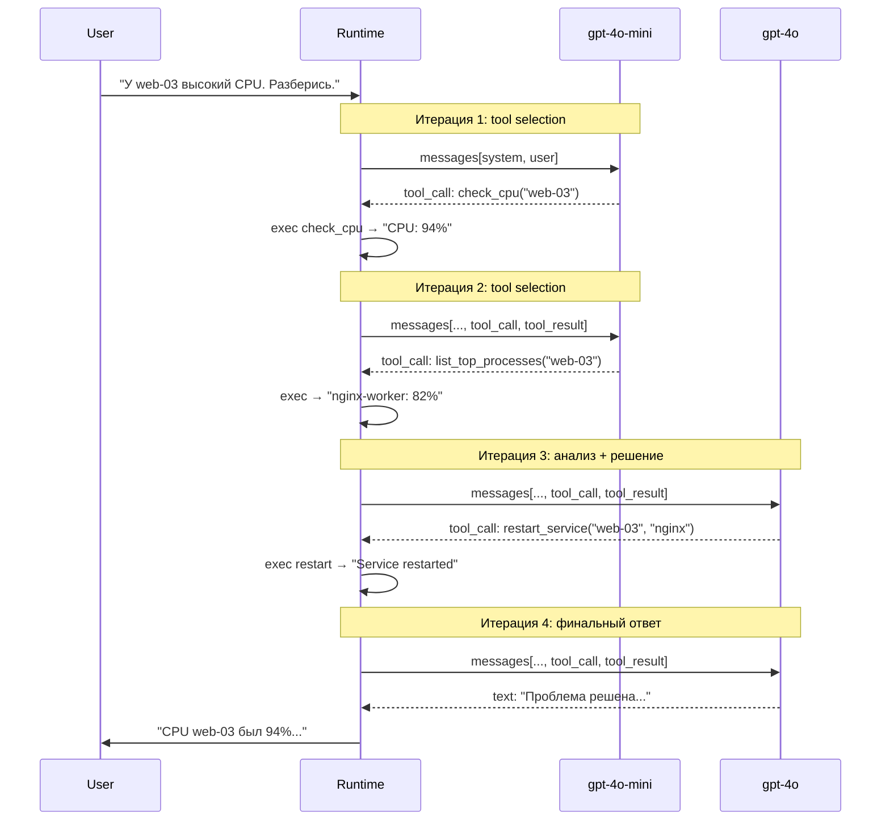

# 04. Автономность и Циклы — ReAct Loop

## Зачем это нужно?

В этой главе мы реализуем паттерн **ReAct (Reason + Act)** — сердце автономного агента.

Без автономного цикла агент работает как чат-бот: один запрос → один ответ. С автономным циклом агент может выполнить 10 действий подряд для решения одной задачи, самостоятельно принимая решения на основе результатов предыдущих действий.

### Реальный кейс

**Ситуация:** Пользователь пишет: "У меня кончилось место на сервере. Разберись."

**Без автономного цикла:**
- Агент: "Я проверю использование диска" → вызывает `check_disk` → получает "95%"
- Агент: [Останавливается, ждет следующей команды пользователя]

**С автономным циклом:**
- Агент: "Я проверю использование диска" → вызывает `check_disk` → получает "95%"
- Агент: "Диск переполнен. Очищу логи" → вызывает `clean_logs` → получает "Освобождено 20GB"
- Агент: "Проверю снова" → вызывает `check_disk` → получает "40%"
- Агент: "Готово! Освободил 20GB."

**Разница:** Агент сам решает, что делать дальше, основываясь на результатах предыдущих действий.

## Теория простыми словами

### ReAct Loop (Цикл Автономности)

**ReAct** — это аббревиатура от **Reason + Act** (Рассуждай + Действуй). Это паттерн, при котором агент:
1. **Reason (Рассуждает):** Анализирует ситуацию и решает, что делать
2. **Act (Действует):** Выполняет действие (вызывает инструмент)
3. **Observe (Наблюдает):** Видит результат действия
4. **Повторяет:** Снова рассуждает на основе результата

Никакой магии тут нет — это просто цикл, где модель видит результаты предыдущих действий в контексте и генерирует следующий шаг.

Автономный агент работает в цикле:

```
While (Задача не решена):
  1. Отправить историю в LLM
  2. Получить ответ
  3. ЕСЛИ это текст → Показать пользователю и ждать нового ввода
  4. ЕСЛИ это вызов инструмента →
       a. Выполнить инструмент
       b. Добавить результат в историю
       c. GOTO 1 (ничего не спрашивая у пользователя!)
```

**Суть:** Пункт 4.c даёт ощущение "магии": агент смотрит на результат и решает, что делать дальше. Но это не настоящая магия: модель видит результат инструмента в контексте (`messages[]`) и генерирует следующий шаг на основе этого контекста.

### Замыкание круга

После выполнения инструмента мы **не спрашиваем пользователя**, что делать дальше. Мы отправляем результат обратно в LLM. Модель видит результат своих действий и решает, что делать дальше.

**Пример диалога внутри памяти:**

### Магия vs Реальность: Как работает цикл

**Магия (как обычно объясняют):**
> Агент сам решил вызвать `clean_logs()` после проверки диска

**Реальность (как на самом деле):**

**Итерация 1: Первый запрос**

```go
// messages перед первой итерацией
messages := []openai.ChatCompletionMessage{
    {Role: "system", Content: "You are an autonomous DevOps agent."},
    {Role: "user", Content: "Кончилось место."},
}

// Отправляем в модель
resp1, _ := client.CreateChatCompletion(ctx, openai.ChatCompletionRequest{
    Model:    "gpt-4o-mini",
    Messages: messages,
    Tools:    tools,
})

msg1 := resp1.Choices[0].Message
// msg1.ToolCalls = [{ID: "call_1", Function: {Name: "check_disk_usage", Arguments: "{}"}}]

// Добавляем ответ ассистента в историю
messages = append(messages, msg1)
// Теперь messages содержит:
// [system, user, assistant(tool_call: check_disk_usage)]
```

**Итерация 2: Выполнение инструмента и возврат результата**

```go
// Выполняем инструмент
result1 := checkDiskUsage()  // "95% usage"

// Добавляем результат как сообщение с ролью "tool"
messages = append(messages, openai.ChatCompletionMessage{
    Role:       "tool",
    Content:    result1,  // "95% usage"
    ToolCallID: "call_1",
})
// Теперь messages содержит:
// [system, user, assistant(tool_call), tool("95% usage")]

// Отправляем ОБНОВЛЕННУЮ историю в модель снова
resp2, _ := client.CreateChatCompletion(ctx, openai.ChatCompletionRequest{
    Model:    "gpt-4o-mini",
    Messages: messages,  // Модель видит результат check_disk_usage!
    Tools:    tools,
})

msg2 := resp2.Choices[0].Message
// msg2.ToolCalls = [{ID: "call_2", Function: {Name: "clean_logs", Arguments: "{}"}}]

messages = append(messages, msg2)
// Теперь messages содержит:
// [system, user, assistant(tool_call_1), tool("95%"), assistant(tool_call_2)]
```

**Итерация 3: Второй инструмент**

```go
// Выполняем второй инструмент
result2 := cleanLogs()  // "Freed 20GB"

messages = append(messages, openai.ChatCompletionMessage{
    Role:       "tool",
    Content:    result2,  // "Freed 20GB"
    ToolCallID: "call_2",
})
// Теперь messages содержит:
// [system, user, assistant(tool_call_1), tool("95%"), assistant(tool_call_2), tool("Freed 20GB")]

// Отправляем снова
resp3, _ := client.CreateChatCompletion(ctx, openai.ChatCompletionRequest{
    Model:    "gpt-4o-mini",
    Messages: messages,  // Модель видит оба результата!
    Tools:    tools,
})

msg3 := resp3.Choices[0].Message
// msg3.ToolCalls = []  // Пусто! Модель решила ответить текстом
// msg3.Content = "Я почистил логи, теперь места достаточно."

// Это финальный ответ - выходим из цикла
```

**Что происходит на деле:**

1. **Модель видит всю историю** — она не "помнит" прошлое, она видит его в `messages[]`
2. **Модель видит результат инструмента** — результат добавляется как новое сообщение с ролью `tool`
3. **Модель решает на основе контекста** — видя "95% usage", модель понимает, что нужно освободить место
4. **Runtime управляет циклом** — код проверяет `len(msg.ToolCalls)` и решает, продолжать ли цикл

**Суть:** Модель не "сама решила" — она увидела результат `check_disk_usage` в контексте и сгенерировала следующий tool call на основе этого контекста.

### Визуализация: Кто что делает?

```
┌─────────────────────────────────────────────────────────┐
│ LLM (Модель)                                            │
│                                                         │
│ 1. Видит в контексте:                                   │
│    - System Prompt: "Ты DevOps агент"                   │
│    - User Input: "Кончилось место"                      │
│    - Tools Schema: [{name: "check_disk", ...}]          │
│                                                         │
│ 2. Генерирует tool_call:                                │
│    {name: "check_disk_usage", arguments: "{}"}          │
│                                                         │
│ 3. НЕ выполняет код! Только генерирует JSON.            │
└─────────────────────────────────────────────────────────┘
                        ↓
┌─────────────────────────────────────────────────────────┐
│ Runtime (Ваш код на Go)                                 │
│                                                         │
│ 1. Получает tool_call из ответа модели                  │
│ 2. Валидирует: существует ли инструмент?                │
│ 3. Выполняет: checkDiskUsage() → "95% usage"            │
│ 4. Добавляет результат в messages[]:                    │
│    {role: "tool", content: "95% usage"}                 │
│ 5. Отправляет обновленную историю обратно в LLM         │
└─────────────────────────────────────────────────────────┘
                        ↓
┌─────────────────────────────────────────────────────────┐
│ LLM (Модель) - следующая итерация                       │
│                                                         │
│ 1. Видит в контексте:                                   │
│    - Предыдущий tool_call                               │
│    - Результат: "95% usage" ← Runtime добавил!          │
│                                                         │
│ 2. Генерирует следующий tool_call:                      │
│    {name: "clean_logs", arguments: "{}"}                │
│                                                         │
│ 3. Цикл повторяется...                                  │
└─────────────────────────────────────────────────────────┘
```

**Суть:** LLM не "помнит" прошлое. Она видит его в `messages[]`, который собирает Runtime.

## Реализация цикла

```go
for i := 0; i < maxIterations; i++ {
    // 1. Отправляем запрос
    resp, err := client.CreateChatCompletion(ctx, openai.ChatCompletionRequest{
        Model:    "gpt-4o-mini",
        Messages: messages,
        Tools:    tools,
    })
    
    msg := resp.Choices[0].Message
    messages = append(messages, msg)  // Сохраняем ответ
    
    // 2. Проверяем тип ответа
    if len(msg.ToolCalls) == 0 {
        // Это финальный текстовый ответ
        fmt.Println("Agent:", msg.Content)
        break
    }
    
    // 3. Выполняем инструменты
    for _, toolCall := range msg.ToolCalls {
        result := executeTool(toolCall.Function.Name, toolCall.Function.Arguments)
        
        // 4. Добавляем результат в историю
        messages = append(messages, openai.ChatCompletionMessage{
            Role:       openai.ChatMessageRoleTool,
            Content:    result,
            ToolCallID: toolCall.ID,
        })
    }
    // Цикл продолжается автоматически!
    // Никакой магии: мы отправляем обновленную историю (с результатом инструмента)
    // в модель снова, и модель видит результат и решает, что делать дальше
}
```

### Обработка ошибок в цикле

**Важно:** Не забудьте обрабатывать ошибки и добавлять их в историю! Если инструмент упал, LLM должна это узнать и попробовать что-то другое.

**Правильная обработка ошибок:**

```go
for _, toolCall := range msg.ToolCalls {
    result, err := executeTool(toolCall.Function.Name, toolCall.Function.Arguments)
    
    if err != nil {
        // Ошибка — это тоже результат! Добавляем её в историю
        result = fmt.Sprintf("Error: %v", err)
    }
    
    // Добавляем результат (или ошибку) в историю
    messages = append(messages, openai.ChatCompletionMessage{
        Role:       openai.ChatMessageRoleTool,
        Content:    result,  // Модель увидит ошибку!
        ToolCallID: toolCall.ID,
    })
}
```

**Что происходит:**

1. Инструмент возвращает ошибку: `Error: connection refused`
2. Ошибка добавляется в историю как результат инструмента
3. Модель видит ошибку в контексте
4. Модель может:
    - Попробовать другой инструмент
    - Сообщить пользователю о проблеме
    - Эскалировать проблему

**Пример:**

```
Итерация 1:
Action: check_database_status("prod")
Observation: Error: connection refused

Итерация 2 (модель видит ошибку):
Thought: "База недоступна. Проверю сетевую связность"
Action: ping_host("db-prod.example.com")
Observation: "Host is unreachable"

Итерация 3:
Thought: "Сеть недоступна. Сообщу пользователю о проблеме"
Action: [Финальный ответ] "База данных недоступна. Проверьте сетевую связность."
```

**Анти-паттерн:** Не скрывайте ошибки от модели!

```go
// ПЛОХО: Скрываем ошибку
if err != nil {
    log.Printf("Error: %v", err)  // Только в лог
    continue  // Пропускаем инструмент
}

// ХОРОШО: Показываем ошибку модели
if err != nil {
    result := fmt.Sprintf("Error: %v", err)
    messages = append(messages, ...)  // Добавляем в историю
}
```

## Параллельные Tool Calls

Модель может вернуть **несколько tool calls за одну итерацию**. Например, пользователь просит "Проверь статус nginx и postgresql" — модель вернёт два tool_calls в одном ответе.

### Как это выглядит

```go
msg := resp.Choices[0].Message
// msg.ToolCalls может содержать несколько вызовов:
// [
//   {ID: "call_1", Function: {Name: "check_status", Arguments: `{"service":"nginx"}`}},
//   {ID: "call_2", Function: {Name: "check_status", Arguments: `{"service":"postgresql"}`}},
// ]
```

### Последовательное vs параллельное выполнение

По умолчанию runtime выполняет инструменты **последовательно** — один за другим в цикле `range msg.ToolCalls`. Это просто и безопасно.

Но если инструменты **независимы** (не читают/пишут общие данные), их можно выполнять **параллельно**:

```go
for _, toolCall := range msg.ToolCalls {
    if !areIndependent(toolCall, msg.ToolCalls) {
        // Зависимые инструменты — выполняем последовательно
        result := executeTool(toolCall)
        messages = append(messages, makeToolMessage(toolCall.ID, result))
        continue
    }

    // Независимые инструменты — запускаем параллельно
    go func(tc openai.ToolCall) {
        result := executeTool(tc)
        resultsCh <- toolResult{ID: tc.ID, Content: result}
    }(toolCall)
}
```

**Простая реализация с `sync.WaitGroup`:**

```go
type toolResult struct {
    ID      string
    Content string
}

func executeToolsParallel(toolCalls []openai.ToolCall) []toolResult {
    results := make([]toolResult, len(toolCalls))
    var wg sync.WaitGroup

    for i, tc := range toolCalls {
        wg.Add(1)
        go func(idx int, call openai.ToolCall) {
            defer wg.Done()
            result, err := executeTool(call.Function.Name, call.Function.Arguments)
            if err != nil {
                result = fmt.Sprintf("Error: %v", err)
            }
            results[idx] = toolResult{ID: call.ID, Content: result}
        }(i, tc)
    }

    wg.Wait()
    return results
}
```

**Когда параллельно, когда последовательно:**

| Ситуация | Стратегия |
|----------|-----------|
| Два `check_status` для разных сервисов | Параллельно — независимы |
| `read_file` → `parse_json` | Последовательно — второй зависит от первого |
| Прототип / MVP | Последовательно — проще отлаживать |

## Мульти-модельный Agent Loop

В [Главе 03](../03-tools-and-function-calling/README.md#стратегия-выбора-модели-для-разных-этапов) мы ввели `ModelSelector`. Теперь применим его к циклу агента.

### Зачем переключать модель внутри цикла?

На разных итерациях агент делает разную работу:

- **Итерации с tool calls:** Модель выбирает инструмент и генерирует аргументы. Это задача классификации — справится дешёвая модель.
- **Финальная итерация:** Модель анализирует все результаты и формулирует ответ. Это задача рассуждения — нужна мощная модель.
- **Итерации после ошибки:** Модель решает, что делать с ошибкой. Это требует рассуждения — лучше мощная модель.

### Реализация

```go
type MultiModelLoop struct {
    fastModel string // Для tool selection: дешёвая и быстрая
    smartModel string // Для анализа и рассуждений: мощная
}

func (l *MultiModelLoop) Run(ctx context.Context, client *openai.Client,
    messages []openai.ChatCompletionMessage, tools []openai.Tool, maxIter int,
) (string, error) {
    lastHadError := false

    for i := 0; i < maxIter; i++ {
        // Выбираем модель для текущей итерации
        model := l.fastModel
        if lastHadError {
            model = l.smartModel // После ошибки нужно рассуждение
        }

        resp, err := client.CreateChatCompletion(ctx, openai.ChatCompletionRequest{
            Model:    model,
            Messages: messages,
            Tools:    tools,
        })
        if err != nil {
            return "", fmt.Errorf("iteration %d: %w", i, err)
        }

        msg := resp.Choices[0].Message
        messages = append(messages, msg)

        // Финальный ответ — переспрашиваем у мощной модели, если отвечала дешёвая
        if len(msg.ToolCalls) == 0 {
            if model == l.fastModel && i > 0 {
                // Дешёвая модель дала финальный ответ.
                // Можно переспросить мощную для лучшего качества.
                return l.refineAnswer(ctx, client, messages)
            }
            return msg.Content, nil
        }

        // Выполняем инструменты
        lastHadError = false
        for _, tc := range msg.ToolCalls {
            result, execErr := executeTool(tc.Function.Name, tc.Function.Arguments)
            if execErr != nil {
                result = fmt.Sprintf("Error: %v", execErr)
                lastHadError = true
            }
            messages = append(messages, openai.ChatCompletionMessage{
                Role:       openai.ChatMessageRoleTool,
                Content:    result,
                ToolCallID: tc.ID,
            })
        }
    }
    return "", fmt.Errorf("exceeded %d iterations", maxIter)
}
```

**Ключевой момент:** Метод `refineAnswer` необязателен. Это оптимизация: если дешёвая модель собрала все данные через инструменты, мощная модель может лучше сформулировать финальный ответ.

## Сквозной пример: мульти-модельный флоу на 5 итерациях

Абстракции `ModelSelector` и `MultiModelLoop` могут выглядеть понятно в коде, но непонятно, **что именно происходит в runtime**. Разберём конкретный сценарий шаг за шагом.

### Сценарий

Пользователь пишет: **"У сервера web-03 высокий CPU. Разберись."**

У агента три инструмента:

```go
tools := []openai.Tool{
    {Function: &openai.FunctionDefinition{
        Name:        "check_cpu",
        Description: "Check CPU usage of a server",
        Parameters:  json.RawMessage(`{"type":"object","properties":{"host":{"type":"string"}},"required":["host"]}`),
    }},
    {Function: &openai.FunctionDefinition{
        Name:        "list_top_processes",
        Description: "List top CPU-consuming processes on a server",
        Parameters:  json.RawMessage(`{"type":"object","properties":{"host":{"type":"string"},"limit":{"type":"integer"}},"required":["host"]}`),
    }},
    {Function: &openai.FunctionDefinition{
        Name:        "restart_service",
        Description: "Restart a systemd service on a server. CAUTION: causes brief downtime.",
        Parameters:  json.RawMessage(`{"type":"object","properties":{"host":{"type":"string"},"service":{"type":"string"}},"required":["host","service"]}`),
    }},
}
```

Стратегия выбора модели:
- **gpt-4o-mini** — для итераций, где предыдущий ответ содержал tool calls (простая задача: выбрать инструмент)
- **gpt-4o** — когда нужно принять решение на основе собранных данных (анализ, финальный ответ)

### Диаграмма флоу



### Пошаговый разбор

**Итерация 1 — `gpt-4o-mini` — выбор первого инструмента**

```
[iter=1 model=gpt-4o-mini reason=first_call cost≈$0.0003]
```

Модель видит:
```
messages = [
  {role: "system", content: "You are a DevOps agent. Diagnose and fix issues."},
  {role: "user",   content: "У сервера web-03 высокий CPU. Разберись."}
]
```

Модель возвращает:
```json
{"tool_calls": [{"function": {"name": "check_cpu", "arguments": "{\"host\":\"web-03\"}"}}]}
```

**Почему gpt-4o-mini?** Это первый вызов. Задача — выбрать из 3 инструментов тот, что соответствует "высокий CPU". Это классификация, не рассуждение. Дешёвая модель справляется.

Runtime выполняет `check_cpu("web-03")` → `"CPU usage: 94%, load average: 12.3"`

---

**Итерация 2 — `gpt-4o-mini` — выбор второго инструмента**

```
[iter=2 model=gpt-4o-mini reason=previous_had_tool_calls cost≈$0.0004]
```

Модель видит (messages вырос):
```
messages = [
  {role: "system",    content: "You are a DevOps agent..."},
  {role: "user",      content: "У сервера web-03 высокий CPU. Разберись."},
  {role: "assistant", tool_calls: [{name: "check_cpu", args: {host: "web-03"}}]},
  {role: "tool",      content: "CPU usage: 94%, load average: 12.3", tool_call_id: "call_1"}
]
```

Модель возвращает:
```json
{"tool_calls": [{"function": {"name": "list_top_processes", "arguments": "{\"host\":\"web-03\",\"limit\":5}"}}]}
```

**Почему gpt-4o-mini?** Предыдущая итерация вернула tool call. Модель видит "CPU 94%" и должна выбрать следующий инструмент. Это снова классификация: "какой инструмент поможет понять, что грузит CPU?" → `list_top_processes`.

Runtime выполняет `list_top_processes("web-03", 5)`:
```
PID    COMMAND         CPU%
18234  nginx-worker    82.1%
18235  nginx-worker    4.3%
  892  postgres        3.2%
  451  node            2.1%
    1  systemd         0.1%
```

---

**Итерация 3 — `gpt-4o` — принятие решения**

```
[iter=3 model=gpt-4o reason=need_analysis cost≈$0.008]
```

Модель видит (messages содержит 6 элементов):
```
messages = [
  system, user,
  assistant(tool_call: check_cpu),    tool("CPU: 94%"),
  assistant(tool_call: list_top),     tool("nginx-worker: 82.1%...")
]
```

Модель возвращает:
```json
{"tool_calls": [{"function": {"name": "restart_service", "arguments": "{\"host\":\"web-03\",\"service\":\"nginx\"}"}}]}
```

**Почему gpt-4o?** Вот здесь нужно **рассуждение**. Модель должна:
1. Понять, что nginx-worker потребляет 82% CPU (а не просто выбрать инструмент)
2. Решить, что правильное действие — перезапустить nginx (а не postgres или node)
3. Оценить риск перезапуска (CAUTION в описании инструмента)

Дешёвая модель может ошибиться: перезапустить не тот сервис или просто продолжить собирать информацию вместо действия.

Runtime выполняет `restart_service("web-03", "nginx")` → `"Service nginx restarted successfully. PID: 19012"`

---

**Итерация 4 — `gpt-4o` — финальный ответ**

```
[iter=4 model=gpt-4o reason=previous_had_tool_calls_but_critical cost≈$0.01]
```

Модель видит (messages содержит 8 элементов):
```
messages = [
  system, user,
  assistant(check_cpu),     tool("CPU: 94%"),
  assistant(list_top),      tool("nginx-worker: 82.1%"),
  assistant(restart_nginx), tool("Service nginx restarted. PID: 19012")
]
```

Модель возвращает **текст** (без tool_calls):
```
CPU сервера web-03 был загружен на 94%. Основной потребитель — процесс nginx-worker (82.1% CPU).
Выполнен перезапуск nginx. Новый PID: 19012.

Рекомендации:
- Проверить конфигурацию worker_processes в nginx.conf
- Настроить мониторинг CPU с алертом на 80%
```

**Почему gpt-4o?** Финальный ответ требует синтеза информации из всех предыдущих шагов и формулировки рекомендаций. Мощная модель формулирует лучше.

### Эволюция messages[]

| После итерации | Элементов в messages[] | Что добавилось |
|:-:|:-:|:--|
| — | 2 | `system` + `user` |
| 1 | 4 | + `assistant(tool_call: check_cpu)` + `tool("CPU: 94%")` |
| 2 | 6 | + `assistant(tool_call: list_top)` + `tool("nginx: 82%")` |
| 3 | 8 | + `assistant(tool_call: restart)` + `tool("restarted")` |
| 4 | 9 | + `assistant("CPU web-03 был загружен...")` |

Каждая итерация добавляет 2 сообщения (assistant + tool), последняя — 1 (только assistant с текстом).

### Расчёт стоимости

**Одна модель (gpt-4o на всех итерациях):**

| Итерация | Модель | Input tokens | Output tokens | Стоимость |
|:-:|:--|:-:|:-:|:-:|
| 1 | gpt-4o | ~300 | ~30 | $0.0040 |
| 2 | gpt-4o | ~450 | ~40 | $0.0060 |
| 3 | gpt-4o | ~650 | ~35 | $0.0085 |
| 4 | gpt-4o | ~800 | ~120 | $0.0120 |
| | | | **Итого:** | **$0.0305** |

**Мульти-модельная стратегия:**

| Итерация | Модель | Input tokens | Output tokens | Стоимость |
|:-:|:--|:-:|:-:|:-:|
| 1 | gpt-4o-mini | ~300 | ~30 | $0.0003 |
| 2 | gpt-4o-mini | ~450 | ~40 | $0.0004 |
| 3 | gpt-4o | ~650 | ~35 | $0.0085 |
| 4 | gpt-4o | ~800 | ~120 | $0.0120 |
| | | | **Итого:** | **$0.0212** |

**Экономия: 30%** на этом примере. При 10 000 задач в день: $305 vs $212 → $93/день → **$2 800/месяц**.

На задачах с большим количеством tool calls (6-8 итераций вместо 4) экономия достигает 50-60%.

### Когда Runtime переключает модель?

Логика выбора модели в этом примере:

```go
func selectModel(iteration int, lastHadToolCalls bool, lastHadError bool) string {
    // После ошибки — мощная модель (нужно рассуждение)
    if lastHadError {
        return "gpt-4o"
    }

    // Первые 2 итерации с tool calls — дешёвая модель
    // Начиная с 3-й итерации — мощная (накопилось достаточно контекста для решения)
    if lastHadToolCalls && iteration < 3 {
        return "gpt-4o-mini"
    }

    // Остальные случаи — мощная модель
    return "gpt-4o"
}
```

**Альтернативная стратегия** — проще, но менее точная:

```go
func selectModelSimple(lastHadToolCalls bool) string {
    if lastHadToolCalls {
        return "gpt-4o-mini" // Ещё собираем данные
    }
    return "gpt-4o" // Формулируем ответ
}
```

Проблема простой стратегии: на итерации 3 (где нужно принять решение о перезапуске) будет использована дешёвая модель. Она может ошибиться.

### Полный рабочий код

```go
package main

import (
    "context"
    "encoding/json"
    "fmt"
    "os"
    "strings"

    "github.com/sashabaranov/go-openai"
)

func main() {
    config := openai.DefaultConfig(os.Getenv("OPENAI_API_KEY"))
    if baseURL := os.Getenv("OPENAI_BASE_URL"); baseURL != "" {
        config.BaseURL = baseURL
    }
    client := openai.NewClientWithConfig(config)
    ctx := context.Background()

    // Инструменты
    tools := []openai.Tool{
        {Type: openai.ToolTypeFunction, Function: &openai.FunctionDefinition{
            Name: "check_cpu", Description: "Check CPU usage of a server",
            Parameters: json.RawMessage(`{"type":"object","properties":{"host":{"type":"string"}},"required":["host"]}`),
        }},
        {Type: openai.ToolTypeFunction, Function: &openai.FunctionDefinition{
            Name: "list_top_processes", Description: "List top CPU-consuming processes",
            Parameters: json.RawMessage(`{"type":"object","properties":{"host":{"type":"string"},"limit":{"type":"integer"}},"required":["host"]}`),
        }},
        {Type: openai.ToolTypeFunction, Function: &openai.FunctionDefinition{
            Name: "restart_service", Description: "Restart a systemd service. CAUTION: causes brief downtime.",
            Parameters: json.RawMessage(`{"type":"object","properties":{"host":{"type":"string"},"service":{"type":"string"}},"required":["host","service"]}`),
        }},
    }

    messages := []openai.ChatCompletionMessage{
        {Role: "system", Content: "You are a DevOps agent. Diagnose and fix server issues. Use tools to investigate, then act."},
        {Role: "user", Content: "У сервера web-03 высокий CPU. Разберись."},
    }

    // Мульти-модельный цикл
    const (
        fastModel = "gpt-4o-mini"
        smartModel = "gpt-4o"
        maxIter   = 10
    )

    lastHadToolCalls := true
    lastHadError := false

    for i := 0; i < maxIter; i++ {
        // --- Выбор модели ---
        model := fastModel
        if lastHadError || (lastHadToolCalls && i >= 3) || !lastHadToolCalls {
            model = smartModel
        }

        fmt.Printf("\n[iter=%d model=%s msgs=%d]\n", i+1, model, len(messages))

        resp, err := client.CreateChatCompletion(ctx, openai.ChatCompletionRequest{
            Model:       model,
            Messages:    messages,
            Tools:       tools,
            Temperature: 0,
        })
        if err != nil {
            fmt.Printf("  ERROR: %v\n", err)
            return
        }

        msg := resp.Choices[0].Message
        messages = append(messages, msg)
        fmt.Printf("  tokens: prompt=%d completion=%d\n", resp.Usage.PromptTokens, resp.Usage.CompletionTokens)

        // --- Финальный ответ? ---
        if len(msg.ToolCalls) == 0 {
            fmt.Printf("  FINAL ANSWER:\n%s\n", msg.Content)
            break
        }

        // --- Выполнение инструментов ---
        lastHadToolCalls = true
        lastHadError = false
        for _, tc := range msg.ToolCalls {
            fmt.Printf("  tool_call: %s(%s)\n", tc.Function.Name, tc.Function.Arguments)

            result := executeToolStub(tc.Function.Name, tc.Function.Arguments)
            if strings.HasPrefix(result, "Error") {
                lastHadError = true
            }
            fmt.Printf("  result: %s\n", truncate(result, 80))

            messages = append(messages, openai.ChatCompletionMessage{
                Role:       openai.ChatMessageRoleTool,
                Content:    result,
                ToolCallID: tc.ID,
            })
        }
    }
}

// Заглушки инструментов (заменить на реальные вызовы)
func executeToolStub(name, argsJSON string) string {
    switch name {
    case "check_cpu":
        return "CPU usage: 94%, load average: 12.3, uptime: 14 days"
    case "list_top_processes":
        return `PID    COMMAND         CPU%
18234  nginx-worker    82.1%
18235  nginx-worker    4.3%
  892  postgres        3.2%
  451  node            2.1%
    1  systemd         0.1%`
    case "restart_service":
        var args struct{ Service string `json:"service"` }
        json.Unmarshal([]byte(argsJSON), &args)
        return fmt.Sprintf("Service %s restarted successfully. New PID: 19012", args.Service)
    default:
        return fmt.Sprintf("Error: unknown tool %s", name)
    }
}

func truncate(s string, maxLen int) string {
    s = strings.ReplaceAll(s, "\n", " | ")
    if len(s) > maxLen {
        return s[:maxLen] + "..."
    }
    return s
}
```

**Ожидаемый вывод:**

```
[iter=1 model=gpt-4o-mini msgs=2]
  tokens: prompt=285 completion=28
  tool_call: check_cpu({"host":"web-03"})
  result: CPU usage: 94%, load average: 12.3, uptime: 14 days

[iter=2 model=gpt-4o-mini msgs=4]
  tokens: prompt=432 completion=38
  tool_call: list_top_processes({"host":"web-03","limit":5})
  result: PID    COMMAND         CPU% | 18234  nginx-worker    82.1% | 18235  ngi...

[iter=3 model=gpt-4o msgs=6]
  tokens: prompt=648 completion=32
  tool_call: restart_service({"host":"web-03","service":"nginx"})
  result: Service nginx restarted successfully. New PID: 19012

[iter=4 model=gpt-4o msgs=8]
  tokens: prompt=795 completion=118
  FINAL ANSWER:
CPU сервера web-03 был загружен на 94%. Причина — процесс nginx-worker (82.1% CPU).
Выполнен перезапуск nginx (новый PID: 19012).
Рекомендую проверить worker_processes в nginx.conf и настроить алерт на CPU > 80%.
```

Обратите внимание на столбец `model=`: итерации 1-2 используют дешёвую модель, итерации 3-4 — мощную. Runtime решает это **до** вызова LLM, основываясь на номере итерации и наличии tool calls.

## Стратегии остановки цикла

Лимит итераций (`maxIterations`) — это **защита от зацикливания**, но не стратегия остановки. Агент должен останавливаться, когда задача решена.

### Стратегия 1: Модель решает сама (по умолчанию)

Модель перестаёт вызывать инструменты и возвращает текст. Это работает, когда System Prompt содержит инструкцию:

```
When the task is complete, respond with a summary. Do not call tools unnecessarily.
```

### Стратегия 2: Инструмент "task_complete"

Добавьте специальный инструмент, который агент вызывает для завершения:

```go
{
    Name:        "task_complete",
    Description: "Call this when the task is fully resolved. Provide a summary of what was done.",
    Parameters: json.RawMessage(`{
        "type": "object",
        "properties": {
            "summary": {"type": "string", "description": "Summary of completed work"},
            "success": {"type": "boolean", "description": "Whether the task was successful"}
        },
        "required": ["summary", "success"]
    }`),
}
```

Преимущество: вы получаете **структурированный** результат (успех/неуспех + описание), а не просто текст.

### Стратегия 3: Детекция застревания

Если последние N действий одинаковые, агент застрял:

```go
func detectStuck(messages []openai.ChatCompletionMessage, windowSize int) bool {
    var recentCalls []string
    for i := len(messages) - 1; i >= 0 && len(recentCalls) < windowSize; i-- {
        msg := messages[i]
        if msg.Role == openai.ChatMessageRoleAssistant && len(msg.ToolCalls) > 0 {
            call := msg.ToolCalls[0].Function.Name + ":" + msg.ToolCalls[0].Function.Arguments
            recentCalls = append(recentCalls, call)
        }
    }

    if len(recentCalls) < windowSize {
        return false
    }
    // Все вызовы одинаковые?
    for _, c := range recentCalls[1:] {
        if c != recentCalls[0] {
            return false
        }
    }
    return true
}
```

### Стратегия 4: Бюджет токенов

Останавливаемся, если потрачено слишком много токенов:

```go
totalTokens += resp.Usage.TotalTokens
if totalTokens > maxTokenBudget {
    // Бюджет исчерпан — просим модель дать финальный ответ
    messages = append(messages, openai.ChatCompletionMessage{
        Role:    openai.ChatMessageRoleUser,
        Content: "Token budget exhausted. Provide your best answer based on information gathered so far.",
    })
    // Последний вызов без tools — модель обязана ответить текстом
    resp, _ := client.CreateChatCompletion(ctx, openai.ChatCompletionRequest{
        Model:    model,
        Messages: messages,
        // Tools не передаём — модель может ответить только текстом
    })
    return resp.Choices[0].Message.Content, nil
}
```

Подробнее о бюджетах токенов см. [Главу 20: Cost & Latency Engineering](../20-cost-latency-engineering/README.md).

## Типовые ошибки

### Ошибка 1: Зацикливание

**Симптом:** Агент повторяет одно и то же действие бесконечно.

**Причина:** Нет лимита итераций и детекции повторяющихся действий.

**Решение:**
```go
// ХОРОШО: Лимит итераций + детекция застревания
for i := 0; i < maxIterations; i++ {
    // ...
    
    // Детекция повторяющихся действий
    if lastNActionsAreSame(history, 3) {
        break
    }
}

// ХОРОШО: Улучшите промпт
systemPrompt := `... If action doesn't help, try a different approach.`
```

### Ошибка 2: Результат инструмента не добавляется в историю

**Симптом:** Агент не видит результат инструмента и продолжает выполнять то же действие.

**Причина:** Результат выполнения инструмента не добавляется в `messages[]`.

**Решение:**
```go
// ПЛОХО: Результат не добавляется
result := executeTool(toolCall)
// История не обновлена!

// ХОРОШО: ОБЯЗАТЕЛЬНО добавляйте результат!
messages = append(messages, openai.ChatCompletionMessage{
    Role:       openai.ChatMessageRoleTool,
    Content:    result,
    ToolCallID: toolCall.ID,  // Важно для связи!
})
```

### Ошибка 3: Агент не останавливается

**Симптом:** Агент продолжает вызывать инструменты, даже когда задача решена.

**Причина:** System Prompt не инструктирует агента останавливаться, когда задача решена.

**Решение:**
```go
// ХОРОШО: Добавьте в System Prompt
systemPrompt := `... If task is solved, answer user with text. Don't call tools unnecessarily.`
```

### Ошибка 4: Одна модель на все итерации

**Симптом:** Агент работает медленно и дорого. Каждый tool call стоит столько же, сколько финальный ответ.

**Причина:** Используется одна мощная модель (GPT-4o) для всех итераций, включая простой выбор инструментов.

**Решение:**
```go
// ПЛОХО: GPT-4o для каждой итерации
model := "gpt-4o" // $0.01 за вызов × 8 итераций = $0.08

// ХОРОШО: Дешёвая модель для tool calls, мощная для анализа
if lastHadToolCalls {
    model = "gpt-4o-mini" // $0.0002 за tool call × 7 = $0.0014
} else {
    model = "gpt-4o"      // $0.01 за финальный ответ × 1 = $0.01
}
// Итого: $0.0114 вместо $0.08 — экономия 7x
```

Подробнее см. [Главу 03: Стратегия выбора модели](../03-tools-and-function-calling/README.md#стратегия-выбора-модели-для-разных-этапов).

## Мини-упражнения

### Упражнение 1: Добавьте детекцию зацикливания

Реализуйте проверку, что последние 3 действия одинаковые:

```go
func isStuck(history []ChatCompletionMessage) bool {
    // Проверьте, что последние 3 действия одинаковые
    // ...
}
```

**Ожидаемый результат:**
- Функция возвращает `true`, если последние 3 действия одинаковые
- Функция возвращает `false` в противном случае

### Упражнение 2: Добавьте логирование

Логируйте каждую итерацию цикла:

```go
fmt.Printf("[Iteration %d] Agent decided: %s\n", i, action)
fmt.Printf("[Iteration %d] Tool result: %s\n", i, result)
```

**Ожидаемый результат:**
- Каждая итерация логируется с номером и действием
- Результаты инструментов логируются

## Критерии сдачи / Чек-лист

**Сдано:**
- [x] Агент выполняет цикл автономно
- [x] Результаты инструментов добавляются в историю
- [x] Агент останавливается, когда задача решена
- [x] Есть защита от зацикливания (лимит итераций + детекция)
- [x] Ошибки инструментов обрабатываются и добавляются в историю

**Не сдано:**
- [ ] Агент не продолжает цикл после выполнения инструмента
- [ ] Результаты инструментов не видны агенту (не добавляются в историю)
- [ ] Агент зацикливается (нет защиты)
- [ ] Агент не останавливается, когда задача решена

## Связь с другими главами

- **Инструменты:** Как инструменты вызываются и возвращают результаты, см. [Главу 03: Инструменты](../03-tools-and-function-calling/README.md)
- **Память:** Как история сообщений (`messages[]`) растет и управляется, см. [Главу 09: Анатомия Агента](../09-agent-architecture/README.md)
- **Безопасность:** Как остановить цикл для подтверждения, см. [Главу 05: Безопасность](../05-safety-and-hitl/README.md)

## Что дальше?

После изучения автономности переходите к:
- **[05. Безопасность и Human-in-the-Loop](../05-safety-and-hitl/README.md)** — как защитить агента от опасных действий


