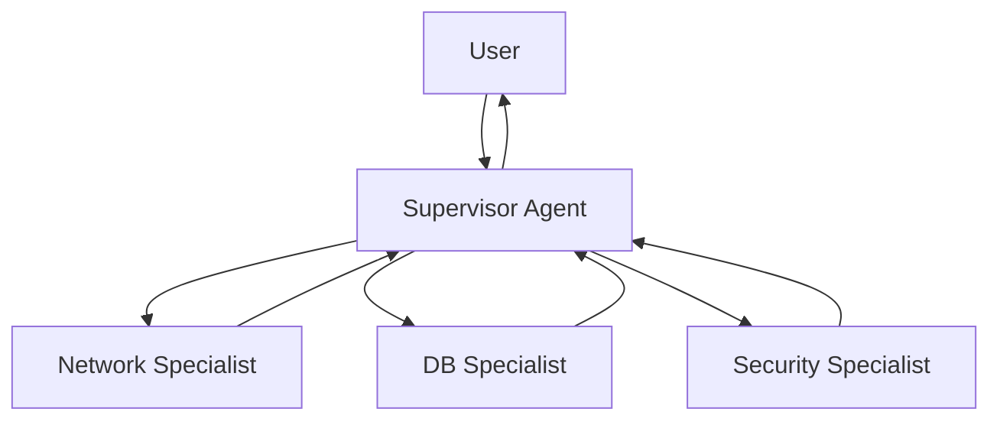

# 07. Multi-Agent Systems

## Зачем это нужно?

Один агент "мастер на все руки" часто путается в инструментах. Когда у агента слишком много инструментов (20+), модель начинает путаться в выборе и делает ошибки.

Эффективнее разделить ответственность: создать команду узких специалистов, управляемую главным агентом (Supervisor). Каждый специалист знает только свои инструменты и фокусируется на своей области.

### Реальный кейс

**Ситуация:** Вы создали агента для DevOps с 15 инструментами: проверка сетей, работа с БД, управление сервисами, логи, метрики, безопасность и т.д.

**Проблема:** Агент путается в инструментах. Когда пользователь просит "Проверь доступность БД и узнай версию", агент может вызвать неправильный инструмент или пропустить шаг.

**Решение:** Multi-Agent система с Supervisor и специалистами. Supervisor делегирует задачу Network Expert для проверки доступности и DB Expert для получения версии. Каждый специалист фокусируется только на своей области.

## Теория простыми словами

### Как работает Multi-Agent?

1. **Supervisor получает задачу** от пользователя
2. **Supervisor анализирует задачу** и решает, какие специалисты нужны
3. **Supervisor вызывает специалистов** через tool calls
4. **Специалисты выполняют задачи** в изолированном контексте
5. **Результаты возвращаются Supervisor-у**, который собирает ответ

**Суть:** Изоляция контекста — каждый специалист видит только свою задачу, а не всю историю Supervisor-а. Это экономит токены и фокусирует внимание.

## Паттерн Supervisor (Начальник-Подчиненный)

**Архитектура:**

- **Supervisor:** Главный мозг. Не имеет инструментов, но знает, кто что умеет.
- **Workers:** Специализированные агенты с узким набором инструментов.

**Изоляция контекста:** Worker не видит всей переписки Supervisor-а, только свою задачу. Это экономит токены и фокусирует внимание.



## Пример для DevOps — Магия vs Реальность

**❌ Магия:**
> Supervisor "думает" и "делегирует" задачи специалистам

**✅ Реальность:**

### Как работает Multi-Agent на практике

**Шаг 1: Supervisor получает задачу**

```go
// Supervisor имеет инструменты для вызова Workers
supervisorTools := []openai.Tool{
    {
        Function: &openai.FunctionDefinition{
            Name: "ask_network_expert",
            Description: "Ask the network specialist about connectivity, pings, ports",
            Parameters: json.RawMessage(`{
                "type": "object",
                "properties": {
                    "question": {"type": "string"}
                },
                "required": ["question"]
            }`),
        },
    },
    {
        Function: &openai.FunctionDefinition{
            Name: "ask_database_expert",
            Description: "Ask the DB specialist about SQL, schemas, data",
            Parameters: json.RawMessage(`{
                "type": "object",
                "properties": {
                    "question": {"type": "string"}
                },
                "required": ["question"]
            }`),
        },
    },
}

supervisorMessages := []openai.ChatCompletionMessage{
    {Role: "system", Content: "You are a Supervisor. Delegate tasks to specialists."},
    {Role: "user", Content: "Проверь, доступен ли сервер БД, и если да — узнай версию"},
}
```

**Шаг 2: Supervisor генерирует tool calls для Workers**

```go
supervisorResp, _ := client.CreateChatCompletion(ctx, openai.ChatCompletionRequest{
    Model:    openai.GPT4,
    Messages: supervisorMessages,
    Tools:    supervisorTools,
})

supervisorMsg := supervisorResp.Choices[0].Message
// supervisorMsg.ToolCalls = [
//     {Function: {Name: "ask_network_expert", Arguments: "{\"question\": \"Проверь доступность db-host.example.com\"}"}},
//     {Function: {Name: "ask_database_expert", Arguments: "{\"question\": \"Какая версия PostgreSQL на db-host?\"}"}},
// ]
```

**Почему Supervisor вызвал оба инструмента?**
- Supervisor видит задачу "проверить доступность" → связывает с Network Expert
- Supervisor видит "узнай версию" → связывает с DB Expert
- Supervisor понимает последовательность: сначала сеть, потом БД

**Шаг 3: Runtime (ваш код) вызывает Worker для Network Expert**

> **Примечание:** Runtime — это код агента, который вы пишете на Go. См. [Главу 00: Предисловие](../00-preface/README.md#runtime-среда-выполнения) для определения.

```go
// Runtime перехватывает tool call "ask_network_expert"
func askNetworkExpert(question string) string {
    // Создаем НОВЫЙ контекст для Worker (изоляция!)
    workerMessages := []openai.ChatCompletionMessage{
        {Role: "system", Content: "You are a Network Specialist. Use ping tool to check connectivity."},
        {Role: "user", Content: question},  // Только вопрос, без всей истории Supervisor!
    }
    
    // Worker имеет свои инструменты
    workerTools := []openai.Tool{
        {
            Function: &openai.FunctionDefinition{
                Name: "ping",
                Description: "Ping a host to check connectivity",
                Parameters: json.RawMessage(`{
                    "type": "object",
                    "properties": {"host": {"type": "string"}},
                    "required": ["host"]
                }`),
            },
        },
    }
    
    // Запускаем Worker как отдельного агента
    workerResp, _ := client.CreateChatCompletion(ctx, openai.ChatCompletionRequest{
        Model:    openai.GPT3Dot5Turbo,
        Messages: workerMessages,  // Изолированный контекст!
        Tools:    workerTools,
    })
    
    workerMsg := workerResp.Choices[0].Message
    // workerMsg.ToolCalls = [{Function: {Name: "ping", Arguments: "{\"host\": \"db-host.example.com\"}"}}]
    
    // Выполняем ping
    pingResult := ping("db-host.example.com")  // "Host is reachable"
    
    // Worker видит результат и формулирует ответ
    workerMessages = append(workerMessages, workerMsg)
    workerMessages = append(workerMessages, openai.ChatCompletionMessage{
        Role:    "tool",
        Content: pingResult,
    })
    
    workerResp2, _ := client.CreateChatCompletion(ctx, openai.ChatCompletionRequest{
        Model:    openai.GPT3Dot5Turbo,
        Messages: workerMessages,
        Tools:    workerTools,
    })
    
    // Возвращаем финальный ответ Worker-а Supervisor-у
    return workerResp2.Choices[0].Message.Content  // "Host db-host.example.com is reachable"
}
```

**Суть изоляции:**
- Worker **не видит** всю историю Supervisor-а
- Worker видит только свой вопрос и свой контекст
- Это экономит токены и фокусирует внимание Worker-а

**Шаг 4: Runtime (ваш код) вызывает Worker для DB Expert**

```go
func askDatabaseExpert(question string) string {
    // Аналогично Network Expert, но с другими инструментами
    workerMessages := []openai.ChatCompletionMessage{
        {Role: "system", Content: "You are a DB Specialist. Use SQL tools."},
        {Role: "user", Content: question},  // Изолированный контекст!
    }
    
    workerTools := []openai.Tool{
        {
            Function: &openai.FunctionDefinition{
                Name: "sql_query",
                Description: "Execute a SELECT query",
                Parameters: json.RawMessage(`{
                    "type": "object",
                    "properties": {"query": {"type": "string"}},
                    "required": ["query"]
                }`),
            },
        },
    }
    
    // Worker генерирует SQL и выполняет
    // Возвращает: "PostgreSQL 15.2"
    return "PostgreSQL 15.2"
}
```

**Шаг 5: Результаты Workers возвращаются Supervisor-у**

```go
// Runtime добавляет результаты как tool messages
supervisorMessages = append(supervisorMessages, supervisorMsg)
supervisorMessages = append(supervisorMessages, openai.ChatCompletionMessage{
    Role:       "tool",
    Content:    askNetworkExpert("Проверь доступность db-host.example.com"),  // "Host is reachable"
    ToolCallID: supervisorMsg.ToolCalls[0].ID,
})
supervisorMessages = append(supervisorMessages, openai.ChatCompletionMessage{
    Role:       "tool",
    Content:    askDatabaseExpert("Какая версия PostgreSQL на db-host?"),  // "PostgreSQL 15.2"
    ToolCallID: supervisorMsg.ToolCalls[1].ID,
})
```

**Шаг 6: Supervisor собирает результаты и отвечает**

```go
// Отправляем Supervisor-у результаты Workers
supervisorResp2, _ := client.CreateChatCompletion(ctx, openai.ChatCompletionRequest{
    Model:    openai.GPT4,
    Messages: supervisorMessages,  // Supervisor видит результаты обоих Workers!
    Tools:    supervisorTools,
})

finalMsg := supervisorResp2.Choices[0].Message
// finalMsg.Content = "Сервер БД доступен (ping успешен). Версия PostgreSQL: 15.2"
```

**Что происходит на деле:**

1. **Supervisor вызывает Workers как обычные tools** — это не "делегирование", а tool call
2. **Workers — это отдельные агенты** — каждый со своим контекстом и инструментами
3. **Изоляция контекста** — Worker не видит историю Supervisor-а, только свой вопрос
4. **Runtime управляет всем** — он перехватывает tool calls Supervisor-а, запускает Workers, собирает результаты

**Суть:** Multi-Agent — это не "командование", а механизм вызова специализированных агентов через tool calls с изоляцией контекста.

## Типовые ошибки

### Ошибка 1: Нет изоляции контекста

**Симптом:** Worker видит всю историю Supervisor-а, что приводит к переполнению контекста и путанице.

**Причина:** Worker получает полную историю сообщений Supervisor-а вместо изолированного контекста.

**Решение:**
```go
// ПЛОХО: Worker видит всю историю Supervisor-а
workerMessages := supervisorMessages  // Вся история!

// ХОРОШО: Worker получает только свой вопрос
workerMessages := []openai.ChatCompletionMessage{
    {Role: "system", Content: "You are a Network Specialist."},
    {Role: "user", Content: question},  // Только вопрос!
}
```

### Ошибка 2: Supervisor не знает, кого вызвать

**Симптом:** Supervisor не вызывает нужных специалистов или вызывает неправильных.

**Причина:** Описания инструментов для вызова Workers недостаточно четкие.

**Решение:**
```go
// ХОРОШО: Четкое описание, когда вызывать каждого специалиста
{
    Name: "ask_network_expert",
    Description: "Ask the network specialist about connectivity, pings, ports, network troubleshooting. Use this when user asks about network issues, connectivity, or network-related problems.",
},
{
    Name: "ask_database_expert",
    Description: "Ask the DB specialist about SQL, schemas, data, database queries. Use this when user asks about database, SQL, or data-related questions.",
},
```

### Ошибка 3: Worker не возвращает результат

**Симптом:** Supervisor не получает ответ от Worker-а или получает пустой ответ.

**Причина:** Worker не завершает свою работу или результат не возвращается Supervisor-у.

**Решение:**
```go
// ХОРОШО: Worker завершает работу и возвращает результат
func askNetworkExpert(question string) string {
    // ... Worker выполняет задачу ...
    
    // Возвращаем финальный ответ Worker-а
    return workerResp2.Choices[0].Message.Content  // "Host is reachable"
}

// Supervisor получает результат
supervisorMessages = append(supervisorMessages, openai.ChatCompletionMessage{
    Role:       "tool",
    Content:    askNetworkExpert("..."),  // Результат Worker-а
    ToolCallID: supervisorMsg.ToolCalls[0].ID,
})
```

## Мини-упражнения

### Упражнение 1: Реализуйте изоляцию контекста

Реализуйте функцию создания изолированного контекста для Worker-а:

```go
func createWorkerContext(question string, workerRole string) []openai.ChatCompletionMessage {
    // Создайте изолированный контекст для Worker-а
    // Только System Prompt и вопрос пользователя
}
```

**Ожидаемый результат:**
- Worker получает только System Prompt и свой вопрос
- Worker не видит историю Supervisor-а

### Упражнение 2: Реализуйте Supervisor с двумя специалистами

Создайте Supervisor-а с двумя специалистами (Network Expert и DB Expert):

```go
supervisorTools := []openai.Tool{
    // Ваш код здесь
}
```

**Ожидаемый результат:**
- Supervisor может вызвать оба специалиста
- Описания инструментов четкие и понятные
- Supervisor правильно выбирает специалиста для задачи

## Критерии сдачи / Чек-лист

✅ **Сдано:**
- Supervisor правильно делегирует задачи специалистам
- Workers работают в изолированном контексте
- Результаты Workers возвращаются Supervisor-у
- Supervisor собирает результаты и формулирует финальный ответ
- Описания инструментов для вызова Workers четкие

❌ **Не сдано:**
- Worker видит всю историю Supervisor-а (нет изоляции)
- Supervisor не знает, кого вызвать (плохие описания)
- Worker не возвращает результат Supervisor-у
- Supervisor не собирает результаты от Workers

## Прод-заметки

При использовании Multi-Agent систем в продакшене:

- **Кореляция по `run_id`:** Используйте единый `run_id` для всей цепочки Supervisor → Worker → Tool. Это позволяет отслеживать полный путь запроса в логах.
- **Трейсинг цепочки:** Трассируйте каждый шаг цепочки (Supervisor → Worker → Tool) для отладки. Подробнее: [Глава 19: Observability и Tracing](../19-observability-and-tracing/README.md).
- **Изоляция контекста:** Каждый Worker должен иметь свой изолированный контекст (уже описано выше). Это критично для предотвращения переполнения контекста.

## Связь с другими главами

- **Инструменты:** Как Supervisor вызывает Workers через tool calls, см. [Главу 03: Инструменты](../03-tools-and-function-calling/README.md)
- **Автономность:** Как Supervisor управляет циклом работы, см. [Главу 04: Автономность](../04-autonomy-and-loops/README.md)

## Что дальше?

После изучения Multi-Agent переходите к:
- **[08. Evals и Надежность](../08-evals-and-reliability/README.md)** — как тестировать агентов


