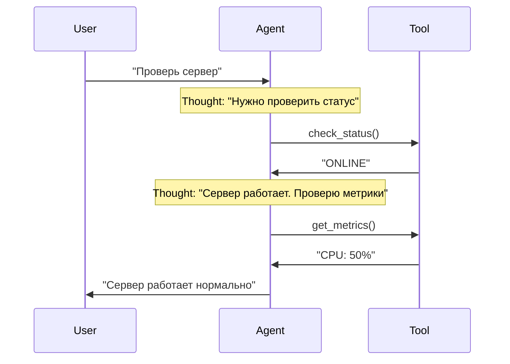
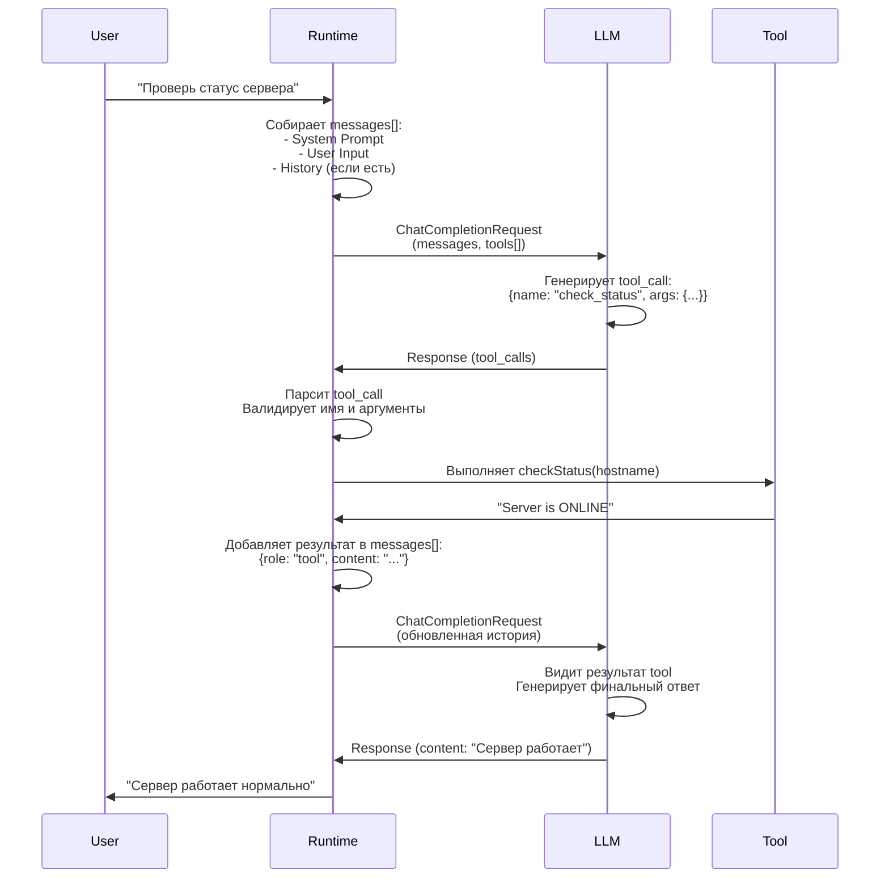

# 09. Анатомия агента — компоненты и их взаимодействие

## Зачем это нужно?

Агент — это не просто LLM с инструментами. Это сложная система с памятью, планированием и средой выполнения. Без понимания архитектуры вы не сможете:
- Правильно управлять контекстом и историей диалога
- Реализовать автономный цикл работы агента
- Оптимизировать использование токенов
- Создать расширяемую систему

В этой главе разберём компоненты агента и то, как они связаны между собой.

### Реальный кейс

**Ситуация:** Вы создали агента для DevOps. После 20 сообщений агент "забывает" начало разговора и перестает помнить контекст задачи.

**Проблема:** История диалога переполняет контекстное окно модели. Старые сообщения "выталкиваются", и агент теряет важную информацию.

**Решение:** Если понимать, как устроена память, вы сможете оптимизировать контекст: саммаризировать историю или поднимать важные сообщения выше.

## Теория простыми словами

Упрощённая формула:

$$ Agent = LLM + Memory + Tools + Planning $$

## Memory (Память)

Агент должен "помнить" контекст разговора и историю действий.

### Short-term Memory (Краткосрочная память)

Это история сообщений (`messages` array). Ограничена контекстным окном.

**Структура сообщения:**

```go
type ChatCompletionMessage struct {
    Role    string  // "system", "user", "assistant", "tool"
    Content string  // Текст сообщения
    ToolCallID string  // Если это результат инструмента
}
```

**Пример истории:**

```go
messages := []ChatCompletionMessage{
    {Role: "system", Content: "Ты DevOps инженер"},
    {Role: "user", Content: "Проверь статус сервера"},
    {Role: "assistant", Content: "", ToolCalls: [...]},  // Вызов инструмента
    {Role: "tool", Content: "Server is ONLINE", ToolCallID: "call_123"},
    {Role: "assistant", Content: "Сервер работает нормально"},
}
```

**Проблема:** Если история слишком длинная, она не влезает в контекстное окно.

**Пример проблемы:**

```go
// Контекстное окно: 4k токенов
// System Prompt: 200 токенов
// История диалога: 4000 токенов
// Новый запрос: 100 токенов
// ИТОГО: 4300 токенов > 4000 [ОШИБКА]
```

**ВАЖНО:** Детальные техники оптимизации контекста (саммаризация, отбор фактов, бюджеты токенов, политики отбора) описаны в [Главе 13: Context Engineering](../13-context-engineering/README.md). Здесь описывается только концепция кратковременной памяти как компонента агента.

### Long-term Memory (Долгосрочная память)

Это векторная база данных (RAG). В ней можно хранить гигабайты документов и искать нужное по смыслу (Semantic Search).

**Как это работает:**

1. Документы разбиваются на чанки (chunks)
2. Каждый чанк преобразуется в вектор (embedding)
3. При запросе агента ищутся похожие векторы
4. Релевантные чанки добавляются в контекст

**Примеры использования:**

- **DevOps:** Хранение регламентов, runbooks, документации по сервисам
- **Support:** База знаний с решениями типовых проблем
- **Data:** Схемы баз данных, документация по API
- **Security:** Playbooks для инцидентов, политики безопасности

См. [Глава 06: RAG](../06-rag/README.md)

## Planning (Планирование)

**Planning** — это способность агента разбить сложную задачу на последовательность простых шагов и выполнить их в правильном порядке.

### Зачем нужно планирование?

Представьте задачу: *"У нас проблемы с базой данных, разберись"*

**Без планирования:**
- Агент может попытаться сделать всё сразу и запутаться
- Агент может пропустить важные шаги
- Агент может выполнить шаги в неправильном порядке

**С планированием:**
- Агент сначала анализирует задачу
- Агент разбивает её на подзадачи
- Агент выполняет подзадачи последовательно
- Агент проверяет результат каждого шага

### Уровни планирования

#### Уровень 1: Имплицитное планирование (ReAct)

Агент не создает явный план, а планирует "на лету" в процессе выполнения.

**Как это работает:**
1. Агент получает задачу
2. Агент думает: "Что мне нужно сделать первым?"
3. Агент выполняет действие
4. Агент видит результат и думает: "Что делать дальше?"
5. Повторяет до завершения задачи

**Пример (DevOps):**
```
User: "Проверь, почему сервер медленно отвечает"

Итерация 1:
Thought: "Нужно проверить метрики сервера"
Action: get_cpu_metrics()
Observation: CPU 95%

Итерация 2:
Thought: "CPU высокий. Нужно посмотреть, какой процесс жрет ресурсы"
Action: get_top_processes()
Observation: Process: ffmpeg, CPU: 90%

Итерация 3:
Thought: "ffmpeg жрет CPU. Нужно проверить, что это за процесс"
Action: get_process_info(pid=12345)
Observation: Это видео-конвертация, запущенная пользователем

Итерация 4:
Thought: "Это легитимный процесс, но он блокирует систему. Предложу пользователю ограничить приоритет"
Action: [Финальный ответ пользователю]
```

**Преимущества:**
- Гибкость: агент может адаптироваться к результатам
- Простота реализации
- Подходит для задач средней сложности

**Недостатки:**
- Может "заблудиться" в деталях
- Может пропустить важные шаги
- Сложно отследить прогресс

#### Уровень 2: Явное планирование (Plan-and-Solve)

Агент сначала создает полный план, затем выполняет его по пунктам.

**Как это работает:**
1. Агент получает задачу
2. Агент генерирует полный план (список шагов)
3. Агент выполняет шаги по очереди
4. Агент отмечает выполненные шаги
5. Агент завершает, когда все шаги выполнены

**Пример (DevOps - Инцидент):**
```
User: "Сервис оплаты недоступен (502). Разберись"

Шаг 1: Планирование
Agent думает: "Нужно создать план расследования"
Agent генерирует план:
  1. Проверить HTTP статус сервиса
  2. Если не 200 — прочитать логи
  3. Проанализировать ошибки в логах
  4. Определить причину (config error / connection error / memory)
  5. Применить фикс (rollback / restart / scale)
  6. Верифицировать, что сервис восстановлен

Шаг 2: Выполнение
Agent: "Выполняю пункт 1: Проверяю HTTP статус"
Action: check_http_status("payment-service")
Observation: 502 Bad Gateway

Agent: "Выполняю пункт 2: Читаю логи"
Action: read_logs("payment-service", lines=50)
Observation: ERROR: Config syntax error in line 42

Agent: "Выполняю пункт 3: Анализирую ошибки"
Thought: "Логи показывают синтаксическую ошибку в конфиге. Это не временная проблема."

Agent: "Выполняю пункт 4: Определяю причину"
Thought: "Причина: Config error. Решение: Rollback"

Agent: "Выполняю пункт 5: Применяю фикс"
Action: rollback_deploy("payment-service", version="v1.9")
Observation: Rollback complete. Service restarted.

Agent: "Выполняю пункт 6: Верифицирую"
Action: check_http_status("payment-service")
Observation: 200 OK

Agent: "Все шаги выполнены. Инцидент решен."
```

**Преимущества:**
- Гарантия выполнения всех шагов
- Легко отследить прогресс
- Подходит для сложных задач (5+ шагов)

**Недостатки:**
- Менее гибкий: план может быть неоптимальным
- Требует больше токенов (генерация плана)
- Может быть избыточным для простых задач

#### Уровень 3: Иерархическое планирование (Hierarchical Planning)

Для очень сложных задач план разбивается на подпланы.

**Пример (Security - Расследование инцидента):**
```
Главная задача: "Расследовать подозрительную активность на хосте 192.168.1.10"

План верхнего уровня:
  1. Триаж алерта
  2. Сбор доказательств
  3. Анализ угрозы
  4. Принятие мер (containment)
  5. Генерация отчета

Подплан для шага 2 (Сбор доказательств):
  2.1. Запросить логи SIEM за последний час
  2.2. Проверить сетевой трафик
  2.3. Проверить метрики системы
  2.4. Проверить запущенные процессы
  2.5. Проверить файловую систему на изменения

Подплан для шага 3 (Анализ угрозы):
  3.1. Определить тип атаки
  3.2. Оценить критичность
  3.3. Определить scope (затронутые системы)
  3.4. Оценить ущерб
```

**Когда использовать:**
- Очень сложные задачи (10+ шагов)
- Задачи с множественными зависимостями
- Задачи, требующие координации нескольких специалистов

### Стратегии планирования

#### 1. ReAct (Reason + Act)

Самая популярная архитектура. Формула: `Thought -> Action -> Observation`.



**Цикл ReAct:**

1. **Thought:** Модель генерирует CoT (план действий)
2. **Action:** Модель генерирует токен вызова инструмента
3. **Runtime:** Наш код перехватывает вызов, выполняет функцию, получает результат
4. **Observation:** Результат подается обратно в модель
5. **Loop:** Повторяем до тех пор, пока модель не решит, что задача решена

**Примеры ReAct в разных доменах:**

**DevOps:**
```
Thought: Пользователь жалуется на тормоза. Надо проверить CPU.
Action: get_cpu_metrics()
Observation: CPU 99% process: ffmpeg
Thought: ffmpeg жрет все. Надо его убить или ограничить.
Action: kill_process(pid=123)
```

**Support:**
```
Thought: Пользователь не может войти. Проверю статус аккаунта.
Action: check_account_status(user_id="12345")
Observation: Account is locked due to suspicious activity
Thought: Аккаунт заблокирован. Нужно разблокировать, но сначала проверю логи.
Action: check_security_logs(user_id="12345")
Observation: Multiple failed login attempts from unknown IP
Thought: Это похоже на взлом. Разблокирую, но отправлю уведомление о смене пароля.
Action: unlock_account(user_id="12345")
```

**Data Analytics:**
```
Thought: Пользователь спрашивает про продажи. Нужно понять структуру данных.
Action: describe_table("sales")
Observation: Таблица содержит: date, region, amount
Thought: Теперь сформулирую SQL-запрос.
Action: sql_select("SELECT region, SUM(amount) FROM sales GROUP BY region")
Observation: Region A: 100k, Region B: 150k
Thought: Проанализирую результаты и сформулирую выводы.
```

### Plan-and-Solve

Для сложных задач ([Lab 06 Incident](https://github.com/kshvakov/ai-agent-course/tree/main/translations/ru/labs/lab06-incident)) ReAct может "заблудиться" в деталях.

**Архитектура:**

1. **Planner:** Сначала сгенерируй полный план
    ```
    План:
    1. Проверить HTTP статус
    2. Прочитать логи
    3. Проанализировать ошибки
    4. Применить фикс
    5. Верифицировать
    ```

2. **Solver:** Выполняй пункты плана по очереди

**Когда использовать Plan-and-Solve вместо ReAct?**

- Задача очень сложная (5+ шагов)
- Нужна гарантия, что все шаги будут выполнены
- Агент часто "забывает" про важные шаги
- Задача имеет четкую структуру (например, SOP для инцидентов)

**Реализация Plan-and-Solve:**

```go
func planAndSolve(ctx context.Context, client *openai.Client, task string) {
    // Шаг 1: Генерация плана
    planPrompt := fmt.Sprintf(`Разбей задачу на шаги:
Задача: %s

Создай план действий. Каждый шаг должен быть конкретным и выполнимым.`, task)
    
    planResp, _ := client.CreateChatCompletion(ctx, openai.ChatCompletionRequest{
        Model: "gpt-4o",
        Messages: []openai.ChatCompletionMessage{
            {Role: "system", Content: "Ты планировщик задач. Создавай детальные планы."},
            {Role: "user", Content: planPrompt},
        },
    })
    
    plan := planResp.Choices[0].Message.Content
    fmt.Printf("План:\n%s\n", plan)
    
    // Шаг 2: Выполнение плана
    executionPrompt := fmt.Sprintf(`Выполни план по шагам:
План:
%s

Выполняй шаги по очереди. После каждого шага сообщай о результате.`, plan)
    
    // Запускаем агента с планом в контексте
    runAgentWithPlan(ctx, client, executionPrompt, plan)
}
```

#### 3. Tree-of-Thoughts (ToT)

Агент рассматривает несколько вариантов решения и выбирает лучший.

**Как это работает:**
1. Агент генерирует несколько возможных путей решения
2. Агент оценивает каждый путь
3. Агент выбирает лучший путь
4. Агент выполняет выбранный путь

**Пример (Data Analytics):**
```
Задача: "Почему упали продажи в регионе X?"

Вариант 1: Проверить данные о продажах напрямую
  - Плюсы: Быстро
  - Минусы: Может не показать причину

Вариант 2: Проверить данные о продажах + маркетинговые кампании + конкурентов
  - Плюсы: Более полная картина
  - Минусы: Дольше

Вариант 3: Проверить качество данных сначала
  - Плюсы: Убедимся, что данные корректны
  - Минусы: Может быть избыточно

Агент выбирает Вариант 2 (наиболее полный)
```

**Когда использовать:**
- Задача имеет несколько возможных подходов
- Нужно выбрать оптимальный путь
- Важна эффективность решения

#### 4. Self-Consistency (Самосогласованность)

Агент генерирует несколько планов и выбирает наиболее согласованный.

**Как это работает:**
1. Агент генерирует N планов (например, 5)
2. Агент находит общие элементы во всех планах
3. Агент создает финальный план на основе общих элементов

**Пример:**
```
План 1: [A, B, C, D]
План 2: [A, B, E, F]
План 3: [A, C, D, G]
План 4: [A, B, C, H]
План 5: [A, B, D, I]

Общие элементы: A (всех 5), B (в 4 из 5), C (в 2 из 5)
Финальный план: [A, B, C, ...] (на основе наиболее частых элементов)
```

### Декомпозиция задач

#### Как правильно разбивать задачи?

**Принципы декомпозиции:**

1. **Атомарность:** Каждый шаг должен быть выполним одним действием
    - Плохо: "Проверить и починить сервер"
    - Хорошо: "Проверить статус сервера" → "Прочитать логи" → "Применить фикс"

2. **Зависимости:** Шаги должны выполняться в правильном порядке
    - Плохо: "Применить фикс" → "Прочитать логи"
    - Хорошо: "Прочитать логи" → "Проанализировать" → "Применить фикс"

3. **Проверяемость:** Каждый шаг должен иметь четкий критерий успеха
    - Плохо: "Улучшить производительность"
    - Хорошо: "Снизить CPU с 95% до 50%"

**Пример декомпозиции (Support):**

```
Исходная задача: "Обработать тикет пользователя о проблеме с входом"

Декомпозиция:
1. Прочитать тикет полностью
   - Критерий успеха: Получены все детали проблемы
   
2. Собрать контекст
   - Критерий успеха: Известны версия ПО, ОС, браузер
   
3. Поискать в базе знаний
   - Критерий успеха: Найдены похожие случаи или решение
   
4. Проверить статус аккаунта
   - Критерий успеха: Известен статус (активен/заблокирован)
   
5. Сформулировать ответ
   - Критерий успеха: Ответ готов и содержит решение
   
6. Отправить ответ или эскалировать
   - Критерий успеха: Тикет обработан
```

### Практические примеры планирования

#### Пример 1: DevOps - Расследование инцидента

```go
// Задача: "Сервис недоступен. Разберись."

// План (генерируется агентом):
plan := []string{
    "1. Проверить HTTP статус сервиса",
    "2. Если не 200 — прочитать логи",
    "3. Проанализировать ошибки",
    "4. Определить причину",
    "5. Применить фикс",
    "6. Верифицировать восстановление",
}

// Выполнение:
for i, step := range plan {
    fmt.Printf("Выполняю шаг %d: %s\n", i+1, step)
    result := executeStep(step)
    if !result.Success {
        fmt.Printf("Шаг %d провален: %s\n", i+1, result.Error)
        // Агент может перепланировать или эскалировать
        break
    }
}
```

#### Пример 2: Data Analytics - Анализ продаж

```go
// Задача: "Почему упали продажи в регионе X?"

// План:
plan := []string{
    "1. Проверить качество данных (nulls, duplicates)",
    "2. Получить данные о продажах за последний месяц",
    "3. Сравнить с предыдущим периодом",
    "4. Проверить маркетинговые кампании",
    "5. Проверить конкурентов",
    "6. Проанализировать тренды",
    "7. Сгенерировать отчет с выводами",
}
```

#### Пример 3: Security - Триаж алерта

```go
// Задача: "Алерт: подозрительная активность на хосте 192.168.1.10"

// План:
plan := []string{
    "1. Определить severity алерта",
    "2. Собрать доказательства (логи, метрики, трафик)",
    "3. Проанализировать паттерны атаки",
    "4. Определить scope (затронутые системы)",
    "5. Оценить критичность",
    "6. Принять решение (False Positive / True Positive)",
    "7. Если True Positive — containment (с подтверждением)",
    "8. Сгенерировать отчет для SOC",
}
```

### Типовые ошибки планирования

#### Ошибка 1: Слишком общий план

**Плохо:**
```
План:
1. Разобраться с проблемой
2. Починить
3. Проверить
```

**Хорошо:**
```
План:
1. Проверить HTTP статус сервиса (check_http)
2. Если 502 — прочитать последние 50 строк логов (read_logs)
3. Найти ключевые слова ошибок в логах
4. Если "Syntax error" — выполнить rollback (rollback_deploy)
5. Если "Connection refused" — перезапустить сервис (restart_service)
6. Верифицировать: проверить HTTP статус снова (check_http)
```

#### Ошибка 2: Неправильный порядок шагов

**Плохо:**
```
1. Применить фикс
2. Прочитать логи
3. Проверить статус
```

**Хорошо:**
```
1. Проверить статус
2. Прочитать логи
3. Применить фикс
```

#### Ошибка 3: Пропуск важных шагов

**Плохо:**
```
1. Прочитать логи
2. Применить фикс
(Пропущен шаг верификации!)
```

**Хорошо:**
```
1. Прочитать логи
2. Применить фикс
3. Верифицировать результат
```

### Чек-лист: Планирование

- [ ] Задача разбита на атомарные шаги
- [ ] Шаги выполняются в правильном порядке
- [ ] Каждый шаг имеет четкий критерий успеха
- [ ] План включает верификацию результата
- [ ] Выбран правильный уровень планирования (ReAct / Plan-and-Solve / Hierarchical)
- [ ] План адаптируется к результатам выполнения (для ReAct)

### Reflexion (Самокоррекция)

Агенты часто ошибаются. Reflexion добавляет шаг критики.

Цикл: `Act -> Observe -> Fail -> REFLECT -> Plan Again`

**Пример:**

```
Action: read_file("/etc/nginx/nginx.conf")
Observation: Permission denied
Reflection: "Я пытался прочитать файл, но получил Permission Denied. 
            Значит, у меня нет прав. В следующий раз надо использовать sudo 
            или проверить права доступа сначала."
Action: check_permissions("/etc/nginx/nginx.conf")
Observation: File is readable by root only
Action: read_file_sudo("/etc/nginx/nginx.conf")
```

## Runtime (Среда выполнения)

Runtime — это код, который связывает LLM с инструментами.

**Основные функции Runtime:**

1. **Парсинг ответов LLM:** Определение, хочет ли модель вызвать инструмент
2. **Выполнение инструментов:** Вызов реальных функций Go
3. **Управление историей:** Добавление результатов в контекст
4. **Управление циклом:** Определение, когда остановиться

### Паттерн Registry для расширяемости

Чтобы агент был расширяемым, мы не должны хардкодить логику инструментов в `main.go`. Нам нужен паттерн **Registry** (Реестр).

**Проблема без Registry:**
- Добавление нового инструмента требует правок в десятках мест
- Код становится нечитаемым
- Сложно тестировать отдельные инструменты

**Решение: Интерфейсы Go + Registry**

#### Определение интерфейса Tool

```go
type Tool interface {
    Name() string
    Description() string
    Parameters() json.RawMessage
    Execute(args json.RawMessage) (string, error)
}
```

Любой инструмент (Proxmox, Ansible, SSH) должен реализовывать этот интерфейс.

#### Реализация инструмента

```go
type ProxmoxListVMsTool struct{}

func (t *ProxmoxListVMsTool) Name() string {
    return "list_vms"
}

func (t *ProxmoxListVMsTool) Description() string {
    return "List all VMs in the Proxmox cluster"
}

func (t *ProxmoxListVMsTool) Parameters() json.RawMessage {
    return json.RawMessage(`{
        "type": "object",
        "properties": {},
        "required": []
    }`)
}

func (t *ProxmoxListVMsTool) Execute(args json.RawMessage) (string, error) {
    // Реальная логика вызова API Proxmox
    return "VM-100 (Running), VM-101 (Stopped)", nil
}
```

#### Registry (Реестр инструментов)

Registry — это хранилище инструментов, доступное по имени.

```go
type ToolRegistry struct {
    tools map[string]Tool
}

func NewToolRegistry() *ToolRegistry {
    return &ToolRegistry{
        tools: make(map[string]Tool),
    }
}

func (r *ToolRegistry) Register(tool Tool) {
    r.tools[tool.Name()] = tool
}

func (r *ToolRegistry) Get(name string) (Tool, bool) {
    tool, exists := r.tools[name]
    return tool, exists
}

func (r *ToolRegistry) ToOpenAITools() []openai.Tool {
    var result []openai.Tool
    for _, tool := range r.tools {
        result = append(result, openai.Tool{
            Type: openai.ToolTypeFunction,
            Function: &openai.FunctionDefinition{
                Name:        tool.Name(),
                Description: tool.Description(),
                Parameters:  tool.Parameters(),
            },
        })
    }
    return result
}
```

#### Использование Registry

```go
// Инициализация
registry := NewToolRegistry()
registry.Register(&ProxmoxListVMsTool{})
registry.Register(&AnsibleRunPlaybookTool{})

// Получение списка инструментов для LLM
tools := registry.ToOpenAITools()

// Выполнение инструмента по имени
toolCall := msg.ToolCalls[0]
if tool, exists := registry.Get(toolCall.Function.Name); exists {
    result, err := tool.Execute(json.RawMessage(toolCall.Function.Arguments))
    if err != nil {
        return fmt.Errorf("tool execution failed: %v", err)
    }
    // Добавляем результат в историю
}
```

**Преимущества Registry:**
- Добавление нового инструмента — просто реализовать интерфейс и зарегистрировать
- Код инструментов изолирован и легко тестируется
- Runtime не знает про конкретные инструменты, работает через интерфейс
- Легко добавлять валидацию, логирование, метрики на уровне Registry

**Пример Runtime с Registry:**

```go
func runAgent(ctx context.Context, client *openai.Client, registry *ToolRegistry, userInput string) {
    messages := []openai.ChatCompletionMessage{
        {Role: "system", Content: systemPrompt},
        {Role: "user", Content: userInput},
    }
    
    tools := registry.ToOpenAITools()  // Получаем список инструментов из Registry
    
    for i := 0; i < maxIterations; i++ {
        resp, _ := client.CreateChatCompletion(ctx, openai.ChatCompletionRequest{
            Model: "gpt-4o-mini",
            Messages: messages,
            Tools: tools,
        })
        
        msg := resp.Choices[0].Message
        messages = append(messages, msg)
        
        if len(msg.ToolCalls) == 0 {
            // Финальный ответ
            fmt.Println(msg.Content)
            break
        }
        
        // Выполняем инструменты через Registry
        for _, toolCall := range msg.ToolCalls {
            tool, exists := registry.Get(toolCall.Function.Name)
            if !exists {
                result := fmt.Sprintf("Error: Unknown tool %s", toolCall.Function.Name)
                messages = append(messages, openai.ChatCompletionMessage{
                    Role: "tool",
                    Content: result,
                    ToolCallID: toolCall.ID,
                })
                continue
            }
            
            result, err := tool.Execute(json.RawMessage(toolCall.Function.Arguments))
            if err != nil {
                result = fmt.Sprintf("Error: %v", err)
            }
            
            messages = append(messages, openai.ChatCompletionMessage{
                Role: "tool",
                Content: result,
                ToolCallID: toolCall.ID,
            })
        }
    }
}
```

### Схема потока данных в агенте



**Ключевые моменты:**
- LLM не выполняет код, только генерирует JSON
- Runtime управляет всем циклом и выполняет реальные функции
- История (`messages[]`) собирается Runtime'ом и передается в каждый запрос
- Результаты инструментов добавляются в историю перед следующим запросом

## Skills (Навыки)

Агент с фиксированным System Prompt ограничен. Навыки (Skills) позволяют динамически менять поведение агента в зависимости от задачи.

[Agent Skills](https://agentskills.io/) — открытый формат для расширения возможностей агентов. Стандарт поддерживается Cursor, Claude Code, VS Code, GitHub и другими инструментами. По сути, навык — это папка с файлом `SKILL.md`. Агент загружает его содержимое в контекст по мере необходимости.

### Зачем нужны навыки?

Представьте: агент для DevOps умеет работать с Docker. Завтра появляется задача работы с Kubernetes. Без навыков придётся переписывать System Prompt и добавлять инструкции прямо в код.

С навыками вы просто загружаете нужный модуль поведения.

### Skill — это не Tool

Навык и инструмент — разные вещи. Инструмент выполняет конкретное действие (вызывает API, читает файл). Навык описывает **как себя вести** в определённой ситуации.

**Аналогия:**
- **Tool** — молоток, пила, отвёртка (конкретные действия)
- **Skill** — инструкция "как собрать шкаф" (последовательность действий и правила)

### Skills — Магия vs Реальность

**Магия (как обычно объясняют):**
> Навыки — это AI-модули, которые агент "выучил" и применяет автоматически.

**Реальность (как на самом деле):**

Навык — это текстовый файл с инструкциями. Агент загружает его содержимое в контекст перед запросом к LLM. Модель просто получает дополнительный текст в промпте. Никакого обучения не происходит.

### Формат Agent Skills (SKILL.md)

[Спецификация Agent Skills](https://agentskills.io/specification) определяет стандартный файловый формат. Навык — это директория с файлом `SKILL.md`:

```
docker-debugging/
├── SKILL.md        # Обязательно: метаданные + инструкции
├── scripts/        # Опционально: исполняемый код
├── references/     # Опционально: дополнительная документация
└── assets/         # Опционально: шаблоны, схемы
```

Файл `SKILL.md` содержит YAML frontmatter и Markdown-инструкции:

```yaml
---
name: docker-debugging
description: >
  Debug Docker containers — check status, logs, resources,
  restart loops. Use when user mentions Docker problems.
---

# Docker Debugging

## When to use this skill
Use when the user reports Docker container issues...

## Steps
1. Check container status (docker ps)
2. Read logs (docker logs)
3. Check resources (docker stats)
4. If container is restarting — check exit code
5. Never run docker rm -f without confirmation
```

Два поля обязательны: `name` (идентификатор, строчные буквы + дефисы) и `description` (когда применять навык). Markdown-тело содержит инструкции.

### Progressive Disclosure (Постепенное раскрытие)

Навыки используют трёхуровневую загрузку для экономии контекста:

1. **Discovery.** При старте агент загружает только `name` и `description` каждого навыка. Это ~100 токенов на навык.
2. **Activation.** Когда задача совпадает с описанием навыка, агент читает полное тело `SKILL.md` в контекст.
3. **Execution.** Агент следует инструкциям, подгружая файлы из `scripts/`, `references/` только по мере необходимости.

Агент остаётся быстрым, но при этом имеет доступ к детальным инструкциям по запросу.

### Реализация загрузки навыков в Runtime

Ниже — один из способов реализовать загрузку навыков в Runtime агента. Поле `Instruction` соответствует телу файла `SKILL.md`. Поиск по триггерам — упрощённый вариант. Продвинутые реализации (Cursor, Claude Code) позволяют LLM самой решать, какой навык активировать, на основе `description`.

#### Определение навыка

```go
// SkillDefinition — описание навыка
type SkillDefinition struct {
    Name        string   // Уникальное имя навыка
    Description string   // Когда использовать этот навык
    Triggers    []string // Ключевые слова для автоматической загрузки
    Instruction string   // Текст инструкции (добавляется в промпт)
}
```

#### Skill Registry (Реестр навыков)

По аналогии с Tool Registry навыки хранятся в реестре. Реестр умеет находить подходящие навыки по ключевым словам в запросе пользователя.

```go
// SkillRegistry — реестр навыков агента
type SkillRegistry struct {
    skills map[string]SkillDefinition
}

func NewSkillRegistry() *SkillRegistry {
    return &SkillRegistry{
        skills: make(map[string]SkillDefinition),
    }
}

func (r *SkillRegistry) Register(skill SkillDefinition) {
    r.skills[skill.Name] = skill
}

// FindByTrigger ищет навыки по ключевому слову в запросе
func (r *SkillRegistry) FindByTrigger(userInput string) []SkillDefinition {
    var matched []SkillDefinition
    for _, skill := range r.skills {
        for _, trigger := range skill.Triggers {
            if strings.Contains(strings.ToLower(userInput), trigger) {
                matched = append(matched, skill)
                break
            }
        }
    }
    return matched
}

// BuildPrompt собирает System Prompt с загруженными навыками
func (r *SkillRegistry) BuildPrompt(basePrompt string, skills []SkillDefinition) string {
    if len(skills) == 0 {
        return basePrompt
    }

    var sb strings.Builder
    sb.WriteString(basePrompt)
    sb.WriteString("\n\n## Загруженные навыки\n\n")
    for _, skill := range skills {
        sb.WriteString("### " + skill.Name + "\n")
        sb.WriteString(skill.Instruction + "\n\n")
    }
    return sb.String()
}
```

#### Пример использования

```go
registry := NewSkillRegistry()

// Регистрируем навыки
registry.Register(SkillDefinition{
    Name:        "docker-debugging",
    Description: "Отладка Docker-контейнеров",
    Triggers:    []string{"docker", "контейнер", "container"},
    Instruction: `При работе с Docker:
1. Сначала проверь статус контейнера (docker ps)
2. Прочитай логи (docker logs)
3. Проверь ресурсы (docker stats)
4. Если контейнер перезапускается — проверь exit code
5. Никогда не делай docker rm -f без подтверждения`,
})

registry.Register(SkillDefinition{
    Name:        "incident-response",
    Description: "Реагирование на инциденты",
    Triggers:    []string{"инцидент", "авария", "502", "500", "даунтайм"},
    Instruction: `При инциденте:
1. Определи severity (P1/P2/P3)
2. Собери факты, не гадай
3. Проверь мониторинг и логи
4. Примени минимальный фикс (rollback)
5. Верифицируй восстановление
6. Не оптимизируй во время пожара`,
})

// Агент получает запрос
userInput := "Docker-контейнер постоянно перезапускается"

// Находим подходящие навыки
skills := registry.FindByTrigger(userInput)

// Собираем промпт с навыками
prompt := registry.BuildPrompt(baseSystemPrompt, skills)
// prompt теперь содержит базовый промпт + инструкции по Docker-отладке
```

Навыки расширяют поведение агента без изменения кода. Новый навык — это новый файл `SKILL.md`, а не рефакторинг.

Полная спецификация формата: [Agent Skills Specification](https://agentskills.io/specification). Примеры навыков доступны в [GitHub-репозитории](https://github.com/anthropics/skills).

## Subagents (Под-агенты)

Иногда задача слишком сложна для одного агента. Или агенту нужно выполнить подзадачу, не засоряя основной контекст. Для этого агент может создать под-агента.

### Когда под-агент, а когда инструмент?

**Инструмент (Tool)** подходит, когда:
- Действие простое и детерминированное
- Результат предсказуем
- Не нужно "думать" над задачей

**Под-агент (Subagent)** подходит, когда:
- Подзадача требует рассуждений и нескольких шагов
- Нужен отдельный контекст (чтобы не загрязнять основной)
- Подзадача сама по себе сложная

**Пример:**

```
Задача: "Разверни новый сервис и настрой мониторинг"

Tool-подход (плохо для сложных задач):
  → deploy_service("my-app")     // Одно действие, нет гибкости
  → setup_monitoring("my-app")   // Одно действие, нет гибкости

Subagent-подход (хорошо для сложных задач):
  → Под-агент 1: "Разверни сервис" (5-10 шагов с рассуждениями)
  → Под-агент 2: "Настрой мониторинг" (3-5 шагов с рассуждениями)
```

### Связь "Родитель — Потомок"

Родительский агент создаёт под-агента с:
- **Отдельным System Prompt** — специализация под конкретную задачу
- **Своим набором инструментов** — только то, что нужно для подзадачи
- **Своим контекстом** — не наследует всю историю родителя
- **Ограничением по итерациям** — под-агент не может работать бесконечно

Когда под-агент завершает работу, результат возвращается родителю как обычный текст.

```go
// SubagentConfig — конфигурация под-агента
type SubagentConfig struct {
    Name          string // Имя для логирования
    SystemPrompt  string // Инструкции для под-агента
    Tools         []Tool // Доступные инструменты
    MaxIterations int    // Лимит итераций
}

// SpawnSubagent создаёт и запускает под-агента для выполнения подзадачи.
// Под-агент работает в собственном цикле и возвращает текстовый результат.
func SpawnSubagent(
    ctx context.Context,
    client *openai.Client,
    config SubagentConfig,
    task string,
) (string, error) {
    messages := []openai.ChatCompletionMessage{
        {Role: "system", Content: config.SystemPrompt},
        {Role: "user", Content: task},
    }

    registry := NewToolRegistry()
    for _, tool := range config.Tools {
        registry.Register(tool)
    }

    // Под-агент выполняет свой цикл
    for i := 0; i < config.MaxIterations; i++ {
        resp, err := client.CreateChatCompletion(ctx, openai.ChatCompletionRequest{
            Model:    "gpt-4o",
            Messages: messages,
            Tools:    registry.ToOpenAITools(),
        })
        if err != nil {
            return "", fmt.Errorf("subagent %s: %w", config.Name, err)
        }

        msg := resp.Choices[0].Message
        messages = append(messages, msg)

        // Нет tool_calls — под-агент завершил работу
        if len(msg.ToolCalls) == 0 {
            return msg.Content, nil
        }

        // Выполняем инструменты под-агента
        for _, tc := range msg.ToolCalls {
            tool, exists := registry.Get(tc.Function.Name)
            if !exists {
                messages = append(messages, openai.ChatCompletionMessage{
                    Role:       "tool",
                    Content:    fmt.Sprintf("Error: unknown tool %s", tc.Function.Name),
                    ToolCallID: tc.ID,
                })
                continue
            }
            result, err := tool.Execute(json.RawMessage(tc.Function.Arguments))
            if err != nil {
                result = fmt.Sprintf("Error: %v", err)
            }
            messages = append(messages, openai.ChatCompletionMessage{
                Role:       "tool",
                Content:    result,
                ToolCallID: tc.ID,
            })
        }
    }

    return "", fmt.Errorf("subagent %s: превышен лимит итераций (%d)", config.Name, config.MaxIterations)
}
```

### Пример: Родительский агент запускает под-агентов

```go
// Родительский агент получил сложную задачу
task := "Разверни сервис payment-api и настрой алерты"

// Под-агент для деплоя
deployResult, err := SpawnSubagent(ctx, client, SubagentConfig{
    Name:          "deploy-agent",
    SystemPrompt:  "Ты специалист по деплою. Разверни сервис по всем правилам.",
    Tools:         []Tool{&DeployTool{}, &HealthCheckTool{}},
    MaxIterations: 10,
}, "Разверни сервис payment-api в production")

if err != nil {
    log.Fatalf("Деплой провален: %v", err)
}

// Под-агент для мониторинга (получает контекст от первого)
monitorResult, err := SpawnSubagent(ctx, client, SubagentConfig{
    Name:          "monitoring-agent",
    SystemPrompt:  "Ты специалист по мониторингу. Настрой алерты.",
    Tools:         []Tool{&CreateAlertTool{}, &ListMetricsTool{}},
    MaxIterations: 5,
}, fmt.Sprintf("Настрой алерты для payment-api. Контекст деплоя: %s", deployResult))
```

Под-агенты — частный случай мульти-агентных систем. Подробнее о координации нескольких агентов, паттернах делегирования и оркестрации см. [Глава 07: Multi-Agent](../07-multi-agent/README.md).

## Checkpoint и Resume (Сохранение и восстановление)

Долгоживущие агенты работают минутами и часами. За это время может упасть сеть, закончиться лимит API или перезапуститься процесс. Без механизма сохранения состояния вся работа теряется.

### Зачем это нужно?

Представьте: агент анализирует 50 серверов. На 47-м сервере падает соединение с API. Без checkpoint агент начнёт всё сначала — 47 вызовов API впустую. С checkpoint — продолжит с 48-го.

### Стратегии сохранения

**Per-iteration** — сохранение после каждой итерации цикла:
- Просто реализовать
- Может быть избыточным для коротких задач
- Подходит для длинных задач с предсказуемым числом шагов

**Per-tool-call** — сохранение после каждого вызова инструмента:
- Более гранулярный контроль
- Полезно, когда вызовы инструментов дорогие или медленные
- Позволяет не повторять уже выполненные вызовы

### Checkpoint — Магия vs Реальность

**Магия (как обычно объясняют):**
> Агент автоматически запоминает своё состояние и продолжает с места остановки.

**Реальность (как на самом деле):**

Состояние агента — это массив `messages[]` и метаданные (номер итерации, статус). Вы сериализуете их в JSON и сохраняете на диск. При перезапуске загружаете и продолжаете цикл с того же места.

#### Структура checkpoint

```go
// Checkpoint — снимок состояния агента
type Checkpoint struct {
    ID        string                          `json:"id"`
    CreatedAt time.Time                       `json:"created_at"`
    Iteration int                             `json:"iteration"`
    Messages  []openai.ChatCompletionMessage  `json:"messages"`
    TaskID    string                          `json:"task_id"`
    Status    string                          `json:"status"` // "in_progress", "completed", "failed"
}
```

#### Сохранение и загрузка

```go
// SaveCheckpoint сохраняет состояние агента на диск
func SaveCheckpoint(dir string, cp Checkpoint) error {
    data, err := json.MarshalIndent(cp, "", "  ")
    if err != nil {
        return fmt.Errorf("marshal checkpoint: %w", err)
    }

    path := filepath.Join(dir, cp.TaskID+".json")
    return os.WriteFile(path, data, 0644)
}

// LoadCheckpoint загружает последний checkpoint для задачи.
// Возвращает nil, nil если checkpoint не найден — агент начнёт с нуля.
func LoadCheckpoint(dir, taskID string) (*Checkpoint, error) {
    path := filepath.Join(dir, taskID+".json")

    data, err := os.ReadFile(path)
    if err != nil {
        if os.IsNotExist(err) {
            return nil, nil // Нет checkpoint — начинаем с нуля
        }
        return nil, fmt.Errorf("read checkpoint: %w", err)
    }

    var cp Checkpoint
    if err := json.Unmarshal(data, &cp); err != nil {
        return nil, fmt.Errorf("unmarshal checkpoint: %w", err)
    }
    return &cp, nil
}
```

#### Агент с поддержкой checkpoint

```go
func runAgentWithCheckpoints(
    ctx context.Context,
    client *openai.Client,
    registry *ToolRegistry,
    taskID, userInput string,
) error {
    checkpointDir := "./checkpoints"

    // Пытаемся восстановиться из checkpoint
    cp, err := LoadCheckpoint(checkpointDir, taskID)
    if err != nil {
        return err
    }

    var messages []openai.ChatCompletionMessage
    startIteration := 0

    if cp != nil && cp.Status == "in_progress" {
        // Восстанавливаемся — берём историю и номер итерации из checkpoint
        messages = cp.Messages
        startIteration = cp.Iteration
        log.Printf("Восстановлен checkpoint: итерация %d", startIteration)
    } else {
        // Checkpoint не найден — начинаем с нуля
        messages = []openai.ChatCompletionMessage{
            {Role: "system", Content: systemPrompt},
            {Role: "user", Content: userInput},
        }
    }

    for i := startIteration; i < maxIterations; i++ {
        resp, err := client.CreateChatCompletion(ctx, openai.ChatCompletionRequest{
            Model:    "gpt-4o",
            Messages: messages,
            Tools:    registry.ToOpenAITools(),
        })
        if err != nil {
            // Ошибка API — сохраняем checkpoint и выходим
            SaveCheckpoint(checkpointDir, Checkpoint{
                TaskID:    taskID,
                Iteration: i,
                Messages:  messages,
                Status:    "in_progress",
                CreatedAt: time.Now(),
            })
            return fmt.Errorf("API error (checkpoint saved at iteration %d): %w", i, err)
        }

        msg := resp.Choices[0].Message
        messages = append(messages, msg)

        if len(msg.ToolCalls) == 0 {
            // Задача завершена — сохраняем финальный checkpoint
            SaveCheckpoint(checkpointDir, Checkpoint{
                TaskID:    taskID,
                Iteration: i,
                Messages:  messages,
                Status:    "completed",
                CreatedAt: time.Now(),
            })
            return nil
        }

        // Выполняем инструменты
        for _, tc := range msg.ToolCalls {
            tool, _ := registry.Get(tc.Function.Name)
            result, _ := tool.Execute(json.RawMessage(tc.Function.Arguments))
            messages = append(messages, openai.ChatCompletionMessage{
                Role:       "tool",
                Content:    result,
                ToolCallID: tc.ID,
            })
        }

        // Сохраняем checkpoint после каждой итерации
        SaveCheckpoint(checkpointDir, Checkpoint{
            TaskID:    taskID,
            Iteration: i + 1,
            Messages:  messages,
            Status:    "in_progress",
            CreatedAt: time.Now(),
        })
    }

    return nil
}
```

Checkpoint — это страховка. Для коротких задач (2-3 итерации) он избыточен. Для длинных задач (10+ итераций) или дорогих вызовов API — обязателен.

## Типовые ошибки

### Ошибка 1: История переполняется

**Симптом:** Агент "забывает" начало разговора. После N сообщений перестает помнить контекст задачи.

**Причина:** История диалога превышает размер контекстного окна модели. Старые сообщения "выталкиваются" из контекста.

**Решение:**
```go
// ПЛОХО: Просто обрезаем историю (теряем информацию)
if len(messages) > maxHistoryLength {
    messages = append(
        []openai.ChatCompletionMessage{messages[0]},  // System
        messages[len(messages)-maxHistoryLength+1:]...,  // Последние
    )
}

// ХОРОШО: Сжимаем старые сообщения через саммаризацию
// Детальные техники оптимизации описаны в [Главе 13: Context Engineering](../13-context-engineering/README.md)
compressed := compressContext(messages, maxTokens)
```

### Ошибка 2: Агент зацикливается

**Симптом:** Агент повторяет одно и то же действие бесконечно.

**Причина:** Нет лимита итераций и детекции повторяющихся действий.

**Решение:**
```go
// ХОРОШО: Лимит итераций + детекция застревания
for i := 0; i < maxIterations; i++ {
    // ...
    
    // Детекция застревания
    if lastNActionsAreSame(history, 3) {
        break
    }
}
```

### Ошибка 3: Результат инструмента не добавляется в историю

**Симптом:** Агент не видит результат инструмента и продолжает выполнять то же действие.

**Причина:** Результат выполнения инструмента не добавляется в `messages[]`.

**Решение:**
```go
// ПЛОХО: Результат не добавляется
result := executeTool(toolCall)
// История не обновлена!

// ХОРОШО: Результат добавляется в историю
result := executeTool(toolCall)
messages = append(messages, openai.ChatCompletionMessage{
    Role:       openai.ChatMessageRoleTool,
    Content:    result,
    ToolCallID: toolCall.ID,
})
```

## Мини-упражнения

### Упражнение 1: Подсчет токенов в истории

Реализуйте функцию подсчета токенов в истории сообщений:

```go
func countTokensInMessages(messages []openai.ChatCompletionMessage) int {
    // Подсчитайте общее количество токенов
    // Учтите: Content, ToolCalls, системные сообщения
}
```

**Ожидаемый результат:**
- Функция возвращает точное количество токенов
- Учитывает все типы сообщений (system, user, assistant, tool)

### Упражнение 2: Оптимизация контекста

**Примечание:** Детальные техники оптимизации контекста описаны в [Главе 13: Context Engineering](../13-context-engineering/README.md). Здесь предлагается базовое упражнение.

Реализуйте функцию сжатия контекста через саммаризацию:

```go
func compressContext(messages []openai.ChatCompletionMessage, maxTokens int) []openai.ChatCompletionMessage {
    // Если токенов меньше maxTokens, верните как есть
    // Иначе сожмите старые сообщения через саммаризацию
    // Подробные техники: см. [Главу 13: Context Engineering](../13-context-engineering/README.md)
}
```

**Ожидаемый результат:**
- System Prompt всегда остается первым
- Старые сообщения сжимаются через LLM
- Последние N сообщений сохраняются полностью

## Критерии сдачи / Чек-лист

**Сдано:**
- [x] Short-term memory (история сообщений) управляется
- [x] Реализован подсчет токенов и мониторинг контекста
- [x] Применяется оптимизация контекста (саммаризация/приоритизация)
- [x] Long-term memory (RAG) настроена (если нужно)
- [x] Planning (ReAct/Plan-and-Solve) реализован
- [x] Runtime корректно парсит ответы LLM
- [x] Runtime выполняет инструменты
- [x] Runtime управляет циклом
- [x] Есть защита от зацикливания

**Не сдано:**
- [ ] История переполняется (нет оптимизации контекста)
- [ ] Агент зацикливается (нет лимита итераций)
- [ ] Результаты инструментов не добавляются в историю
- [ ] Нет мониторинга использования токенов

## Связь с другими главами

- **[Глава 01: Физика LLM](../01-llm-fundamentals/README.md)** — Понимание контекстного окна помогает управлять памятью
- **[Глава 03: Инструменты и Function Calling](../03-tools-and-function-calling/README.md)** — Как Runtime выполняет инструменты
- **[Глава 04: Автономность и Циклы](../04-autonomy-and-loops/README.md)** — Как Planning работает в цикле агента
- **[Глава 13: Context Engineering](../13-context-engineering/README.md)** — Детальные техники оптимизации контекста (саммаризация, отбор фактов, бюджеты токенов)
- **[Agent Skills Specification](https://agentskills.io/specification)** — Открытый формат навыков агента (`SKILL.md`)

## Что дальше?

После изучения архитектуры переходите к:
- **[10. Planning и Workflow-паттерны](../10-planning-and-workflows/README.md)** — как агент планирует сложные задачи


