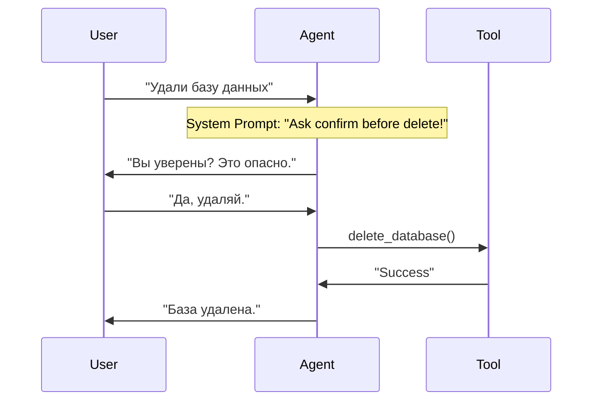

# Lab 05: Human-in-the-Loop (Clarification & Safety)

## Цель
Научить агента не быть "слепым исполнителем". Агент должен уметь:
1.  **Задавать вопросы**, если не хватает информации (Slot Filling).
2.  **Просить подтверждение** перед опасными действиями (Safety check).

## Теория
В Lab 04 наш цикл работал так: `User -> Loop(Think->Act->Think) -> Answer`.
Но что, если Агент в фазе `Think` поймет, что не может вызвать инструмент, потому что не знает аргументов? Или инструмент слишком опасен?

В этом случае Агент должен сгенерировать **Текстовый ответ** (Вопрос), и цикл должен прерваться, чтобы дать слово Пользователю.

**Схема интерактивного цикла:**

## Задание
У вас есть набор инструментов: `delete_db(name)` и `send_email(to, subject, body)`.

1.  **System Prompt:** Настройте промпт так, чтобы агент:
    *   Всегда спрашивал подтверждение перед `delete_db`.
    *   Всегда уточнял тему письма, если пользователь её не указал.
2.  **Main Loop:** Используйте код из Lab 04, но оберните его в бесконечный цикл ввода (`while true`), как в Lab 01.
    *   Если агент возвращает `ToolCall` -> выполняем, продолжаем цикл агента.
    *   Если агент возвращает `Text` -> выводим пользователю, ждем ввода, продолжаем цикл чата.

## Сценарии для проверки
1.  `"Удали базу test_db"` -> Агент должен спросить "Are you sure?". -> Вы отвечаете "Yes". -> Агент удаляет.
2.  `"Отправь письмо боссу"` -> Агент должен спросить "Какая тема и текст?". -> Вы отвечаете. -> Агент отправляет.

